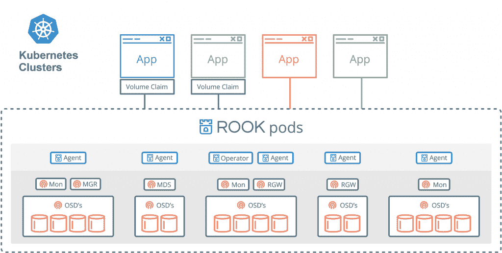

# 使用 Rook 和 Ceph 简化 Kubernetes 的存储

> 原文：<https://thenewstack.io/simplify-storage-for-kubernetes-with-rook-and-ceph/>

[Sagar Nangare](https://twitter.com/sagarnangare)

[Sagar Nangare 是科技博客作者，专注于数据中心技术(网络、电信、云、存储)和边缘计算、物联网、机器学习、人工智能等新兴领域。他目前在浦那担任 Coredge.io 的产品营销总监。](https://twitter.com/sagarnangare)

自诞生以来，Kubernetes 已经成为任何数据中心的领先应用程序编排框架；从私有、公共云到远程边缘站点。企业正在展示用于编排部署在边缘的容器以及处理各种工作负载的 Kubernetes。

Kubernetes 最初用于管理容器，在容器中可以托管应用程序和最少量的存储。通过这种方式，第一个容器化的应用程序遵循了微服务设计模式。随着它的成熟，Kubernetes 正在升级到托管更具挑战性的有状态工作负载。新的趋势是在 pod 中编排存储工作负载，以扩展应用程序数据存储的可移植性和云原生优势。It 管理员可以轻松地将某些应用程序的存储转移到另一个数据中心或另一个公共云供应商。从首席信息官的角度来看，这非常重要。

Ceph 是一种广泛使用的软件定义的存储系统，在网络服务器上提供多模式(对象、块和文件存储)数据访问。Ceph 有其部署和操作的复杂性，运营商目前正在自行管理。这些源于 Ceph 巨大的灵活性，这是开源项目的典型特征:Ceph 公开了大量的可调优设置，专家操作人员热衷于详细调优他们的集群。

随着 Kubernetes 的广泛采用，设计数据中心将变得显而易见，要记住不同类型数据的托管需求以及以动态方式编排这些数据。此外，在容器化微服务的世界中，数据和应用程序可移植性的要求将需要一个简单的单点解决方案，该解决方案充分利用 Kubernetes 和 Ceph 等灵活的数据中心工具的功能。

## 鲁克:融合了库伯涅特斯和 Ceph 的力量

接下来是 [Rook](https://rook.io/) ，它将 Red Hat 管理的开源 Ceph 横向扩展存储平台和 [Kubernetes](/category/kubernetes/) 结合起来，为高性能和动态扩展存储工作负载提供动态存储环境。它是云原生环境的存储协调器。

随着 Ceph 等存储系统的利用，Rook 消除了 Kubernetes 的存储挑战，如对本地存储的依赖、云提供商供应商锁定和基础架构内的第二天操作。

Rook 是一个 Kubernetes 存储操作员，可以帮助部署和管理 Ceph 集群，并监控这些集群是否符合所需的运行时配置。“Operator”是 Kubernetes 的一个新术语，它给人的感觉是，管理员只需声明 Ceph 集群的理想状态，而 Rook 会观察状态和运行状况的变化，分析状态差异，并应用状态中提到的配置指令。

车建筑

Rook 为 Ceph 存储集群带来了编排优势，如简化的部署、引导、配置、供应、扩展(向上和向下)、升级、迁移、监控和资源管理。

通常，Ceph 用于自动化存储管理，而 Rook 可以位于 Kubernetes 集群之上，以自动化面向管理员的操作，使存储团队无需运行日常操作。

## 摘要

Kubernetes 使应用程序成为云原生的，但应用程序存储从一开始就没有启用云原生功能。Rook 通过将存储云与 Ceph 和其他存储系统结合起来，缩小了这一差距。Kubernetes 为部署在容器中的应用程序带来了什么好处，就像 Rook 为存储带来的好处一样，为现代数据中心带来了动态数据存储编排功能。Rook 还因其令人印象深刻的减少数据中心存储团队所需工作的能力而看起来很有前途。在现代数据中心设计中增加使用 Rook 有望将存储从锁定中解放出来，就像 Kubernetes 为计算所做的那样。

*更多技术细节，请参考 Sean Cohen、Federico Lucifredi 和 Sébastien Han 在*[*open stack Summit 2019*](https://www.openstack.org/videos/summits/denver-2019/storage-101-rook-and-ceph)*和*[*kube con 2019*](http://www.sebastien-han.fr/blog/2019/05/25/KubeCon-Barcelona-Rook-Ceph-and-ARM-A-Caffeinated-Tutorial/)*的演讲。*

<svg xmlns:xlink="http://www.w3.org/1999/xlink" viewBox="0 0 68 31" version="1.1"><title>Group</title> <desc>Created with Sketch.</desc></svg>