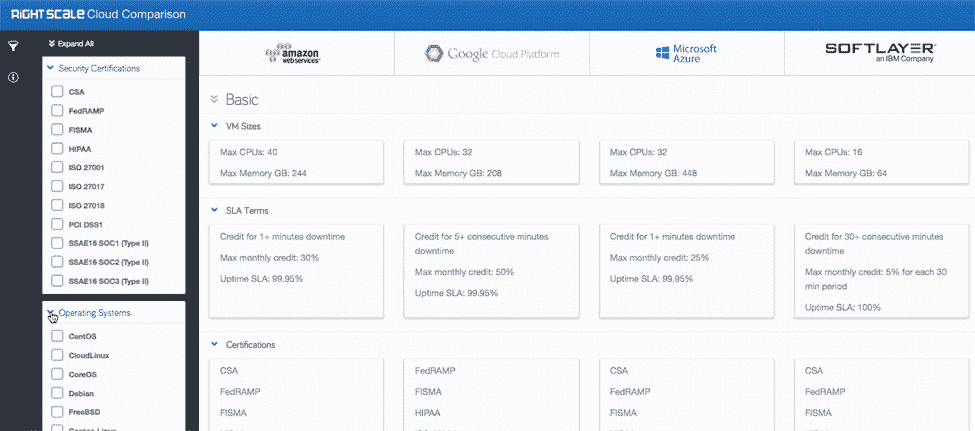
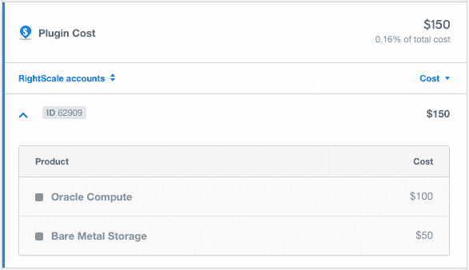

# RightScale 的单一管理平台，适用于多种云管理

> 原文：<https://thenewstack.io/single-pane-glass-multi-cloud-management-rightscale/>

在大规模工作时，开发人员必须管理的信息量可能会非常大。对于使用跨多个云的应用程序的开发人员来说，这更是一个挑战。由于不断增长的云扩张，管理员通常渴望“单一控制台”

“单一窗口”背后的概念很简单。本质上，这只是意味着管理员希望有一个单一的控制点来管理他们跨云的应用程序。无论这些是裸机云、公共云、混合云还是私有云，大规模部署应用都不应该以运行十个单独的云提供商为代价。

## 一个玻璃窗格来统治他们

[RightScale](http://www.rightscale.com/) 旨在通过一套集成服务简化企业处理其云平台的方式，这些服务包括多云自助服务、云治理、成本跟踪和持续交付，所有这些都在一个控制台下完成。

例如，定价数据是选择正确的云解决方案的关键，加入云平台的隐性成本可能会很快导致收入损失或令人震惊的过剩。当考虑到传统存储解决方案中有多少数据未被利用时，这可能是一个代价高昂的错误。

RightScale 在 2015 年推出了其[云定价服务](http://eng.rightscale.com/2015/10/07/rightscale-cloud-pricing-service.html)，该服务于 2016 年 3 月早些时候全面上市。这种云定价服务与其[云比较工具](http://www.rightscale.com/products-and-services/products/cloud-compare)非常契合，允许用户不仅根据功能，还根据价格点来比较和对比流行的云提供商。

RightScale:云比较仪表板

企业 IT 团队越来越多地扮演云服务中介的角色。通过向开发人员和内部客户提供预配置的模板，RightScale 旨在实现供应和操作的自动化，从而使这些团队能够专注于对他们至关重要的工作。RightScale 营销副总裁 [Kim Weins](https://twitter.com/kimweins) 表示:“运营团队可以对所有云及其基于云的工作负载进行可见性、治理和成本控制。

RightScale 在这个市场上并不孤单。谷歌和微软都在开发多云管理工具。

Scalr 为其用户提供全面的云平台管理，以及执行安全和治理策略的能力。 [CloudBolt](https://www.cloudbolt.io/) 是这一领域的另一个产品，它为 IT 专业人员创造了自动化和供应服务的机会。通过实施自动化供应，IT 专业人员能够更好地创建测试和部署的外部环境。

开发人员通常希望为云管理实现定制的工作流。RightScale 提供的分析和管理工具将使他们在开发的各个阶段受益。那些大规模运行应用程序的企业现在需要他们的云提供商为各种 API 和 CI/CD[持续集成/持续部署]管道提供集成。

由于应用程序在 CI/CD 工作流中每天要构建和部署数百甚至数千次代码，RightScale 为开发人员提供了编排和配置工具，以轻松扩展其基础架构。

## 在幕后

在引擎盖下，RightScale 使用一些最流行的编程语言来驱动其 SaaS 平台。“我们主要将 Ruby 用于我们的应用程序代码，但最近开始将 Go 用于我们的一些服务和组件。我们在我们的 [RightLink](http://www.rightscale.com/blog/cloud-management-best-practices/rightlink-10-easier-way-manage-all-your-cloud-servers) 代理以及 CLI 中使用 Go，”Weins 说。

RightScale:云分析 API 仪表板

用户还可以将 RightScale 添加到他们现有的工作负载中，使他们能够开始管理他们当前的云，而无需经历复杂的设置过程。将 RightScale 代理添加到个人的工作负载中，可提供监控、警报和脚本功能以及其他优势。

特别是，其中包括一个用于编排新的基于云的应用程序和服务器配置的模板。使用这些模板的开发人员也可以利用他们现有的配置工具，如 [Puppet](https://puppetlabs.com/) 、 [Chef](https://www.chef.io/products/chef-infra/) 、 [Ansible](https://www.ansible.com/) 或定制脚本。对于那些使用容器的人来说，RightScale 还允许开发人员将他们的代码打包到容器中，以便进行云就绪部署。

如果管理您的云蔓延变得势不可挡，RightScale 提供了一个简化的解决方案，希望能够解决当今大规模企业可能遇到的许多常见陷阱。

通过 Pixabay 显示特征图像，通过 RightScale 显示嵌入图像。

<svg xmlns:xlink="http://www.w3.org/1999/xlink" viewBox="0 0 68 31" version="1.1"><title>Group</title> <desc>Created with Sketch.</desc></svg>