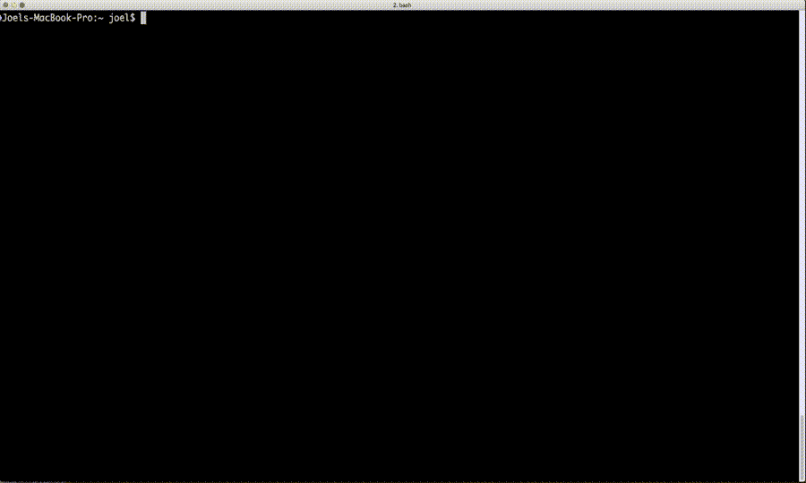

# Kubernetes 的单点登录:命令行体验

> 原文：<https://thenewstack.io/single-sign-kubernetes-command-line-experience/>

在我的上一篇[文章](https://thenewstack.io/kubernetes-single-sign-one-less-identity/)中，我讨论了 Kubernetes 中不同的用户认证方法。我解释了我在 [Pusher](https://pusher.com) 的团队如何希望为我们的工程师创造无缝单点登录(SSO)体验，以及这一旅程如何从调查 Open ID Connect (OIDC)开始，并找到其缺点的解决方案。

其中一个问题是 Kubernetes 没有登录过程。通常，客户端软件会启动这个登录流，但是 kubectl 没有内置这个功能。Kubernetes 让您来设计登录体验。

在这篇文章中，我将解释我们让工程师从终端登录的过程，以及我们在这个过程中面临的挑战。

## 我们的身份提供商

 [Joel Speed，云基础架构工程师，Pusher

Joel Speed 是去年在 Kubernetes 工作的 DevOps 工程师。他从事软件开发已经三年多了，目前正在帮助 Pusher 构建他们的内部 Kubernetes 平台。最近，他一直专注于改善 Kubernetes 内部的自动伸缩、弹性、身份验证和授权的项目，并为 Pusher 的工程团队构建了一个 ChatOps 机器人 Marvin。在学习期间，他深入参与了沃里克学生电影院，将他们的基础设施集装箱化，并定期放映电影。](https://pusher.com/) 

单点登录的第一步是将 [Dex](https://github.com/coreos/dex) 设置为我们的身份提供者。Dex 被配置为使用用户的 Google GSuite 帐户对用户进行身份验证。它充当身份验证流的代理。

我们在一个弹性负载平衡器后面的 AWS EC2 实例集合上托管 Dex，公开一个 Dex 端点来认证 Pusher 的所有 Kubernetes 集群。虽然您可以在 Kubernetes 中运行 Dex 并分别对每个集群进行身份验证，但我们选择了集中进行。但是，这确实允许被破坏的令牌访问所有群集。考虑到我们可以用 Dex 撤销令牌，我们决定这是一个小的交换。

```
Connecting our Kubernetes clusters to Dex was just  a  case of adding  a  few parameters to our Kubernetes API server configuration:

# The URL where Dex was available
--oidc-issuer-url=https://auth.example.com/dex
# The client ID we configured in dex. Kubernetes will compare this to the `aud` field
# in any bearer token from Dex before accepting it.
--oidc-client-id=kubernetes
# Since Dex is configured with TLS, add the CA cert to initiate trust
--oidc-ca-file=/etc/kubernetes/ssl/dex-ca.pem
# The claim field to identify users. For us this means users are granted the username # of their Pusher email address
--oidc-username-claim=email

```

当呈现由我们的 Dex 集群生成的 id-token 时，Kubernetes 现在可以验证该令牌并使用该令牌对用户进行身份验证。

当前版本的 Dex 不支持通过其 OIDC 连接器刷新令牌。因此，Dex 从不回头查看 Google，看看用户是否仍被允许登录。我们已经提交了一个 [Pull 请求](https://github.com/coreos/dex/pull/1180)来解决这个问题，并且目前正在运行一个定制版本。

## 连接 kubectl，艰难之路

当开始使用 Dex 时，我使用他们的示例应用程序来生成我的第一个 ID 令牌。

```
staticClients:
-  id:  kubernetes
redirectURIs:
-  'http://127.0.0.1:5555/callback'  # Allowed redirect URI
name:  'Kubernetes API'
secret:  &lt;SOME_SUPER_SECRET_STRING&gt;  # Pre-shared client-application secret

```

通过向 Dex 添加一个静态客户端，并回调到 127.0.0.1，我可以在我的笔记本电脑上运行示例应用程序，并使用它来生成我的第一个令牌。请注意，由于 Dex 从不直接与应用程序对话，因此在环回地址上托管客户端是可以接受的。

Dex(和其他 OIDC 提供商)使用重定向列表来验证请求用户令牌的软件的身份。通过在对 Dex 的初始请求中提供 redirectURI，Dex 可以向它的一个已知客户端(在这种情况下是 ID kubernetes)发出 id-token，并期望在认证流的令牌交换阶段由客户端软件提供匹配的预共享秘密。这确保了信任，防止了中间人攻击。

```
./example-app  -client-id=kubernetes  -client-secret=&lt;SOME_SUPER_SECRET_STRING&gt;  -issuer=https://auth.example.com/dex -issuer-root-ca=ca.pem

```

上面的命令启动一个 web 服务器监听 127.0.0.1:5555(您可能注意到这是在 Dex 中配置的 redirectURI 的一部分)。通过访问这个地址，我可以启动登录流并生成一个 ID 令牌和一个刷新令牌。

有了这些信息，我将以下内容添加到我的 kubeconfig 文件中:

```
-  name:  joel.speed@pusher.com
user:
auth-provider:
config:
client-id:  kubernetes
client-secret:  &lt;SOME_SUPER_SECRET_STRING&gt;  # Pre-shared client auth
id-token:  &lt;TOKEN_RETRIEVED_FROM_THE_EXAMPLE_APP&gt;
idp-issuer-url:  https://auth.example.com/dex
refresh-token:  &lt;REFRESH_TOKEN_RETRIEVED_FROM_THE_EXAMPLE_APP&gt;
name:  oidc

```

kubectl 可以使用这个用户配置与 Kubernetes 集群对话，并且当 id-token 过期时，可以使用 refresh-token 来获得新的 id-token。

虽然这种“第一次体验”很有效，但我不想把它推广给我们的其他工程师。我想创造一种用户友好的体验。不得不检索秘密，运行任意工具，然后将信息从浏览器复制到 kubeconfig，对我来说感觉不是很友好。

## 连接 kubectl，用户友好的方式

为了改善体验，我从 gcloud auth 登录流中寻找灵感。如果您还没有使用 gcloud 登录流，那么您可以从终端运行该命令，它会打开您的浏览器。这将带你到谷歌的登录屏幕。登录后，它会指示您返回到终端，在那里您会被告知您已经登录并且您的环境已经配置好了。从 Dex 示例应用程序开始，我构建了一个工具(称为 k8s-auth)来反映这种体验。

作为入职的一部分，Pusher 的工程师在 Vault 上签名。k8s-auth 正是利用了这一点。我们将 k8s-auth 的配置存储在 Vault 中，并使用工程师的 Vault 令牌在运行时将其加载到程序中。因此，如果我们需要更改预共享的客户端密码，我们只需要在 Vault 中更新它。

k8s-auth 使用 kubernetes 客户端库中的代码来配置用户的 kubeconfig，而不是在 web 浏览器中显示创建的令牌。因为我们的集群遵循一个命名方案，所以我还添加了配置新集群和相应上下文的功能，作为同一个应用程序的一部分。

当一名新工程师加入组织时，为了设置 kubectl 并将其连接到我们的集群，他们需要遵循以下说明:

*   按照我们的入职说明登录 Vault
*   安装 k8s-auth 和 kubectl
*   运行 k8s-auth cluster1 cluster2
*   运行 kubectl config set-context 来选择集群。

在我们撤销他们的令牌的情况下，他们需要做的就是再次运行 k8s-auth 来生成新的 id 令牌和刷新令牌。

[](https://storage.googleapis.com/cdn.thenewstack.io/media/2018/03/961a7f68-kube-sso.gif)

## 结论

我们开始构建一个用户友好的 SSO 体验，我们的工程师可以用它来赞美 kubectl。我们发现我们喜欢 gcloud auth 登录流程，并成功复制了几乎相同的体验。

通过扩展最初的概要并将集群配置添加到同一个工具中，我们现在为我们的工程师提供了一种为现有和未来的集群设置 kubectl 的简单方法。

虽然我不能开源我们的 k8s-auth 的具体版本，但我已经创建了一个[示例](https://github.com/pusher/k8s-auth-example)，它是它的抽象版本。您可以使用这个例子来执行 OIDC 登录流，或者您可以使用它作为基础来为您的集群创建一个更具体的登录工具。

然而，kubectl 并不是我们的工程师访问 API 的唯一方式。Kubernetes 仪表板也没有为您提供执行 OIDC 登录流程的方法。在我的下一篇文章中，我将解释我们设计的 Dashboard SSO 体验，以及您自己如何复制它。

<svg xmlns:xlink="http://www.w3.org/1999/xlink" viewBox="0 0 68 31" version="1.1"><title>Group</title> <desc>Created with Sketch.</desc></svg>