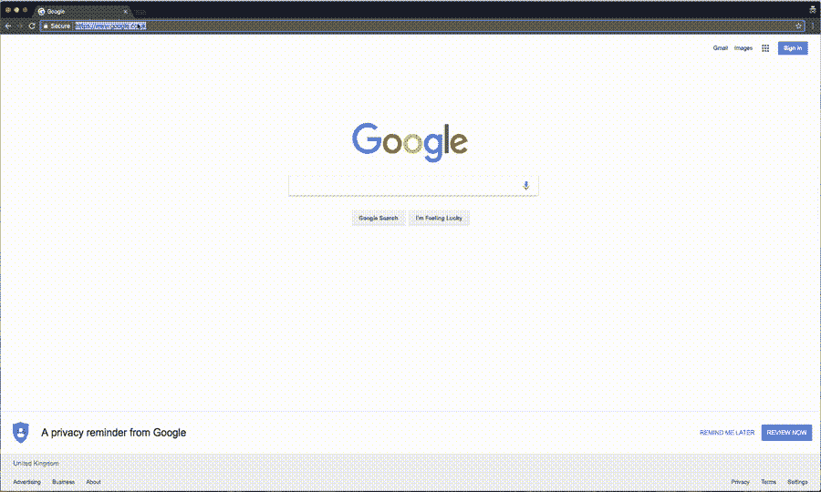

# Kubernetes 的单点登录:仪表板体验

> 原文：<https://thenewstack.io/single-sign-on-for-kubernetes-dashboard-experience/>

 [Joel Speed，云基础架构工程师，推动者

Joel Speed 是一名 DevOps 工程师，在 Kubernetes 工作了最后一年。他从事软件开发已经超过 3 年，目前正在帮助 Pusher 构建他们的内部 Kubernetes 平台。最近，他一直专注于改善 Kubernetes 内部的自动伸缩、弹性、身份验证和授权的项目，并为 Pusher 的工程团队构建了一个 ChatOps 机器人 Marvin。在学习期间，他深入参与了沃里克学生电影院，将他们的基础设施集装箱化，并定期放映电影。](https://pusher.com/) 

在我的前两篇文章([第 1 部分](https://thenewstack.io/kubernetes-single-sign-one-less-identity/)和[第 2 部分](https://thenewstack.io/single-sign-kubernetes-command-line-experience/))中，我研究了 Kubernetes 中的用户认证以及如何在 Kubernetes 生态系统中创建单点登录体验。到目前为止，我已经解释了 Open ID Connect (OIDC)如何工作，如何开始使用 OIDC，以及如何从命令行执行登录。

这个拼图的最后一块是 Kubernetes 仪表板，我们的工程师经常和 kubectl 一起使用它。为了完成向 SSO 的迁移，我们希望确保在使用仪表板时，我们的工程师登录到他们用于 kubectl 的同一个帐户。

从 Kubernetes 版本 1.7.0 开始，仪表板就有了一个登录页面。它允许用户上传 kubeconfig 文件或输入不记名令牌。如果您已经登录到命令行，这允许您将 kubeconfig 文件中的 OIDC id-token 复制到无记名 token 字段并登录。然而，这有几个问题:

*   登录页面有一个跳过按钮—如果您没有使用任何授权(RBAC)，那么这将允许任何人以有效的管理权限访问仪表板。
*   从文件中复制和粘贴令牌对用户来说并不友好。

或者，仪表板支持使用授权头来提供无记名令牌(Authorization: Bearer <oidc-id-token>)。这允许预先生成 OIDC id-token，并在装载仪表板之前注入报头。如果我们能够确保对仪表板的每个请求都包含这个标题，那么我们就可以跳过仪表板登录屏幕，避免前面提到的问题。</oidc-id-token>

## 认证代理

在[推手](https://www.pusher.com)，我们已经在使用 Bitly OAuth2 代理来保护我们的一些内部网站。它支持 OIDC，因此与 Dex 兼容。最初，看起来好像我可以用它来生成仪表板的授权头。然而不幸的是，它还没有为这个用例做好准备:

*   **访问 id 令牌**:虽然代理可以连接到 Dex 并对用户进行身份验证，但它没有公开授权头所需的 ID 令牌。有了这个 PR，OAuth2 代理可以在代理模式和 Nginx Auth 请求模式下运行时公开一个与 Kubernetes 仪表板兼容的授权头。
*   **集中运行代理**:我们希望设计尽可能可扩展的系统。如果我们要在我们的每个 Kubernetes 集群上运行 OAuth2 代理的副本，那么我们的 Dex 配置将需要在每次添加新集群时更新，新的回调 URI 将需要指向每个集群。有了这个 PR，OAuth2 代理可以接受重定向请求到白名单域的子域。通过将 Kubernetes 集群所属的域列入白名单，我们可以托管一个中央 OAuth2 代理，当我们添加新集群时，它不需要任何重新配置。

通过对 OAuth2 代理的这些添加，我们将其添加到现有的 Dex 集群中，并将其配置为 Dex 的客户端。我已经包含了与上述 PRs 相关的代理配置片段，例如:

|  | 

【kube . pusher platform . io 的#子域允许重定向

- 白名单 - 域 =。kube。 例 。com

# Cookie 需要覆盖所有白名单域

-Cookie-域 =。kube。 例 。com

#在 auth 响应中设置授权头

- 设置 - 授权头-=真

 |

## 注入集管

在我们的身份验证集群上配置了 OAuth2 代理之后，现在是时候将仪表板连接到它了。为此，我们利用入口控制器中 Nginx 的 Auth Request 模块。

通过将下面的代码片段添加到仪表板的入口对象，我们可以使用 Nginx 检查 OAuth2 代理(反过来检查 Dex 和 Google)来确定用户是否登录，然后才允许用户访问仪表板。

|  | 

#对于在 https://auth.example.com/oauth2 托管的 OAuth2 代理

#配置 Nginx 授权请求模块

入口 。 kubernetes 。io/auth-URL:" https://auth . example . com/oauth 2/auth "

ingress。。io/auth-sign in:"https://auth.example.com/oauth2/start？rd = https://$ host $ request _ uri $ is _ args $ args "

#代理认证头到仪表板

入口 。 kubernetes 。 io / 配置 - 片段:&#124;

#为 kubernetes-dashboard 添加授权头

auth _ request _ settoken

proxy _ set _ header授权token；

 |

在这种配置下，对仪表板的请求会发生以下情况:

1.  Nginx 向 OAuth2 代理的 auth 端点 auth-URL 发送一个请求
2.  如果用户登录，OAuth2 代理返回 202，如果用户未登录，则返回 401。
    *   如果 Nginx 接收到一个 202，它将允许对仪表板的请求，并在对仪表板的 auth 响应中代理授权头。
    *   如果 Nginx 收到一个 401，它会将用户重定向到 *auth-signin* 端点，然后该端点启动登录流程。

当用户第一次访问仪表板时，他们会通过 Dex 透明地重定向到 Google 进行登录。一旦他们登录谷歌，他们就会被重定向回原来的位置。此时，他们将面对仪表板，跳过登录屏幕，因为他们现在使用授权头进行身份验证。

## 结论

有了上面的系统，我们现在可以确保对 Kubernetes 仪表板的每个请求都经过了身份验证。我们的工程师倾向于已经登录到 Google，他们甚至经常没有注意到仪表板登录流程，他们的浏览器只是将他们直接重定向到仪表板。

结合我在上一篇文章中讨论的命令行体验，我们已经将 Pusher 的 Kubernetes 身份验证迁移到了单点登录系统。每个工程师都单独登录集群，重要的是，我们不需要管理额外的用户帐户。

虽然最初的单点登录设置花费了一些时间，但我们对结果和我们的工程师现在拥有的用户友好的体验非常满意。

<svg xmlns:xlink="http://www.w3.org/1999/xlink" viewBox="0 0 68 31" version="1.1"><title>Group</title> <desc>Created with Sketch.</desc></svg>