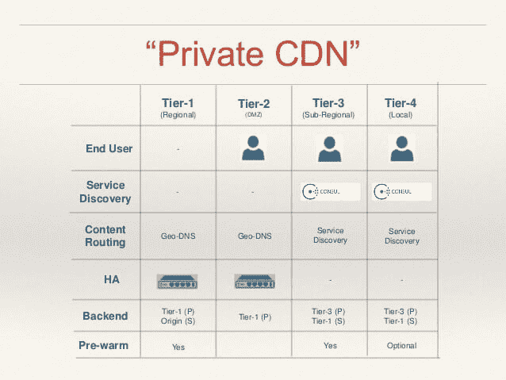

# 一个工程师如何用清漆建立特斯拉的私人 CDN

> 原文：<https://thenewstack.io/single-tesla-engineer-uses-varnish-create-private-cdn/>

在最近的一次 Varnish 峰会上，特斯拉汽车公司首席 it 基础架构架构师 Vitaliy Kushnerov 和特斯拉网络平台架构师 Rajasekar Jegannathan 谈到了他们如何创建一个私有内容交付网络(CDN)。

2013 年，[特斯拉 Model S](https://www.teslamotors.com) 被《消费者报告》评为[有史以来最好的汽车](http://money.cnn.com/2013/05/09/autos/tesla-model-s-consumer-reports/index.html)，IT 团队意识到他们当前的基础设施不可扩展。他们需要一个能够提供缓存引擎、强大的地理 DNS 和服务发现的 CDN，所有这些在全球范围内保持一致。

我们不都是吗？

[特斯拉网站](https://www.teslamotors.com)充斥着大量视频内容和图像文档，它们既占用空间又需要时间来下载。

库什纳罗夫说，该公司意识到它没有优化利用资源。客户连接到服务中心，然后等待。“所以他们坐在那里想‘多漂亮的车啊，但是他们不能把服务流程做好。’"

成立了一个小团队来发现问题并提出解决方案，他们首先问问题出在哪里？他们如何更好地利用现有的基础设施和服务？

分析显示，有多个地方反复传输相同的内容。“问题变成了:‘我们如何一次性传递数据？’，”库什纳罗夫说道。

CDN 是显而易见的答案。但当时没有可靠的 cdn 将可靠性扩展到中国。全球一致性对特斯拉至关重要。该团队决定在内部控制的私有 CDN 和特斯拉保护伞下才是出路。

这一工作完成后，库什纳罗夫和杰甘纳坦一起坐在一台显示器前，在大约 5 个小时内完成了特斯拉 CDN 的概念验证。所以事实证明，特斯拉像初创公司一样运营的传言是真的。

手握概念证明，Jegannathan 继续完整地设计项目，并将其提升到目前的水平——全球活跃，公司中有数千人使用。

Jegannathan 说，最大的挑战是在全球范围内提供相同的用户体验，尤其是在中国。他得到了其他特斯拉开发人员的帮助，他们在全球范围内传递有关数据流量模式的信息。

根据这些信息，他对 CDN 提供商提出了要求:

*   使用现有硬件和网络资源的能力，因为作为一家初创企业，他们没有钱购买额外的资源。
*   基于永久存储的高速缓存，每个文件的容量从 650 MB 到 1.7 GB 不等。
*   基于应用选择存储的能力。
*   团队对数据的可见性。
*   最重要的是，控制网络的能力。

进入 [Varnish 软件](https://www.varnish-software.com)，他不仅检查了所有这些盒子，而且他们的工程师同意与 Jegannathan 合作，使他的概念验证工作。

Varnish 为大型网站提供了一个开源的 HTTP 加速器，最近发布的 MSE (海量存储引擎)模块提供了一种高速缓存大量数据的方法，如果系统崩溃，可以快速重新加载。

“放在应用服务器前面；它超级简单。因此，它也快了 200–1000 倍。因此，每当你将数据从缓存层移动到应用服务器时，Varnish 将在 30-40 微秒内提供数据，而典型的缓存为 10-20 毫秒，”Varnish Software 的创始人兼首席技术官佩尔·帕尔在当天早些时候的一次采访中说。

为了响应 Jegannathan 的请求，Varnish 工程师对 MSE 进行了编码更改，以接受重定向。现在，当一个请求进入 Tesla 网络时，该流程会查看地图并选择最近的位置，然后将请求重定向到该位置。Varnish 软件团队在整个概念验证过程中与 Jegannathan 合作，编写新功能代码，使 Varnish 为特斯拉工作。

最重要的是，根据 Jegannathan 的说法，VCL (Varnish 配置语言)让他能够控制 CDN。“我爱 VCL，”他热情洋溢地说。

现在，无论有多少人试图获取视频，特斯拉 CDN 都只保留一份拷贝。因此，如果六个人想看相同的 7.5 gig 视频，只需检索一次。Jegannathan 认为这是一个巨大的胜利，因为没有钱添加硬件。

Varnish 使用一个 CPU，即使这样也是分区的，优先考虑服务，然后是视频，然后是其他使用图像的应用程序。此外，他发现 CDN 不会占用太多内存，这也是一个优势。

此外，“预取”过程会不断寻找任何可用的新软件/视频。例如，在欧洲，有五个高容量站点，系统会为这些高容量区域预先填充常用缓存。

区域层也可以为关键站点预热，这意味着在发出请求之前下载最常用的内容。例如，中国地区可以预热，这解决了许多交货问题。本地站点没有预热。

## 四层体系

在后端，Jegannathan 在 VCL 创建了一个监控硬件的进程。如果任何一个部分出现故障，这个过程只是简单地重定向到另一个服务器，而没有工程师的参与。通过视频流，工程师可以了解全球的情况。如果出现任何问题，技术人员可以看到并解决问题。

以此为基础，Jegannathan 构建了一个四层 CDN 系统。

他说，高可用性对于向客户交付内容至关重要，因此它用于第 1 层和第 2 层。第 3 层和第 4 层使用控制台提供服务。

该公司网站的流量目前每天只有 2000-10000 次下载，但内容的大小非常大，每个文件高达 1.7 千兆字节。这些信息对于确定系统的构建方式至关重要。J 指出，如果交通负荷更高，可能会做出不同的决定。

特斯拉 CDN 的未来？“藏在一个盒子里，”杰甘纳坦说。由于流量增加，需要新的服务器吗？装运一个盒子，预装 CDN，用于即插即用升级。

一个拥有管理支持和创业环境的工程师能做的事情令人惊叹。

<svg xmlns:xlink="http://www.w3.org/1999/xlink" viewBox="0 0 68 31" version="1.1"><title>Group</title> <desc>Created with Sketch.</desc></svg>