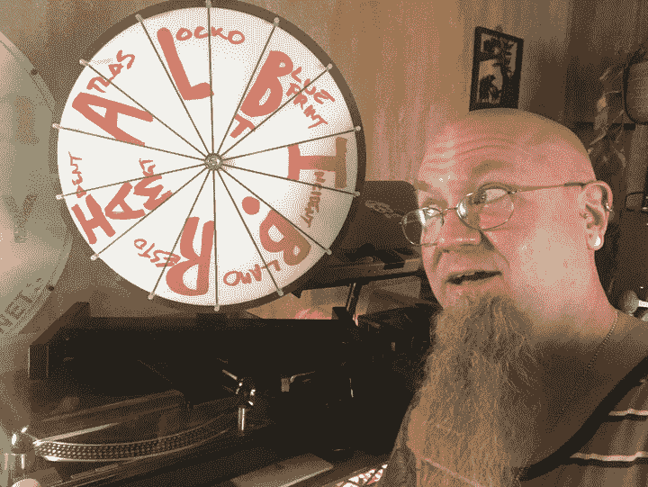
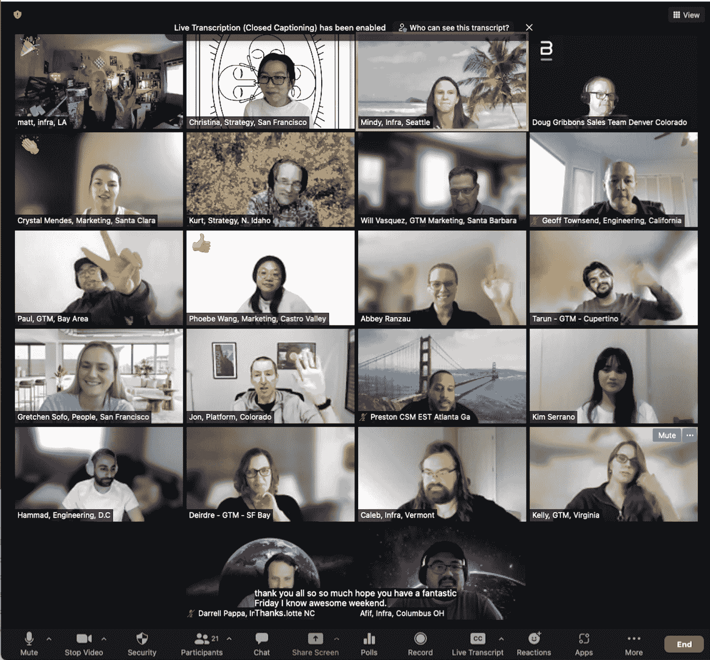

# 现场可靠性工程和即兴艺术

> 原文：<https://thenewstack.io/site-reliability-engineering-and-the-art-of-improvisation/>

 [马特·戴维斯

马特是无可指责的高级基础设施工程师。他的专业知识包括数据中心运营、存储硬件和分布式数据库、IT 安全、站点可靠性、支持服务、可观察性系统和 TechOps 领导力。他拥有音乐表演和作曲学位，热衷于探索艺术思维和操作分布式软件架构之间的关系。](https://www.linkedin.com/in/mattcookedavis/) 

站点可靠性工程(SRE)依赖于编排和即兴创作。发展一个伟大的 SRE 实践意味着对技术基础设施的深刻理解，但也意味着相信你的直觉并开始干扰的信心。

我在“无可指责”开设了一个每周一次的持续学习课程，该课程的名称来自传统的印度尼西亚管弦乐团:Gamelan(发音为“gah-meh-lahn”)。这个管弦乐队主要是打击乐器，有许多调音的锣和槌棒乐器，还有一些弦乐器和管乐器，通常由一名男歌手或女歌手演唱，他们通过节奏和即兴创作结合在一起。

你看，gamelan 的一个关键要素是，音乐是由团队在练习时创作的，他们相信音乐应该成长和变化。当他们一次又一次相遇时，成员们每次演奏时都会不断地进化出歌曲的新版本。实践开始看起来像表演，反之亦然。这很像即兴爵士乐，演出仅仅是聚在一起演奏的又一次机会。

在这些会议上，我们转变和发展理解的一些方式包括:

*   **可观察性工具集演练**，也称为“早晨远景”:当你打开笔记本电脑开始一天的工作，查看整个运营环境时，你观察到了什么？这为我们的同事如何处理日常工作提供了新的视角。
*   **决策需求表** **建筑**，例如在我们的 Kubernetes 集群的随叫随到或实时维护期间面临的最困难的决策。这些帮助我们思考如何改进，以支持应急人员在胁迫下做出决定。
*   **团队知识启发**，比如更深入地了解 NGINX 入口日志或尝试关键路径的依赖矩阵。这对从我们专家的大脑中挤出一些有趣的知识非常有用。
*   **问这样一个问题，“为什么我们有随叫随到的服务？”**分享公司不同人员如何看待和参与 it 的心智模型。我们了解彼此的期望，如何减轻第一次随叫随到的恐惧。
*   **旋转专业知识之轮！**又名“谁？什么？哪里？”在这里，我们通过游戏探索我们的技术堆栈和服务，要求每个人旋转轮盘，并要求他们直接向我们展示他们将如何找到答案，或者如果他们不知道，他们将如何升级。

转动专业知识的轮子

我们在“无可指责”创造了一个学习的机会，一个以合作的方式走到一起的时间，分享心智模型，并以安全和无压力的方式讲述系统不同领域的故事，这样我们就可以继续学习。这样，事件也仅仅是另一次我们可以运用直觉的力量，因为我们已经将处理它们的技术付诸实践。更准确地说，我们称之为“实践的实践”，这是我们在实际制作工艺时吸收的经验——即兴创作、制作、事件。

我的座右铭有时是，只要我们一起做，我们一起做什么并不重要。不管出席情况如何，讨论总是深入到共同的视角，并允许参与者有一个安全的空间来探索事情，而不用担心与事件相关的判断或焦虑。任何一个人都不可能了解网络软件的全部复杂性，因此知道在哪里可以找到专业知识以及如何从实践中学习，而不是试图遵循处方或匆忙审阅的操作手册变得至关重要。

关于运行这些学习机会，我最喜欢的事情之一是，当我们回答问题或探索一个或另一个 UI 时，看到参与者使用他们日常工作的各个方面。这使得其他人可以窥视他们同事的思维模式。对一个人来说看似平凡无奇的任务可能会启发另一个人的理解，甚至会引导其他人修饰他们自己的模式和工作方式。

## 社会技术实践

我们的主题和议程有些松散，但通常是有计划的，所以我们不只是盯着对方。然而，有时我们需要适应。有一个会议在一个大型供应商中断的同一天举行，这使得我们无法使用我们自己的 UI 来支持当天的游戏。因此，我们改变了方向，与我们的两位专家就供应商中断的主题进行了会谈，在本例中，这是根证书颁发机构和 SSL/TLS 协议。

虽然重点是我们复杂系统的运营部分，但参与者不仅仅是基础设施工程师和 sre。我们的会议包括技术写作、软件开发、客户服务、战略、营销甚至管理人员。我们让日历邀请在公司范围内可选，我们不称之为会议:这是一个会话，在这里我们可以分享故事，并在现场享受乐趣。

与不同团队成员的会议

在所有这些活动中，我们寻求打开人们可能害怕通过的门，通过体验我们的同行如何回答关于服务或技术的问题来学习。我们学习他人的模式和实践，这丰富了我们自己的直觉反应，在我们自己的心智模式中创造了新的途径和新的联系。这丰富了我们对系统的认识，并为在响应事件时具有适应性提供了基础。

## 构建以适应

在宏大的社会技术体系中，“实践的实践”*使我们能够建立起像训练有素的爵士音乐家的和声一样绽放的弹性。发现中的神奇和兴奋是我们大脑的食粮。我们的突触渴望丰富模式识别，将新的经验与旧的经验和其他心理模型结合起来，形成新的经验。*

 *这种超级英雄般的力量可以瞬间从看似不存在的地方拉出解决方案，它源于将我们练习过的音阶、旋律、理论、节奏和其他模式与鼓舞人心的组合结合在一起。

我们不会在事故中遭受令人紧张的共同点故障，从而导致糟糕的客户体验，而是寻求新的方法来更自信地设计我们的社会技术系统。作为一个组织，我们认为这种合作是有力量的；参与者称赞这些课程是他们做过的最好的在职学习。

因此，的确，更坚定地处理而不是回避模糊性，直接来自于知道如何在最关键的时候把工作做得更好。但我们并不孤单。我们通过在合作联合活动中利用我们丰富的人类网络来做到这一点，认识到我们的日常工作如何与我们寻求理解的复杂性相互关联并馈入其中。

这与音乐家通过演奏相互影响和支持的方式没有太大的不同。想象一下，当您非常可靠的服务器出现故障时，一个关于您有什么选择的谦逊会话可以减轻非常不舒服的事件。意外是没有计划的，因此可能会令人生畏，但是团队会支持你。这种情况你们都练习过，所以这只是你们聚在一起创作音乐的又一次机会。

<svg xmlns:xlink="http://www.w3.org/1999/xlink" viewBox="0 0 68 31" version="1.1"><title>Group</title> <desc>Created with Sketch.</desc></svg>*