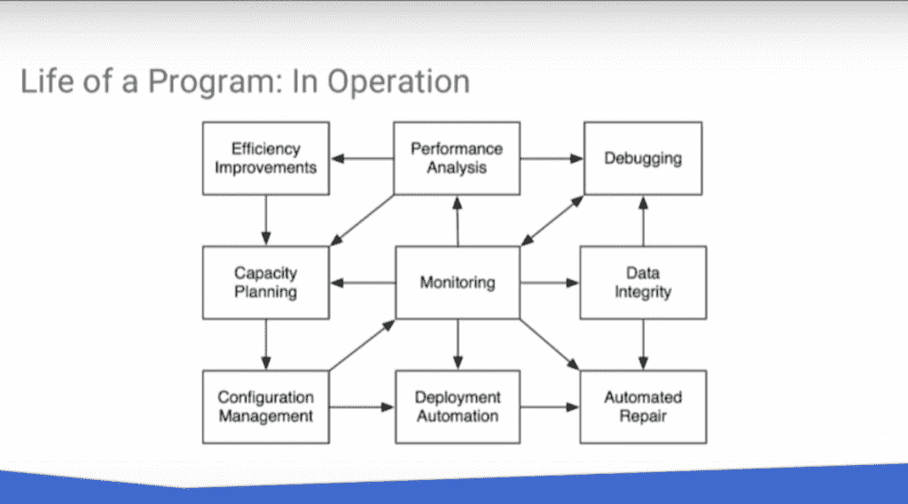

# 面向云原生操作的站点可靠性工程

> 原文：<https://thenewstack.io/site-reliability-engineering-cloud-native-operations/>

开发人员希望尽快改变事物，而运营团队仍然担心改变会破坏事物。为了调和这两种驱动力，谷歌创造了站点可靠性工程(SRE)之路，这是一种维护需要高可靠性运行的复杂计算系统的新兴实践。正如谷歌 SRE 团队的创始人，[本·特雷诺(Ben Treynor)在](https://en.wikipedia.org/wiki/Site_reliability_engineering)所说的那样:SRE 是“当一个软件工程师被赋予过去被称为运营的任务时所发生的事情。”

SRE 可以追溯到 2003 年，当时 Treynor 加入谷歌，管理一个工程师团队来运行生产环境。实践证明是成功的，该公司现在有 1500 名工程师在 SRE 工作。苹果、甲骨文、微软、Twitter、Dropbox、IBM 和亚马逊也都成立了自己的 SRE 团队。

那么 SRE 到底是什么？有人会称之为 [DevOps](/category/devops/) 本身的子集。Treynor 将其描述为传统 sysadmin 服务管理方法的一种替代方法，在传统 sysadmin 方法中有两个不同的开发和运营团队。他说主流的 sysadmin 方法很容易实现，并且已经有很多工具和例子可以帮助你实现。然而，Treynor 说，这个过程会带来直接和间接的成本，包括团队必须根据服务和流量需求进行扩展和收缩。

“从本质上讲，开发团队希望推出新功能，并看到它们被用户采用。他们的核心是，运营团队希望确保在他们拿着寻呼机时服务不会中断。因为大多数中断是由某种变化引起的——新配置、新功能发布或新类型的用户流量——两个团队的目标从根本上来说是紧张的，” [Treynor 写道](https://landing.google.com/sre/book/chapters/introduction.html)。

SRE 团队的首要任务是至少花一半的时间在开发上，以确保系统保持强大和稳定。谷歌 SRE 团队由谷歌软件工程师组成，其中许多人拥有 Unix 或网络管理等专业技能。所有人都专注于解决复杂问题的软件。他们有一种“要么编码，要么淹死”的心态，因此没有人会长期从事某项工作，从而将运营的债务保持在最低水平。

在今年的 [CoreOS Fest](https://coreos.com/resources/index.html#ufh-i-347359245-coreos-fest-day-2-coreos-cto-brandon-philips-google-sre-chris-jones-astronomer-lucianne-walkowicz/588810) 上，[O ' Reilly 的书《站点可靠性工程》的联合编辑，](https://g.co/srebook) Google 研究员[克里斯·琼斯](https://www.linkedin.com/in/chris-jones-122969/)告诉观众，即使是思想进步的敏捷软件工程仍然缺少软件工程的维护方面，专注于构建软件而不是操作软件。

琼斯说，软件可靠性工程师所做的是“考虑软件对象的整个生命周期，从它们的开始到它们的部署到操作、改进，以及最终的和平退役”。

## 云世界中的站点可靠性工程

谷歌 SRE 团队所做的一切不仅包括创造和自动化，还包括衡量事情是如何进行的。这些指标推动了软件的进一步开发，从而使软件运行得更可靠、更快、更便宜。

但是这在我们的云世界中是如何工作的呢？

“云是一个计算环境，你很难指出运行你的软件的确切东西，”琼斯说。

云部署的一个重要步骤是将应用程序与它们自己的依赖项配对。对于谷歌来说，容器是实现这一点的云的基础技术。“在内部，我们几乎是开源的，”琼斯谈到谷歌时说，在谷歌，工程师可以对任何代码提出修改，允许他们真正根据需要构建软件，并理解它在做什么。

琼斯承认，这种方法可能不适用于那些对他们正在建设和运行的东西没有完全透明度和所有权的公司，但他怀疑将开始出现涵盖这一点的标准。随着越来越多的软件为云而构建，云将变得内在可互操作，以实现这些目标。

最后，Jones 认为，随着我们越来越多地向云迁移，我们将需要 SRE 作为瀑布或 DevOps 的替代方案，因为它是在云中构建的。

[https://www.youtube.com/embed/MICZJ1A9LsM?start=2467&feature=oembed](https://www.youtube.com/embed/MICZJ1A9LsM?start=2467&feature=oembed)

视频

[CoreOS](https://coreos.com/) 是新堆栈的赞助商。

<svg xmlns:xlink="http://www.w3.org/1999/xlink" viewBox="0 0 68 31" version="1.1"><title>Group</title> <desc>Created with Sketch.</desc></svg>