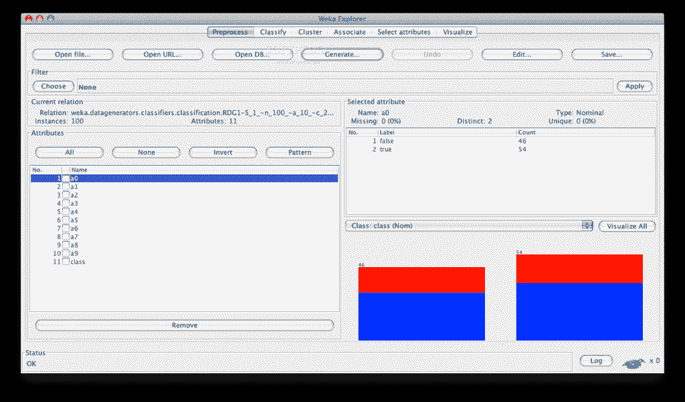
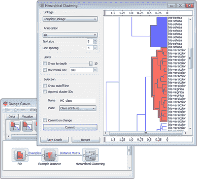
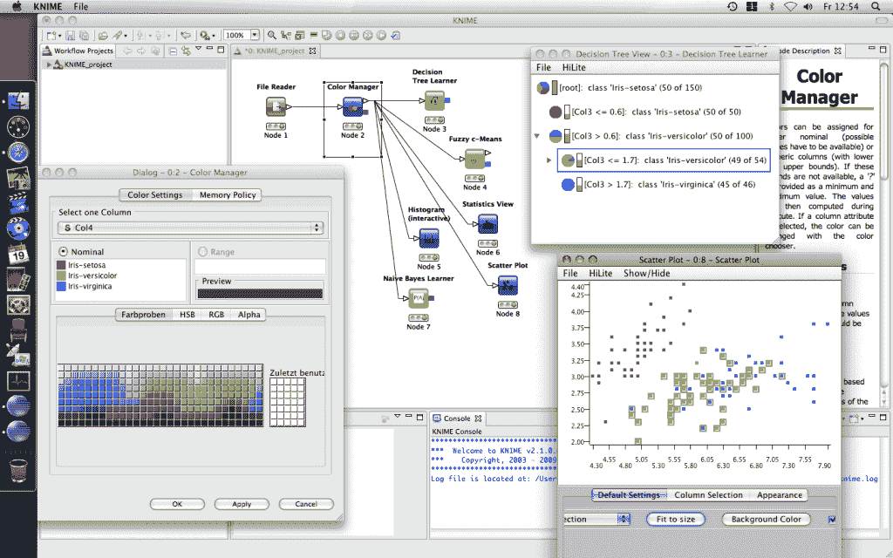
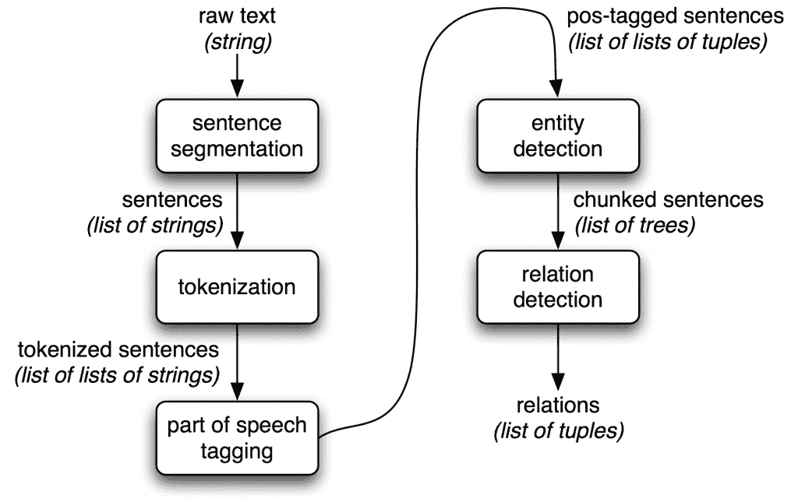

# 六个最好的开源数据挖掘工具

> 原文：<https://thenewstack.io/six-of-the-best-open-source-data-mining-tools/>

有人说，在当今世界，数据就是金钱。随着向基于应用程序的世界的过渡，数据呈指数级增长。然而，大多数数据是非结构化的，因此需要一个过程和方法来从数据中提取有用的信息，并将其转换为可理解和可用的形式。这就是数据挖掘发挥作用的地方。大量的工具可用于数据挖掘任务，使用人工智能、机器学习和其他技术来提取数据。

以下是六个强大的开源数据挖掘工具:

## RapidMiner(前耶鲁大学)

该工具用 Java 编程语言编写，通过基于模板的框架提供高级分析。一个好处是:用户几乎不用写任何代码。作为一项服务，而不是一个本地软件，这个工具在数据挖掘工具列表中占据首要位置。

除了数据挖掘， [RapidMiner](https://rapidminer.com/) 还提供数据预处理和可视化、预测分析和统计建模、评估和部署等功能。更强大的是，它提供了来自 WEKA 和 R 脚本的学习方案、模型和算法。

RapidMiner 是在 AGPL 开源许可下发布的，可以从 SourceForge 下载，在 SourceForge 它被评为排名第一的商业分析软件。

## 新西兰黑秧鸡

最初的非 Java 版本的 WEKA 主要是为分析农业领域的数据而开发的。对于基于 Java 的版本，该工具非常复杂，用于许多不同的应用程序，包括可视化和数据分析和预测建模的算法。它在 GNU 通用公共许可证下是免费的，与 RapidMiner 相比这是一大优势，因为用户可以随心所欲地定制它。

WEKA 支持几个标准的数据挖掘任务，包括数据预处理、聚类、分类、回归、可视化和特征选择。
增加序列建模功能后，WEKA 将变得更加强大，目前还不包括这一功能。

## **R 编程**

如果我告诉你 GNU 项目 [Project R](https://www.r-project.org/) 是用 R 本身写的呢？它主要是用 C 和 Fortran 编写的。而且它的很多模块都是用 R 本身写的。这是一种用于统计计算和图形的免费软件编程语言和软件环境。R 语言在数据挖掘者中广泛用于开发统计软件和数据分析。近年来，易用性和可扩展性大大提高了 R 的受欢迎程度。

除了数据挖掘，它还提供统计和图形技术，包括线性和非线性建模、经典统计测试、时间序列分析、分类、聚类等。

## 柑橘

Python 越来越受欢迎，因为它简单易学而且功能强大。因此，当你正在为你的工作寻找一个工具并且你是一个 Python 开发者的时候，看看 [Orange](https://orange.biolab.si/) 就知道了，它是一个基于 Python 的、强大的开源工具，适合新手和专家。

你会爱上这个工具的可视化编程和 Python 脚本。它也有机器学习的组件，生物信息学和文本挖掘的插件。它包含数据分析功能。

## KNIME

数据预处理有三个主要部分:提取、转换和加载。KNIME 做这三件事。它为您提供了一个图形用户界面，允许组装节点以进行数据处理。这是一个开源的数据分析、报告和集成平台。KNIME 还通过其模块化数据管道概念集成了机器学习和数据挖掘的各种组件，并引起了商业智能和金融数据分析的注意。

用 Java 编写，基于 Eclipse，KNIME 易于扩展和添加插件。可以随时添加其他功能。核心版本中已经包含了大量的数据集成模块。

## NLTK

说到语言处理任务，没有什么能打败 NLTK。NLTK 提供了一个语言处理工具库，包括数据挖掘、机器学习、数据搜集、情感分析和其他各种语言处理任务。你所需要做的就是安装 NLTK，为你喜欢的任务拉一个包，你就可以开始了。因为它是用 Python 写的，所以你可以在它上面构建应用程序，为小任务定制它。

Chandan Goopta 是加德满都大学的数据研究员，专注于构建用于情感分析的智能算法。

<svg xmlns:xlink="http://www.w3.org/1999/xlink" viewBox="0 0 68 31" version="1.1"><title>Group</title> <desc>Created with Sketch.</desc></svg>