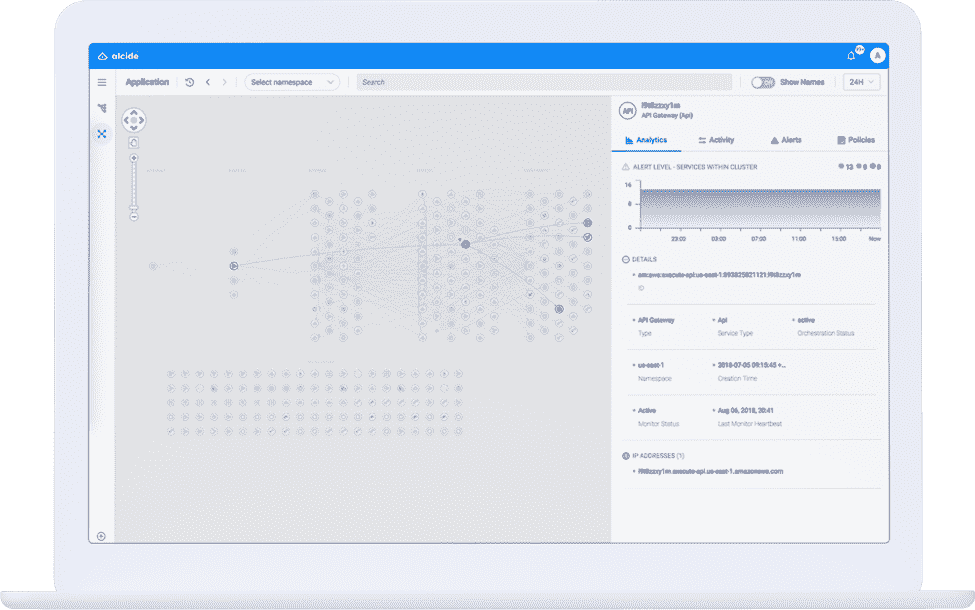

# 无服务器环境的六个安全注意事项

> 原文：<https://thenewstack.io/six-security-considerations-for-serverless-environments/>

 [加迪·纳尔，首席技术官兼 Alcide 联合创始人

加迪·纳尔作为首席技术官兼 Alcide 联合创始人，拥有 15 年的网络安全产品开发经验。Gadi 将他的管理和技术背景融合在不同的岗位上。Gadi 曾在 CheckPoint 工作，担任业务开发经理和高级开发人员，领导 CheckPoint 的防火墙核心安全引擎和 VPN 软件的开发。然后，他在 Altor Networks 担任高级软件工程师，Altor Networks 是虚拟化数据中心安全领域的先驱，后来被 Juniper Networks 收购，他继续担任高级软件工程师。在联合创立 Alcide 之前，Gadi 是基于微服务的系统 Fitfully 的联合创始人兼首席技术官。](https://www.alcide.io/) 

在 AWS Lambda 于 2014 年推出功能即服务(functions-as-a-service，FaaS)或无服务器之后，许多企业已经将它作为云架构的一部分。从那以后，其他主要的云提供商也宣布了他们自己的无服务器产品，包括 [Azure Functions](https://azure.microsoft.com/en-us/services/functions/) 和 [Google Functions](https://cloud.google.com/functions/) 。

无服务器基础设施的快速采用主要是因为它能够将基础设施管理从应用程序开发人员转移到云提供商。这使得开发人员可以节省以前花费在后端操作和程序编码上的时间和成本，从而提高基础设施的利用率。然而，无服务器的主要优势——为开发人员减轻操作负担——也带来了最大的风险之一:在这些环境中缺乏所有权、可见性和安全性。

传统的[共享责任模式](https://aws.amazon.com/compliance/shared-responsibility-model/)规定云提供商负责云中的安全*，客户负责*云中的服务*的安全。无服务器计算改变了这种共享责任模式，将这些服务的大部分安全责任放回云提供商手中，因为它正在扩展云基础架构并处理后端操作。然而，运营所有权的这种转变引起了人们对专用解决方案的兴趣，这些解决方案为这些隐藏环境提供了额外的安全性和可见性。*

## 游泳，不要在没有服务器的情况下下沉

当在无服务器架构中开发时，开发人员职责的变化对一些组织来说可能是令人畏惧和有问题的。随着无服务器的持续快速增长和采用，安全性需要继续成为一个关键问题，这样企业才不会成为这些新型服务引入的盲点的受害者。

在实现阶段遵循无服务器安全性(以及一般的云安全性)的最佳实践，将有助于您的团队在开始使用功能时游刃有余，而不是一蹶不振。结果是操作合规性和高效安全的工作负载，让您的团队专注于实际编写代码的有趣部分，而不是处理无聊的操作需求。虽然无服务器环境的本质是短暂的和非常动态的，但无服务器用户应该记住这些最佳实践，以确保这些新环境中的安全。

## 无服务器安全最佳实践

云提供商负责提供计算基础设施的无服务器背后的理念引入了一组开发人员应该了解的最佳实践，以便同时享受自动化的可扩展性和安全的环境。

以下是我们推荐的最佳实践:

1.  ***使用 IAM 策略构建功能级分段。***

无论是否应用功能内运行时保护，与功能相关的特权的持续评估定义了功能爆炸半径，而控制该半径是必须的。这需要确定某个功能需要访问哪些资源并分配 IAM 策略。当然，这些 IAM 策略可以帮助您分割和访问一个函数可以访问的其他资源，以及该函数可以对这些资源应用哪些操作(比如读、写和删除)。

除非您在虚拟私有云(VPC)内运行您的功能，否则从您的功能完全控制互联网出口流量的能力将变得不可能。如果其中一个功能受损，攻击者很有可能会试图从中提取敏感数据。因此，在无服务器环境中，为了避免不寻常的活动并跟踪运行在无服务器环境中的网络之间的流量，在部署功能时持续监控这些功能是非常重要的。

2.  ***有效安全地管理凭证和机密***

无服务器功能使用凭证来调用其他服务。当这些是其他云提供商托管的资源时，使用 IAM 角色是为功能分配权限的首选方法。但是，有些使用案例需要第三方服务或跨帐户集成的长期机密，包括维护永久凭据如何在无服务器环境中带来安全风险。为了避免这些风险并保持合规性，功能代码中的所有凭证都应该是临时的。如果由于某种原因，您的功能确实需要使用长期有效的机密，请加密您的机密。使用云提供商的密钥管理服务来自动管理、维护和检索这些秘密。

每个无服务器提供商都提供管理机密和帐户访问的集成工具。如果您的无服务器环境提供的机密管理工具类型不适合或不适用于您的特定功能或任务，手动处理机密时，请遵循以下一般最佳实践:

*   秘密应该只存在于记忆中；
*   没有秘密应该被记录到日志文件，存储或手动；
*   为了增加安全性，开发代码来为您管理您的秘密；
*   扫描代码以查找机密的意外提交。

3.  ***坐稳你的 VPC***

如果您的无服务器环境需要访问 VPC，您应该通过最小特权原则来控制这些环境，最小特权原则是一种常见的网络安全最佳实践，它只需要为用户分配最低级别的访问权限，这些权限对于用户执行其预期功能以及访问这些功能所需的相关资源是必不可少的。此外，让用户理解用最小特权原则控制 VPC 会影响高级别无服务器功能连接到它们的从属功能的方式，这一点很重要。

4.  ***自动化代码变更和部署***

集成/连续交付过程从您的无服务器架构开始，以确保新代码在整个功能中的无缝分布。自动化迫使部署通过明确定义的仪式，从而在规范代码部署的同时最大限度地减少人为错误。仪式应包括应用程序漏洞扫描、秘密扫描、静态代码分析和飞行前测试。

5.  ***运行时异常检测***

无论生产前试运行环境是否能够充分提供配置文件功能并建立基准，也无论是否需要生产动态配置文件，通过异常检测增强安全防御都提供了一个额外的层面。

评估异常检测引擎应该从了解异常引擎收集哪些信号开始:包括完整的运行时功能监控、云提供商 API 访问日志(如 CloudTrail)和网络访问日志(如 VPC 流日志)。

6.  ***事件及响应工作流程***

将您的安全工具堆栈与开发运维工作流相集成。如果 DevOps 和站点可靠性工程(SRE)是安全事件的第一响应层，请确保除了法规遵从性要求的审计跟踪之外，还将整个检测和预防功能传达给 DevOps/SecOps 渠道。

有效的实践通过在事件早期将正确的利益相关者与事件的高分辨率数据联系起来，有助于最大限度地缩短响应和解决问题的平均时间。

## 无服务器，无所畏惧

使用 Alcide 平台进行无服务器应用监控。

虽然表面上看起来保护无服务器环境的全部责任都掌握在您的云提供商手中，但是采用新的无服务器共享责任模式意味着以前合理的假设不再有效。虽然云提供商负责这些环境中的大部分安全所有权，但大部分责任仍掌握在客户手中。遵循无服务器最佳实践将更好地保护开发人员和安全团队，并提高整体安全状况。

在 [Alcide](https://www.alcide.io/) ，我们刚刚宣布了[我们平台的一个新版本](https://globenewswire.com/news-release/2018/07/11/1535972/0/en/Alcide-Announces-New-Release-of-its-Cloud-Native-Security-Platform-for-Modern-Data-Center-and-Cloud-Environments.html)，通过扩展您的基础设施和网络可见性和控制力来宣传对 AWS Lambda 的无服务器支持。使用我们的平台，无论您的 VPC 中有 AWS Lambda 还是完全托管在 AWS Lambda 服务器上，您都可以收回对无服务器环境的控制，以确保以安全的方式调用功能，这与您整个云基础架构的其余安全控制密切相关。

<svg xmlns:xlink="http://www.w3.org/1999/xlink" viewBox="0 0 68 31" version="1.1"><title>Group</title> <desc>Created with Sketch.</desc></svg>