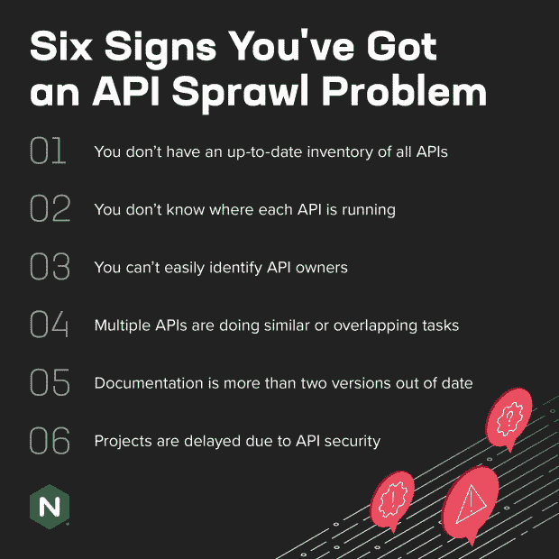

# API 蔓延问题的六个迹象

> 原文：<https://thenewstack.io/six-signs-youve-got-an-api-sprawl-problem/>

根据行业分析机构 451 Group 的数据，[如今平均每个企业有超过 15，000 个 API。显然，这比一般的](https://nonamesecurity.com/api-security-trends-report)[平台运营](https://www.nginx.com/resources/glossary/what-is-platform-ops/)团队能够在电子表格中跟踪的 API 要多一些。即使您将 API 跟踪的责任委托给单个业务部门，考虑到 API 数量的惊人增长，这项任务仍然是难以完成的。

2021 年，F5 工程师和技术专家 Rajesh Narayanan 为该问题创造了一个新术语: [API 蔓延](https://www.f5.com/company/news/press-releases/api-sprawl-threat-business-economy)。API 蔓延就像它听起来的那样 API 在世界各地的组织中加速扩散，以及由此带来的管理和保护它们的挑战。问题有多大？Narayan 估计，到 2030 年，全世界将部署和运行超过 10 亿个 API。

现代应用程序开发方式的改变正在加速 API 的蔓延。微服务的兴起，API 在系统内通信中的使用越来越多，以及多云和混合云架构的快速增长，都增加了 API 在应用程序之间通信的使用。例如，Kubernetes，容器编排的事实上的标准，使用 API 进行所有内部通信。新的基础设施类型，如无服务器，也意味着 API 可以在几乎任何环境中运行。同时，有更多类型的 API 技术需要管理——REST、GraphQL 和 gRPC 已经被广泛使用，更多的 API 查询协议即将出现。

更糟糕的是，网络罪犯绝对喜欢 API 蔓延。他们越来越多地将攻击目标对准 API，正是因为它们通常没有被仔细管理，也没有默认配置相对开放的访问权限。

为了减轻由此产生的混乱，管理、发现和保护 API 的挑战必须以编程方式大规模解决。但是在你能够有效地处理 API 蔓延之前，你需要知道这个问题在你的组织中有多严重。这里有六个明显的迹象表明你有 API 蔓延的问题。

## 您没有所有 API 的最新清单

API 蔓延的典型症状是不知道哪些 API 在您的所有环境中运行。这通常是由于松散的 API 管理策略导致的，该策略允许团队不注册他们仅用于内部目的的 API(所谓的“影子 API”)。

你的首要任务是进行准确的盘点。但是 API 的增加和减少是如此频繁，以至于准确的库存是一个不断变化的目标。合理的解决方案是程序化的库存和持续的 API 发现，就像您用于网络扫描和资产发现一样。

理论上，结构化的 API 审批流程也有所帮助，但在实践中，正在左移的组织需要缩减繁重的 API 创建和版本控制等任务的审批流程。对于这些组织来说，作为 CI/CD 和构建流程的一部分运行清单通常是一个好方法，特别是如果 API 用于微服务和其他更现代的应用程序架构。

## 你不知道每个 API 在哪里运行

在现代基础设施环境中，仅仅知道一个 API 的存在是不够的——您需要一张到它的位置的地图。端点可能会在不同基础设施外形规格的容器之间进行镜像—跨云、混合云和各种服务(如无服务器)。

安全团队需要位置信息来正确配置策略和保护，并针对 API 运行安全测试。如果您需要在多个环境中运行 API，这也会影响您对 [API 网关](https://www.nginx.com/learn/api-gateway/)和其他 API 流量管理选项的选择。理想情况下，您需要一个全局 API 网关解决方案，它可以独立于环境，一致地管理和保护 API 流量。

## 你不能轻易地识别 API 所有者

如果你不知道谁拥有一个 API，当它出现问题时，你就不知道去哪里求助。这听起来可能很傻，但是很多时候，当构建 API 的人或团队转移到另一个角色或离开公司时，对于平稳运营不可或缺的 API 就像“孤儿”一样运行。有时所有权会明确地转移，但更多的时候，这个过程会被跳过，或者通过非正式的握手来完成。

作为库存流程的一部分，为每个 API 分配所有权以建立责任并帮助所有者正确管理和保护其 API 是至关重要的。

## 多个 API 正在执行相似或重叠的任务

当多个团队有相似但不相同的需求，有人说，“让我们构建自己的 API 来做我们想要的事情，然后我们可以控制自己的命运”时，重叠经常发生唉，拥有多个相似的 API 增加了技术债务，通常是不必要的。因此，衡量有多少应用程序或服务使用 API 作为关键性能指标(KPI)是很重要的。跟踪这些指标可以帮助最大化每个 API 的可重用性。另一种整合 API 的方法是转换到更灵活的格式，比如 GraphQL。

## 文档已过期 2 个版本以上

文档对于机构记忆、新员工入职和组织弹性至关重要。不幸的是，编写和维护它通常是工程师最讨厌的事情。过时的 API 文档通常表明 API 正在蔓延，因为团队创建和更新 API 的速度非常快，他们没有时间更新文档——或者可以合理地声称这一点。在最坏的情况下，旧的文档是 API 成为无人维护的孤儿的标志。

幸运的是，API 往往有一个清晰定义的结构，使它们易于理解。好的 API 管理解决方案通常包括一个工具，帮助开发人员从 API 规范自动生成文档。最常见的例子之一是 [OpenAPI 规范](https://www.openapis.org/)。它使用一种标准格式来描述 API，因此人类和计算机无需访问源代码或其他文档就可以发现和理解 API 的功能。

## 由于 API 安全性，项目被延迟

好消息是什么？您的安全团队会在所有 API 发布前对其进行检查。坏消息呢？检查失败，代码被送回返工，因为 API 所有者在开发期间没有遵循 API 安全性的最佳实践，或者没有进行充分的测试。更好的消息呢？制定一套连贯的通用规则和最佳实践来让您的开发人员达到 95%的目标并不困难——比如实施速率限制、加密外部流量，以及要求通过密钥再生进行重新授权。大多数组织还可以使用高级 web 应用防火墙(WAF)或其他工具在 API 网关实施额外的保护，以抵御 [OWASP API Top](https://owasp.org/www-project-api-security/) 10 中列出的最常见的 API 攻击。

拥有成熟 SecDevOps 印章的更高级的组织可以为每个 API 构建一个威胁模型，并可能根据它们可以访问的数据或服务的类型为不同的 API 创建不同的安全级别。

## 结论:避免蔓延是一场永无止境的战斗

这六个迹象只是 API 蔓延的一些信号。让我们明确一点——API 蔓延是开发者自治和微服务 DIY 心态的自然产物。有了 GitHub Copilot 这样的现代开发工具和代码自动化功能，构建新的 API 变得越来越容易。

对抗蔓延的工作永远不会结束。部署 API 管理解决方案和 API 网关可以起到强制功能的作用——不使用 APIM 解决方案的开发人员可能会冒着让网关关闭 API 的风险(这很苛刻，但出于安全考虑是必要的)。

幸运的是，你用来对抗蔓延的[步骤](https://www.nginx.com/blog/5-ways-to-fight-api-sprawl-and-why-you-should-care/)大多与常识性的 API 管理相一致。随着时间的推移，他们甚至可以通过消除技术债务和避免在开发过程后期或发布后用附加安全性修复 API 来提高开发速度。

如果 API 是组织的命脉，那么蔓延就是对组织健康的最大威胁之一。警惕和主动的蔓延缓解会带来巨大的回报，最终会让开发商更开心。

<svg xmlns:xlink="http://www.w3.org/1999/xlink" viewBox="0 0 68 31" version="1.1"><title>Group</title> <desc>Created with Sketch.</desc></svg>