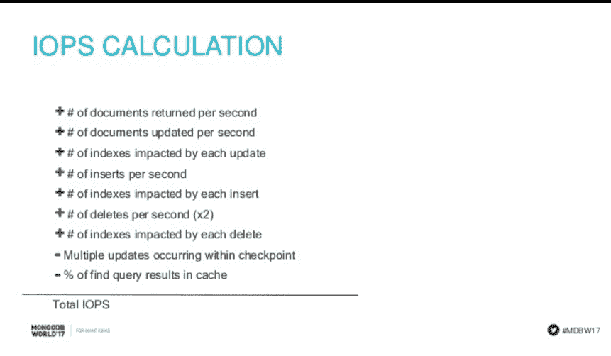

# 如何确定 MongoDB 集群的规模

> 原文：<https://thenewstack.io/size-mongodb-clusters/>

过度供应仍然是一个猖獗的问题，像 [Qubole](https://www.qubole.com/) 这样的公司旨在通过自动化来解决这个问题。如果公司支付的容量超过了运行工作负载所需的容量，那么使用公共云的成本可能会很高。然而，供应不足会导致严重的性能问题和客户流失。

在最近的 [MondoDB World 2017](https://www.mongodb.com/world17) 大会上， [MongoDB](https://www.mongodb.com/) ，[的首席解决方案架构师](https://explore.mongodb.com/vidyard-all-players/mongodb-world-presentations-crystal-c-jay-runkel-6-21-2017) [Jay Runkel](https://www.linkedin.com/in/runkel/) 演示了如何应用一点数学来对运行数据库工作负载所需的资源进行非常接近的猜测。

这可能是决定是否开发一个应用程序的关键——例如，如果这个应用程序可以在 Atlas 中以每月 10，000 美元的价格开发出来，那么它就是可行的，但如果每月花费 100，000 美元，就不是了。

然而，他警告说，他的方法仍然是最好的猜测。

“如果你要求精确，你必须用实际的数据建立一个原型，对你计划在生产中使用的服务器进行实际的查询，”他警告说。

它包括建立一个电子表格，可以在 GitHub 上获得。

在设计过程中，您可能会想出许多您可能想要使用的不同模式。根据您选择的模式，这可能会影响您需要的硬件类型或碎片数量。他说，所以你可以对你想到的每一个最佳候选方案进行评估。

本练习旨在确定副本集和/或分片集群的规模，因此解决方案将包括一定数量的分片，以及多少个 CPU、可用磁盘空间中的存储、IOPS、内存，有时还包括网络。

他说，计算出所需的 IOPS——无论是在硬盘、SDD 还是硬盘上，驱动器可以多快地随机找到数据存储中的随机信息——是最难的部分。

## 简化模型

MongoDB 的新存储引擎 [WiredTiger](https://docs.mongodb.com/manual/core/wiredtiger/) ，提供了改进的吞吐量和压缩。它有一个缓存，其中包含每个集合和索引的文件。服务器中大约 50%的 RAM 将专用于该缓存。

工作集是索引加上频繁访问的文档。Runkel 说，如果你能把所有的索引和经常访问的文档都存入内存，你就能减少很多 IO。您希望确保 RAM 大于工作集，但也小于数据大小。

为了简化这个练习，他假设所有的索引都在内存中，所有的文档都在文件系统中。下面是如何在这种方法中分解 IOPS 性能:

### **查找查询**

如果系统必须在磁盘上查找文档，那么对 100 个文档的查找查询需要 100 个 IOPS。如果我们每秒处理 10 个查询，那么我们需要服务器上 1000 个 IOPS 来每秒处理这 10 个查询。

但是如果你的搜索指数不好，那么整个假设就会被打破，他说。

### **插入**

如果您正在执行插入操作，您必须将文档写入磁盘，因此这是一个 IOP。为了更新每个索引文件，每个索引需要一个 IOP。如果你知道我们每秒要做多少次索引，我们就能估算出来。

### **删除**

删除也是如此。使用索引来查找并标记文档，然后更新每个索引文件需要一次 IOP 加上索引调用的次数。

### **更新**

更新都差不多。在 MongoDB 中，更新实际上是一个删除加一个插入，所以它导航内存索引，将文档标记为已删除，插入文档的新版本并更新索引。所以是 2 加上索引的数量。

这提供了您需要的 IOPS 的估计。

“这是好消息。坏消息是，我简化了一堆东西，你会高估 IOPS 的数量。一旦你有了基线，我们需要做一些修改来消除这种过度计算，”Runkel 说。

这些事情包括:

**文档大小:** IO 系统在块上工作，而不是在文档上工作，所以如果你在做大量的插入操作，小文档可能适合一个磁盘块。因此，磁盘块的每次插入都将包含许多文档，并涉及较少的 IOPS。

**索引数组:**插入不仅影响文档文件的一部分，还会影响许多部分，因此您必须考虑到这一点。

**Journal，log:** 该模型忽略了日志和日志记录的开销，每次更新时都会执行这些开销。如果您遵循 MongoDB 最佳实践，您可以将日志和日志放在单独的 IO 系统上，这样它们就不会影响您的工作负载。但是如果你不像那样设计你的服务器，你可能也需要考虑这些，他说。

**检查点:**在 MongoDB 中，当您执行写操作时，磁盘上的文档不会立即更新。它在 RAM 中更新，然后写入日志，以便保持写入，并定期出现检查点，通常在 60 秒或 2gb 数据时出现，以先出现者为准。该检查点是将数据写入磁盘的后台进程。如果您在很短的时间内对一个文档进行了大量的写操作—您可能会更改该文档 18 次—但是它只在检查点写入磁盘一次。所以如果我们不考虑这一点，我们将会高估 IOPS。

确定规模的过程包括:

*   计算集合的数据大小和索引大小，
*   确定工作集，
*   计算所需的 IOPS，
*   根据工作集和检查点等因素调整假设，
*   计算所需碎片的数量。

## 数据量

对于每个集合，您应该估计文档的数量及其大小，这就给出了每个集合的估计总大小。对指数的分析可以产生指数大小。你可以看看这将会压缩到什么程度。所有这些都将因应用而异。

MongoDB 中有很多工具可以给你提供平均大小的文档，他说，但如果这是你申请的第一天，你就没有任何文档。最好建造一些，而不是猜测它们的大小。互联网上有一些工具可以帮助您建立数据集，以达到您估计的数据大小的 5%到 10 %,从而创建您需要的测量值。

一旦有了收藏，就可以使用[**db . collection . stats**](https://docs.mongodb.com/v3.2/reference/method/db.collection.stats/)方法**。它将向您显示计数、收藏的大小、平均文档大小以及它是如何压缩的。它告诉我们指数有多大。你可以从那里推断出来。**

### **工作集**

你刚刚算出了索引的大小。对于频繁访问的文档，您必须了解应用程序的“热”数据集，并做一个估计。

现在，要计算出查询的 IOPS，请执行以下操作:

*   查找查询等于每秒返回的文档数，
*   对于每秒的更新，数字 1 加上索引的数量，
*   对于索引，1 加上索引的数量，
*   对于删除，2 加上索引数。

合计所有这些，然后减去如果在短时间内会有很多更新。

对于 find 查询，您必须对工作集如何覆盖您的工作量有所了解。通常，您不必担心所需的 CPU 数量，因为您要求的 RAM 需求会有大量的 CPU。唯一的例外是，如果您正在进行大量的聚合。

### **分片计算**

就估计您需要的磁盘空间量而言:如果您知道存储容量、工作集大小、IOPS 估计值，您应该对部署在什么类型的机器上有一些概念。

如果总共需要 9TB 的数据，而 WiredTiger 压缩需要 3TB 的磁盘，那么如果每台服务器提供 2tb 的数据，您将需要两个碎片。他建议增加一些缓冲，因为一些 Mongo 进程会暂时扩大存储大小。

可以进行相同的分析来估计 RAM 需求。如果工作集需要 428GB，而服务器有 128 GB，则需要 4 个碎片。

就 IOPS 而言:如果我们需要 50，000 个 IOPS，而 AWS 实例有 20，000 个，则需要三个碎片。

所以你看着所有这些，然后选择最大的数字，他说。如果你说你需要九个磁盘碎片，但是三个内存碎片，你需要九个碎片。

<svg xmlns:xlink="http://www.w3.org/1999/xlink" viewBox="0 0 68 31" version="1.1"><title>Group</title> <desc>Created with Sketch.</desc></svg>