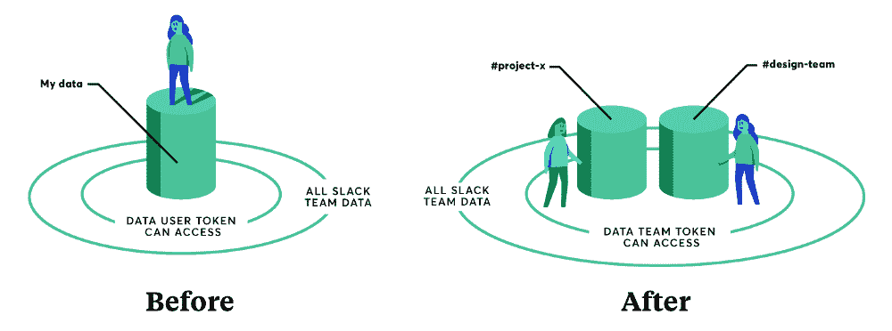

# Slack 通过 API 更新将应用带到前台

> 原文：<https://thenewstack.io/slack-brings-apps-front-center-api-update/>

Slack 正在更新其 [API 和核心功能](https://api.slack.com/)，以帮助开发者将其基于 Slack 的应用分发给更多人，简化开发和维护，并扩展这些应用的用户体验。

广义的[包括](https://medium.com/slack-developer-blog/looking-to-the-future-of-apps-in-slack-c2633df0bcb7)一个新的权限 API，基于团队的应用令牌，以及在 Slack 界面内向一等公民推广应用。结合起来，这些更新将应用程序带到了前端用户体验和后端开发人员访问用户和用户数据的最前沿。

例如，使用新的 Permissions API，开发人员将能够在最初请求最低限度的访问权限，然后随着用户熟悉度和信任度的提高而请求更多权限，从而有效地降低了准入门槛。与 Slack 界面中的应用可见性一样，这里的目标是增加应用的安装数量并促进持续使用。

此外，团队令牌将解除应用与个人用户的绑定，并将他们连接到整个团队。这不仅允许开发人员在不需要重新安装的情况下逐渐增加范围，而且它“将为以前由于安全或合规性限制而无法使用应用程序的客户打开访问通道。”团队令牌还为应用程序提供了基于团队而非个人用户权限的频道和直接消息访问。

最后，团队令牌进一步模糊了机器人和应用程序之间的区别，结合功能“意味着你不需要维护一个单独的机器人用户来与你的用户交谈。”

Howdy Slack 应用程序提供商和[僵尸工具](https://www.botkit.ai/)创建者的创始人兼首席执行官本·布朗说[将应用程序移动到字面上的最前沿](https://medium.com/slack-developer-blog/giving-apps-a-new-home-in-slack-daa2ba3a75ed)仍然是这次公告的最大部分。

“对于希望在 Slack 上建立业务或涉及 Slack 的应用程序开发人员来说，这些公告最令人兴奋的事情是 Slack 客户端本身内部应用程序可见性的改善，”Brown 说。“随着应用从一个渠道传播到另一个渠道，这将带来更高的留存率和更快的采用率。”

虽然[我们在 2015 年](https://thenewstack.io/slack-new-model-business-process-software/)注意到 Slack 开发者生态系统的势头正在增长，但仍有一个关键部分希望“建立业务”，即货币化。用互联网的不朽名言来说:

1.  构建一个 Slack 应用程序
2.  ???
3.  利润！

【Howdy 的产品经理 Eric Soelzer 表示，这些更新表明 Slack 致力于填补空白，让 Slack 应用成为开发者的可行机会。

“我认为公告中最重要的部分不是他们公告的细节，而是这些改进(以及他们昨天举办的研讨会)如何向开发人员展示了在 Slack 平台上制作机器人的真正承诺，”Soelzer 说。“由于生态系统的大部分仍未定义，消息平台能够接受反馈并在必要时适应，这对开发人员的成功非常重要。Slack 很好地展示了作为一个平台，双向关系意味着什么。”

事实上，这似乎是来自 [Slack](https://www.slack.com/) 的官方说法，开发者关系负责人 [Amir Shevat](https://twitter.com/ashevat) 指出。

Shevat 说:“我们正在加倍发展我们不断增长的开发者生态系统——我们现在有超过 155，000 名活跃的开发者，他们的应用每周都被积极使用。”“Slack 一直在寻找新的方法，为开发者提供更多的表面积，更丰富的与用户互动的方式，并努力扩大 Slack 机器人和应用的发现和参与。”

对于 bot 联合服务公司 Message.io 的首席执行官汤姆·哈德菲尔德来说，他希望看到企业领域的其他消息平台也能效仿这一举措。哈德菲尔德指出，团队令牌和渐进式许可都将极大地提高企业客户的信任度。

“再一次，Slack 凭借其最近对开发者友好的 API 增强而处于领先地位，”哈德菲尔德说。“我们合作的机器人开发者希望其他企业消息平台，如微软、思科和 Atlassian，也能效仿！”

API 预览期将于 8 月 1 日开始，在此期间，它将发布新的文档和功能，并允许开发人员“试用这些功能，创建现有应用的团队令牌版本，或构建全新的东西。”

新 API 的预计全面上市时间目前“大致”定在 2018 年的前几个月。

<svg xmlns:xlink="http://www.w3.org/1999/xlink" viewBox="0 0 68 31" version="1.1"><title>Group</title> <desc>Created with Sketch.</desc></svg>