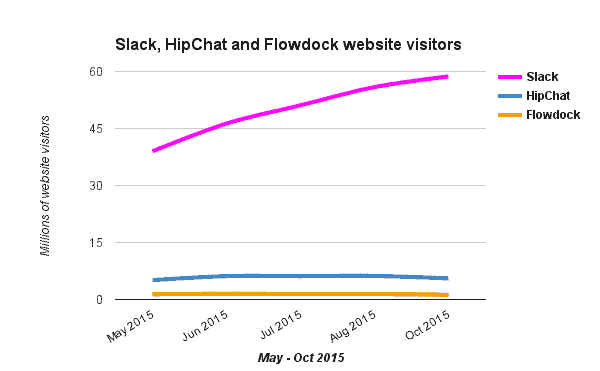

# Slack 和业务流程软件的新模型

> 原文：<https://thenewstack.io/slack-new-model-business-process-software/>

Slack 最初是一个内部开发项目的内部消息应用程序，现在已经迅速成为最著名的消息应用程序之一。这种势头正在超越 Slack 本身，因为大量第三方公司正在基于 Slack 开发新功能，实际上是将工作聊天应用程序变成了一个运行业务流程的平台。特别是专注于提供开发者工具的初创公司，他们看到了为了获得市场牵引力，他们需要整合或利用 [Slack](https://slack.com/) 。

自今年年中以来，企业一直是团队聊天应用的主要采用者。这款应用通常由希望参与自己协作项目的特定团队引入公司，往往会很快引起其他同事的注意，并在整个组织中进行筛选。评论者指出，该应用易于采用，允许业务团队自主使用，这是更广泛采用之前的切入点，在 SaaS 产品通常以更集中的方式购买的企业环境中，软件通常无法遵循这一路线。

MemSQL、Spotify、PayPal、Expedia、Demandbase、Quandl、Eventbrite、Box 和 Bitly 都在运营中使用了 Slack。(Slack 已经创建了一个[特定的职位公告板](http://slackatwork.com/)，以分享使用 Slack 的组织中的新职位。)

[Slack](https://slack.com/) 创立于 2013 年，第一天就有[约 8000 人注册](http://venturebeat.com/2013/08/15/flickr-founder-stewart-butterfields-new-slack-signed-up-8000-companies-in-24-hours/)。该应用程序的想法是通过提供按主题组织的聊天室来实现团队交流，并提供私人消息和私人群组消息。

这款应用由 Flickr 背后的团队开发，特别被开发团队和初创公司采用，反映了该应用的原始用例:它是作为在线游戏开发人员的内部工具开发的，以便他们可以就自己的版本进行交流。从那时起，它已经看到了一个相当稳定的增长率。例如，在过去的六个月里，网站统计网站 [SimilarWeb](http://www.similarweb.com) 估计 Slack 网站的访问量从不到 4000 万增长到不到 6000 万。这个数字是为网站访问者计算的，反映了网络应用的参与度，而不是实际客户的数量，据《财富》杂志[报道，今年年中有 110 万人](http://fortune.com/2015/06/24/slack-claims-1-1m-users/)。

作为一款移动应用，App Annie 报告称，在 iTunes 应用商店中，Slack 应用在 12 个国家的商业类中排名第一，在 101 个国家的十大商业应用中排名第一。在跟踪 Slack API 的开发者中，API Changelog 报告说，它是他们目录中最受欢迎的 API 之一，并且每个月都在增长，目前有 171 名开发者在监控 Slack API。

## 快速增长的生态系统

Slack 现在看到一个围绕它的生态系统正在出现，这使得其他企业能够摆脱 Slack 现象。例如，Convergely 围绕着提供从闲聊中浮现出来的生产力工具而建立起来。上个月，PointNineCap 的初创投资者 Rodrigo Martinez 认为[在消息传递](https://medium.com/point-nine-news/3-key-reasons-to-build-businesses-on-top-of-messaging-7aa57a6e49e9)的基础上建立业务有一些新的机会，并特别指出 Slack 是“企业环境中的开放平台”，因为它的用户采用、集成思维和作为客户的开发人员核心基础。Martinez 链接到一个[产品搜索列表](http://www.producthunt.com/@jackdweck/collections/all-things-slack)，显示了一些已经在 Slack 上创建的机器人、工具和生态系统业务。像 [SlackStack](http://slackstack.io/) 这样的服务已经涌现出来，以方便发现松弛工具。

与此同时，[彭博最近指出](http://www.bloomberg.com/news/articles/2015-06-23/slack-is-getting-ready-for-wall-street-but-is-wall-street-ready-for-slack-)，Slack 一直在招聘合规和政策人员，以帮助该应用公司定位于一项企业计划，该计划可以满足金融等特定垂直行业的需求。随着这一目标的实现，更多的玩家将寻求在 Slack 的新“脊柱”上构建自己的商业产品，就像我们在 Docker partners 和生态系统产品中看到的那样。

在最近的伦敦 API Days 上，Balderton Capital 的投资者 Nicolas Debock 表示，他希望在他们的下一轮融资中看到一系列 Slackbot 融资提案。

> 这种新兴的 Slack 生态系统的增长超越了集成——尽管也有集成——并显示了 Slack 目前如何成为开发人员工作流的核心，但它如何能够改变整个业务流程软件市场。

“Slack 已经解决了许多沟通问题，并成为团队的日常沟通工具，”Slack 平台负责人 April Underwood 说。“越来越多的开发者和 B2B 公司很早就听到了这一点，并通过在 Slack 平台上提供集成来使自己与众不同。”

Underwood 说，许多开发软件的团队在他们的产品开发过程中使用它，这反过来帮助他们产生关于如何向最终用户提供基于 Slack 的产品和集成的新想法。安德伍德说:“在我们平台的早期，我们就有来自开发者的大量需求。

## Slack 生态系统中的新产品

LaunchKit 是一个很好的例子，说明 Slack 是如何激发开发工具的新想法，然后被用作一种利用终端产品进入市场的方式。LaunchKit 是一套为产品经理和应用开发团队打造的工具，旨在帮助开发人员在应用商店中营销应用，监控应用商店评论，管理应用销售，以及为应用建立网站。

“对我们来说，最终用户要么是产品经理，要么是程序员，要么是营销人员，”LaunchKit 的首席执行官 Brenden Mulligan 说。“我们在 2 月份推出了我们的第一款产品。我们的团队之前开发了很多应用程序，我们看到同样的痛点反复出现。我们不得不一遍又一遍地构建相同的工具，所以我们开始在博客中描述这一点。然后我们围绕如何在 iOS 中做通知发布了一些源代码。”

由于积极的反应强烈，Mulligan 的团队开始投资创建新的工具套件。

第一个是 Review Monitor，它将评论摘要推送到 Slack，这样整个开发团队就可以了解最终用户对应用程序的看法。Mulligan 说，这个工具的想法来自于使用 Slack。

“Slack 是我们的主要灵感来源。我去 iTunes 应用商店看我们的评论。开发团队的其他成员从未真正参与其中。所以我会把评论复制并粘贴到电子邮件中。然后，我从苹果公司提供的 RSS 订阅源中拼凑了一个，并将其连接到 Slack。它很难看，也不是一个聪明的帖子，但突然整个团队都知道我们得到了多少评论。因此，从团队协作的角度来看，它确实帮助我们了解了我们的用户群。”

Mulligan 说，激发团队协作的核心是将数据放入 Slack。“那是最重要的。我们从我们的用户身上看到了这一点:大多数人使用 Review Monitor 是因为松散的集成。我们进行了路演，并与 50 名开发人员进行了交谈，当我们向他们展示 Slack 通知时，每个人都睁大了眼睛。任何拥有 iOS 应用并正在使用 Slack 的开发团队都希望立即获得 Review Monitor。”

虽然已经有了像 [Flowdock](https://www.flowdock.com/) 和 HipChat 这样的消息和工作聊天应用，以及像 [Akana](http://akana.com/) 这样的完整服务，这些服务提供旨在显示团队成员一直在做什么的提要，但穆里根认为 Slack 成功的部分秘密是移动应用体验和对新功能的持续开发:

“我认为 Slack 有很多微妙之处是我不理解的。促使我们从 HipChat 转向的主要原因是移动体验。HipChat 移动体验太糟糕了，这是我们转换的原因，然后我们发现在移动设备上使用 Slack 也有一些快乐的时刻。这是一个更漂亮的界面:他们花了一些时间在 UI 中创造了一些令人愉快的东西，多了一点空白，稍微好了一点的组织。HipChat 很功利。所以最后，与其说 Slack 好得多，不如说 Slack 在一百个不同的方面都好得多。”

Mulligan 认为 Slack 帮助他们开发了让企业的业务和技术方面更有效沟通的产品:“在开发应用程序时，产品经理如何与开发人员更无缝地合作？通过我们的 Slack 通知，我们旨在帮助将工具放在必须使用它们的人手中。”

## 用户的工作流程

松散集成正从企业内部最初的开发人员使用基础发展起来，并扩展到其他角色。这就是为什么 [Blockspring](http://blockspring.com) 关注 Slack，这是它继电子表格之后的第二个关键工具。

Blockspring 是一种将 API 包装到现有工具(如电子表格)中的服务，以便非技术用户可以利用 API 的底层功能。最近，他们一直在进行整合，以便[在 Slack 内部，用户可以确定哪些 API 可以帮助他们获得他们需要的数据，或者可以通过 API](https://www.blockspring.com/docs/slack-quickstart-run) 外包特定的功能。

“我们关注企业想要使用的任何工具。我们相信当你有机会接触到 API 时，生意会变得更好。我们在内部也大量使用 Slack，我们立即看到了它的潜力。Slack 内置于用户的行为中:他们使用工具中的事件驱动集成。这与使用网络服务有一点不同，所以我们认为在那里集成会非常酷，” [Blockspring](https://www.blockspring.com/) 的首席执行官保罗·卡森说。

“我们总是在终端用户的现有行为范围内进行设计。我们的团队都有过为终端用户开发新工具的经历。但是每当你想给开发者新的功能时，最终用户和开发者都不想学习新的工具。开发人员希望创建非常酷的功能，对于最终用户来说，第一个问题通常是，“导出数据按钮在哪里，我可以把它放在电子表格中？”"

Blockspring 的目标是在用户的工作流程中将他们的服务呈现在用户面前，现在这意味着可以在 Slack 中访问。

Slack 的一个主要好处是，它有助于围绕一项任务或文件之外的联系和沟通来建立工作关系。Slack 的联合创始人斯图尔特·巴特菲尔德在接受《金融时报》 采访时表示，这是该应用区别于 Dropbox 等其他基于团队的云软件的重要因素，Dropbox 以文档为中心进行交互，因此“可能是错误的”。

## 业务流程软件的新模型

虽然其他基于团队的软件试图创建一个类似新闻订阅的功能，向业务同事更新最近发生了什么交互以及完成了什么任务，但 Slack 能够在更高的跨业务规模上做到这一点。通过应用程序创建的 J 曲线集成，Slack 可以从其服务中获得 Slack 通知，从而在业务环境中提供单一的全局更新:来自客户服务软件的警报、在线购物车、IT 监控和订单履行都在一个流程中完成。《T4 金融时报》称，这使得 Slack 成为“一个企业的数字脊柱”，可以吸收人类和机器生成的数据。

正是这种潜力使得 Slack 从一个单纯的工作和协作工具转变为一种新型的业务流程管理平台。但是要实现这一点，创建集成的开发人员需要仔细考虑通知中哪些信息是有用的，可以帮助处于流程中任何位置的最终用户。这也意味着 Slack 必须帮助发现集成，这些集成可以帮助企业在不脱离工作流程的情况下完成工作。

API 测试服务公司 Runscope 的首席执行官 John Sheehan 认为 Slack 是开发者的平台。“松弛很重要，因为它现在很流行。对我们来说，考虑整合更重要。在 Slack、HipChat 和 PagerDuty 之间——它们有一些不同的用例——通知是一个被充分覆盖的空间。当有如此多的 API 监控问题需要解决时，我们专注于通知是没有意义的。我们希望在开发者的工作流程中根深蒂固。为此，集成是绝对必要的。我们希望通过整合成为其他生态系统中的一流公民。”

Slack 有助于推动新用户采用 Runscope。“他们当前支持的集成提供商列表是我们注册的重要来源。这是推动采用的因素之一。Slack 的受欢迎程度是我们第二大受欢迎的第三方集成的四倍。”

安德伍德说:“我们现在试图解决的问题是:已经有很棒的应用程序建立在我们的 API 上，而人们却找不到。”“我们让开发人员在 Slack 上轻松创建出色的体验，但我们需要确保业务和企业团队能够找到这些集成并加以利用。

“我们需要让团队更容易找到他们需要的集成。我们的工作是帮助团队更有效地工作。我们将不得不做一些更聪明的事情来帮助团队为他们找到集成。我们有许多工作要做。

“然后，接下来，我们将研究如何让指挥中心变得松弛:如何以减少接触转换的方式做到这一点。我们希望打造这种体验，以便工程师可以坐在他们的空闲通道内，而不需要在不同的应用程序之间来回切换。”

如果 Slack 要成为一个更完整的业务流程工具——指挥中心的中枢——Slack 将需要启用可发现性功能，就像 Blockspring 试图通过使 API 从 Slack 通道中浮出水面一样。但要实现指挥中心的愿景，还需要开发人员构建各种丰富的体验，这意味着最终用户可以依赖使用 Slack 作为其工作流程的中心枢纽。

在 LaunchKit，Mulligan 考虑的是“什么是好的松弛帖子？有什么值得全队看的？例如，对于一些开发商店来说，获得一个新的评论并不是一件大事，所以这就是为什么我们的工具中有一个小开关来设置你想要多少颗星，所以你只需要看到某些评论。这是一条重要的信息，所以当我们开发出提供反馈的新工具时，我们将允许它们发布到 Slack。我们思考什么是对团队业务有帮助的关键信息？”

希恩同意提供正确类型信息的重要性:“进入 Slack 的一个棘手问题是你不能发布实时更新的图表。我想让它在你谈论它的时候更新数据。随着平台的成熟，我相信他们会给我们提供这样做的设施，这意味着人们不需要放松，这对我们有好处，因为它让人们参与到我们的产品中来。”

希恩对这个指挥中心的想法很满意。“Slack 和消息服务是他们未来将提供的服务的开端。例如，我们每天向用户发送一封电子邮件，内容是他们与我们一起监控的所有 API。这是我们可以通过 Slack 通知提供的东西，如果我们可以得到正确的 UI。Slack 可以支持的数据类型以及它们提供的表示层正在快速发展。很高兴看到他们投资改善我们最终用户的 Runscope 体验。”

安德伍德认为，这种类似指挥中心角色正在改变协作团队中的业务流程和工作流程。安德伍德说:“通常一个商业团队可能从 Trello 或 Google Doc 开始，然后设计团队开始在 InDesign 中构建，然后工程团队使用 GitHub。”“Slack 确实为产品开发过程中的各个步骤提供了自始至终的空间:这是 Slack 改变团队工作方式的具体方式。”

接下来的六个月将是 Slack 的关键。他们目前所处的阶段是，如果他们不解决集成可发现性问题，用户将限制他们对平台的期望，因此它仍然只是一个工作工具。与此同时，随着集成合作伙伴的扩展，这些合作伙伴需要足够精明，以便为 Slack 的最终用户提供有价值的通知体验，而不是仅仅寻求利用快速而笨拙的集成来驾驭 Slack 浪潮。而这一切都是在 Slack 追逐企业市场的同时发生的。

随着它的迅速普及，Slack 现在正处于不仅仅是一个团队通讯应用的早期阶段。这是生态系统有机会扩展的地方，不仅仅是与 Slack 良好合作的集成，而是导致产品的创建——如可以独立的 LaunchKit，但作为链接到 Slack 以传递信息的组件更有意义。随着新产品的出现，将会有一个不断增长的生态系统平台，现有的服务将会链接到这个平台上，就像 Runscope 将他们的可用性定位到 Slack 用户一样。最后，还有可发现性的问题，它有机会深刻地改变企业对业务流程工具的期望，在这种情况下，一定程度的自动化可以帮助用户识别存在哪些功能或数据，而无需知道那里有什么。Slack 可能就是未来业务流程软件和 API 聚合工作流工具的样子。

特征图片:“7。-卡斯特尔斯一卡斯特尔斯。patrimoni continental de la Humanitat "由 [Palau Robert，generata de Catalunya](https://www.flickr.com/photos/palaurobert/)，根据 [CC BY -ND 2.0](https://creativecommons.org/licenses/by-nd/2.0/) 授权。

<svg xmlns:xlink="http://www.w3.org/1999/xlink" viewBox="0 0 68 31" version="1.1"><title>Group</title> <desc>Created with Sketch.</desc></svg>