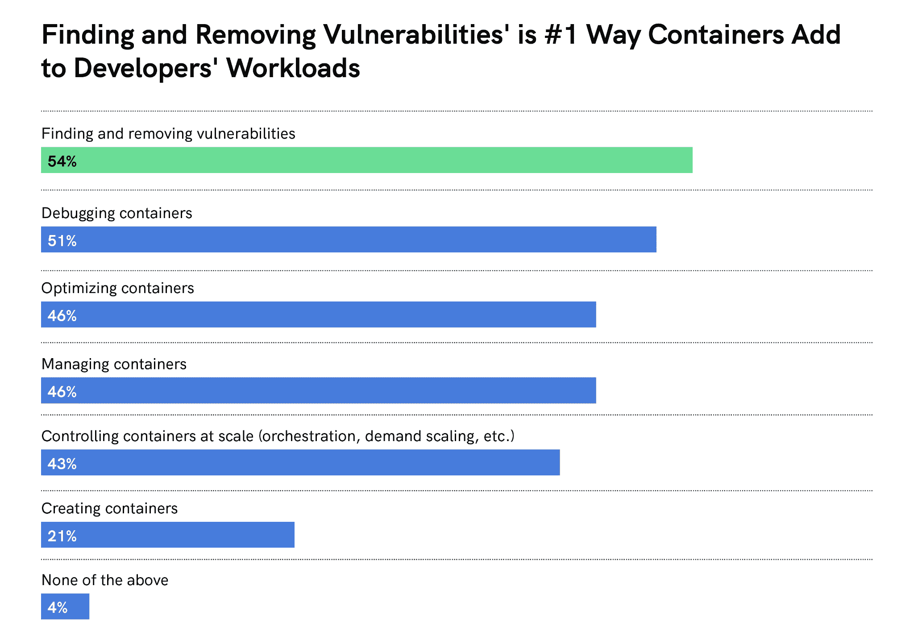
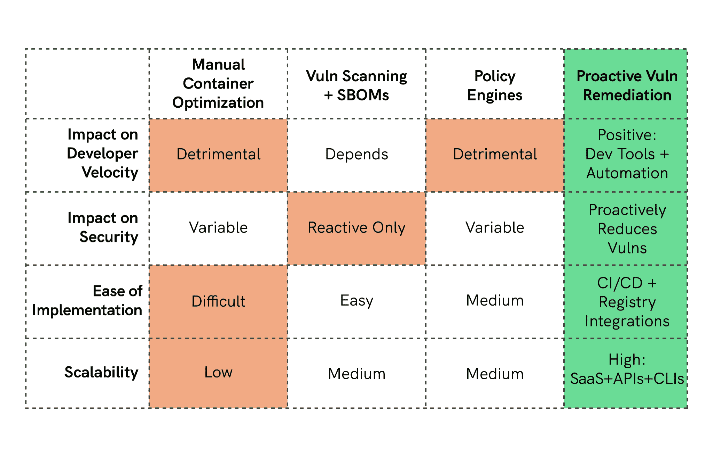
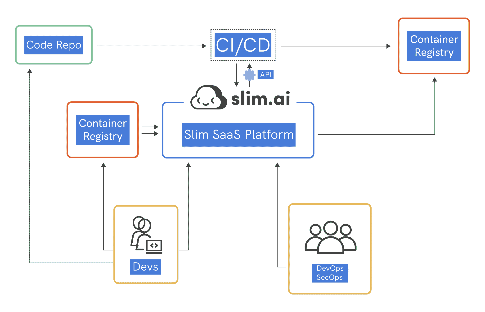

# 苗条。人工智能:针对左移世界的自动化漏洞修复

> 原文：<https://thenewstack.io/slim-ai-automating-vulnerability-remediation-for-a-shift-left-world/>

现在，如果你是以容器的形式生产软件，你需要有人在下游扫描你的容器映像来寻找漏洞，这使得你的工作比过去更加困难。

世界上有很多漏洞扫描器，其中许多都很棒。它所没有的是一种可扩展的方式来管理和消除漏洞。具体来说，开发人员需要一种方法来在构建过程中自动识别和消除容器映像中的漏洞，而 DevSecOps 专业人员需要一种方法来跟踪并向软件供应链上下游生态系统中的每个参与者传达他们正在修复的内容。

现代安全依赖于此，而现在，这个过程被打破了。

在当前软件供应链问题的氛围下，组织和开发团队正在努力跟上管理 CVE(关键漏洞事件)的步伐，并且淹没在 CVE 噪音中。他们面临的问题包括，“哪些漏洞可以利用，哪些不可以？”以及“我们如何确定优先修复的项目，以便有效地部署有限的工程资源？”

当一个容器平均有 284 个漏洞，公司同时在基础设施中运行成百上千个容器映像时，团队如何解决这个问题呢？根据我们的 [2022 容器报告](https://www.slim.ai/blog/container-report-2022) ，每修复一个漏洞，就会出现四个新漏洞。

问题的根源在于，使容器成为开发理想工具的东西在生产中变得脆弱。开发阶段的工具和包让开发者的日子更轻松。但是，当您转到生产环境时，您希望删除不需要的任何内容，因为这会扩大攻击面，并引入生产环境中根本不存在的潜在易受攻击的包。

我和我的联合创始人凯尔·奎斯特(Kyle Quest)用“只运送你需要的产品”这句话来描述我们在[斯利姆公司想要完成的目标。AI](https://www.slim.ai/company) 。对于使用我们平台的公司来说，这意味着创建一个自动去除 CVE 噪声的系统。它消除了与应用程序运行不必要的软件相关的漏洞。通过减少这种噪音，我们帮助团队区分重要漏洞的优先级。

## **帮助开发人员减少 CVE 噪声**

对于大多数开发人员来说，让容器为生产做好准备的过程是一项极其困难的任务。漏洞扫描器是帮助保护您的软件的有价值且必要的工具，但是拥有强大的风险降低姿态是有代价的，即开发人员的生产力。

事实上，根据我们最近的调查，当开发人员被问到“哪些任务增加了您的工作负担？”—发现并消除容器中的漏洞是增加他们工作量的首要任务。

当今的组织正在努力提高漏洞扫描的信噪比，并尽可能有效地确定安全修复的优先级。在斯利姆。AI，我们正在研究如何自动减少、管理和共享扫描器提供的漏洞，同时删除生产中不需要的代码。

## **目前的解决方案是必要的，但还不够**

图 1:生产前发现、优化和管理容器的工具给开发人员留下了一个巨大的空白，需要他们自己去弥补。苗条。人工智能正在解决这个问题。

有几种不同的方法可以满足漏洞补救的需求，它们都有优点，但也有明显的缺点。

**手动容器优化** 像 Alpine images 这样的方法从开发人员选择一个最小的基础映像开始，然后添加他们开发所需的所有工具。对于生产，他们希望将这些工具从 docker 文件中取出，并通过漏洞扫描器运行，这样容器就可以发布到生产中。

如果你是一名经验丰富的后端开发人员或 DevOps pro，你应该知道这个过程的必要性以及如何去做——不破坏任何东西。但是，随着您的组织开始扩大其对云的采用，这些专业的“开发人员体验工程师”或“云架构师”团队可能会变得难以扩展，因为他们昂贵、稀有且需求量大。

此外，许多组织既不能控制也看不到供应商或上游开源项目所使用的基础映像。新的基础映像通常会带来新的操作系统，这会增加调试 DNS 和内核库的低级系统问题的开销。

**漏洞扫描** 则相反，是一种反应式或时间点解决方案。漏洞扫描器的清单很长，而且还在不断增加，许多都做得很好。问题是，它们不能解决根本问题，因为当你得到一个报告，在一个给定的容器中有 200 到 300 个漏洞，甚至可能有 1000 个，有数百或数千个不同的容器，这是根本不可行的。太多了，无法合理解决。另外，您知道大多数这些漏洞与您构建的应用程序无关。同样，这种方法是不可扩展的，因为信噪比很低。

这个问题的另一个方面是，漏洞扫描器会提供一种[的虚假安全感](https://thenewstack.io/draft-vulnerability-scanners/)。“攻击面”有很多方面与 CVEs 无关。“零漏洞”映像在某些情况下仍然可以被利用，比如使用 shells、包管理器或者像`git`和`curl`这样的工具。

**策略引擎** 是一个强大的工具，因为它们不允许任何不符合 DevOps 或 DevSecOps 团队设定的标准的内容进入生产。例如，如果代码或工件没有被签名，或者如果关键漏洞超过某个阈值。像 Kyverno 赞助的[Cloud Native Computing Foundation](https://cncf.io/?utm_content=inline-mention)这样的策略引擎是一件好事，甚至是一件关键的事情，但它们就像一堵墙:它们阻止开发人员将代码交付给产品，并将他们的时间从编码转移到管理漫长的中断/修复周期。

我相信，成功的组织会找到向上游推动法规遵从性的方法，除了进行必要的下游检查以防止生产中的安全问题之外，还会向开发人员提供必要的工具来遵守他们的策略。

## **苗条。人工智能的不同:开发者第一的方法**

苗条。AI 认识到当前这些集装箱安全方法的缺点，并为开发人员建立了一个平台，自动化运输细长、安全的集装箱的过程。苗条的好处。人工智能的方法是，它给了开发者使用任何他们想要的图像进行开发的自由。借助我们的工具，开发人员可以使用他们喜欢的任何基础映像和工具，然后通过我们的自动化流程运行他们的容器，以生成一个新的、生产就绪的容器，保证符合容器最佳实践。

此外，苗条。用于主动减少漏洞的 AI 平台与第三方图像一起工作，因此您可以强化您从开源项目或第三方使用的任何图像(或要求他们在将图像运送给您之前通过 Slim 运行他们的容器)。例如，我们正在与领先的安全提供商 BigID 合作，以强化他们的容器映像，并为他们的团队提供关于其容器的安全配置文件的有价值的报告，他们可以与客户共享这些报告。

苗条的。人工智能平台，没有新的代码要写，也没有新的生态系统要学习。您只需在我们的云中或您现有的基础设施中运行我们的软件，即可自动为您的组织增加一层新的容器安全性和可见性。您的安全团队可以高枕无忧，因为容器符合安全最佳实践(并有自动化报告来证明)，开发人员可以花更多时间来构建出色的功能，而不用花太多时间去寻找随机开源库的补丁。

图 2:苗条。AI 正在积极地消除漏洞，作为自动化流程的一部分，该流程与开发人员已经在使用的工具和流程相集成。

## **结论**

在斯利姆。人工智能，我们相信成功的组织将是那些从长远角度看待软件供应链安全及其容器的组织，通过自动化漏洞分类和补救，  减少软件攻击面和保护映像。

我们认为自动化可以增强开发人员的能力。供应链安全是一个如此重要的问题，以至于我们需要一个可扩展的解决方案，而自动化开发中的安全流程是解决这个问题的唯一途径。

通过实施瘦身计划。AI 平台引入到您的开发工作流程中，您的安全团队将会受益，因为他们知道开发人员正在采取一切预防措施，以自动化的方式保护他们的容器。开发人员受益于工具、见解和自动化流程来强化他们的容器，消除猜测和“尽力而为”的做法。

我们每天都在引入新的设计合作伙伴，尽我们所能打造最好的平台，我们希望您能加入我们的行列。

<svg xmlns:xlink="http://www.w3.org/1999/xlink" viewBox="0 0 68 31" version="1.1"><title>Group</title> <desc>Created with Sketch.</desc></svg>