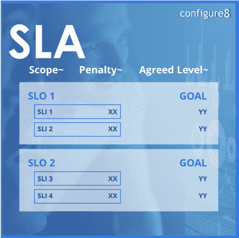

# SLO vs SLA:有什么区别，SLI 如何联系？

> 原文：<https://thenewstack.io/slo-vs-sla-whats-the-difference-and-how-does-sli-relate/>

您可能听说过[服务水平协议(SLA)和服务水平目标(SLO)](https://thenewstack.io/slo-vs-sla-whats-the-difference-and-how-does-sli-relate/)，因为它们在提供或消费服务的企业中普遍使用。大多数人认为 SLA 和 SLO 是一样的，其实不然。

这篇文章将涵盖什么是 SLO，什么是 SLA，它们之间有什么不同，各自的好处是什么，以及一些相关的术语。

## **什么是服务水平协议(SLA)？**

[服务水平协议(SLA)](https://thenewstack.io/ignoring-slas-doesnt-pay/) 是服务提供商和客户之间的合同，规定了客户期望的服务水平的可测量指标。例如，SLA 可能涵盖响应时间、正常运行时间、[解决时间](https://www.helpscout.com/blog/time-to-resolution/)、对错误报告的期望等等。

SLA 通常包括以下内容:

*   提供的服务类型
*   提供的服务水平
*   服务交付的时间框架
*   服务信用
*   正常运行时间预期
*   责任
*   响应性
*   用于衡量服务水平的指标
*   未达到指定的服务可用性级别的经济处罚

SLA 包含许多服务级别目标，这些目标为客户指定了满足这些目标的细节。

内部和外部客户都使用 SLA。

> 服务级别目标指定了给定业务流程或系统的服务质量。

## **什么是服务水平目标(SLO)？**

服务级别目标指定了给定业务流程或系统的服务质量。这是一个可衡量的目标，以确保系统达到或超过要求的标准。SLO 是 SLA 中的特定点。例如，您的 SLA 中的一个 SLO 在任何给定的一分钟内对 API 的平均响应时间可能小于一秒。

SLO 通常包括以下内容:

*   它所应用的特定服务或系统，例如 trade API。
*   要达到的可量化目标——API 事务平均值小于 1 毫秒。
*   交易日内任何给定的一分钟时间段内的目标实现时间框架。
*   你衡量目标的频率和时间段，比如交易时间的每秒钟。

内部和外部客户都使用 SLO。

## **什么是服务水平指标(SLI)？**

在讨论 SLO 和 SLA 时，服务水平指标(sli)是您可能会听到的另一个指标。SLI 用于衡量系统的性能。例如，SLIs 可以跟踪组织朝着其目标和内部目标的进展。此外，组织可以使用它们来确定需要提高服务质量的领域。SLI 是系统的实际度量，而不是目标。例如，如果您的 SLO 是不到一秒的响应，那么您的 SLI 就是实际的响应时间，它可能是 0.5 秒或 0.99 秒。不管怎样，在这些情况下，你都会遇到你的 SLO。

SLI 的另一个术语是“关键绩效指标”(KPI)。大多数人交替使用这两个术语。

SLI 文档通常包括以下内容:

*   该监控系统
*   被监控的系统
*   用于衡量绩效的监控指标或 KPI
*   获得的值
*   衡量和报告指标的频率

一般来说，只有内部团队使用 SLIs。

> SLI 是系统的实际度量，而不是目标。

## SLO 和 SLA:有什么区别？

现在我们已经讨论了什么是 SLO 和 SLA，让我们来讨论一下它们有什么不同。

SLO 和 SLA 之间最显著的区别在于，SLO 是组织为确保其系统达到或超过所需标准而设定的目标。SLA 是服务提供商和客户之间的一份合同，规定了客户期望获得的服务级别。

另一个区别是，SLO 是在服务交付之前完成的。通常，服务级别协议是在服务处于活动状态并且出现问题之后完成的。

SLO 可以帮助您定义您的业务目标，而 SLA 可以帮助您跟踪实现这些目标的进展。

重要的是要记住，组织应该两者都用；这两者构成了贵公司服务水平的完整图景。

> 拥有自动 SLO 的最大好处是确保系统达到或超过要求的标准。

## **SLA 的好处**

拥有 SLA 的最大好处是它保证了客户期望得到的服务级别。有保证的服务水平有助于建立客户和服务提供商之间的信任，从而为公司带来更多业务。此外，SLA 有助于跟踪既定目标的进展情况，这有助于提高所提供服务的质量。例如，如果您与客户的 SLA 规定了 24 小时的响应时间，那么您可以使用此指标来跟踪您实现目标的情况。

如果组织不能满足 SLA 中的标准，公司知道它需要做出改变来提高服务质量。

## **SLO 的好处**

拥有自动 SLO 的最大好处是确保系统达到或超过要求的标准。双方同意的标准有助于提高客户服务质量。

通过为给定的过程或系统设置目标服务质量，SLO 可以帮助定义业务目标。它还可以帮助跟踪实现这些目标的进展。例如，如果你有一个电子商务网站，你的 SLO 可以确保 99%的订单在 24 小时内处理完毕。

## **SLI 的好处**

拥有 SLI 的最大好处是它有助于衡量绩效。然后，技术团队可以使用这些信息来提高服务质量。SLO 建立在 sli 的基础上，因此它们是成功的标准衡量和实现过程的关键组成部分。

## **谁来定义 SLA？**

通常，服务提供商定义 SLA。它是服务提供商和客户之间的合同，规定了客户可以期望得到的服务级别。

## 谁定义了 SLO？

在大多数情况下，服务提供商定义 SLO，但是在某些情况下，SLO 是由消费组织驱动的。无论哪种方式，SLO 都是双方同意的。目标是确保系统达到或超过要求的标准。

## **SLO、SLA 和 SLIs 之间的相似之处**

既然我们已经讨论了 SLO、SLA 和 SLI 之间的差异，那么让我们来看一些相似之处。首先，你可以把它们作为服务保证展示给潜在客户。其次，它们可以帮助定义业务目标和目的。第三，这些指标有助于跟踪实现这些目标的进展。最后，它们都可以用来提高服务质量。

## **什么时候应该使用 SLA？**

如果您想向客户提供有关他们期望得到的服务级别的保证，那么最好使用 SLA。

## **什么时候应该使用 SLO？**

一般来说，当您希望为系统设定目标以确保其达到或超过所需标准时，最佳实践是使用 SLO。

## **什么时候应该使用 SLI？**

通常，当您想要测量系统性能以提高服务质量时，可以使用 SLI。

## **你应该用哪一个？**

这个问题的答案取决于你的具体需求。例如，如果您想确保系统达到或超过要求的标准，SLO 可能就是您所需要的。但是，如果您想与客户建立信任并跟踪既定目标的进展，则需要 SLA。

您组织的软件开发活动的实时知识地图，如通用目录[配置 8 . io](https://www.configure8.io?utm_source=TNS&utm_medium=content&utm_campaign=slovsla)，可以帮助您提高组织的 SLA、SLO 和 sli 的意识和可见性，并帮助您的工程团队确定服务协议的优先级并找到要改进的系统。当事故发生时，它还可以帮助团队更快地做出响应。

再次强调，记住 SLO 要么是独立的，要么包含在 SLA 中，这一点很重要。SLA 中总是包含 SLO。这两者对于清楚地勾勒出你的公司服务的能力和水平以及让你的客户满意都是至关重要的。

## **管理和监控服务订单**

管理和监控 SLO 是一项复杂的任务。支持团队中的每个人都很难知道谁拥有或谁负责一项服务。虽然工程经理通常会设置 SLO 和警报并了解这些信息，但他们并不总是可用的，有时所有信息都不会传达给随叫随到的工程师，或者不在易于访问的地方。

这就是现代内部开发人员门户(IDPs)发挥作用的地方。他们将 SLO、服务及其所有者视为一等公民，并支持将这些关键指标开箱即用。

有了 IDP，工程师就有了关于 SLA、SLO 和 SLI 的信息，比如它对应的服务以及哪个团队或工程师负责它。此外，您可以快速检索关于底层服务的信息，以查看是否存在超越单个服务的更广泛的问题。

随着现代 IDP 将 SLO 放在工程师思想的最前沿，他们可以更好地了解他们服务的健康状况。工程师能够自助服务并查看他们的质量指标，而不需要现场可靠性工程师(SRE)的帮助，他们不仅仅是在出现灾难性错误时才了解问题。国内流离失所者帮助一个组织创造一种分担责任的文化，并避免拥有部落知识。

## **收尾**

SLA 和 SLO 都是帮助设定客户期望的关键要素。确保你已经清楚地定义了它们，以防止误解。如果你不确定什么时候需要使用这两种方法中的任何一种，请咨询专业人士，他们可以帮助你确定最适合你企业的行动方案。

<svg xmlns:xlink="http://www.w3.org/1999/xlink" viewBox="0 0 68 31" version="1.1"><title>Group</title> <desc>Created with Sketch.</desc></svg>