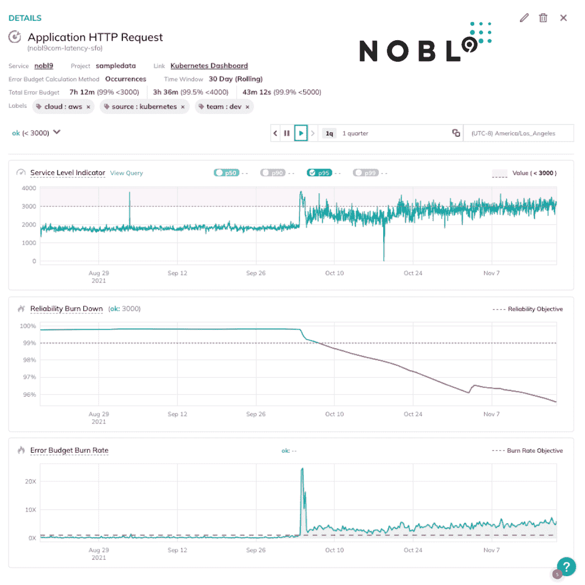

# Kubernetes 的 SLOs，1 年后

> 原文：<https://thenewstack.io/slos-in-kubernetes-1-year-later/>

 [布莱恩·辛格

布莱恩是 Nobl9 的首席产品官和联合创始人。](https://www.linkedin.com/in/briantsinger/) 

大约一年前，New Stack 发表了一篇名为“[Kubernetes 中的服务水平目标”](https://thenewstack.io/service-level-objectives-in-kubernetes/)的文章，作者是威廉·摩根。我们认为这将是探索过去 12 个月 SLO 进展的绝佳时机。回顾这篇文章，我们可以看到许多领域已经发展，主要是在行业对 SLO 如何工作以及它们为什么有帮助的理解上。

先说今天 SLO 的无处不在。我们看到客户和社区成员以各种方式使用 SLO，从减少寻呼机疲劳到定义基础设施、平台和 Kubernetes 环境期望的 SLO。他们还可以[改善开发者文化](https://www.sloconf.com/talk/4UMZ_iINFJY)，[启用混沌工程](https://www.sloconf.com/talk/2hAbBXzdqXI)，充当技术债务的[预警，甚至帮助设置](https://thenewstack.io/its-ok-to-ignore-some-tech-debt-heres-why/) [SSL 证书](https://nobl9.com/resources/preventing-ssl-certificate-expiration/)的提醒。

## 正确计算 SLO

SLO 和误差预算的机制[现在也更好理解了](https://www.youtube.com/watch?v=-lHPDx90Ppg)。在我看来，去年的文章错误地定义了误差预算，所以我想澄清这一点:误差预算是一段时间内 100%和 SLO 之间的差距。在这篇文章的例子中，目标是 30 天内 99%，这意味着 1%的误差预算，而不是文章声称的 0.75%。如果服务命中 99.75%，如文中所说，只消耗了 25%的错误预算(100 减去 99.75 是 0.25，也就是 1%的 25%)。

假设没有客户投诉或服务目标需要调整的外部指标，拥有该服务的团队可以安全地忽略可靠性并致力于其他事情。

## 社区状况

在过去的一年里，SLO 的从业者群体急剧膨胀。SLOconf 有 50 多名发言人，并提供了 7 个小时的录音内容，介绍 SLO 的原因和操作指南。超过 2200 人注册，超过 450 人填写了事后调查。 [OpenSLO](https://thenewstack.io/automate-user-satisfaction-with-this-gitops-friendly-spec-for-service-level-objectives/) ，一个我们与 GitLab、Dynatrace 和其他公司一起启动的开源项目，一直吸引着 SLO 的从业者和平台提供商来创建一个与供应商无关的声明性 SLO 代码规范和相应的验证工具 Oslo。在过去的 12 个月中，SLO 的概念框架和工具获得了极大的关注。

由于 Nobl9 提供了一个 SLO 平台，我们有一个独特的窗口来了解当今软件团队的挑战。他们希望通过推出更多功能并领先于最终客户需求来保持生产力。他们还希望提高效率，确保他们的建造和交付方式不会造成浪费。与此同时，他们需要确保出色的客户体验，即使他们不断改变位置和调整部署。

SLO 是工程速度的关键促成因素。SLO 强调需要注意的业务风险，这意味着围绕优先级和投资需求与业务涉众更好地保持一致。SLO 还鼓励围绕服务目标的粒度进行对话和反馈。例如，你可以将黑色星期五的“结账”体验与“随意浏览”体验区分开来，并为两者设定各自的目标。这更好地将工程决策(如变更管理和容量规划)与业务现实相匹配。

## 救援工具

去年令人惊讶的一件事是 AIOps 作为管理运营的一种解决方案的出现。似乎许多提供商跳过了定义目标的步骤，将这一责任委托给智能数字代理。

在 Nobl9，我们正在投资基于人工智能的复杂工具，以提出更好的 SLO。我们还没有完全同意将基础设施的钥匙交给机器人，但采用 SLOs 是实现 AIOps 愿景的第一步。

随着组织从被动到主动，从手动到自动，并通过其基础架构中的许多技术转变，他们需要用户期望的一些基础。SLO 成为衡量这些投资和变革有效性的标准。我们非常同意，正如 Morgan 的文章所说，“工具在这里可以提供极大的帮助，特别是对于后一种方法，通过提供基于历史数据的建议。”基于现有数据推荐 SLO 是我们在 Nobl9 构建的。

## 平台所有者的观点

正如他们在谷歌喜欢说的那样，Kubernetes 的采用继续“向右上方”增长。组织内的平台团队在为其应用团队提供通用计算服务方面变得越来越成熟。如果你运行一个内部平台，你需要与你的应用团队达成某种协议或谅解，以确保正确使用平台及其期望。与将 SLO 视为匿名合同不同，SLO 有助于创建一个反馈循环和一个关于每个工作负载的正确服务级别的对话。

当你属于同一个组织时，更好的理解是至关重要的。在当今世界，实时看到变化并通过自动化和更深入的协作进行调整，对于满足客户卓越性、工程生产率和业务效率之间的矛盾权衡至关重要。用一种通用语言描述的更细粒度的目标意味着跨堆栈层的清晰性以及对服务的涉众的清晰性。

作为平台提供商，您知道并非所有工作负载都是相同的。区分优先事项和做出明确的选择是你成长战略的一部分。每个人都需要服务的明确规则和目标来推动他们的工程决策。更好的决策是您如何扩展您的数字服务以满足我们现代世界的需求。

软件系统不是统一的，你的平台也不是一堆匿名的计算能力。现在，环境比以往任何时候都更是提供卓越、高效服务的关键。而 SLO 恰恰提供了这种环境。

<svg xmlns:xlink="http://www.w3.org/1999/xlink" viewBox="0 0 68 31" version="1.1"><title>Group</title> <desc>Created with Sketch.</desc></svg>