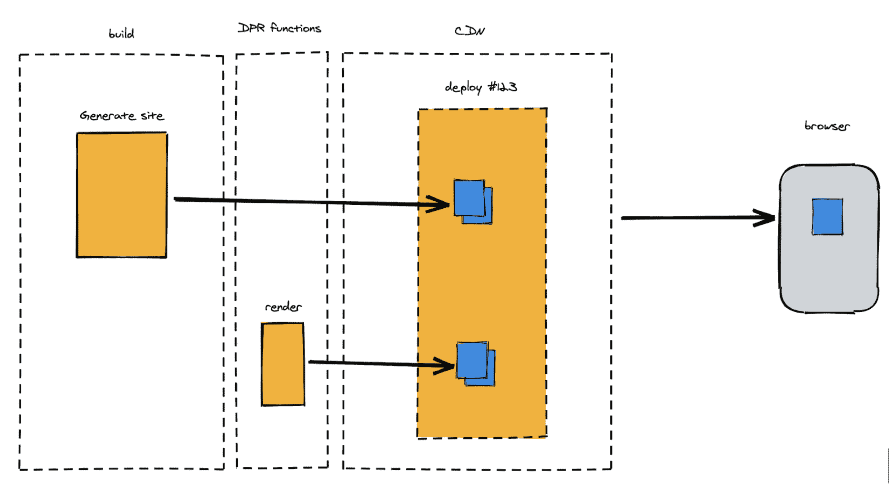
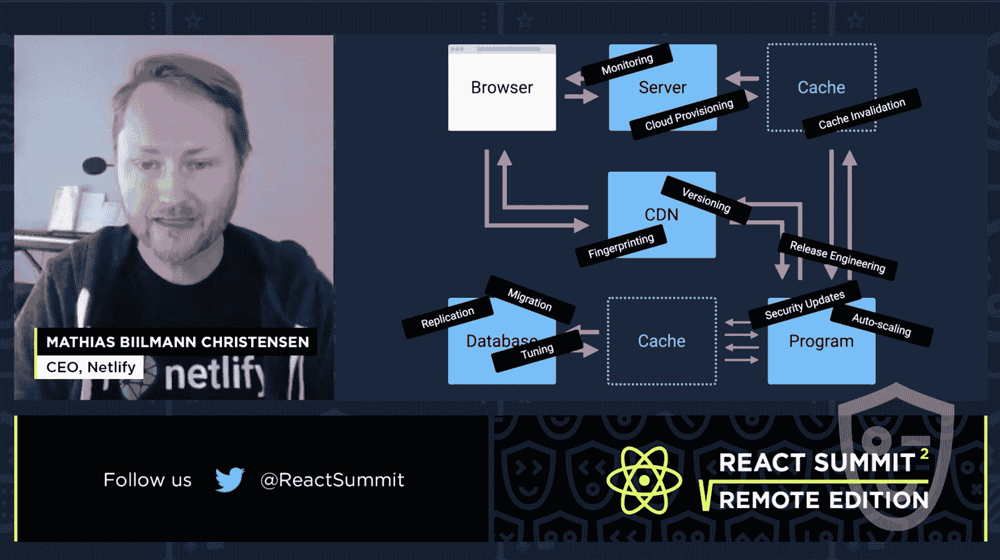

# 缓慢的 Jamstack 构建:Netlify 的解决方案是分布式持久渲染

> 原文：<https://thenewstack.io/slow-jamstack-builds-netlifys-solution-is-distributed-persistent-rendering/>

 [理查德·麦克马努斯

理查德是 New Stack 的高级编辑，每周撰写一篇关于网络和应用程序发展趋势的专栏文章。此前，他在 2003 年创立了读写网，并将其打造为全球最具影响力的科技新闻和分析网站之一。](https://twitter.com/ricmac) 

[Jamstack](https://jamstack.org/) 是由 Netlify 发明的现代 web 开发概念[，Netlify 是一家为 web 提供 CI/CD 和部署服务的公司。通常，](https://thenewstack.io/why-netlify-is-tech-agnostic-and-its-role-in-jamstack-development/) [Jamstack 方法](https://www.netlify.com/jamstack/)要求预渲染尽可能多的网站内容，并通过内容交付网络(CDN)进行交付。可以通过使用 API 将动态功能添加到组合中，但 Jamstack 的核心承诺是向最终用户交付内容比通常更快——因为其中大部分是预先构建的。虽然这种方法给开发人员带来了好处，比如不必处理 web 服务器维护，但是到目前为止，Jamstack 还有一个关键问题:构建时间。

Netlify 预先构建其托管的所有网站，然后将内容部署到其全球边缘网络。然而，如果你有一个非常大的网站——比如说，几十万个页面——那么它可能需要相当长的时间来“构建”网站。Jamstack 公司的同事 Gatsby 去年曾报道过这些问题，一名前雇员声称建立一些网站需要 30 分钟。

为了尝试解决这个问题，Netlify 最近[宣布了](https://www.netlify.com/blog/2021/04/14/distributed-persistent-rendering-a-new-jamstack-approach-for-faster-builds/)一个新概念，称之为“分布式持久渲染”这基本上是一种阻止不需要快速部署的页面构建的方法。因此，您只需预先构建您知道会经常更改的页面子集；所有其他页面在第一次被请求时都是动态呈现的，之后都保存在 CDN 上。正如 Netlify 在[GitHub RFP](https://github.com/jamstack/jamstack.org/discussions/549)中所说的，这“允许开发者推迟呈现任何给定的 URL 或资产，直到它第一次被请求。”

图片 via Netlify。

Netlify 举了一个新闻网站的例子，该网站的档案中可能有数百万页，但大多数旧故事并不经常被请求。因此，当请求一条十年前的新闻时，DPR 函数就会发挥作用，然后进行按需构建和部署。然后，呈现的页面被保存在 CDN 网络上，并将“保持可用，直到被随后的部署所无效。”

## 一切旧的都是新的

正如独立开发者 Leigh Harrison [在我发布这条消息时指出的那样，DPR 概念对网络开发者来说并不陌生。在她自己的框架中，“CSS 和 JS 文件只有在它们的任何组件被更新后第一次被请求时才会被构建和缩小。”](https://twitter.com/leighelse/status/1382516409817731076)

当我问及这个问题时，Netlify 的联合创始人兼首席执行官 Mathias (Matt) Biilmann 坦率地承认这个概念是借用的。他告诉我，Jamstack 本身也是如此。

“当我们最初创造 Jamstack 这个术语时，我们并没有发明什么新东西，而是命名了一种我们在网站和应用程序中见过的架构方法，没有任何明确的术语，也没有一套架构最佳实践。给架构起一个名字，对于围绕它构建模式，对于支持架构的许多新框架的出现，对于发展一个与这种架构方法无缝协作的工具生态系统，都是非常重要的。”

虽然 DPR 并不是一个完全原创的概念，但它确实非常适合 Jamstack 哲学(不需要 web 服务器管理，只需使用一个函数！)并帮助解决构建速度慢的问题。

## DPR 有助于应对当前的复杂局面吗？

对 DPR 的另一个潜在的批评是，它在已经很复杂的 Jamstack 网站和应用程序构建过程中又增加了一个步骤。然而，在本月早些时候 React 峰会上[的十分钟演讲中，比尔曼认为 DPR 是 React 在 2013 年首次亮相时承诺的简单性的回归。](https://www.youtube.com/watch?v=p-ZWytPX1fo)

“早在 2013 年，React 就推出了视图层，简化了构建基于浏览器的应用程序的流程。任何试图在 React 之前构建基于浏览器的应用程序的人，都必须处理整个 DOM 中的这种混合状态。”

他继续解释说，随着 React 的发展，越来越多的概念被加入其中。再加上过去七八年的其他发展——比如 CI/CD、监控和新 CDN 服务的兴起(比如 Netlify 本身)——把我们**再次带回了复杂的网络开发世界。**

Biilmann 说，特别是，React 开发者很难知道网页在任何给定时刻的状态是什么。网站上的直播可能不是你想要的版本。

马特·比尔曼在 React 峰会上。

但是根据 Biilmann 的说法，“Jamstack 使得对站点状态的推理变得容易”——这意味着你应该总是知道在任何时候部署了什么。他说，现在有了 DPR，你可以“获得与[Jamstack]构建相同的原子部署和可预测状态的保证。”

在本文的对话中，比尔曼重申了“Jamstack 和 DPR 都是架构模式，使得 web 属性的状态很容易推理。”

“Jamstack 从一个非常明确的缓存合同开始(如果你不重新部署，它就不会改变)，”他继续说道，“DPR 接受了同样的合同，并将其分发给各个构建者。”

## 不是所有的东西都必须是静态的

愤世嫉俗者可能会说，Netlify 只是给成熟的 web 开发实践起了一个花哨的新名字(分布式持久化呈现)。毫无疑问，Jamstack 的发明者有创造新术语的诀窍，但公平地说，DPR 的概念听起来确实非常有用。此外，构建缓慢是 Jamstack 方法的一个关键问题，DPR 是迄今为止最好的解决方案。

DPR 还展示了 Jamstack 如何继续从“其静态站点和 SSG(静态站点生成器)的起源”向“静态优先而不仅仅是静态”的模型发展，正如 JAMstacked 时事通讯[的 Brian Rinaldi 所说](https://jamstack.email/issues/28)。你会看到同样的趋势在临近 Jamstack 的公司身上发生，比如 Vercel 和 Gatsby。在[的主页](https://vercel.com/)上，Vercel 强调它通过“动态代码执行”的能力“不仅仅是缓存静态内容”与此同时， [Gatsby](https://www.gatsbyjs.com/) 强调它“只在访问者需要的时候加载页面的关键部分，不会早一秒钟。”

Jamstack 社区在过去一年中学到的一件事是，静态网页并不是最重要的。有时需要变通方法来提高站点性能——构建时尤其如此。

<svg xmlns:xlink="http://www.w3.org/1999/xlink" viewBox="0 0 68 31" version="1.1"><title>Group</title> <desc>Created with Sketch.</desc></svg>