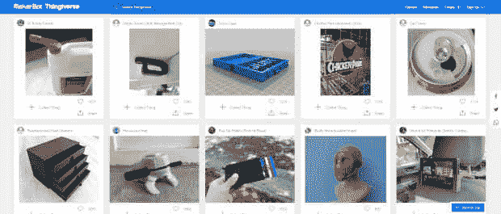
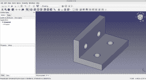
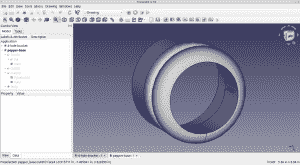
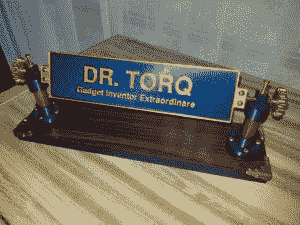

# 小型晶圆厂:拥抱 CAD 思维

> 原文：<https://thenewstack.io/small-scale-fab-embrace-the-cad-mindset/>

在过去的一年里，我们对 Torq 博士的旧居进行了翻新，所以我和一些商人谈过。人们总是问我是做什么的。我告诉他们我设计并且[写关于物理计算的小工具](https://thenewstack.io/physical-computing-types-see-github-a-little-differently/)。

话题经常转向 3D 打印，一些承包商告诉我，他们家里有 3D 打印机。他们热情地继续印刷他们所有的酷的*《星球大战》*头盔和微型变形金刚形象。当地创客空间和机器人俱乐部的成员也喜欢 3D 打印，尽管他们倾向于喜欢更专业的物品，如外壳、箱子、小支架和与技术相关的小摆设。

万岁！3D 打印现在是主流。

嗯，算是吧。

甚至当我告诉其他技术人员我经常在 [FreeCAD](https://www.freecadweb.org/) 中建模零件时，他们给我一种有点困惑的表情。然后，我提到 [Thingiverse](https://www.thingiverse.com/) 。

嗯嗯？

在 Thingiverse 上，你可能找不到一个支架来给你的蒸汽朋克机器人项目安装回收的开罐器马达。能够下载预先制作的模型当然很有趣也很有用。在我看来，设计和构建自己的 CAD 模型是真正推动 3D 打印超越宣传并使其成为真正主流所需的缺失环节。

[上次](https://thenewstack.io/small-scale-fab-make-parts-with-free-open-source-software/)，我们概述了如何使用 [FreeCAD](https://www.freecadweb.org/) 、戴尔笔记本电脑、Ubuntu Linux 和 Prusa MK3S 打印机创建和打印零件。

这一次，我们将探索一些基本原则，当你开始用 FreeCAD 设计自己的 3D 打印零件时，你会想要考虑这些原则。

## 2D 与三维建模

在 FreeCAD 中有两种基本的建模方法，绘制一个 2D 模型，然后拉伸它或绕轴旋转它。或者，抓取一个 3D 对象，如立方体，并使用布尔运算将其附加到其他对象，直到您完成零件。我经常把 2D 的形状组合成 3D 物体，然后把它们和其他 3D 物体组合在一起。

您不仅可以将零件“添加”在一起，还可以在模型中“减去”对象。假设我从两个 4×1×1/4 英寸的直角立方体开始，形成一个支架。它们通过在它们的两个边缘“接合”而成为一个物体。然后，将两个直径为 1/4 英寸、长为 1/4 英寸的圆柱体放在每个腿上，并“减去”(切割两个物体)以形成安装孔。

FreeCAD 中的四孔支架

加减对象需要一点时间来适应。如果你想用传统的制造技术钻孔，你需要把零件夹紧，用钻头钻透材料。在 3D 打印中，你只要“不”打印任何细丝就能在你想要的地方得到一个洞。

在 FreeCAD 模型中添加和减去对象是非常棒的，相比之下，手动将两块平板焊接在一起形成一个支架，然后钻四个孔。如果你有一台焊接机和某种钻头的话。自然，塑料 3D 支架没有同等大小的金属支架坚固。工程中总有权衡，顺便说一下，这是另一个基本原则。

生产效率也开始体现在项目中。如果你做一个 10 英尺长的支架，每条腿上有两排 20 个 1/8 英寸直径的孔，会怎么样？在 FreeCAD 中设计并在打印机上打印是微不足道的，在钻床上设置和执行也相当耗时。

如果你的支架需要 3/16 英寸而不是 1/4 英寸的孔呢？只需将模型更改为 3/16 英寸孔。手工制作技术不容易做到这一点。

## 一致性、准确性和可重复性

读者肯定熟悉传统的钻孔、切割和铣削技术来制作版画。该过程去除材料以生产特定形状和尺寸的零件。还有许多手工测量和标记，以及操作之间的零件定位。手工工具经常用于调整和装配。虽然熟练的工匠可以制造非常精确的零件，但新的 DIY 小规模制造商可能没有经验、耐心或时间来制造出精确的公差。

制造标准、一致且美观的零件很快成为一项挑战。修订和可重复性也是个问题。

现代的桌面级 3D 打印机，如 [Prusa MK3S](https://www.prusa3d.com/category/original-prusa-i3-mk3s/) 可以保持千分之几(0.002 英寸或 0.003 英寸)的公差。这对于设计像回收电动开罐器马达支架这样的东西来说已经足够好了。他们也可以一遍又一遍地打印同一个部分，直到你用完了灯丝。

再循环开罐器电机支架

一开始，你肯定会忽略的一个原则是间隙问题。

在兴奋于如此精确的零件尺寸时，你可能会忘记考虑适当的间隙。例如，如果您有一个 1/4 英寸(. 250 英寸直径)的螺栓需要穿过一个孔，请确保该孔的直径为. 250 英寸，再加上一点点，比如可能是. 010 英寸或. 015 英寸。

这样，螺栓将通过整体没有干扰。计算角落、顶部到外壳、滑动部件等的间隙。

## 为什么要画出你的设计？

多年来，尽管我年轻时有丰富的绘图经验，但我从未正式画出我的设计。我的小批量桌面和一次性车库项目总是进展很快，我只想继续构建。

现在，没有模型就不能用 CAD 制造零件。你从哪里得到一个模型？一个地方是像 Thingiverse 这样的零件网站。

另一个选项是…你猜对了…用 FreeCAD 设计自己的零件。请记住，像 3D 铣削或激光切割(通常称为计算机辅助制造的 CAM)这样的新桌面技术也需要模型作为输入。如果你想对你的零件进行分析，你也需要一个模型。

现在酷的是，现代消费级笔记本电脑可以从软件方面处理所有这些事情。FreeCAD 建模甚至对像汽车变速器这样复杂的东西也很有效。

切片机(如 [Prusa 切片机](https://www.prusa3d.com/page/prusaslicer_424/))用于为打印机制作 g 代码，快速而轻松。在现代现成的计算硬件上，对零件进行热建模或有限元建模也不是什么大事。

您创建的模型也可以保存、重用和共享。它们只是你通过电子邮件发送或复制给其他人的文件。过去，我看不出在文件柜中保留我设计的纸质图纸有什么意义。你拿他们没办法。

现在，你可以把零件，像一个标准螺栓或你新设计的可回收开罐器马达支架，插入到一个新项目中。没有必要从头开始重新创建一切。或者，您可以将零件发送给同事，请求升级建议或让他们打印出来。

我们也不要忘记，FreeCAD 具有广泛的尺寸标注功能来记录设计。在过去，谁想给图纸标注尺寸？没人。

现在，您只需将它们放置在您希望它们出现在绘图上的位置。物理测量是模型的一部分，并反映在绘图尺寸中。在演示文稿中制作精美、专业的信息图形。只需将您的绘图发送过来并在 LibreOffice 中使用即可。

## 找到你的 CAD 思维模式

进入 CAD 思维模式非常容易。忘记那些小饰品，开始思考你能做些什么来修理房子周围的东西。

我的第一个有用的项目是修理我妻子最喜欢的胡椒研磨器。底座是圆柱形的，有一大块三角形的突出部分。这是她最喜欢的颜色，红色和替换零件根本不可用。

我订购了一些红色的聚乳酸纤维，颜色最接近，并在 FreeCAD 中建模。我使用 2D 草绘器工作台来绘制底座的横截面轮廓。

然后，我绕着底座中心线旋转草图。我用了一个 35 美元的卡尺来测量。这个设计需要在内部有一个小的定位凹槽，所以我目测了一个大小合适的正方形。有了支撑物，打印用了大约一个小时，使用了 0.3 毫米的层高度。打印完成后，我将零件从打印床上取下，并将其安装在胡椒研磨器上，无需任何修改。

胡椒研磨机底座的 FreeCAD 模型

3D 打印胡椒研磨器底座(右)

该设计使用 FreeCAD sketcher 工作台，将草图旋转为 3D 零件。接下来，我将一个较小的圆柱体放入旋转的底座中，并减去它。

一个正方形物体，并“减去”凹口。最后我打印了零件，把坏掉的胡椒研磨器底座换掉了。

过了几天，我妻子才注意到新的部分。颜色和轮廓都不完全匹配。它有层次线。

但是，我的妻子说这已经足够好了，并感谢我的努力。当朋友和家人过来时，它也足够好，可以作为一个很好的话题。

其他便于使用的部件包括用于梯子的 TPU(柔性细丝)脚和我的工友长凳。一个实心的淋浴排水管盖(另一个带有两个螺栓孔的草图旋转对象)来替换旧的 1960 年型号的排水管/杠杆盖。我用 PETG 灯丝来抵御任何热水。还有把手用来固定工友身上坏掉的东西。

## 包裹

在现代笔记本电脑上用 FreeCAD 设计零件只是在最近几年才真正实用起来。在此之前，开源(非专有商业)CAD 软件和硬件根本无法胜任这项工作。

现在 3D 打印“相当”容易使用，有进取心的 DIY 设计师和桌面工程师有很多机会创造他们自己的定制、可配置部件，并将它们变成真正的日常实用物品。

网上有很多关于使用 FreeCAD 的 YouTube 视频和课程。好好学习，找个像样的笔记本，开始思考如何组装自己的替换胡椒研磨器底座或阶梯脚模型。

如果你刚刚开始使用 FreeCAD，不要试图马上变得太狡猾。从简单的部分开始，坚持下去，你的技能会随着你的学习而提高。这需要一点时间。能够设计自己的零件绝对值得付出努力。

*在[doc@drtorq.com](mailto:doc@drtorq.com)或 407-718-3274 联系 [Rob "drtorq" Reilly](/author/rob-reilly/) 咨询、演讲约定和委托项目。*

<svg xmlns:xlink="http://www.w3.org/1999/xlink" viewBox="0 0 68 31" version="1.1"><title>Group</title> <desc>Created with Sketch.</desc></svg>