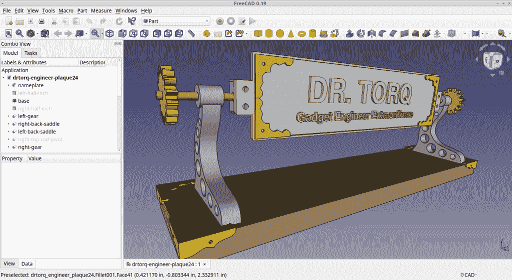

# 小规模工厂:用自由/开源软件制造零件

> 原文：<https://thenewstack.io/small-scale-fab-make-parts-with-free-open-source-software/>

[Torq 博士](https://thenewstack.io/author/rob-reilly/)

 [Rob (drtorq) Reilly 是一名独立顾问、作家和演说家，专门研究 Linux/OSS、物理计算、硬件黑客、技术媒体和 DIY/Maker 运动。](https://thenewstack.io/author/rob-reilly/) 

如今，人们对小规模制造和生产有着极大的兴趣。这个话题经常出现在商业杂志和新闻中。我认为这是科技行业有史以来最好的时代，任何人进入“小规模”行业都有光明的未来。

许多技术人员了解基本概念。说你要做一个支架。只需买一台 3D 打印机，把它放在你的桌子上，也许在你的笔记本上快速制作一个 CAD 模型，按下打印机上的按钮，噗…一个超级酷的物理部件就出来了。

嗯，技术仍然是复杂的，微妙的复杂性明显影响着期望，从家庭成员和朋友，一直到组织和公众。我通常可能只是得到一个“这很好，有什么好处？”回应。

像其他事情一样，你必须知道一些东西来回答他们的问题。

这个新系列旨在帮助你无畏地步入小规模制造，并启发你帮助引导它进入实用。给你一个提示:好奇心、学习意愿、免费/开源软件和少量现金会让你稳稳地进入游戏。

## 我们是如何来到这里的

值得注意的是，在过去几年里，制造物理“东西”的挑战急剧下降。

80 年代中期，我为马丁·玛丽埃塔工作。该公司全心全意地拥抱 CAD、CNC 和立体平版印刷术等当时的新工具。那些过程和系统意味着花费大量的金钱。我认为二氧化碳激光立体平版印刷机花了整整 25 万美元。

传统的机加工(金属、木材、塑料)零件需要一个足球场大小的车间，里面布满了车床、铣床、钻床、焊接设备、注塑机、现场零件库存和装配区。小规模的晶圆厂，尤其是为个人或小公司手工完成，往往超级缓慢，通常昂贵。非常富裕的普通 Joe DIYer 可能有一台小车床或 Bridgeport mill，但肯定没有 CAD 或 3D 打印机，更不用说他们桌上的一台了。有趣的是，我从来没有真正想过立体平版印刷术(当时是这样)会起飞。

回到十年前，我们迎来了 10 美元微控制器电路板和创客运动的时代。DIY 者和技术修补者开始将模块焊接成项目，编写程序并在网上自由分享他们的知识。这一切都演变成我们目前的小规模，桌面一切的能力。

今天，在你的笔记本电脑、客厅电视和口袋里的智能手机上，我们有一个基本上无处不在的网络。现代供应链提供各种东西，从一打 1 英寸长的 8 号圆头黄铜螺丝到仍然相当先进的 JeVois 人工智能机器视觉相机到碳纤维打印机灯丝，一两天后就出现在我家门口。当然，来自海外的零件需要更长的时间。

我的 [Prusa 打印机](https://www.prusa3d.com/category/original-prusa-i3-mk3s/)在我订购后过了大约一个月才到达，尽管当时(2020 年末)它们如此受欢迎以至于积压了大量订单，完全组装好的机器不得不(通过美国海关)从捷克共和国运到佛罗里达州。我在打开盒子后不久就打印了第一部分。

## 开源拯救世界

自由和开源软件也深刻地影响了我们寻找和消化信息的能力。在过去的十年里，它已经非常成熟，并且已经发展到你可以做任何专有系统上的人可以做的事情，比如 Windows 或 Mac。许多在 Linux 下运行的软件也有在其他平台上运行的版本。

> 在我看来，进入小规模工厂和制造业归结为培养强烈的学习意愿，尝试新事物和应用自己。实际的货币成本也不算太差。

像 Raspberry 和 Rock Pi 这样的单板计算机几乎只在 Linux 上运行，网络上也是如此。我在所有的电脑上都运行 Linux，因为它非常可靠，而且可以免费下载和使用。Prusa 的设计也是开源的，所以如果你需要打印备件，只需下载文件就可以了。

在我看来，进入小规模工厂和制造业归结为培养强烈的学习意愿，尝试新事物和应用自己。如果你做出明智、实际的选择，并在一两年后审视投资，实际的货币成本也不会太糟糕。

在本系列中，我们将涵盖所有这些因素以及更多。

## 把这个设计从我的脑海中抹去

结果是实际的，所以让我们从一个完整的、真实的零件例子开始。

比方说，我想要一个新的支架，放在我的[蒸汽朋克桌面铭牌](https://thenewstack.io/off-the-shelf-hacker-finishing-the-low-cost-conference-badge/)上。它最初有一个圆柱形底座，上面有一小段铜管，顶部有一个交叉支架。这是一个特写:

原始圆柱形蒸汽朋克名称牌匾支架

我设想将设计简化成一个整体，保留蒸汽朋克美学，看起来很棒。改变设计使它更容易生产，支持牌匾的销售。这里有一个简单的草图:

新改进的蒸汽朋克名称牌匾支架的餐巾草图

有了画在餐巾纸上的部分，我们现在如何把它栓在牌匾上？让我们更详细地扩展一下前面的过程。

## 制造零件

首先，我们需要一台笔记本电脑。我的是一款戴尔 Inspiron i7 触摸屏机型，在百思买(Best Buy)售价约 1200 美元。我安装了 [Xubuntu Linux](https://xubuntu.org/) 来代替 Windows，用 [FreeCad](https://www.freecadweb.org/) 来建模零件。Xubuntu 是非常常用的 [Ubuntu Linux](https://ubuntu.com/) 的一个版本。

FreeCad 是一个免费提供的专业级计算机辅助设计(Cad)程序，它使用立方体、圆柱体和球体等基本对象来构建三维机械模型。你可以通过在 3D 模型中添加和减去基本形状来构建东西。FreeCad 的“工作台”里有一堆功能，可以让你操作形状，让你的设计恰到好处。

虽然 FreeCad 的学习曲线适中，但网上有大量的操作方法和视频教程，可以帮助你入门。FreeCad 的响应速度非常快，笔记本中有 16 GB 的 RAM 和 500 GB 的 SSD。我们将在以后的文章中更深入地研究 FreeCad 和 Linux 的使用。

在我的支架示例中，下一步是对零件建模。一个便宜的刻度盘测径器使收集粗略的(成比例的)零件测量变得容易。这些测量数据被转换成 FreeCad 来制作模型。CAD 建模允许根据需要轻松调整测量值，以优化零件。

FreeCad 应用程序中的新支架模型

一旦模型建立，一个。OBJ 文件可以发送到一个切片程序。切片器将 CAD 模型切割成水平切片，由 3D 打印机分层放置。我使用 [Prusa 切片机](https://www.prusa3d.com/page/prusaslicer_424/)，可以调整印刷床上的零件方向、层厚、壁厚、填充百分比、细丝类型、挤压温度等。Prusa 切片器可以免费下载，可以在各种操作系统上运行。

Prusa 切片程序

切片器变魔术之后，你需要输出一个 g 代码文件到 SD 卡。然后将 SD 卡插入 3D 打印机，零件排队等待打印。我非常满意 [Prusa MK3S 机器](https://www.prusa3d.com/category/original-prusa-i3-mk3s/)，它是顶级的桌面尺寸打印机。它具有实用的内置功能，如自动床调平、全金属挤出机、加热床和断电重启。

一个自己动手制作的版本售价约为 750 美元，外加运费。完全组装和测试的版本售价约为 1100 美元，外加运费。我选择了完全组装的模型，因为我想立即打印零件，并且已经知道如何将东西组装在一起。如果你真的想了解它是如何工作的细节，就去拿工具包，自己组装起来。我在洛克希德-马丁公司的一些朋友使用 Prusa 打印机制造零件。

我的许多零件都使用 PLA 长丝，因为它能生产出非常干净的零件，易于印刷。PETG 灯丝更耐热(我住在佛罗里达州)，比 PLA 更柔韧，尽管它会从空气中吸收水分，所以你必须用塑料袋中的干燥剂包保持干燥。

我也用 TPU 丝制作高弹性零件。它适用于垫圈、o 型圈、柔性铰链等。TPU 确实能吸收水分，所以当它不在打印机上时，它就在塑料袋里。1 斤。这些细丝的线轴每个成本在 20 美元左右。

一旦正确的灯丝安装在 Prusa 上，与我在切片机程序中分配的类型相匹配，最终按下按钮开始打印。打印机将完成它的工作，过一会儿，可以从打印机上取下一个新部件。这是完成的部分。

3D 打印的示例零件

## 花一点钱，让它可靠，让它安心

在我看来，这种基本的小规模制造设置的成本约为 2500 美元(包括正常的杂费、税费、运费等)是非常合理的。

当学习任何新技术时，使用可靠的、成熟的工具来最大限度地减少设置、校准和未充分优化的过程是有意义的。戴尔和 Prusa 是性能稳定的可靠机器。您可以专注于学习如何有效地使用 FreeCad modeler，并通过 Prusa 切片器轻松地传送文件。

我认为 Prusa 是一个很好的投资，因为它的精度和可靠性是众所周知的，我打开盒子后一小时它就开始打印了。它很好用，经过一年多的打印，我很少打印失败，也没有维护问题。固件和切片程序更新频繁，不断增强打印机功能。我希望它能在未来几年内轻松生产出新零件。

## 包裹

我们已经了解了用于小规模制造的基本 3D 打印机设置，并通过一个示例了解了如何制作零件。CNC 加工、激光切割和其他自动化过程的技术是相似的，尽管很明显，你会使用不同的机器。

如果你已经有一个不错的笔记本，只需下载 FreeCad 并开始观看如何使用它的教程。Instructables、YouTube 和其他创客类网站有大量有用的信息。

立即开始设计一些零件，即使你还没有 3D 打印机。你总是可以把你的新零件模型带到当地的制造商空间，使用他们的打印机。获得学习小规模制造的所有资源的机会非常少。个人只需要承诺学习并付出努力。

对于技术人员、工程师或发明家来说，这是历史上最伟大的时代。

而且，这是很有趣的事情！

*在[doc@drtorq.com](mailto:doc@drtorq.com)或 407-718-3274 联系 [Rob "drtorq" Reilly](/author/rob-reilly/) 咨询、演讲约定和委托项目。*

<svg xmlns:xlink="http://www.w3.org/1999/xlink" viewBox="0 0 68 31" version="1.1"><title>Group</title> <desc>Created with Sketch.</desc></svg>