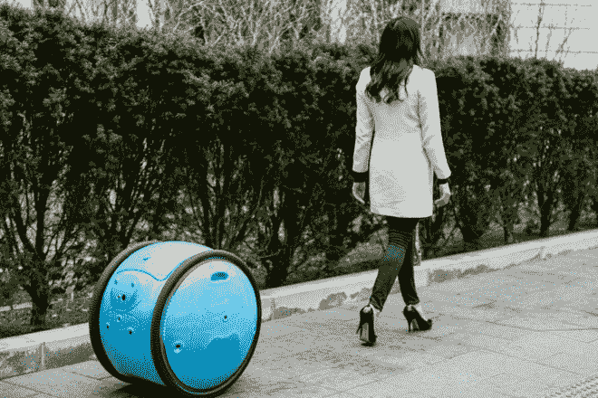
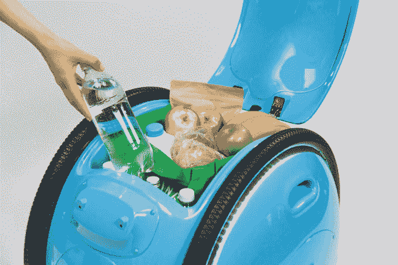
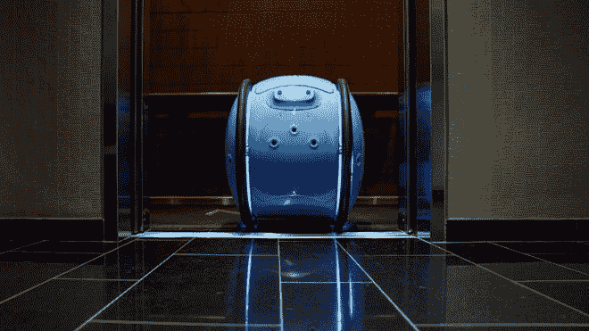
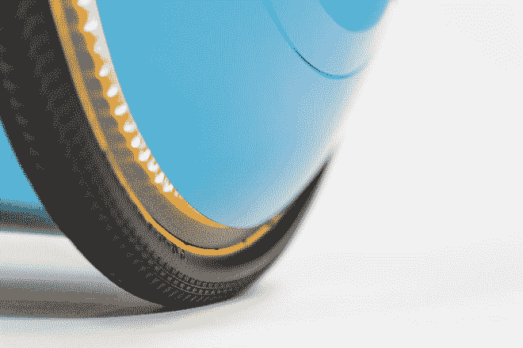
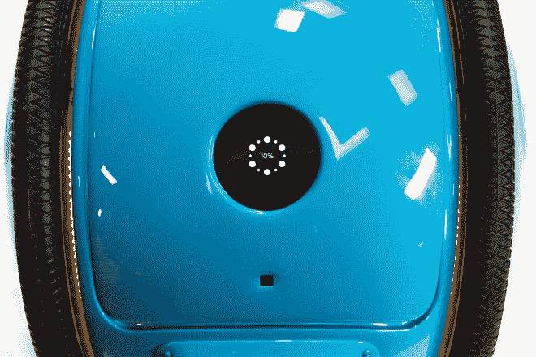
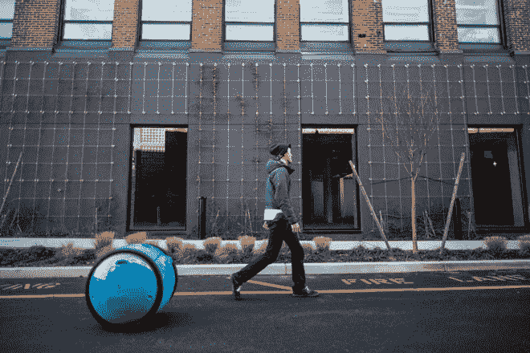

# 这个智能自动驾驶机器人跟着你，帮你拿东西

> 原文：<https://thenewstack.io/smart-self-driving-robot-follows-carries-stuff/>

缓慢但肯定的是，机器人成为我们日常生活一部分的想法正在得到越来越广泛的接受——从较小的家庭除尘机器人，到在办公室与人类一起工作的协作机器人，再到在人行道上漫游的送货机器人，分发食品杂货或网上订购的药品。

如果意大利移动公司 [Piaggio](http://www.piaggio.com/) 成功的话，个人货运机器人也可能成为我们生活中的一个重要组成部分。该公司以其时尚的 Vespa 踏板车而闻名——这本身就是一种文化象征——该公司现在正着眼于通过 [Gita](http://piaggiofastforward.com/gita) 打入自动驾驶汽车行业，这是一种自动驾驶智能机器人，旨在拖着你的东西到处跑。

[https://www.youtube.com/embed/vGrFeouXMd0?feature=oembed](https://www.youtube.com/embed/vGrFeouXMd0?feature=oembed)

视频

Piaggio Fast Forward 是该集团的新技术和设计部门 Gita(发音为“jee-ta”，来自意大利语“短途旅行”的意思)的创意，看起来像一个侧放的圆桶。它有 26 英寸高，能够以每小时 21 英里的最大速度承载 40 磅的重量——大约是人类奔跑的速度。在它鲜艳的碳纤维外表下，隐藏着一个数字指纹锁定的储物隔间，人们可以在那里存放杂货或其他需要长途步行的重物。

## 给你的东西一辆小摩托

作为对 Vespa 在紧张的城市地区作为一种有效交通方式的持久成功的认可，Gita 是一种自主车辆，它的大小不完全是一辆汽车，但比空中无人机更重，并且可以通过跟随人类指南(即你)在附近。

它由一个持久的可充电电池供电，它的 360 度摄像头和两个大轮子允许它轻松地绘制和移动各种城市地形，无论是人行道，轮椅坡道，甚至是室内。Gita 可以被指示跟随你，或者独自出现在预先确定的地点，或者在其他 gita 的护送下出现。据该公司称，Gita 被设计成一辆“高性能摩托车”，具有相同的制动、平衡和安全能力，以及令人难以置信的零转弯半径。

## 增加人类的流动性

Piaggio Fast Forward 首席执行官 [Jeffrey Schnapp](https://www.linkedin.com/in/jeffrey-schnapp-7573536/) 在一组宣传材料中解释说:“这是一架陆地无人机，它是一个货运机器人，它是一个夏尔巴人，它是一个智能设备，在人类的指导下学习环境并在行进中绘制地图。”。

Gita 也被认为是一个具有“平易近人和善于沟通”个性的机器人。它布满了一系列灯光和声音，并配有触摸屏界面，便于交互控制。

但与市场上的其他设备不同，Gita 不会将你从行走的任务中解救出来。这里的想法是通过创建一个机器人“伴侣”来增强人类的自主性，当你走路时，它会跟着你一起滚动——通过使用可穿戴的电子白色工具带将用户与 Gita 无线连接，人类和机器人的配对成为可能。

“运输和机器人行业往往专注于优化任务和取代劳动力。我们正在开发增强和扩展人类能力的产品，而不是简单地试图取代它们，”施纳普说。“想一想，如果不再需要拖着笨重的物品，你从一个地方到另一个地方会有多自由。”

作为一种“中间”个人移动性概念，它针对的是城市结构中存在的间隙空间——如人行道、小巷、室内过道和人行道、坡道等——Gita 解决了该公司所谓的“颗粒移动性”，这是其他制造商经常掩盖的问题。

Schnapp 说:“颗粒移动性是我们在 Piaggio Fast Forward 中阐述的一个概念，旨在引起人们对我们作为行人和二十一世纪城市公民所走过的空间的关注。“我们想，让我们尝试制作一种产品，它能融入所有这些不同的城市，以及人们在所有这些城市的移动方式。Gita 旨在利用城市空间人类导航员的力量，帮助理解它们。我们把它想象成 21 世纪的 Vespa。”

除了在城市中携带个人物品之外，还有其他实现 Gita 的伟大想法:该公司设想可以招募一支 Gita 车队来投递邮件，或者可能作为全市货运机器人共享系统的一部分进行租赁，就像自行车共享一样。机场和酒店可能会提供一组 Gitas 来帮助游客卸下行李。像老年人或视力受损者这样的行动不便的人群也将受益于个人机器人伴侣。

到目前为止，这些只是想法，但随着世界各地城市的进一步密集化，以及对自行车和步行等负担得起的交通替代方式的需求增加，Gita 等有用的智能机器将在很大程度上确保我们的城市保持步行、无障碍和宜居。要了解更多信息，请访问 [Piaggio 快进](http://piaggiofastforward.com/)。

<svg xmlns:xlink="http://www.w3.org/1999/xlink" viewBox="0 0 68 31" version="1.1"><title>Group</title> <desc>Created with Sketch.</desc></svg>