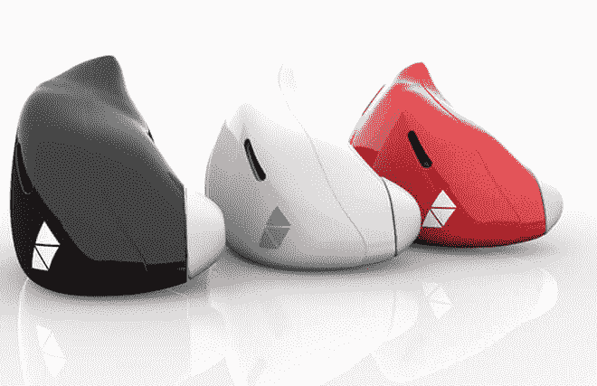

# 入耳式设备几乎可以即时翻译外语

> 原文：<https://thenewstack.io/smart-wearable-ear-device-translates-foreign-languages-almost-instantly/>

去另一个国家旅行可能会很艰难:遇到异国的食物，甚至可能是异国情调的厕所。但毫无疑问，学习当地语言总是有助于避免潜在的尴尬局面，如果你想问该乘哪趟火车或结识新朋友，这将非常方便。

但是学习另一种语言说起来容易做起来难——这可能取决于新语言与你的母语有多相似，你的动机或者你手头有多少时间。

但是玩弄这些语言逻辑可能已经没有必要了。总部位于纽约市的一家名为[韦弗利实验室](http://www.waverlylabs.com/)的公司正在推出 [Pilot](https://www.indiegogo.com/projects/meet-the-pilot-smart-earpiece-language-translator--2#/) ，这是一款由智能手机应用程序控制的可穿戴设备，能够即时实时翻译外语。

让人想起科幻作品中常见的通用翻译器，这种戴在耳朵上的设备允许人们用他们的母语交流，使用他们的日常词汇。任何拥有另一个飞行员(或至少安装了附带的智能手机应用程序)的人都可以通过耳机或智能手机的扬声器，听到你的讲话被同时翻译成他们的母语。

[https://www.youtube.com/embed/NjjQ5cH_YzI?feature=oembed](https://www.youtube.com/embed/NjjQ5cH_YzI?feature=oembed)

视频

这款可穿戴翻译机采用了现有的技术——即语音识别、机器翻译、[语音合成](https://en.wikipedia.org/wiki/Speech_synthesis)和蓝牙技术——并将所有这些技术整合在一个看起来光滑而不显眼的包中，该包也易于使用和穿戴。

在引擎盖下，耳机有一个特别设计的双降噪麦克风，可以在用户说话时过滤掉背景噪音。用户的语音然后通过智能手机应用程序发送，智能手机应用程序使用内置的语音识别、机器翻译和语音合成技术对其进行解析。翻译后的语音从配对耳机的另一端传出来，几乎立刻就传到了听者的耳朵里。该设置使用了一个 [ARM 处理器](http://whatis.techtarget.com/definition/ARM-processor)和一个近场磁感应(NFMI)通信系统，由两个设备之间的调制低功率磁场创建。

Pilot 智能手机应用程序可以在不同语言之间切换，并且可以离线使用，如果你不想陷入在海外购买数据计划的麻烦，这很有用。该应用程序也可以单独用作基本的常用语手册。当不作为翻译使用时，Pilot 耳机仍可用于无线播放音乐。另一个很棒的特性是会议模式，它允许说不同语言的多人加入到同一个对话中，就像一个小型的联合国。

“我们在韦弗利实验室所做的是[创造]一种没有语言障碍的生活，”该试验的创造者安德鲁·奥乔亚说。有趣的是，这款设备的灵感来自于奥乔亚想要找到一种快速、无痛的方式与他的法国新女友交流，而不用他们的智能手机在他们之间笨拙地调解。(啊，我们为爱做的事情:爬山，打仗，或者推出一个新的科技产品。)

该试点项目自 2014 年以来一直在酝酿中，背后有一个强大的团队，结合了机器人、电气和软件工程、工业设计、机器学习和翻译等不同背景。该团队目前正在努力完善首次亮相前试点的一些问题，即翻译之间出现的“几秒钟的延迟”。总的来说，机器翻译也是一项不完善的技术(任何在线翻译机的用户都会知道)，但使用 Pilot 的人越多，它的翻译引擎就变得越好。

该试点计划将于 2017 年 5 月正式推出，最初将提供英语、西班牙语、法语、意大利语和葡萄牙语版本。未来几个月将增加更多语言；该团队预计未来将增加阿拉伯语、希伯来语、俄语以及日耳曼语、斯拉夫语、非洲语和东亚语言。零售价格预计在 249 美元到 299 美元之间，但你可以通过该公司的 [Indiegogo](https://www.indiegogo.com/projects/meet-the-pilot-smart-earpiece-language-translator--2#/) 页面以更低的价格购买一整套产品，包括两个飞行员、一个便携式充电器和不同尺寸的耳塞(众筹活动已经成功资助了多次)。

专题图片:道格拉斯·亚当斯'[巴别鱼](http://hitchhikers.wikia.com/wiki/Babel_Fish)，[如 BBC](https://www.youtube.com/watch?v=fmpP73-SHPQ) 所描绘的，改编自亚当的'[银河系漫游指南](https://www.amazon.com/Hitchhikers-Guide-Galaxy-Douglas-Adams/dp/0345391802)其他图片:韦弗利实验室

<svg xmlns:xlink="http://www.w3.org/1999/xlink" viewBox="0 0 68 31" version="1.1"><title>Group</title> <desc>Created with Sketch.</desc></svg>