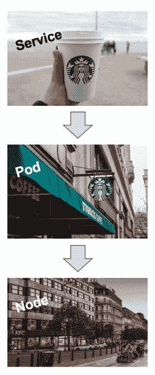

# 智能工作负载:通向自我管理系统的桥梁

> 原文：<https://thenewstack.io/smart-workloads-the-bridge-to-self-managing-systems/>

[Eva TUC zai](https://turbonomic.com/)

[Eva 在 IT 服务管理方面拥有超过 15 年的经验，在移动应用战略方面横跨应用性能管理、虚拟化优化和企业级持续质量。作为 Turbonomic 高级工程团队的一员，她致力于采用以客户为中心的解决方案来解决影响各地业务的问题。](https://turbonomic.com/)

祝贺您将工作负载容器化，并用 Kubernetes 进行编排！欢迎来到便携性和弹性的新领域——这只是开始。开发人员有一个梦想，即应用程序无需修改就可以在任何地方运行。这从 Kubernetes 开始，但它扩展到了 serverless，它承诺开发人员无需管理基础设施就可以部署和运行功能。在这一梦想的背后是强大的业务需求——快速发展，不断升级——将开发人员及其应用推向物联网、边缘计算等新领域。但是，随着现实世界和数字世界之间的界限变得模糊，使之成为可能的关键技术为 it 运营带来了新的挑战。

集装箱化服务提供了跨越多个地点或云的能力。开发人员现在可以跨不同的云创建和集成许多服务，而不必在一个应用程序平台中编写整个业务工作流。现在，你可以在一个云中访问数据，在另一个云中访问提供事件触发的无服务器功能，在另一个云中访问机器学习、商业分析、文本到语音转换等等。这就是为什么云提供商发现他们的竞争优势不在于弹性计算、存储或网络资源，而在于运行在它们之上的服务。

开发人员只想专注于构建与众不同并推动业务发展的应用程序，而他们有一套全新的构建模块来实现这一目标。这些新构件包括:

*   **微服务:**加速开发，允许团队并行工作，构建&部署组成单个应用程序的解耦服务
*   **容器:**构建一次，随处运行；再次，加快发展
*   **Kubernetes:** 在任何地方部署和运行这些工作负载；灵活扩展集装箱化基础设施
*   **函数:**AWS Lambda、knative 或 Openwisk 等函数；更多的抽象，让开发人员更专注于应用程序
*   **数据:**很多很多的数据…因为数据…
*   **服务网格:**需要一个服务网格将其连接在一起，确保服务之间的安全通信
*   **功能网关:**网关，比如 [Gloo](https://thenewstack.io/meet-gloo-the-function-gateway-that-unifies-legacy-apis-microservices-and-serverless/) 提供了集成遗留服务的能力，这些遗留服务还没有准备好容器化，但是它们是整个业务事务的必要部分。
*   **还有这么多**！

当开发人员和 DevOps 团队正在利用不断增长的构建模块来构建和部署敏捷而灵活的服务时，运营商正在将相同的 ol’方法应用于已转变的环境。这真的有意义吗？

## 新开发，旧运营

IT 运营部门一直有责任确保应用程序性能，同时最大限度地降低成本并遵守业务政策。随着容器化和现在的无服务器应用程序的出现，这一要求略有变化:在遵守业务约束(预算、数据位置、安全性等)的同时，确保服务水平目标(SLO)。).

他们目前是如何做到这一点的？通过脚本、策略和阈值实现监控和流程自动化。

让我们看看这对 Kubernetes 意味着什么。在 Kubernetes 中，您必须定义、操作和管理缩放阈值，也就是“自动缩放”。如果您跨多个云进行操作，那么您必须对部署了您的服务的每个单独的云进行同样的操作。那么，为了做出正确的决策，Kubernetes 运营商需要问些什么问题呢？

*   pod 的限制和保留是什么？(又名允许多少 CPU 和内存？)
*   pod 中的容器配置是否正确？最好是正确的，因为你要自动缩放配置相当多。
*   pod 何时需要横向扩展以确保满足峰值需求？什么时候应该缩减？
*   我可以重新安排一个 pod 以避免资源碎片吗？如何防止因邻居吵闹而导致拥堵？如今，这通常是通过杀死 pod 并启动一个新的 pod 来实现的，从而允许本机调度程序找到可用容量…但这中断了对最终用户的服务！
*   我的豆荚应该往哪里跑？更接近最终用户？更接近他们所连接的服务？今天，这是通过节点标签硬编码的——而且通常是最佳猜测。

无服务器呢？首先，没有一个功能是真正的“无服务器的”无服务器只是说明这不是开发者的问题。这些功能运行在一个平台上，您—操作员—需要管理这个平台。即使是函数也有需要管理的资源配置。数据服务呢？数据服务——无论是内部部署还是公共云 RDS——都应该有合适的规模或模板来处理高峰需求，而不会超支。

在堆栈的多个层以及跨异构云和组件的这种动态复杂性下，您如何确保端到端的业务事务的性能？如今，单独管理 pod、服务和功能的方法既费力又不连贯。它无法扩展。

## 什么使工作负载变得智能？

运营商需要一种新的方法。在行业中，我们经常谈论自动化。通过自动化流程，我们已经取得了长足的进步。但是，由于上述原因，依靠阈值、脚本和策略已经不够好了。工作量太大了！更重要的是，它超出了人类的范围。现代分布式应用，以及它们运行的云和容器化的多云基础设施，对于人们来说太复杂、太动态，以至于无法持续保证性能。

如果工作负载可以做出自己的资源决策，您就不必再做这些决策了。如果工作负载能够自我管理，您就需要花费时间来推出新服务、改进现有流程或学习新技能。你创新。

那么，智能工作负载需要什么呢？

*   **全栈可见性:**工作负载必须了解您的环境中有什么、相互依赖性和权衡。最后两个非常关键。将来自不同系统的监控数据整合到一个视图中是不够的。工作负载需要了解跨任何云的容器化服务和平台、功能以及传统虚拟化系统之间的关系。这里的变化会引起那里的变化吗？如果我横向扩展一个单元，节点上是否有足够的容量？服务器上有足够的容量吗？这些都是只有全栈可见性才能回答的重要问题。
*   **实时分析:**还记得我关于超越人类尺度的动态复杂性的观点吗？在这种新环境中确保 SLO 需要持续、动态地调整资源管理。换句话说，它需要 24/7 的决策来决定何时扩展，扩展多少；何时缩减规模；在哪里放置工作负载；如何配置(或重新配置)工作负载—全部基于实时资源需求。
*   自动化操作:你可以拥有世界上最强大的分析工具来告诉你该做什么，但如果系统不能执行这些操作，那还有什么意义呢？

如何让这一切发挥作用？正确的抽象。它必须足够简单，适用于任何新技术，并且足够优雅，能够捕捉到真正发生的事情——而且有很多事情正在发生。观察基本原理:应用程序有资源需求，这些需求可以从有限的资源池中得到满足。这些约束可能是预算、容量或合规性规则。有需求就有供给。这些问题需要被视为服务于工作负载的相互关联的供应链——无论是容器、功能还是(但愿不会如此！)一个 VM。

## 有人要南瓜拿铁吗？

环境中的行为可以抽象为经济决策吗？服务依赖于 pod，pod 依赖于节点，节点依赖于服务器等等来运行。听起来像是供应链。

如果服务是咖啡，而容器是星巴克会怎样？你和你的朋友对南瓜香料拿铁有一种强迫症。镇上的其他人也是。需求增加。这么多拿铁要做，没有足够的咖啡师。所以星巴克在同一个社区部署了一个新的豆荚——我是说“商店”。这个邻域被称为工人节点 2。这是一个受欢迎的地方，许多其他商店(你知道，“豆荚”)突然出现。但是，随着需求的增加，工人节点 2 的租金价格也会上涨。在某些时候，你最喜欢的星巴克留在附近是没有意义的——所以它搬到了几个街区外的 Worker Node 3 社区。那里的租金更便宜。

我失去你了吗？如果是这样，对不起。我们可以在 KubeCon 喝拿铁聊天。底线是有办法让软件做出决策——做我们不能也不想做的事情，比如持续的资源管理。这个世界正在自动化，这是一件好事，因为我们可以提升人们的角色，让他们能够创新和创造性地思考，以解决更大的问题。

通过 Pixabay 的特征图像。

<svg xmlns:xlink="http://www.w3.org/1999/xlink" viewBox="0 0 68 31" version="1.1"><title>Group</title> <desc>Created with Sketch.</desc></svg>