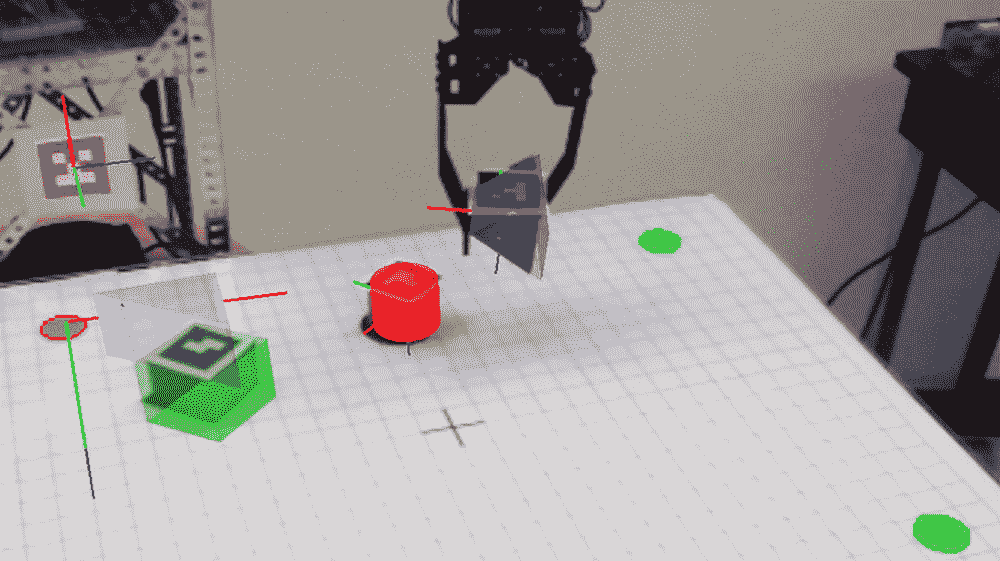
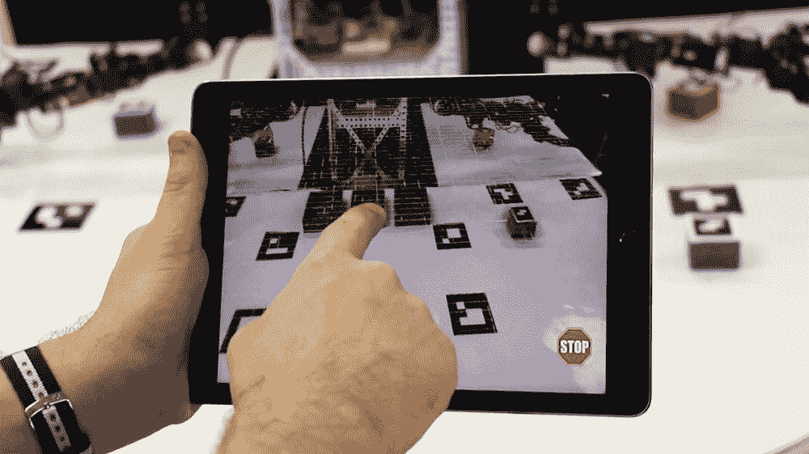

# 这款智能手机应用可以通过增强现实来控制机器人

> 原文：<https://thenewstack.io/smartphone-app-can-control-robots-augmented-reality/>

随着各种尺寸和类型的机器人在我们的工厂和办公室变得越来越普遍，人类找到一种简单而直观的方法来控制它们变得至关重要，而不必经历某种特殊的培训。虽然有一天我们可能能够使用非侵入性的[脑机接口](https://thenewstack.io/self-correcting-robot-thats-telepathically-controlled-human-brain/)用我们的思想通过心灵感应来控制机器人，但这些解决方案仍然需要某种准备培训(除了戴上看起来笨拙的游泳帽)。

也就是说，直觉机器人控制更有可能的候选者可能是使用普通的智能手机或配备某种易于使用的应用程序的平板电脑。这正是纽约大学[坦登工程学院](http://engineering.nyu.edu/)的机械工程博士生[贾里德·艾伦·弗兰克](https://www.linkedin.com/in/jared-alan-frank/)开发的:一款利用增强现实(AR)的应用程序，允许用户告诉机器人去哪里和做什么。观看来自 IEEE Spectrum*的视频，了解这是如何做到的:*

 *https://youtu.be/IUI6OMbUzAU

## 操纵虚拟对象

与其他增强现实应用类似，弗兰克的应用程序使用智能设备上的摄像头来“捕捉”场景。然后，它在指定的“虚拟对象”上覆盖标记，然后可以在应用程序中使用手势进行空间操作。智能设备屏幕上的这些点击、滑动和手指绘制的线条会转化为现实世界中机器人的相应运动或动作。

弗兰克使用苹果公司的软件开发平台 [Xcode](https://developer.apple.com/xcode/) ，用坐标系创建了一个虚拟网格。用户定义的虚拟物体被放置在这些虚拟坐标内，被称为[基准标记](https://en.wikipedia.org/wiki/Fiducial_marker#Augmented_Reality)的视觉标签被放置在用户想要在这个虚拟空间内控制的任何东西上，无论是机器人还是需要移动的其他物品。智能设备的内置传感器——如加速度计、陀螺仪和磁力计——在建立这个虚拟场景时也发挥了作用。

通过这种方式设置虚拟舞台，然后使用设备的摄像头捕捉场景。一旦完成，用户现在就可以通过智能设备操纵场景的虚拟物体来发出命令。这些指令通过 WiFi 传递给机器人，机器人配备了 Raspberry Pi 板作为处理这些命令的主要控制器。

这个系统的主要优点是它不需要特殊设备。“与传统上用于与复杂的机器人团队互动的方法不同，我们的方法不需要购买或安装任何额外的硬件或软件，也不需要在传统的实验室环境中进行互动，”弗兰克告诉 [*Next Reality*](https://next.reality.news/news/robot-swarms-could-be-controlled-by-your-smartphone-thanks-ar-0177243/) 。“这是因为我们的应用程序减轻了对实验室级和工业级设备的依赖，而是利用移动设备的功能来跟踪和控制机器人。”

这意味着人们可能只需拿出一个安装了应用程序的智能设备，拍摄一个场景，然后方便地开始控制一组连接到系统的机器人。像这样的工具相对来说更具移动性，并可能对更好地将机器人融入日常生活和许多行业产生巨大影响。

Frank 解释说:“让普通人控制一小群机器人具有很大的实用价值，因为人们和机器人群体可能需要交互的应用列表预计将稳步增长(例如，在教育和培训、建筑和制造以及娱乐领域)。”。现在的目标是进一步完善该应用程序，但要保持其易用性和直观性，以便可以在建筑工地和工厂车间进行测试。

采取这种方法是有意义的，这将使机器人的使用更加大众化和简化。毕竟，我们已经依赖智能设备来完成各种任务——在街上导航、寻找好餐馆或扫描二维码来获取更多信息——这样的例子不胜枚举。现在，想象一下能够使用你的智能手机和另一个易于使用的应用程序来命令机器人。毫无疑问，这是一个吸引人的想法。

图片:NYU

<svg xmlns:xlink="http://www.w3.org/1999/xlink" viewBox="0 0 68 31" version="1.1"><title>Group</title> <desc>Created with Sketch.</desc></svg>*