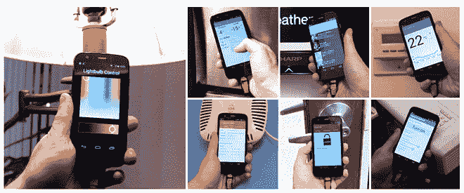
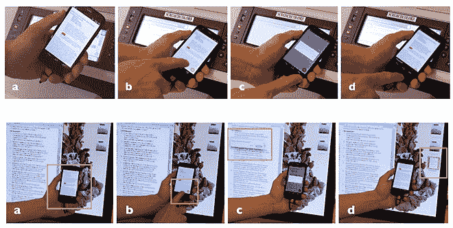
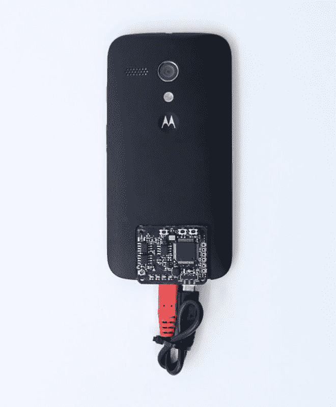

# 原型:用于物联网的智能手机通用遥控器

> 原文：<https://thenewstack.io/smartphone-prototype-acts-like-universal-remote-internet-things/>

我们许多人都听说过所谓的“智能家居”的警笛声，这些智能家居配备了智能电器，如智能手机控制的恒温器，可以让你在下班回家的路上打开空调，或者可以根据你的日常安排打开或关闭的应用程序调节的 led 照明，帮助你省钱和节能。据估计，到 2020 年，物联网上的各种智能设备将达到令人难以置信的 340 亿个。

但尽管大肆宣传，目前的现实是，用户在控制所有这些设备方面的体验是支离破碎的。不得不通过滑动来找到所讨论的设备的正确应用程序可能是令人沮丧和耗时的。此外，制造商在许多这些设备上安装全功能触摸屏并不划算，这意味着应用程序可能是唯一的出路。人们可以想象，当我们的家里充满了这样的设备时，这将变得多么乏味——滚动应用程序页面，只为了找到合适的应用程序——如果你能记住名称的话！

因此，难怪我们对这种智能手机的原型感兴趣，它的行为就像某种主遥控器。由卡耐基梅隆大学的[未来接口小组](http://www.figlab.com/)建造，它能够感应到哪种设备在附近，并将自动调出正确的应用程序以允许你控制它，而无需你手动滑动来找到它。

在上个月举行的计算机械协会人机交互大会上， [ACM CHI 2017，](https://chi2017.acm.org/)[电磁感应手机](http://chrisharrison.net/projects/emphone/EMPhone.pdf)使用了一种特殊的传感器，可以检测用户在设备上点击手机时每个智能设备发出的各种电磁信号。手机的微芯片使用[机器学习](/category/machine-learning/)来区分这些信号，并将这些电磁信号与手机上安装的相关应用程序进行匹配。观看它的运行:

[https://www.youtube.com/embed/eInfzdZ-9fE?feature=oembed](https://www.youtube.com/embed/eInfzdZ-9fE?feature=oembed)

视频

“一切都像是自己的微型电台——只不过它在厘米范围内广播，”[向 Fast.Co.Design 解释道](https://www.fastcodesign.com/90124584/did-this-experimental-smartphone-just-solve-one-of-the-biggest-problems-in-tech)人机交互助理教授和论文合著者[克里斯·哈里森](http://www.chrisharrison.net/)。

例如，用户可以在智能手机上点击恒温器来启动相关的应用程序，无论手机当前运行的是什么应用程序，应用程序都会出现在一个新的全屏上。

如果被触摸的设备没有关联的应用程序，但有一个开放的 API，那么手机也可以调用“上下文魅力”——或一个小工具，使当前智能手机应用程序执行设备特定的任务。人们可以在手机上阅读 PDF，然后将手机轻触打印机，方便地在屏幕上调出“打印”按钮，或者在有文本的计算机屏幕上轻触手机，调出“复制粘贴”按钮。charm 应用程序框架有几个预定义的动作，但是是可扩展的。

电磁感应手机可以调用制造商的专用应用程序来控制灯光、电视、温度、门锁、WiFi 等。

用于从移动电话打印 PDF 文档的上下文魅力(顶行)；用于从手机向桌面计算机“发送文档”的上下文魅力(底行)。

CMU 的研究人员将这些便捷的功能称为“即时触摸上下文功能”，这里的目标是绕过用户现在面临的“交互瓶颈”，使用一种更有效、更简化的解决方案，可以随着物联网设备数量的增长而轻松扩展。

哈里森说:“你可以用智能手机作为网关，而不是在你的房子里为每一个电器配备 50 个触摸屏。”“这是一个非常强大的概念。这不是灵丹妙药，但它让我们更接近智能手机，了解我周围的环境。这是一种比我们现在看到的更神奇、更强大的体验。”

电磁感应手机的最终原型，带集成 PCB。

具有类似目的的其他解决方案包括利用 RFID 标签、近场通信(NFC)、激光指示器、基准标签、手持投影仪和个人区域网络。但是这些方法的缺点是它们需要用额外的特殊标签和传感器来改装电器。

相比之下，电磁感应概念需要的干预要少得多，允许用户受益于“全栈”方法，该方法使用公共物联网 API 提供近乎通用的控制和跨设备交互。

> 手机的微芯片可以区分这些信号，并将这些电磁信号与手机上安装的相关应用程序进行匹配。

最重要的是，该原型在识别电器方面的准确性令人惊讶，因为研究人员发现，在识别十几个电器的不同电磁信号方面，准确率高达 98.8%。唯一的潜在问题是，手机无法区分两个或更多相同设备的电磁信号——例如，在拥有不止一台相同打印机的办公室环境中可能会出现这种情况。这是研究人员正在努力解决的问题。

为了让这个概念发挥作用，另一个重要的要求是制造商从一开始就使用开放 API，以便将来能够被广泛采用。在任何情况下，与智能设备进行无缝、流畅的交互体验的想法都非常诱人，用一种单一、通用的方式来控制这一切，至少是朝着更好地管理物联网迈出的一步。

图片:卡内基梅隆大学

<svg xmlns:xlink="http://www.w3.org/1999/xlink" viewBox="0 0 68 31" version="1.1"><title>Group</title> <desc>Created with Sketch.</desc></svg>