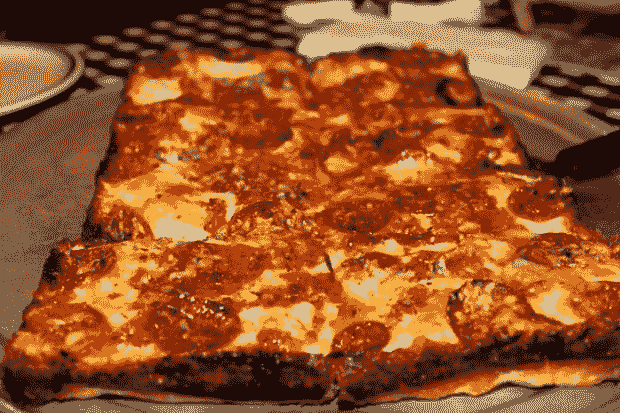
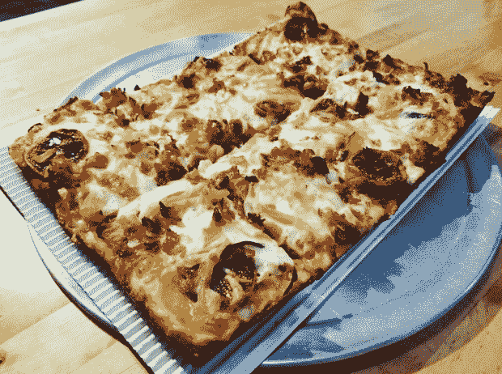
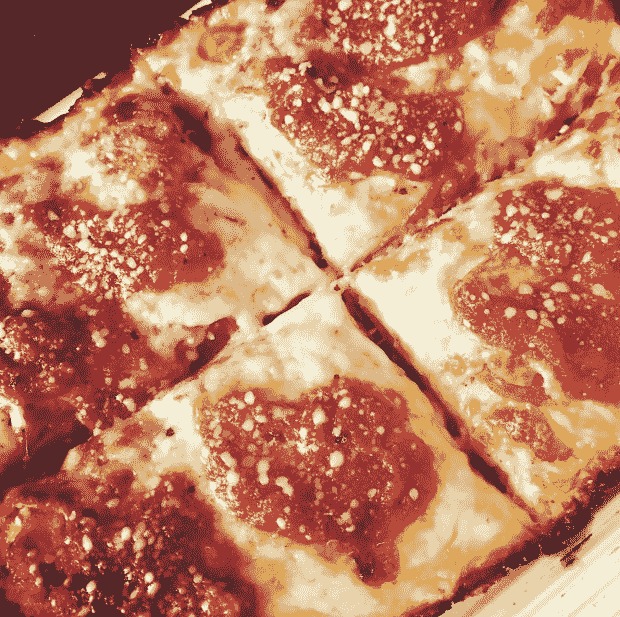

# 小吃栈:深入探索深菜底特律

> 原文：<https://thenewstack.io/snack-stack-a-deep-dive-into-deep-dish-detroit/>

比萨饼有三个普遍的和不可讨价还价的因素:外壳，酱料，浇头。这个神圣的三位一体中的每个成员都可以用许多不同的方式来执行，导致 lim(x→∞)个可能的饼图排列。

让我们停下来惊叹比萨饼是如何同时是有限的和无限的。现在，让我们把目光从这一大堆比萨饼中移开，来思考一种特殊的馅饼。兄弟姐妹们，今天我们聚在这里谈论底特律深盘。

## 这是乳清

乍一看，底特律风格的比萨饼是公认的西西里风格的比萨饼的后代:方形，厚面团，质朴的配料。但是事情变得…不一样了。真的不一样。

首先，底特律馅饼的浇头顺序颠倒了，将意大利辣香肠放入面团中，然后覆盖上奶酪。馅饼从烤箱中出来后，番茄酱会被裹在上面。

说到奶酪，这不是你标准的马苏里拉奶酪，而是威斯康星砖状奶酪(一种半硬的当地生产的牛奶奶酪，砖状奶酪得名于用来挤压乳清的传统砖块)。最后，经过双重醒发、双重拉伸的面团会产生一种黄油般松软的面包皮，与西西里风格的致密面包皮截然不同。

在一个深钢锅里一起烘烤，结果是一个令人惊讶的轻馅饼，松脆的外表，丰富的焦糖奶酪使边缘变得如此美味，以至于本地底特律人争夺角落切片。

底特律披萨的起源故事可以直接追溯到[巴迪的聚集地](https://www.buddyspizza.com/history-of-detroit-style-pizza)，这是一家位于科南特和六英里路拐角处的社区酒馆。

1946 年，Buddy's 的老板 Gus Guerra 决定在提供啤酒和锅炉的同时提供食物。他的西西里岳母提供了她的比萨饼面团配方，并且(传说中)一个在汽车城的一家汽车工厂工作的朋友给 Guerra 接上了一堆蓝色的钢制实用托盘，这些托盘用于在汽车组装过程中放置小零件。

真正的底特律披萨的著名特征——轻盈的方形外壳，松脆的奶酪边缘——来自这些不同寻常的深平底锅的厚钢，更像铸铁煎锅，而不是典型的披萨饼，披萨饼是在其中烘焙的。

## 试一试馅饼

### 巴迪的

巴迪的经典意大利辣香肠钢锅披萨，由巴迪披萨提供。

[巴迪的](https://www.buddyspizza.com/)已经扩展到密歇根州的多个地方，但在底特律人的头脑和心中，柯南特和六英里的最初位置经常被模仿，但从未被超越。

很传奇，平实简单。有很多配料可供选择，但大多数人都喜欢在原始的蓝色钢锅里烘焙的经典方形馅饼，上面有烧焦和卷曲的罗尼杯，完美的焦糖化砖奶酪，完美的番茄酱。

它并不在底特律市中心的 KubeCon Central 的隔壁，但是你可以让 legend [送货上门](https://order.buddyspizza.com/)。

巴迪的经典意大利辣香肠钢锅披萨，由巴迪披萨提供。

### 馅饼披萨

Pie-Sci 的无花果饼，由 Pie-Sci Pizza 提供。

当我在 313 个区号朋友中调查底特律独有的食物和不容错过的餐馆时， [Pie-Sci Pizza](https://piescipizza.com/) 是唯一一个出现在每个人推荐名单上的地方。它基本上是膳食 nerdvana:一个轮换的季节性菜单，由当地采购的原料制成，所有东西都是室内制作的，并提供无乳制品、纯素食和无麸质的选择。

据说这些披萨棒极了，从底特律经典披萨到花样繁多的披萨，比如无花果酱、马苏里拉奶酪、培根、焦糖洋葱、无花果片、蜂蜜毛毛雨，或者印第安纳琼斯和末日豆豉(蒜油、烤豆豉、黑豆、烤红薯、素食随心所欲马苏里拉奶酪、素食阿多博酸奶油毛毛雨)。

如果你赶时间，Pie-Sci 以其底特律风格的方形 boi 切片而闻名，既有肉食者也有素食者。进去拿一个，最多两分钟。

### 比萨宫

图片由比萨宫提供。

这家外卖广场披萨店位于底特律市中心的皇家橡树区，由肖恩·兰达佐(Shawn Randazzo)共同创办，他在与脑癌斗争后于 2020 年去世。Randazzo 在 2012 年拉斯维加斯国际披萨博览会上被评为年度世界披萨制作冠军，帮助底特律风格的披萨出名。

[Palazzo Di Pizza](https://www.palazzodipizzamenu.com/) 派是经典的底特律派，但有所改变:这种奶酪是传统砖状奶酪和马苏里拉奶酪的混合物，尽管上面仍有大量的红酱。真正的创新是“八角披萨”(！).还记得底特律人是如何争夺香脆的玉米片的吗？在 Palazzo di Pizza，他们将一个大披萨分成两个小披萨，以使脆皮一角的动作加倍，并保持餐桌的和平。

可悲的是，比萨宫只外卖，不送货；你可以在网上订购外卖或提前打电话取货。

<svg xmlns:xlink="http://www.w3.org/1999/xlink" viewBox="0 0 68 31" version="1.1"><title>Group</title> <desc>Created with Sketch.</desc></svg>