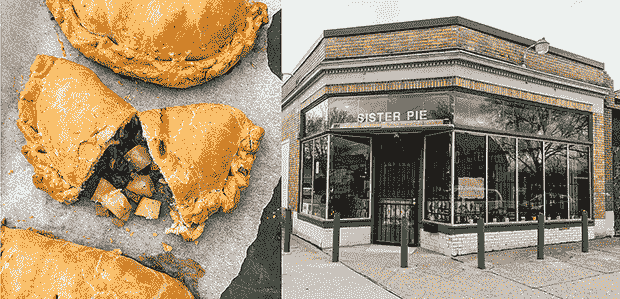
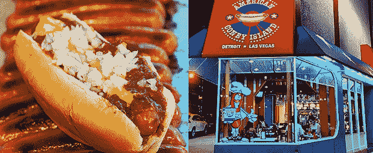
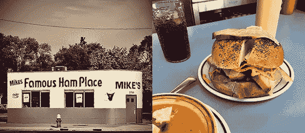

# 小吃栈:底特律最好的菜肴(第一部分)

> 原文：<https://thenewstack.io/snack-stack-detroits-best-dishes-part-1/>

在…里

[our monthly “Snack Stack” column](https://thenewstack.io/snack-stack-follow-the-hobbit-diet-for-good-health-really/) [Michelle Gienow](https://thenewstack.io/author/michelle_gienow/)

深入软件文化和美食文化的交汇点，有历史和奇闻、推荐、食谱和其他美食。在这里，她展望了 KubeCon+CloudNativeCon 北美和其主办城市底特律的饮食文化。

313 号房。汽车城。底特律摇滚城市。摩城。d 镇。老虎镇。戴-特瓦。世界汽车之都。美国希斯维尔。

不管你叫它什么，我真的很兴奋下个月要去底特律参加我第一次亲身体验 KubeCon。我也是一个勇敢的食客，所以这是我收集的关于只有在底特律才有的饮食机会的研究，我希望在我第一次访问这个城市时一定要享受这些机会。

## 手工馅饼

在底特律的时候，我最想吃的东西是:手工馅饼。

密歇根州的其他地方将这些薄片状、美味的馅饼称为“pasties”(发音为 PAH-stees)，通常它们由肉、土豆和洋葱填充，然后包裹在黄油外皮中，成为单手即可享用的美食。

它们在很大程度上是密歇根州的特色，起源于 19 世纪移居到上半岛的康沃尔定居者，他们在铁矿和铜矿工作，需要单手用餐来满足他们 12 小时的地下轮班。历史记载，矿工们在头灯的蜡烛上用挖掘铲加热他们的馅饼，但是今天你可以在从加油站到美食餐馆的任何地方找到这些传统的肉食。

然而，在底特律，馅饼被称为“手馅饼”，有甜的和咸的两种。因为我是大饼迷，所以到达汽车城后，我的计划是直接从机场前往大饼的妹妹 T1。被像 [Thrillist](https://www.thrillist.com/eat/nation/best-bakeries-in-america) 和 [Bon Appétit](https://www.bonappetit.com/restaurants-travel/article/sister-pie-detroit) 这样的出版物命名为全国最好的面包店之一，Sister Pie 著名的薄片面包皮每天都由手工新鲜制作，并使用当地采购的原料来展示密歇根州著名的农业资源。

斯科特·埃克斯雷在 Unsplash 上拍摄的手派照片，商店外景由派姐提供。

不过，在 KubeCon 附近，我也会去看看沃尔特·帕特的手馅饼。“季节性驱动的小批量黑人女性拥有的面包店”沃尔特·帕特的馅饼是中西部传统和南部影响的美味融合——就像底特律市本身一样，当你想到它的时候。

[Coffee Down Under](https://www.coffeedownunder.com/) 距离会议中心只有两个街区的路程，这里有 Walter Pat 的黄油糕点和该市最好的咖啡。

## 康尼狗

在底特律的时候一定要养些狗。令我惊讶的是，从自豪的底特律本地朋友那里得知，与普遍的看法相反，康尼岛热狗(被称为“康尼热狗”或简称“康尼”)并非起源于纽约。

有一个故事是这样的，希腊移民在去中西部的路上经过纽约，他们把康尼岛的名字改成了康尼岛，因为他们升级了康尼岛的内森店里流行的基本的裸狗面包。

康尼热狗是真正的下一个层次:天然肠衣中的全牛肉法兰克福香肠，依偎在柔软的馒头中，顶部是细磨的肉辣椒——绝不是豆类！—切丁的白洋葱和黄色芥末。(有趣的是，在纽约州的某些地方，康尼狗被称为“\_(ツ)_/”。

科尼狗归零地距离库比康的达林顿中心仅四个街区。两家并排的热狗店，[美国康尼岛](http://www.americanconeyisland.com/history.htm)和[老佛爷康尼岛](https://www.facebook.com/pages/category/Hot-Dog-Joint/Lafayette-Coney-Island-143071722397988/)，已经竞争了近一个世纪，都声称提供底特律最好的康尼热狗。

1917 年，希腊移民格斯特·克罗斯(Gust Keros)在底特律市中心的西拉斐特街(West Lafayette Street)开设了美国科尼岛。1924 年，当隔壁的空间开放时，他的兄弟威廉·克罗斯开了老佛爷康尼岛。(那年感恩节，事情可能有些紧张)。从那以后，每家公司都在同一个地点持续经营，底特律人可能会对哪家公司的科尼更好充满热情。

我的朋友告诉我，美国人提供天然肠衣的密歇根牛肉热狗，他们自制的辣椒更辣，而老佛爷提供的猪肉热狗配有更甜的巴伦西亚洋葱。无论哪种方式，当你点菜的时候，你都想要一份。

考虑到所有的事情，我会尝试美国科尼岛，因为它仍然是家庭拥有的，而且它是 24/7 开放的，提供赞助商聚会后的凌晨小吃。得提前计划这些事情。

照片由美国科尼岛提供。

## 火腿三明治

你可以在任何地方买到火腿三明治，但是火腿三明治店是底特律特有的。它们是底特律汽车城全盛时期的遗迹，是工人的午餐柜台，蓝领工人可以在回到汽车工厂之前快速廉价地吃点东西。

底特律火腿店也(通常)提供便宜的早餐和豆子或豌豆汤，但三明治是最受欢迎的。整只火腿都是自家烤的(这里没有加工过的火腿卷)，然后按照订单切成薄片，和一片瑞士奶酪以及一点点黄色芥末一起堆在枕头上。

火腿三明治店遍布底特律地区，它们的名字都很醒目:约翰尼·哈姆·金。火腿宫。就我个人而言，我希望挤上一辆 Lyft 车去[迈克著名的火腿店](https://www.facebook.com/mikesfamousham/)，提供“自 1974 年以来的无骨美味”

迈克的十几个座位的午餐柜台感觉像是来自另一个时代，菜单上正好提供四种食物。除了咖啡，其他的都有新切的火腿，而且是非常好的火腿。暗烤的焦糖外表，厚厚的切片，堆在一个柔软的膨化面包上，旁边是泡菜片，可爱的是，上面还有一个额外的火腿片。

照片由迈克著名的火腿店提供。

## 妈妈的意大利面

[https://www.youtube.com/embed/Q4JCbKDQsks](https://www.youtube.com/embed/Q4JCbKDQsks)

视频

好吧，所以你可以在地球上的任何一个城市吃意大利面，但是只有在底特律，你才能在土生土长的超级说唱歌手阿姆自己的餐馆里吃到，他的餐馆是以[的歌曲《迷失自我》中的那句著名的台词命名的](https://youtu.be/_Yhyp-_hX2s)

[妈妈的意大利面](https://www.momsspaghetti.com/)2017 年首次出现在底特律的弹出式商店，此后成为阿姆音乐节表演的固定节目。妈妈的意大利面的第一个永久地点基本上是 Comerica Park 棒球场附近的一个步行窗口，距离 KubeCon 的活动现场亨廷顿广场正好一英里，或者大约 20 分钟的步行路程。

据住在 313 的熟人说，妈妈的意大利面似乎主要是一个旅游景点，也就是说，当地人并不真的在那里吃饭。可能是因为这家店只能立即出售外卖面食，因为面条是预先煮好的，然后用酱汁快速油炸。“这基本上就像你在家里用罐子做的意大利面条，如果你喝醉了，味道可能最好，”一位朋友说。

他们还承认，S'Getti 三明治(11 美元)——两片黄油白面包之间夹着一堆渗出西红柿的意大利面——是“一种奇怪的令人信服的碳水化合物炸弹。”就我个人而言，我很高兴妈妈的意大利面存在，我也是一个[【8 英里】](https://www.youtube.com/watch?v=axGVrfwm9L4)粉丝，但我不太可能有时间去住宅区吃油炸面。我会忙着吃我囤积的手馅饼。

<svg xmlns:xlink="http://www.w3.org/1999/xlink" viewBox="0 0 68 31" version="1.1"><title>Group</title> <desc>Created with Sketch.</desc></svg>