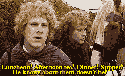

# 零食堆:遵循霍比特人的饮食，保持健康。真的。

> 原文：<https://thenewstack.io/snack-stack-follow-the-hobbit-diet-for-good-health-really/>

在我们每月的“零食栈”专栏中，

[Michelle Gienow](https://thenewstack.io/author/michelle_gienow/)

深入软件文化和美食文化的交汇点，有历史和奇闻、推荐、食谱和其他美食。

我不知道你们怎么想，但是现在的十年感觉就像是天启的四匹马带给我们的:战争！瘟疫！气候变化！贝蒂·怀特死了！

如今，这个世界是一个尖锐、愤怒、势不可挡的地方，所有迹象都表明“前景不太好”

很明显，对于 20 世纪 20 年代这场持续不断的灾难，唯一合理的反应就是变成一个霍比特人。

好吧，也许不是霍比特人的衣柜，但听我说:尤其是在科技世界，我们被最后期限和吉拉门票、单口相声和 SLA 所困扰。我们过度关注生活的工作方面，而忽略了生活的生活方面。

霍比特人幸福地意识到这一切。相反，他们的一天集中在每天六餐，全天麦芽酒，和高品质的海龙草。他们非常重视物质享受和生活中简单的快乐——尤其是那些与食物有关的。

一整天六顿饭和啤酒？帮我报名。

虽然这种生活方式听起来像是病态肥胖的快车，但不知何故，霍比特人能够享受六倍的每日膳食安排，同时保持合理健康的 BMI。虽然他们绝对是丰腴的，但他们很少肥胖，不知何故能够保持健康的体重，同时不仅吃早餐、午餐和晚餐，还吃第二份早餐、11 份午餐、午餐、下午茶和晚餐，同时享受霍比特人 100 岁的平均寿命。

> 他们笑啊，吃啊，喝啊，经常尽情地，总是喜欢简单的玩笑，一天吃六顿饭(如果他们能吃到的话)

——《指环王》的前奏，《关于霍比特人》

## 霍比特人饮食的三个因素

他们是如何应对这一明显的奇迹的？我认为有三个因素:

1.  “放牧”方式。一天中少吃、多吃、有计划地进餐，而不是三顿大餐，已经被证明是保持健康体重的可持续方式。
2.  积极的生活方式。哈比人不是坐办公室的。他们“热爱和平、宁静和肥沃的土地:秩序井然、耕作良好的乡村是他们最喜欢去的地方。他们不理解也不喜欢比锻造风箱、水车或手摇织布机更复杂的机器。”所有这些体力劳动显然有助于消耗掉最后一餐，同时增加下一餐的食欲。
3.  快乐。享受与朋友和家人围坐在一起的友谊和友情，就像享受食物一样。这不是简单的摄入卡路里然后回去工作。这是关于谈笑风生(显然，并不罕见，在餐桌上跳舞)。

我真的相信霍比特人在这里找到了一些东西，作为人类霍比特人，我们可以跟随他们的领导走向更快乐，更轻松，甚至更长寿的生活。你必须自己想出这个节目中快乐和体力活动部分的解决方案，但是我确实有一些关于吃的有用的想法。

对于任何一个吃货来说，霍比特人的餐桌都是(中土)人间的天堂。丰满、金黄的烤鸡，松软的新鲜出炉的面包，整轮的奶酪——霍比特人的食物保证是新鲜和当地的。

这并不奇怪，考虑到当他们不在餐桌旁或斜靠在树下吹烟圈时，书籍和电影向我们展示了大多数哈比人花时间园艺和耕作，酿造和烘焙，或以其他方式制作所有美味的一切。

因此，他们可以在方圆 50 里内买到几乎任何种类的水果、蔬菜、奶制品或肉制品(是的，我查过夏尔的地图)。霍比特人有新鲜的，本地的，从农场到餐桌的东西。

## 霍比特人的用餐时间表

那么什么时候吃什么呢？霍比特人的日常膳食，在意识到阿拉贡不会停下来吃第二顿早餐，因为新生的联盟在纳兹戈尔之前匆匆穿过山丘后，心烦意乱的皮聘很快列出来，可以分解为以下的时间表。

### 早餐(早上 7 点)

[阿尔顿·布朗隔夜燕麦片](https://www.foodnetwork.com/recipes/alton-brown/overnight-oatmeal-recipe-1939324)是健康的，但如此豪华和令人满意，以至于你内心的霍比特人会因早餐快乐而雀跃。这是我吃过的最好的燕麦片。蔓越莓干和无花果使它自然变甜，钢切燕麦片为你在[微服务](https://thenewstack.io/category/microservices/)的矿井中的一天劳动奠定了缓慢燃烧的全谷物碳水化合物基础。

最棒的是，你可以在头天晚上把所有的东西都放进慢炖锅里，这样你就可以在醒来享用美味的第一餐之前多睡一会儿。(记住:适量食用，后面还有六个。佛罗多，你得慢慢来。

### 第二份早餐(上午 9 点)

在第一份早餐的复杂碳水化合物负荷后，第二份早餐是关于蛋白质的。在《指环王》中，霍比特人准备煎第二份培根早餐，当然，你绝对不会错过培根。哈比人还擅长用剩菜或主食制作新的食物——冷切片鸡肉、奶酪、鸡蛋、泡菜、覆盆子果酱和种子蛋糕等耐储存的烘焙食品。

然而，如果第二次早餐时间发现你在办公桌前，不在储藏室，随身携带的蛋白质可能包括煮鸡蛋、奶酪块或片、一把杏仁、一些酸奶或蛋白质奶昔。

### 十一时(上午 11 时)

Elevenses 只是帮你撑过午餐的点心。在霍比屯，这将是一个司康饼，或者一些涂有黄油和蜂蜜的面包，以及一杯茶。

我的版本是我能得到的任何烘焙食品，最理想的是这些自制的[亚瑟王牵牛花松饼](https://www.kingarthurbaking.com/recipes/morning-glory-muffins-recipe)(烘焙后，我将它们单独冷冻，在 10:59 准时放入烤箱)和第三杯咖啡。托尔金从来没有在任何广泛的中土世界正典中提到过 java，但我猜霍比特人会是咖啡的忠实粉丝。尤其是加了很多奶油的。

### 午餐(下午 1 点)

“土豆是什么？”困惑的咕鲁问山姆。“Poh-Tay-Toes！煮了它们，捣碎它们，把它们放在炖肉里！”或者，在我们这里，[慢炖汤](https://www.thespiffycookie.com/2016/02/17/slow-cooker-potato-soup/)。

无论是凝视着魔多的荒原还是周三下午，这汤都会给你旅途的力量。提供新鲜切碎的细香葱、碎培根和切达干酪，再加上一卷种子面包来吸收最后一点。

### 下午茶(下午 4 点)

午后提神的甜点。这些[游侠饼干](http://lotrscrapbook.bookloaf.net/other/recipes.html#32)味道鲜美，制作简单。有趣的是，你用一个单杯量杯来测量配料，因为 Strider 必须轻装上阵，他的包里根本没有空间放一堆厨具。

### 晚餐(下午 6 点)

该吃一天中最丰盛的一餐了。巴林的五香烤牛肉是一种用胡萝卜、洋葱，当然还有大量的波泰脚趾做成的炖牛肉，即使是最乖戾的矮人也会喜欢。

农夫蛆的妻子在山姆、佛罗多和皮聘去巴克利伯里渡口的路上无意中闯入那里后，给他们做了一道美味的农家馅饼。不管餐桌上有什么，如果你还没准备好，现在是时候拿出啤酒罐了。

### 奖金:晚餐(晚上 8 点)

这个是可选的。在 LOTR 的书中，晚餐和夜宵可以互换作为晚餐。然而，在电影版的《指环王》中，他们被称为两次单独的用餐。我有什么资格拒绝第七餐的理由，我的哈比同胞们？

晚餐可以(也可能应该)比正餐清淡，似乎是[美食委员会](https://www.youtube.com/watch?v=WACvLlxn8Zc)的绝佳机会。霍比特人基本上发明了熟食板，因为它们都是关于奶酪，香肠，腌渍的东西，甜的和咸的蜜饯，当然还有更硬的面包。考虑加入方便食用的切片水果和葡萄，或者像朝鲜蓟心、橄榄或蔬菜这样的素食小吃。

<svg xmlns:xlink="http://www.w3.org/1999/xlink" viewBox="0 0 68 31" version="1.1"><title>Group</title> <desc>Created with Sketch.</desc></svg>