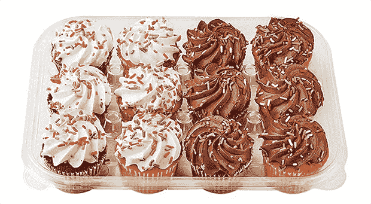

# 点心栈:如果编程语言是甜点...

> 原文：<https://thenewstack.io/snack-stack-if-programming-languages-were-desserts/>

观点:你被邀请参加一个假日社交聚会。这是家常便饭，你的任务是贡献一份自制甜点。

**冲突:**你不知道该做什么。你是程序员，不是厨师！

**解析:**怪胎不算，朋友。简单地向下滚动这个便利的[编程语言](https://thenewstack.io/a-conversation-with-the-creators-behind-python-java-typescript-and-perl/)列表，找到你主要使用的语言(或者，见鬼，你希望使用的语言；我们不会告诉)来确定完美的假日家常便饭供应。

## 列车员:更多

如果你主要是用 C 语言编程，那么 s'mores 就是你的家常便饭。S'mores 远不是最实用的派对小吃，因为它们需要非常特殊的条件才能完成——毕竟，烤棉花糖需要明火——而且实际上你一次只能准备一个。

同样的，C 要求很高(有无数的语法要求)；执行起来有点棘手(C 源代码只要一个错误就会导致终端上多几个)；多线程不是一个东西。

图片由喷射膨化棉花糖提供。

尽管如此，当你觉得需要回归基础时，你会发现自己又回到了 C 调。像 s'mores 一样，C 总是在紧要关头发挥作用，带回你青春时代的美好回忆。

## C++:米饼点心

[米饼点心](https://www.ricekrispies.com/en_US/recipes/the-original-treats-recipe.html)是 s'mores 的逻辑延伸:同样的棉花糖基础，但更容易在大批量生产中执行。也更便于携带，你可以很快地组装一批，比如在聚会前一小时。同样，C++比它的前身更容易编译，在需要高速度和并发性的情况下也很有用。

图片由凯洛格麦片提供。

**专业提示:**正如 C++包含许多“footguns”(很想包含的功能，但很可能会在以后击中你的脚)，通过加入一些额外的东西，如糖粉或巧克力片或喜庆的红色和绿色小熊软糖，很容易使基本的米饼食谱变得有趣。抵制诱惑。这些经典作品最好以其纯净、原始的形式被消费。

## 去:怪物饼干

让 Go 真正发光的是它的效率；它能够同时执行几个进程。Golang 还拥有丰富的“词汇”，这意味着它可以显示比其他语言更多的信息，并且 Go 的结构化类型功能允许大量的功能和动态性。

图片由贝蒂·克罗克提供。

这些特点就是为什么[怪物饼干](https://www.justataste.com/re-post-monster-cookies/)是可食用的围棋等价物。怪物饼干基本上是一种花生酱燕麦饼干(奖励:这使它们天然无麸质)，你可以选择混合。这些可以是你喜欢的任何东西——巧克力片和 M & M 糖果是标准的，但是任何东西都是真的。

基础饼干本身的密度和耐嚼性令人满意，而且每次都很可靠。但它也可以根据您选择融入的任何其他美味珍闻进行灵活扩展，使最终产品既难以弄糟，又真正属于您自己。

## 爪哇:一盒巧克力

我听说过 [Java](https://thenewstack.io/java-adapts-to-cloud-native-computing/) 被描述为“许多事情的好工具，但不是任何事情的最佳工具”，这几乎说明了一切。对于 Java 做的每一件特定的事情，几乎肯定有另一种语言做得更好，但是那种语言做的其他事情肯定不如 Java。

这是一个巧妙的技巧，Java 的真正成就是在几乎所有方面都足够好的同时，在任何方面都不出众。

图片由 Godiva Chocolatier 提供。

这就是为什么一盒混合巧克力——盒盖上有地图的那种，这样你就可以优先选择黑巧克力海盐焦糖，避免那些奇怪的果冻夹心巧克力——是完美的家常甜点。每个人都会原谅你的贡献不是自制的，因为像 Java 一样，每个人都有适合自己的东西，它总能完成任务。

## JavaScript:你在抖音找到的食谱

哪个真的不重要。因为不管你做了什么，派对上所有其他的[JS](https://thenewstack.io/brendan-eich-on-creating-javascript-in-10-days-and-what-hed-do-differently-today/)dev 都会站在一边争论如果你用 [Typescript 做出来会有多好。](https://thenewstack.io/typescript-vs-javascript/)

图片由迪伦·霍利斯提供。

## 水果蛋糕

水果蛋糕是一种经典的甜点，从古代就有了；Lisp 是目前仍在广泛使用的第二古老的编程语言，仅比 Fortran 和 T11 年轻一岁。

尽管如此，每个新一代的一些程序员发现了 Lisp，并致力于其神秘的方式，水果蛋糕仍然在每年 12 月出售，因为有一小部分铁杆人口大声宣布它是唯一真正的节日甜点。

图片由艾伦伯格面包店提供。

Lisp 是假日甜点自助餐的水果蛋糕，因为很少有人真正尝试过它，而且大多数人也没有真正想要这样做。但是爱它的人真的真的爱它。

## Perl:不可思议的分子美食学…东西

今天的 Perl 程序员和真正喜欢健壮的正则表达式的人是同一批人。是的，Linux 内核是 Perl，但是[甚至 Linux 现在也在 Rust 中构建新的特性。人们会看着你的甜点，但完全不知道发生了什么。他们不敢碰它。](https://thenewstack.io/rust-in-the-linux-kernel/)

## PHP:预制饼干面团

[PHP](https://thenewstack.io/php-has-survived-for-26-years-because-it-keeps-evolving/) 是一门你不得不使用的语言，而不是你想使用的语言。因为它是支撑 WordPress 的语言，所以它很受初学者和不懂的人的欢迎。然后，当事情不可避免地出现可怕的错误时，我们其余的人就会被叫来清理这个意大利面条式的代码噩梦。

这就是为什么 PHP 对假日自助餐的恰当贡献是那些松松垮垮、平淡无奇的[“用圣诞树放置并烘烤”饼干](https://www.pillsbury.com/products/cookies/holiday-shape-cookies/christmas-tree)。根据包装，没有混合和测量——只是美味的饼干面团准备在烤箱里烘烤。如果你不想烘焙，就直接从包装中取出饼干面团吃吧！在聚会上，你把你的食物放在自助餐桌上，希望没有人会注意到，然后迅速离开。

图片由皮尔斯伯里提供。

然而，在所有其他更好的食物被挑选出来之后，每个人都喝了几杯酒，他们回来只是为了再吃一份快餐…还有 PHP 在等着。晚上结束的时候，你的盘子是空的。正如你所知。

## 杂货店纸杯蛋糕

[Python](https://thenewstack.io/an-introduction-to-python-for-non-programmers/) 程序员是实用主义者。他们喜欢它作为一种通用编程语言，它功能多样，易于驱动，并带有许多内置的便利。他们不在乎 Python 不够快或不够性感，因为，让我们面对现实吧，我们大多数人花钱开发的大多数应用程序也是如此。然而，不知何故，Python 也出现在过去五年里 Stack Overflow 的“最想学的”语言的榜首。

图片由威格曼食品市场提供。

这就是为什么对于 Python 程序员来说，带去节日聚餐的完美甜点是杂货店的纸杯蛋糕。所需要的只是快速浏览超市的面包店和一些快速的数学运算(ndozen=nguests/12)。这是一个实用、高效、受欢迎的选择，当然，在其他参加派对的人狼吞虎咽地吃完后，你肯定会回收这些容器。

## 铁锈:果冻摇摆器

[Rust](https://thenewstack.io/adoption-of-rust-whos-using-it-and-how/)-Stack Overflow 的[连续第七年最受欢迎的编程语言](https://survey.stackoverflow.co/2022/#technology-most-loved-dreaded-and-wanted)-是一种挑战你的先入之见并迫使你重新评估所有你认为正确的语言。Rust 具有其他编程语言中没有的独特概念，如所有权和借贷，这些概念偶尔会让你的大脑颤抖。这就是为什么完美的 Rust 程序员假日家常甜点是[果冻软糖！](https://www.food.com/recipe/jell-o-jigglers-84471)

图片由卡夫食品提供。

这不仅仅是甜点，它甚至是一个教育机会:向你的派对伙伴介绍[安全与不安全生锈](https://doc.rust-lang.org/nomicon/meet-safe-and-unsafe.html)的概念，让他们一半是普通的，另一半是 190 度的超清晰合唱团，让他们弄清楚哪个是哪个。哦，你们将一起创造的回忆！

## SQL:巧克力饼干

每个人都会很高兴在这个派对上遇到一大盘自制的巧克力饼干。“哦！”他们会带着黎明的喜悦说。"我喜欢这些，但已经很久没吃了！"每个人都会问你要食谱(尽管他们也会偷偷用餐巾纸包一叠饼干，然后放在口袋里以备后用)。

图片由亚瑟王面粉提供。

就像自制的巧克力饼干一样， [SQL](https://thenewstack.io/sql-is-dead-right/) 只是让世界变得更美好。我绝对不想生活在这样一个世界里:我必须编写过程代码来做 SQL 毫不费力就能做的事情。说真的！

机器学习和人工智能是每个人都想谈论的话题，但事实是，在 75%的情况下，一个写得恰当的 SQL 查询，可能用一个紧凑的 Bash 脚本和一个战略性的 [cron](https://thenewstack.io/tutorial-linux-task-scheduling-and-automation-with-cron/) job 整齐地包装在一张餐巾纸中，是一个藏在口袋里的工具，为你以后的生活带来一些简单的快乐。

## Wasm:一次性盘子和餐具

好的，是的，所以 [WebAssembly (Wasm)](https://thenewstack.io/what-is-webassembly/) 实际上并不是一种编程语言，而是其他语言的编译目标，允许服务器端代码被编译成 Wasm，以便在浏览器中执行。理论上，这将重型任务的性能提升到了一个新的水平，允许任何人编写机器代码在浏览器[(或者越来越多地，在浏览器之外)的安全虚拟沙箱中运行。](https://thenewstack.io/the-latest-milestones-on-webassemblys-road-to-maturity/)

图片由蓝色熊猫提供。

这就是为什么一次性盘子，叉子等。对于一路滚动到列表末尾寻找 Wasm 的爱好者来说，是完美的假日家常便饭。是的，你应该带甜点，但是没人介意——毕竟，你的贡献让所有的 Rust/Python/C++/JS 产品变得容易和有效。

<svg xmlns:xlink="http://www.w3.org/1999/xlink" viewBox="0 0 68 31" version="1.1"><title>Group</title> <desc>Created with Sketch.</desc></svg>