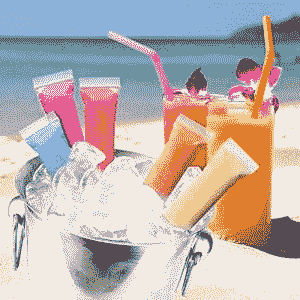

# 零食栈:程序员的冰棍

> 原文：<https://thenewstack.io/snack-stack-popsicles-for-programmers/>

在我们每月的“零食栈”专栏中，

[Michelle Gienow](https://thenewstack.io/author/michelle_gienow/)

深入软件文化和美食文化的交汇点，有历史和奇闻、推荐、食谱和其他美食。编者按:这篇文章包含涉及酒精饮料的食谱。

## 冰棍？

对极了冰棍。

不管你小时候叫它们什么——冰冻汽水、冰巧克力、帕莱塔斯、冰棍——我们都要自己动手做一些冰冻的乐趣。冰棍，只会更好。因为我们的里面会有酒。和咖啡因。还有糖果。成人冰棍。

## 冰棒学

 [米歇尔·吉诺

前端开发人员，以前在 Container Solutions 和 Gatsby 工作，现在在蟑螂实验室从事分布式 SQL。我喜欢游戏、我的狗和食物。来自 O'Reilly Media 的《云原生转型:创新的实用模式》的合著者。](https://github.com/mgienow/) 

在家制作烈酒冰棒是夏天的全部。它们很便宜，可以无限定制，是终极的隐形零食:你可以在街上漫步或穿过公园，在户外音乐会或电影中懒洋洋地躺在草地上，享受美味的高辛烷值食物，没有人会看你一眼。

不幸的是，这并不像把你最喜欢的成人饮料倒进冰棒模具那么简单。那会给你带来一团烂泥，而不是可以吃的固体食物。这是因为水在 32°F 结冰，而 100%纯乙醇在-173°F 左右结冰。你最喜欢的酒的冰点会在这个范围内，这取决于它的证明。这就是为什么我可以把一瓶伏特加(90 度，或 45%的酒精)放在冰箱里没问题，但当我在晚餐前把一瓶上好的桃红葡萄酒(11%的酒精)放在冰箱里以加速冷冻，然后忘记它，嗯，我只是不再使用冰箱的那一部分了。

你最喜欢的鸡尾酒冻结成冰沙的原因是，在冻结过程中，饮料中的非酒精液体首先冻结，并在此过程中与酒精分离，这就是为什么会产生颗粒状思乐冰质地。(这本身也是令人愉快的，如果你想走这条路，你可以停止在这里阅读，去冰箱里找些多汁的烈酒。不过，冷冻的时间要长得多——24 小时比 3 到 4 小时。

然而，如果你想让你的酒精饮料冻结成一种固体的可吸收的“固体”,你需要调整你的混合物的酒精体积比(abv ),直到其他液体在这个过程中冻结并固化酒精，最终达到一种光滑均匀的状态。

## 神奇的比率

作为一个经验法则，成功的酒精冰棒(姑且称之为 poptails，冰棒+鸡尾酒的组合)的最佳途径是在你的酒精组合中加入 5-10%的酒精浓度。本指南假设你的酒在 80-90 度范围内(40-45% abv)，这意味着你希望酒和非酒精的比例为 1:5。比率中的“1”部分是一个常数，但“5”部分可以是你想要分配的任何变量:果汁、奶油、咖啡、能量饮料——实际上任何东西都可以。

也就是说，在一个 6 盎司的伏特加柠檬水汽水中，有 1 盎司的酒和 5 盎司的非酒精液体。然后简单地用你想要填充的冰棒模具的数量乘以它们的体积。

警告:酒精含量较高的冰棍可能仍然会结冰，但它们也会融化得更快，因为它们变回液体的温度更低。例如，当温度仅上升 9 度时，20% abv 的冷冻 poptail 就会变成融化的一团。然而，5% abv 的 poptail 通常会保持其形状，直到温度上升 26 度，给你更多的时间来吃它。

所以 TL；博士，你可以尝试用更高的酒精含量来增加冰棒的酒精含量，但是你可能不应该在吃的时候穿着你最喜欢的衬衫。

## 如何制作烈酒冰棍

制作冰棒非常简单:选择你的酒精和搅拌器，以适当的比例测量，混合，倒入冰棒模具冷冻，等待一段时间，享受。

实际上，你可以自己动手做模具。只有两个组成部分:容器，当它冻结时用来盛放和塑造混合物，以及棍子，当你啜饮时用来盛放混合物。经典的幼儿园手工活动——在纸杯里装满果汁，在纸杯上拉伸保鲜膜，用牙签穿过保鲜膜插入每个纸杯的中心——完全有效。你肯定在什么地方有一些杯子，还有一抽屉从亚洲外卖店买来的从未用过的一次性筷子，还有一些锡纸或保鲜膜。

沙滩上的青蛙！

不过，最简单的方法是买一些冰棒模具。我以前只在杂货店花一两美元买便宜的，但最近我升级到了[奥泽拉高级冰棒模具](https://www.amazon.com/dp/B01GDXHSZ2)(一套六个 9.95 美元)。不粘聚丙烯模具是经典的冰棒形状，让冰棒很容易滑出来，但冷冻的零食可以很好地粘附在脊状的可重复使用的棍子上(当你吃冰棒时，这些棍子是凹形的，可以接住水滴)。Ozera 模具每支容量为 96 毫升，这意味着每根冰棒需要 16 毫升酒精和 80 毫升搅拌器。

不过，我最新痴迷的东西是[蛙跳](https://www.amazon.com/Disposable-Popsicle-Freezer-Healthy-Smoothies/dp/B01MDUDWHH/)(125 个售价 12.95 美元)。想想瘦高的 ziploc 冷冻袋吧，因为它们就是这样。从本质上说，FroZips 可以让你制作自己的成人冷冻汽水。优点是便携性；因为它们在食用前是密封的，所以你可以把它们扔进冷藏箱里，不用担心会泄漏或翻倒。FroZips 可以容纳 100 毫升(3.4 盎司)的液体，因此 17 毫升酒精和 83 毫升混合物的比例可以达到 5:1 的最佳比例。

现在是我们期待已久的时刻:食谱！

## 程序员冰棍

可能的 poptail 口味的数量实际上是无限的，但是无论你想出什么疯狂的组合，组装和冷冻它们的过程都是一样的。

**万能冰棍指令**

1.  **混合**:选择你的食谱。将所有原料放入碗中搅拌，最好是有倾倒口的碗。
2.  **填充:**将你的冰棒模具或冷冻拉链袋填充到填充线——不要装得太满，因为液体冻结时体积会膨胀，你的模具会溢出。FroZips 带有一个漂亮的小漏斗，使这变得更容易。
3.  冷冻:确保你把冰棍直立着冷冻。大多数模具都带有支架。你需要把冷冻拉链垂直放在塑料桶或塑料杯里，直到它们完全冷冻，然后你可以把它们平放。

如果冰棒是编程语言，这里是它们应该包含的内容。数量是单根冰棒或冰柜汽水的数量；相乘得到你想要的份数。

**THE JAVA:** 这款柠檬水+伏特加的冰棍是一款结实的老爷车。基本的，不花哨也不刺激，甚至可能不是你的首选，但它总能完成任务。

*   **柠檬水:** 5 杯/20 液体盎司/500 毫升你选的柠檬水(我很喜欢乔氏冷冻柠檬水浓缩液，因为它是用糖而不是玉米糖浆做的。融化后加入比包装上说明的量少一点的水就可以了)
*   **伏特加:** 5 杯/4 液盎司/125ml 你最喜欢的伏特加。记住，你想要 80-90 度左右的东西。

**PYTHON:**加载一堆不同的库成分，然后调用它完成。或者玛格丽塔。你的选择。

*   1 盎司龙舌兰酒
*   1 盎司新鲜酸橙汁(不要在绿色塑料酸橙汁中使用电池酸)
*   1 盎司橙汁
*   1 盎司冷冻酸橙浓缩物，解冻
*   2 盎司水

**JAVASCRIPT:**因为真的，有人知道`this`是什么吗？

*   1 罐红牛(8.4 盎司)。倒入玻璃杯中，静置直到它变平。
*   同时，把一把小熊软糖泡在某种酒里。哪种并不重要。不管你有什么。
*   在每个冰棒模具里放几个小熊软糖。将压扁的红牛与 2 盎司小熊软糖浸泡液混合。倒入小熊软糖上面的模子里。希望有用。

**WASM:**二进制便携。

*   1 盎司波旁威士忌(我不会用这里的好东西，但你会用)
*   4 盎司墨西哥可口可乐(打开，倒入玻璃杯，静置直到不再有气泡冒出)

**成功人士:**表现出色且固执己见。

*   6 盎司冷煮咖啡浓缩物
*   3 盎司冷水
*   2 盎司甜炼乳
*   2 盎司卡鲁阿，贝利的，或其他咖啡口味的利口酒(这些是较低的 abv，所以你可以使用较高的比例)

让我们继续前进！不过，我需要你的帮助:Rust 程序员。口齿不清。我的 C/C#成员。二郎。露比。PHP。如果你是一根喝醉的冰棍，你会尝起来是什么味道？

*每月专栏“[零食栈](https://thenewstack.io/tns-eats-tapas-for-valencia-and-beyond/)”将从软件开发人员的角度探索美食世界。每个月， [Michelle Gienow](https://www.baltimoresun.com/) 将深入软件文化和美食文化的交汇点，提供历史和奇特之处、推荐、食谱和其他美食。*

*披露:这篇文章的作者是蟑螂实验室的一名员工，该实验室获得了新 Stack 母公司 Insight Partners 的资助。*

<svg xmlns:xlink="http://www.w3.org/1999/xlink" viewBox="0 0 68 31" version="1.1"><title>Group</title> <desc>Created with Sketch.</desc></svg>