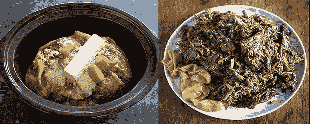
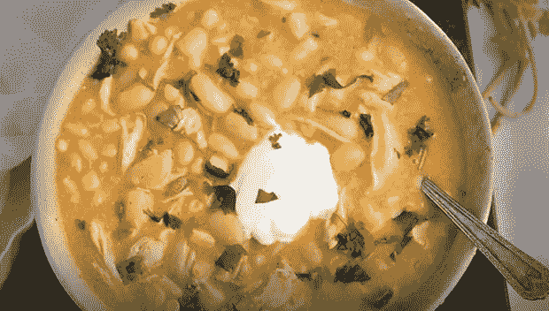
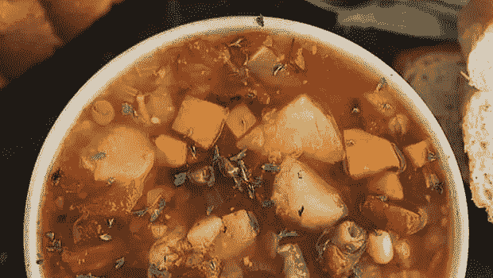

# 零食栈:把冬季舒适食品提高到 11

> 原文：<https://thenewstack.io/snack-stack-slow-cooker-comfort-food-for-busy-developers-and-engineers/>

科技生活有很多好处。连帽衫作为标准的办公室着装，大量的免费含咖啡因的饮料，大部分时间被独自留在办公室工作，等等。然而，随之而来的主要不利因素是[频繁变化的工作时间、](https://thenewstack.io/the-future-of-flexible-work-in-the-tech-industry/)和[大量的](https://thenewstack.io/improve-developer-experience-to-prevent-burnout/)。

bug 没有时间或操作时间的概念——仔细想想，用户/客户也没有——所以当一些重要的东西坏了，笔记本电脑会一直开着，直到它被修复。

最好是在下一张深红色的吉拉门票到来时保持良好的营养，这意味着不仅仅是从最近的休息区捡回来的免费零食。但是谁有时间做饭呢？

这就是为什么慢炖锅是理想的情感支持烹饪用具。配料放进锅里，按下按钮，几个小时后，相当健康的美味就可以狼吞虎咽了。至少理论上是这样。

唯一的缺点是，可悲的是，很高比例的 crockpot 食谱制作出的食物，嗯，令人失望——不管食谱承诺的多么简单、万无一失和完美美味。即使是 Sriracha，这位不可思议的美味救世主，也只能帮到这么多。

在过去的几年里，我记录了很多慢炖锅实验，在沉闷的垃圾中寻找烹饪钻石，这样你就不必浪费时间了。这里有三个我冬季必备的慢炖锅，只需要最基本的烹饪技巧:

*   **密西西比烤肉。**这是一道经典的南方慢炖锅，出发几个小时，回到家就是美味佳肴。起初，这些成分可能听起来有点奇怪，但无论是谁，首先想到将一根黄油，一包牧场调料混合物和一罐胡椒与恰克烤肉结合起来，但结果是舒适的食物天堂。
*   **白鸡辣椒。我自己用一整天的时间和一个装满调料的橱柜制作了一个著名的辣椒烹饪冠军食谱。(我应该知道，因为我做过很多很多次全天版。)这几乎一样好，而且更快、更容易制作。**
*   **速度与激情蔬菜汤。与其说这是一个严格的食谱，不如说是一个公式，可以无限地定制你最喜欢的蔬菜(或者避免你讨厌的蔬菜)。这不是一个懒惰的周日厨师的汤；由于冷冻混合蔬菜和节省时间的杂货店农产品区的预切蔬菜，这一切来得又快又快。如果可以的话，一定要用火烤番茄，尽管普通的罐装番茄丁也不错。**

## 密西西比烤肉

不要害怕吃意大利辣香肠，即使你通常不吃辣的东西。它们的味道神奇地融入到烤肉中，作为一种与丰富性的对比，最终的结果是一点也不辣。

放在黄油鸡蛋面、土豆泥上，或者放在你最喜欢的三明治卷上。

**配料:**

1 (3 磅)烤肉

(12 盎司)罐完整的意大利胡椒(腌香蕉辣椒作为替代品)

(12 盎司)罐胡椒汁

棒状黄油

1 (1 盎司)包 au jus 肉汁混合酱

1 (0.4 盎司)包酪乳牧场调料混合物

**可选:**
切碎的意大利欧芹，作为配菜，如果你正在做可选的肉汁步骤，当食用
玉米淀粉时(强烈推荐)

**说明:**

打开烤盘，用纸巾、盐和胡椒把它擦干净。放入慢炖锅。在一个慢炖锅里加入完整的胡椒，胡椒汁，黄油，蛋黄酱，牧场调料，盐和胡椒。盖上盖子，用小火煮大约八个小时，直到烤肉变软。

将烤肉从慢炖锅移至大碗中。用两把叉子切丝。吞噬。

**亲小贴士:**慢炖锅里剩下的液体做出美味的肉汁。把温度调到最高，在锅里的果汁上撒两汤匙玉米淀粉，搅拌(或者如果你没有搅拌器，就用叉子使劲搅拌)直到它溶解。把它放在锅里再煮五分钟，直到它变稠一点。

## 白豆鸡肉辣椒

**配料:**

1 个大洋葱，切碎

3 罐 15.5 盎司的白豆(cannellini，Great Northern，任何一种都可以)

1 至 2 杯鸡汤

2 罐切碎的青椒(4 盎司大小)

2 茶匙孜然粉

茶匙丁香，磨碎

1 茶匙牛至

茶匙辣椒粉

1-加茶匙大蒜粉(根据口味。我加很多)

4 杯煮熟的鸡肉，切成块(杂货店烤鸡 FTW！)

3 杯磨碎的蒙特雷杰克干酪或切达干酪(分开)

**浇头:**

厚实的萨尔萨酱

酸奶油

碎奶酪

切碎的香菜

切碎鳄梨

**说明:**

1.  打开辣椒和豆子，沥干罐头里的液体，倒入慢炖锅。
2.  加入除奶酪以外的所有材料，搅拌混合。
3.  盖上盖子，大火煮 40 分钟(或大火煮两个小时)，直到所有东西都冒泡
4.  加入 2.5 杯碎奶酪(剩下的留着浇头)。如果慢炖锅在高位，转到低位。继续低火煮 15 分钟，直到奶酪融化成辣椒。如果辣椒看起来很干，加入更多的鸡汤，直到看起来美味多汁。
5.  浇上配料，狼吞虎咽。

## 速度与激情素食蔬菜汤

这个食谱对你的身体和银行账户都非常友好。这份清单中的前四种蔬菜/配料是新鲜的。如果你像我一样，在周二晚上做这道菜，并寻找最快的处理方法，杂货店几乎总是出售已经切好并准备在农产品区使用的这道菜。(要真正加快速度，用一袋冷冻土豆丁——它们比新鲜土豆煮得快。)

但是不要止步于下面的成分！把这变成你自己的。你想在汤里加点蛋白质吗？加一罐豆子。加入剩余的熟意大利面。把红薯换成普通的土豆，或者干脆不吃(这样做饭更快)。

我最喜欢的方法是放入几把新鲜的小菠菜叶，或者一袋切碎的新鲜甘蓝，或者新鲜的切碎的亚洲沙拉，这样也可以得到一些健康的绿色蔬菜。你也可以用一袋冷冻蔬菜来代替新鲜蔬菜。没有一些(或全部)草药？别担心。把你所有的都扔进去。要有创意。一切都很好。

配上面包，或者不要。(加热并端上桌的德克萨斯吐司也在冷冻区，随便说说。)

**配料:**

1 个切碎的大洋葱

3 茎芹菜切碎

2 根胡萝卜去皮切碎

3 个中等大小的育空金土豆，洗净，切成小块

2 罐 14.5 盎司的烤番茄

1 袋 12 至 16 盎司的冷冻什锦蔬菜

两片月桂叶

茶匙干百里香

1 茶匙大蒜粉

1 茶匙盐

1 茶匙胡椒

2 茶匙意大利调料

8 杯蔬菜原汤

**路线:**

把所有东西放进慢炖锅里。(番茄带汁倒入，不要沥干。)用高火煮 90 分钟，直到土豆变软(如果你用的是冷冻土豆，时间会更短)。盐和胡椒调味。很多胡椒。

<svg xmlns:xlink="http://www.w3.org/1999/xlink" viewBox="0 0 68 31" version="1.1"><title>Group</title> <desc>Created with Sketch.</desc></svg>