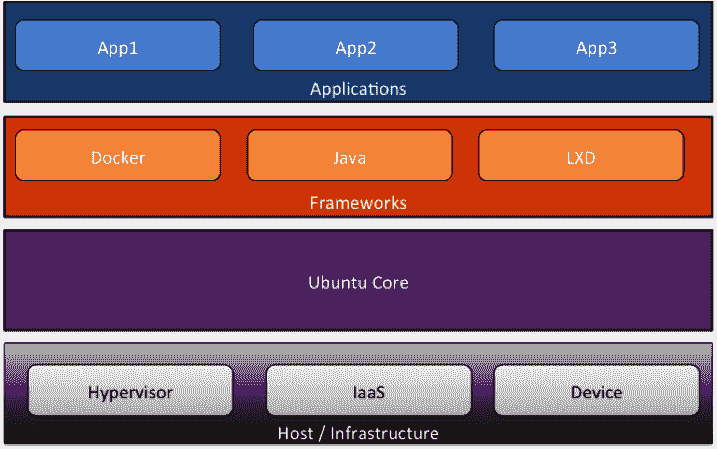

# 敏捷的 Ubuntu 内核——从微控制器到微服务

> 原文：<https://thenewstack.io/snappy-ubuntu-core-powering-microcontrollers-to-microservices/>

2014 年 12 月，Canonical 发布了 Snappy Ubuntu Core (Snappy)，这是一个精简版的 Ubuntu 服务器，支持容器和事务更新。Snappy 是从 Ubuntu 8.10 服务器[Just note Operating System(JeOS)](https://www.suse.com/products/susestudio/features/jeos.html)(读作“juice”)演变而来的，该系统旨在运行在虚拟化环境中。JeOS 占用空间不到 380 MB，采用专门的服务器内核，没有 GUI，非常适合在 vSphere、KVM 和其他虚拟机管理程序上运行 Linux 虚拟机。向容器的转变和 Linux 服务器市场动态的变化促使 Canonical 宣布 Snappy 作为基于 Ubuntu 的新的最小 Linux 操作系统。

## 开源操作系统，云的明确领导者

在过去的二十年里，Linux 经历了巨大的发展。由于 Red Hat、Canonical、Micro Focus (SUSE)和 Oracle 等供应商的努力，它正在成为运行企业工作负载的可行操作系统。Linux 作为公共云和私有云基础架构的首选操作系统，正在推动云的发展势头。[云市场](http://thecloudmarket.com/about.html)，一个跟踪亚马逊 EC2 上操作系统部署的独立实体，[报道](http://thecloudmarket.com/stats#/by_platform_definition)在 2014 年 1 月至 2015 年 2 月期间，客户启动了超过 167，000 个 Linux 虚拟机，而只有 14，000 个微软 Windows 虚拟机。这些虚拟机运行在各种 Linux 发行版上，包括 Ubuntu、Amazon Linux、CentOS、Debian、Red Hat Enterprise Linux、Fedora 和 SUSE。

正如 [OpenStack 2014 年用户调查](http://superuser.openstack.org/articles/openstack-user-survey-insights-november-2014)所揭示的，Linux 和 Ubuntu 也引领着 OpenStack 的公共和私有云基础设施部署。

## 容器抛弃了臃肿的操作系统

容器化的应用程序封装了运行时、框架、第三方库和代码，消除了对底层操作系统的依赖。运行容器的主机需要最低限度的操作系统和容器运行时。容器化的应用程序从不与主机操作系统公开的任何工具交互，因为它们只需要运行时环境。这种经过提炼的操作系统方法与当前的 Linux 分发模型形成对比，在当前的 Linux 分发模型中，操作系统打包了许多工具，而容器化的应用程序可能永远不会使用这些工具。传统的 Linux 发行版供应商现在正在为容器进行优化。最早的极简 Linux 发行版之一 CoreOS 迫使现有的 Linux 操作系统供应商重新审视他们的策略。Red Hat 启动了一项名为[项目 Atomic Hosts](http://www.projectatomic.io/) 的计划，为容器优化 Fedora 和 CentOS。

物联网(IoT)架构也需要最低限度的操作系统，因为资源受限的设备充当物联网网关。精简的 Linux 发行版在将传感器连接到云的过程中起着关键的作用。Canonical Snappy 就是这种操作系统的一个例子。它运行在最新的 Raspberry Pi 2 上，这是一台信用卡大小的计算机，由一个 [ARM Cortex-A7 CPU](http://www.arm.com/products/processors/cortex-a/cortex-a7.php) 驱动。

Canonical 终于推出了 [Ubuntu Touch](https://gigaom.com/2015/02/06/the-ubuntu-phone-is-about-to-go-on-sale-but-curb-your-enthusiasm/) 。[首款搭载 Ubuntu 的手机 BQ Aquaris E4.5](http://www.bq.com/gb/products/aquaris-e4-5.html) ，于 2015 年 2 月上市。Canonical 创始人马克·舒托沃尔斯称，Snappy 将移动操作系统的精确性、确定性和可靠性带到了云操作系统中。应用程序以及属于它们的数据彼此完全隔离，以避免兼容性问题。操作系统可以在中断或停机时间最少的情况下进行更新和回滚。

## 时髦独特的建筑

Snappy 不同于传统的基于包的 Ubuntu 服务器和桌面 OS。它将 Ubuntu 的每个部分隔离在一个单独的只读文件中，并对每个应用程序执行相同的操作。开发人员可以放心地更新他们的应用程序，而不必担心破坏其他应用程序。虽然 Ubuntu Core 是 Snappy 的基础，但它不包括 apt-get，Ubuntu 的传统包管理器。每次 Ubuntu 核心更新时，管理员都会选择升级操作系统。

Snappy 经过设计和优化，可以运行预捆绑了 Docker 引擎和命令行工具的 Docker 容器。任何在 Docker 中运行的容器化应用程序都可以很容易地移植到 Snappy。Snappy 的设计是模块化和可扩展的。它旨在有效管理底层操作系统组件和应用程序。Snappy Ubuntu 核心有以下几层:

*   **主机:**这是物理层，可以是电话、设备、服务器，也可以是虚拟机。
*   **框架:**框架是为应用程序提供运行时和依赖关系的第三方服务。开发人员针对其中一个框架编写他们的应用程序。Docker 是 Snappy 支持的第一个框架。最终，像 Java、Python 和。NET 可以被打包。框架可以独立升级和维护，而不会影响基本操作系统。
*   **应用:**Snappy 中运行的应用被称为 Snapps。它们在框架的上下文中运行。例如，容器化的应用程序是 Docker 框架中的快照。每个 Snapp 都打包并部署在文件系统上的一个隔离目录中。

核心操作系统服务、框架和应用的模块化架构使 Snappy 成为微服务的理想操作系统。

*资料来源:贾纳基拉姆·MSV*

## 通过程序隔离实现安全性

Snappy 遵循 Canonical 移动操作系统中使用的相同安全框架。AppArmor 内核安全通过其强大的隔离机制来限制应用程序。与传统的安全框架不同，AppArmor 的安全模型将访问控制属性绑定到程序，而不是用户。基于强制访问控制(MAC), AppArmor 采用系统控制策略，限制对操作系统资源(如数据文件、设备和系统)的访问。管理员定义由操作系统严格执行的 MAC 标准。

根据 Canonical 的说法，Snappy 对操作系统和应用程序的更新是可靠的。操作系统和应用程序文件完全分开保存，作为一组不同的只读映像。当管理员升级操作系统时，更改会应用到只读分区。在下一次重新启动时，只读分区将变为活动状态。由于之前的状态也被保留，管理员可以轻松地回滚并重新启动以恢复到之前的配置。类似地，每次更新应用程序时，都会备份数据，如果更新失败，应用程序可以回滚到以前的状态。

Canonical 计划为框架提供商和应用程序开发人员创建一个市场来发布他们的工作。在 Snappy 上启动应用程序的典型工作流程包括启动 Snappy Ubuntu Core 的原始实例，安装市场上发布的框架，最后部署 Snapps。最终，marketplace 可以成为面向移动、物联网和云部署模型的 Snapps 的通用目录。

Snappy Ubuntu Core 可以部署在虚拟机管理程序、云和设备上。截至 2015 年 2 月，Snappy VM 镜像已在亚马逊 EC2、微软 Azure 和谷歌计算引擎上提供。KVM、OVA 和流浪者的图像可用。

## 物联网与未来

面向嵌入式设备的传统实时操作系统(RTOS)尚未准备好应对物联网革命。互联设备和持续服务的世界需要强大的现代操作系统。感受到这一机遇， [Canonical 明智地走向了物联网](https://gigaom.com/2015/01/20/robots-embrace-ubuntu-as-it-invades-the-internet-of-things/)。Snappy 目前可以在各种 x86 和 ARM 设备上使用。Canonical 网站的物联网部分拥有对主流物联网平台的支持，如 [Raspberry Pi 2](http://www.raspberrypi.org/products/raspberry-pi-2-model-b/) 、 [Beaglebone Black](http://beagleboard.org/BLACK) 和 Odroid-C1。

Snappy 支持许多平台和设备，是 Canonical 物联网战略的基石。它为物联网堆栈提供了服务器级的可靠性和移动般的简单性。Snappy 有可能成为物联网网关，与连接到传感器、开关和执行器的微控制器进行通信。从家庭自动化供应商 Ninja Blocks 到无人机制造商乐儿机器人公司，Canonical 展示了 Snappy 可以驱动下一代物联网设备。微软已经与 Canonical 合作开发基于 Snappy Ubuntu Core 的 API，用于连接工业物联网设备。其他重要联盟包括:[英特尔](http://www.intel.com/content/www/us/en/cloud-computing/cloud-computing-cloud-builders-canonical-reference-architecture-video.html)物联网解决方案和 [IPSO](http://www.ipso-alliance.org/) 。

## Canonical 能交付吗？

Canonical 将 Snappy 转变为一个无处不在的平台的愿景令人信服。从数据中心到云，到移动设备到嵌入式设备，Ubuntu 正在打造一条富有远见的道路。虽然 CoreOS 和 Red Hat 专注于容器化的工作负载，Canonical 正在扩大与更多受众的相关性。这个大网会限制公司覆盖每个细分市场的所有用例及场景的能力吗？在云上运行可扩展的容器化集群的要求与物联网设备和网关完全不同。Snappy 目前的形式已经存在不兼容性。Docker 框架在云和虚拟机管理程序上受支持，但在 ARM 处理器上运行的物联网平台上不受支持。Canonical 应该考虑开发 Snappy Ubuntu 的“配置文件”,针对它目前支持的每个平台。但是，这也可能导致操作系统的碎片化，这在开放源代码中是很典型的。

Snappy 的主要限制之一是缺乏服务发现和集群管理工具。CoreOS 和 Atomic Hosts 等容器优化操作系统自带内置工具，可轻松管理分布式工作负载。用于容器中服务发现的最流行的框架之一 etcd 包含在 CoreOS 中。对于调度和编排集装箱， [Kubernetes](http://kubernetes.io/) 和 [Fleet](https://github.com/coreos/fleet) 是首选工具。尽管开发人员可以集成这些工具，Snappy 应该带有编排和集群管理工具。

Canonical 宣布了 Docker 的替代容器技术，名为 LXD (读作“lex-dee”)。基于成熟的 LXC 技术，LXD 承诺提供一个完整的类似虚拟机的环境，结合了容器的速度。OpenStack Nova APIs 与 LXD 集成，带来统一的容器启动体验。Snappy 几乎肯定会和 Docker 一起支持 LXD 框架。如果 Canonical 选择通过淡化 Docker 来推动 LXD 成为首选框架，Snappy 在 Docker 开发者中的采用将会受到限制。要想成功，Snappy 应该支持主流容器技术，包括 Docker、LXD 和 CoreOS 的 [Rocket。如果 Snappy 兑现其无处不在的承诺，它将成为第一个支持多种平台的操作系统。](https://coreos.com/blog/rocket/)

<svg xmlns:xlink="http://www.w3.org/1999/xlink" viewBox="0 0 68 31" version="1.1"><title>Group</title> <desc>Created with Sketch.</desc></svg>