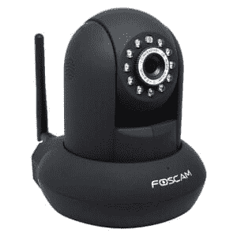
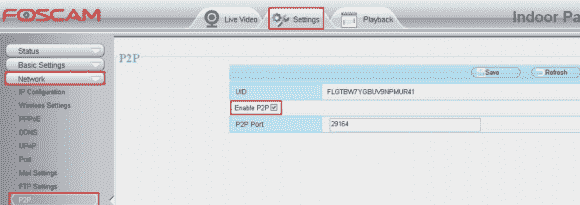

# 对等搜索网络摄像头揭示互联网的安全隐患

> 原文：<https://thenewstack.io/snooping-webcam-reveals-security-dangers-internet-things/>

上周，安全博客博主 Brian Krebs 透露，一个受欢迎的互联网支持的安全摄像头“[秘密地、持续地](http://krebsonsecurity.com/2016/02/this-is-why-people-fear-the-internet-of-things/)连接到一个由中国硬件制造商运营的巨大的点对点网络

虽然该设备不一定是从你的相机分享视频，但它是通过防火墙与其他设备连接。即使用户发现了，也很难关掉它。显然，它不是唯一一个偷偷给家里打电话的电子设备。

制造商可能会将此设想为一项服务，允许移动用户方便地远程连接到他们家中的设备集合。但在某些情况下，制造商甚至没有向他们的客户宣传这些功能，这是前*华盛顿邮报*网络犯罪记者担忧的事情之一，他将该设备作为“为什么人们害怕‘物联网’”的例子

“这么多物联网设备的问题不一定是它们构思不周，而是它们的默认设置经常忽略安全和/或隐私问题，”Krebs 写道。

一家名为 Foscom 的中国公司出售这种特殊的安全摄像头，但一名用户发现了这种不寻常的行为，并于去年 11 月在该公司的讨论板上发布了相关信息。很快其他用户也加入进来，证实他们也注意到了同样的事情。

几天后，另一名用户写道:“我已经切断了任何应该让相机‘打电话回家’的东西，但它仍然坚持向几个不同的 IP 发送 UDP 10001。”“我的路由器阻止了传入的响应，因此实际上没有创建任何对话，但我的防火墙报告了大约 16，000 次尝试连接(4 个不同 IP 各 4，000 次)。”

Krebs 指出，该公司的一些“P2P”相机甚至没有在产品名称中包含 P2P——但他接着指出还有两个更大的问题。首先，这种行为是默认激活的，直到用户主动禁用它。第二:禁用它不会真的*起作用*。“Foscam 承认，禁用 P2P 选项实际上并不能阻止设备在线搜索其他 P2P 主机……”

Brian Krebs 演示了停止 P2P 的 Foscam 设置实际上如何不起作用。

Krebs 链接到 Foscam 论坛的一个帖子，一个用户分享了他们对该公司客户支持的回应。为了使摄像机能够立即上线，它们总是与服务器同步。

这不是第一次有人质疑监控摄像头的安全性。早在 2005 年，网上冲浪者发现了一种简单的方法，可以在谷歌上搜索基于网络的安全摄像头的地址，并开始远程控制摄像头本身，从全球各地获取陌生人的实时信息。

“我在一个中国人的店里闲逛，没人看见，”[发了一个恶作剧的帖子](http://www.graffe.com/forums/showthread.php?t=26886&page=5&pp=20)。“然后突然他们出现了，当我放大他时，他看着摄像机，他发现有些不对劲…所以他跑向他的电脑，我拿着摄像机跟着他，然后他叫他的朋友过来…显然，他们去那里是为了检查电脑，因为摄像头是通过电脑连接的。”

当他们打开电脑上的相机控制软件时，他们看到了:一张他们自己的照片。

但现在，这些设备自己主动联系互联网，在许多情况下，支持互联网的摄像头甚至被设计为通过用户的防火墙。这显然打开了一个新的攻击媒介。根据 Krebs 的说法，Foscam 的相机上的这一功能“如果不应用固件更新和额外的补丁，就无法关闭，该公司只是在用户在其支持论坛上反复请求后才发布的。”

Krebs 联系了 Nicholas Weaver，他是国际计算机科学研究所网络和安全方面的高级研究员，他形容这是“一个疯狂的坏主意”。

“它让所有 Foscam 用户不仅面临对其摄像头本身的攻击(这可能非常敏感)，而且对摄像头的利用还会导致对家庭网络的进一步入侵。鉴于这种看似漫不经心的态度和几乎肯定缺乏自动更新，几乎可以肯定，这些设备是远程利用，”韦弗告诉克雷布斯。

消费者可能没有意识到，他们支持互联网的设备可能已经在接触物联网。去年五月，一名用户还发现[一台 DVR 正在联系中国的同一个 IP 地址](https://thecomputerperson.wordpress.com/2015/05/03/compromised-or-suspicious-swann-dvr-traffic/)。几个月前，另一名安全观察家注意到他购买的智能插头中有类似的 P2P 行为，该智能插头允许使用手机远程关灯。

他在“互联网风暴中心”网站上写道[“我们的房子和办公室越来越多地被嵌入了带有操作系统和存储器的真实计算机的电子设备侵扰”。尽管该产品的包装没有提到这一功能，但他的*插头*也试图联系相同的对等网络。](https://isc.sans.edu/diary/IoT%3A+The+Rise+of+the+Machines+%28Guest+Diary%29/19173)

用户 Xavier Mertens 写道:“这不是一个重大的安全问题，但这个故事强化了我们对物联网的已知(和恐惧):这些设备配置薄弱，缺乏关于其行为的可见性/文档记录。”"在你的网络上连接它们时要小心."

<svg xmlns:xlink="http://www.w3.org/1999/xlink" viewBox="0 0 68 31" version="1.1"><title>Group</title> <desc>Created with Sketch.</desc></svg>