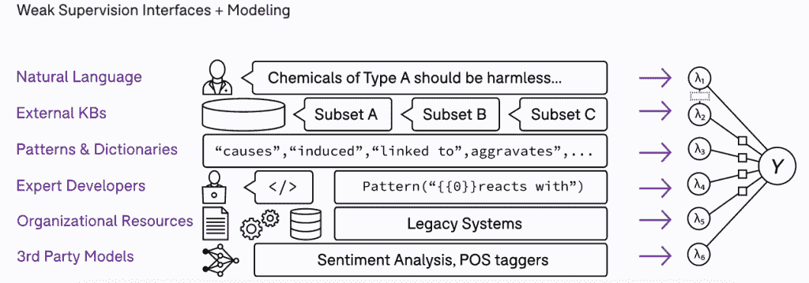

# 浮潜解决人工智能最乏味的任务

> 原文：<https://thenewstack.io/snorkel-tackles-ais-most-tedious-task/>

尽管在开发[人工智能](https://thenewstack.io/category/machine-learning/)算法和模型方面取得了进步，但大多数潜在的应用从未投入生产，因为标记数据来训练模型需要时间和费用。这是一个问题[浮潜。人工智能](https://www.snorkel.ai/)已经着手实现自动化。

公司联合创始人兼首席执行官[亚历克斯·拉特纳](https://www.linkedin.com/in/alexander-ratner-038ba239/)说:“如今，关于人工智能的不那么隐藏的秘密是，尽管所有的技术和工具都有所改进，但对于许多用例来说，80%至 90%的成本只是人工收集、标记和管理这些数据，即模型学习的训练数据。”。

拉特纳承认，这不是第一个领域，甚至不是第一个十年，适当标记的数据被认为是至关重要的。在去年向 TNS 投稿的一篇文章中， [Vikram Bahl](https://www.linkedin.com/in/vikram-bahl-0668bb1b/) 概述了[为机器学习和人工智能准备数据](https://thenewstack.io/clean-data-is-the-foundation-of-effective-machine-learning/)的挑战。

“机器学习模型和算法取得了惊人的进步。开源软件中有很多这样的东西，它们变得如此强大，但也如此渴求数据。拉特纳说:“事实上，这就是我们所做的一切的动机，现在正是数据阻碍了人们。”。

一份 2020 年的 cognelytica[报告](https://www.cognilytica.com/2020/01/31/data-preparation-labeling-for-ai-2020/)发现，数据准备和工程任务占了大多数人工智能和机器学习项目所花时间的 80%以上。它预测，到 2024 年，第三方数据标签解决方案的市场规模将超过 41 亿美元。

在许多情况下，数据需要专家来标记，它是私有的和/或它一直在变化，需要不断地重新标记，所以项目永远不会被部署。这些公司——银行、医疗保健组织、政府机构——是浮潜的客户，许多组织出于合规性原因不能将数据发送给第三方来准备。

## **出身学术界**

[潜泳项目](https://github.com/snorkel-team/snorkel)始于 2016 年斯坦福人工智能实验室，从事 DARPA 打击人口贩运项目。它已经与领先的组织如[谷歌](https://ai.googleblog.com/2019/03/harnessing-organizational-knowledge-for.html)、[英特尔](https://dl.acm.org/doi/abs/10.1145/3329486.3329492)、[苹果](https://arxiv.org/abs/1909.05372)和[斯坦福医学](https://www.sciencedirect.com/science/article/pii/S2666389920300192)以及[40 多篇同行评审研究论文](https://www.snorkel.ai/technology#reference)的一部分共同开发和部署。

“我们从一系列由美国国家卫生研究院赞助的用户研究开始，并说，‘嘿，我们如何才能让一个主题专家，比如医生或生物医学数据科学家来编写这些标签功能呢？它真的会比手工贴标签更快吗？这实际上是我们在 2019 年从斯坦福大学分离出来的一个重要动机，也许是花更少的时间证明关于建模或弱监督的新定理，花更多的时间回到这个最初的[想法]。DARPA 对该项目的第一笔资助是，“如何让主题专家了解现代人工智能技术？””拉特纳说。

“如果您想培训一个医疗分流模型或医生辅助模型，而不只是一个手动的临时流程，您能不能请您的医生朋友坐下来，参加我们关于标准放射学和 VA 医疗保健系统的一篇论文，8 到 14 个人月，只是为了建立并运行第一个模型？我们能让这些主题专家以编程方式教授模型吗——比如说我正在寻找这些特征，或者这些词，或者图像中的这些斑点，然后以这种方式教授模型？”

该公司去年 7 月走出了秘密，最近宣布获得 3500 万美元的 B 轮融资，由光速风险投资伙伴(Lightspeed Venture Partners)牵头。其资金总额已达 5030 万美元。

## 强调迭代工作流

浮潜方法依赖于[弱监管](http://ai.stanford.edu/blog/weak-supervision/)，使用[通用指南](https://www.snorkel.org/blog/weak-supervision)而非严格规则来指导模型的概念。它被认为不太精确，但比超级昂贵的手工贴标更快。

用户从编写标签函数开始，它产生一个标签，比如(SPAM = 1 或 NOT_SPAM = 0)或放弃标签(abstict =-1)。这些不必非常精确。在数据集上运行后，比较标签一致或不一致的区域有助于提高概率，比如说，一幅图像是一个停车标志或一只猫。

该公司坚持认为，使用这种通用方法更快、更灵活，能够使用更大的训练数据集来提高准确性——并且足够准确——从而为公司节省大量标签和时间，以将人工智能应用程序投入生产。如果数据发生变化，用户可以只更新一部分训练数据，而不是从头开始重新标记所有数据。

人工智能技术正试图用善于概括的机器学习模型来弥合 80 年代脆弱、僵化的基于规则的系统。拉特纳表示，虽然这些基于规则的系统使用户能够精确地编纂主题专家的知识，但用户无法回过头来审核这些系统的偏见和错误——这是一个大问题。

它最近宣布了一个无代码 UI，作为其[Application Studio](https://www.globenewswire.com/news-release/2021/04/07/2206132/0/en/Snorkel-AI-Launches-Application-Studio-the-Fastest-Way-to-Develop-AI-Applications-and-Raises-35-Million-in-Growth-Funding-Led-by-Lightspeed-Venture-Partners.html)visual builder 的一部分，以配合其 Python SDK，作为其推动非开发人员——法律分析师、护士甚至[记者](https://www.icij.org/inside-icij/2019/03/how-artificial-intelligence-can-help-us-crack-more-panama-papers-stories/)——管理建模测试数据的一部分。Application Studio 提供标签模板或基于行业特定用例定制模板的能力，如合同智能、新闻分析、客户交互路由或常见的人工智能任务，如文本和文档分类、名称识别和信息提取。

它记录了整个工作流管道和版本，可以很容易地进行审计。他说，虽然该行业在可解释性领域还有很多工作要做，但处理偏差仍然需要人工干预，但有了潜泳，用户可以进入代码并修改它以消除偏差。

“浮潜人工智能解决了需要利用生产人工智能实现业务数字化转型的企业的关键难题。他们的数据团队努力构建、训练和部署精确的大规模模型，因为编码很复杂，数据量也在不断增加。他们需要优化现有代码的使用，加快模型开发，并更有效地组织培训数据。他们还需要在一个支持整个 ML 生命周期的公共平台上合作，”埃克森集团研究副总裁[凯文·佩特里](https://www.eckerson.com/experts/kevin-petrie)说。

人工智能领域的许多初创公司都专注于特定的人工智能痛点，包括 [Fiddler](https://thenewstack.io/fiddler-drills-into-the-decisions-behind-ai-decision-making/) ，承担可解释性；[迭代. ai](https://thenewstack.io/iterative-ai-git-based-machine-learning-tools-for-data-engineers/) 关于版本化； [Dolt](https://thenewstack.io/dolt-a-relational-database-with-git-like-cloning-features/) 和 [TerminusDB](https://thenewstack.io/terminusdb-takes-on-data-collaboration-with-a-git-like-approach/) 进行协作；[谢顿](https://thenewstack.io/seldon-making-ml-deployments-easier-keeping-models-on-track/)和[确定了 AI](https://thenewstack.io/determined-ai-promises-end-to-end-orchestration-and-model-management/) 进行管理。

该公司一直专注于人工智能应用程序开发和部署的迭代过程，努力使其更接近任何其他类型的软件开发的工作流程。它已经接受了与其他开源选项的集成，允许用户混合和匹配他们选择的工具。

拉特纳说，随着数据量的增加，并不是每个公司都有时间和专业知识来应对谷歌规模的挑战。

“人们在获取我们服务的设置中标记的数据方面受到更多的阻碍，然后只是启动、运行和部署比他们需要最复杂的点解决方案更多的东西，所以我们非常专注于实现特定的工作流，在那里您可以尽可能快地进行迭代开发。我们发现客户在这方面有很大的吸引力，”他说。

<svg xmlns:xlink="http://www.w3.org/1999/xlink" viewBox="0 0 68 31" version="1.1"><title>Group</title> <desc>Created with Sketch.</desc></svg>