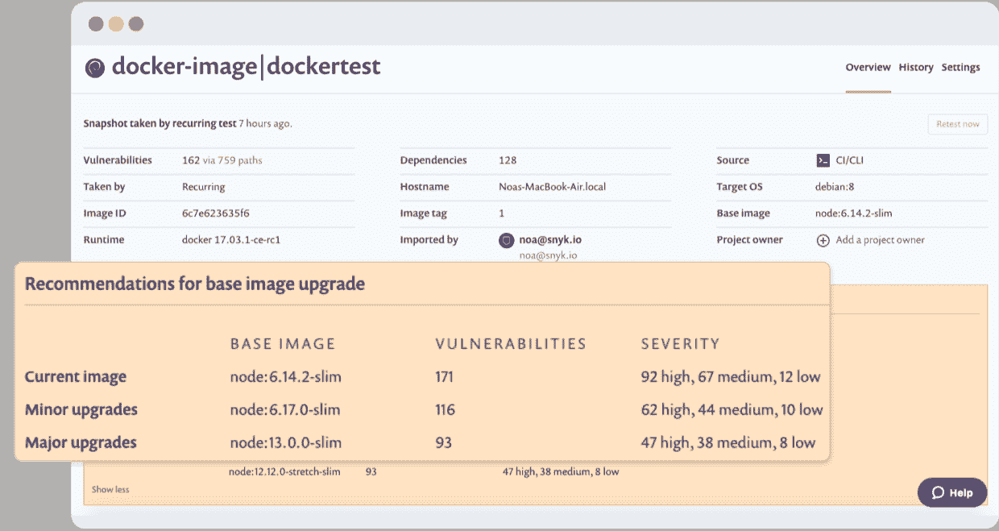

# Snyk 发布了一个以 Kubernetes 为中心的容器安全平台

> 原文：<https://thenewstack.io/snyk-announced-new-container-product-what-to-know/>

随着容器采用率的上升，控制甚至意识到由于依赖开源而引入的漏洞变得更加困难。考虑到这一点，云原生安全公司 Snyk 推出了一个以容器和 Kubernetes 为中心的安全平台 [Snyk 容器](https://snyk.io/product/container-vulnerability-management/)，以在整个软件开发生命周期中发现并修复第三方应用依赖关系中的漏洞。

Snyk 今天也发布了一个[头盔插件](https://github.com/snyk-labs/helm-snyk)，允许开发者扫描他们自己的头盔图寻找漏洞。他们刚刚发布的[舵手安全报告](https://snyk.io/wp-content/uploads/helm-report.pdf)暴露了公共舵手图表库中的漏洞。Helm 是 Kubernetes 的一个流行的包管理器，也可以用来安装第三方软件，如 Jenkins、PostgreSQL 等等。观看新堆栈的[对报告作者 Gareth Rushgrove 的直播采访，](https://www.periscope.tv/thenewstack/)太平洋时间 2019 年 11 月 18 日下午 12 点 15 分，来自圣地亚哥的 KubeCon + CloudNativeCon。

该公司最近的开源安全报告强调了对集装箱扫描服务的需求。该研究表明，“容器经常引入数百个来自开源依赖的漏洞，并且没有本地安全措施来发现和修复它们，”Snyk 总裁兼联合创始人 [Guy Podjarny](https://twitter.com/guypod) 在一份声明中指出。“通过为开发人员提供构建和运行安全容器所需的工具，包括监控 Kubernetes 工作负载的漏洞，Snyk Container 正在帮助客户大幅降低不断增长的容器基础设施的风险，并扩展安全最佳实践。”

Podjarny 提到的研究提到了令人大开眼界的发现，包括两年内应用程序库漏洞增加了 88%，十大最受欢迎的 Docker 图像中的每一个都包含至少 30 个漏洞。Helm Security 报告进一步发现，68%的稳定 Helm 图表包含具有高严重性漏洞的图像。

### 容器产品可以简化 IT 工作

容器产品在短时间内变得如此流行的原因之一是因为它们针对开发人员面临的一些常见问题。例如，许多应用程序只需要查看用户和组，但是却被授予了更多的访问权限。

如果使用虚拟身份服务器(VIS)或容器，它们映射和发布特定于应用程序的视图，只向应用程序提供它需要的数据。然而，很容易看出，如果 it 专业人员继续处理与容器漏洞相关的问题，那么与容器产品相关的便利性会变得不那么明显。Snyk 容器旨在使漏洞管理变得简单明了。

Snyk 容器直接与开发人员工作流和组织使用的现有工具集成，如源代码控制平台、Kubernetes、CI/CD 工作流和容器注册表。Snyk 容器支持定期执行快速扫描，以查找与操作系统或应用程序相关的漏洞。它还可以验证 Kubernetes 工作负载的安全配置。

开发人员还可以在需要时使用策略在特定条件下中断构建。当发现漏洞时，Snyk 容器显示原始 Docker 文件行。然后，开发人员可以出于补救目的对相关线路进行优先级排序。

人们还可以检查 Snyk 容器创建的漏洞树，以显示直接和间接的依赖关系。有了这些信息，就可以了解每个漏洞是如何产生的。

然后，对于每个已识别的漏洞，Snyk Container 会提供如何修复它的建议，例如升级到最安全的基础映像。即将推出的一个相关特性是自动修复的拉请求。Snyk 会自动执行更改为推荐基本图像的拉取请求，从而提供快速、无缝的结果。

【T2

## 监控新问题

除了检查当前的漏洞并建议如何修复它们，Snyk Container 还有一个监视组件，可以通知用户新的漏洞。Slack 和电子邮件是发布这些警报的两个渠道，确保 IT 专业人员掌握最新信息并采取及时行动。

Snyk 最近因成功筹集资金而成为头条新闻。该公司在 2019 年 11 月获得了 700 万美元的 A 轮融资。2019 年 9 月，该公司宣布[已经筹集了](https://techcrunch.com/2019/09/10/snyk-grabs-70m-more-to-detect-security-vulnerabilities-in-open-source-code-and-containers/)总计 7000 万美元。该公司计划用这笔钱来扩大业务。Snyk 容器的引入是实现这一意图的一个例子。

Snyk 容器为用户提供了所需的洞察力和资源，让他们知道漏洞在哪里以及如何解决它们。这些好处有助于客户降低随着集装箱基础设施的增长而出现的风险。随着规模的扩大，公司可以保持最佳的安全实践。

<svg xmlns:xlink="http://www.w3.org/1999/xlink" viewBox="0 0 68 31" version="1.1"><title>Group</title> <desc>Created with Sketch.</desc></svg>