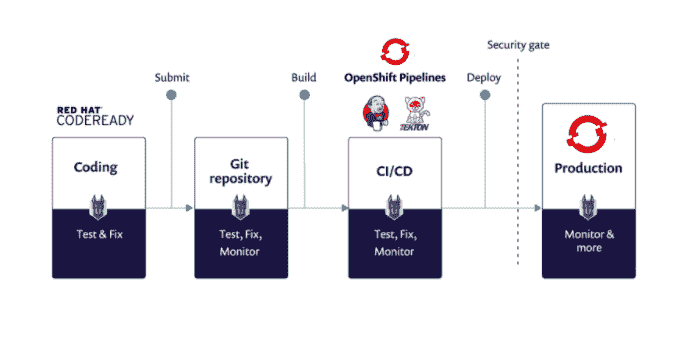
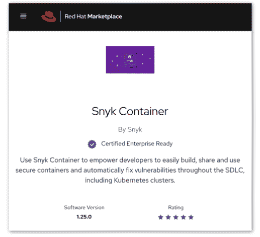
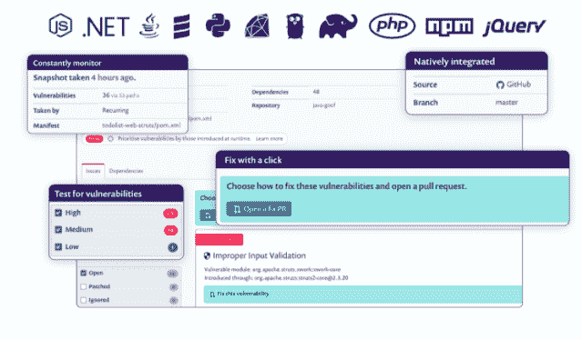

# Snyk 将其 DevOps 安全扫描带到 Red Hat OpenShift

> 原文：<https://thenewstack.io/snyk-brings-its-devops-security-sweep-to-red-hat-openshift/>

Snyk 在本周举行的虚拟[红帽峰会](https://www.redhat.com/en/summit)上宣布，snyk 已经将其 DevOps 漏洞扫描和修复工具扩展到红帽 OpenShift 企业应用平台，允许开发人员将安全检查集成到整个开发和部署过程中。

Snyk 负责容器安全的产品营销总监[吉姆·阿姆斯壮](https://www.linkedin.com/in/jdarmstro/)说:“OpenShift 上运行的代码和容器可以来自任何地方，尤其是当你从公共注册表中获取开源组件和容器基础映像的时候。“开发人员的最终任务是修复所有这些层中的安全问题，因此 Snyk 和 Red Hat 集成了内置于开发人员工具和领先的企业 Kubernetes 平台中的以开发人员为中心的安全修复程序，使这变得很容易。”

[Snyk](https://snyk.io/) 的安全工具将在两个方面帮助 Red Hat 客户:在 [OpenShift 集群](https://www.openshift.com/)中更新和部署代码和应用程序时，为它们提供一致的扫描和修复。Red Hat 的 CodeReady Dependency Analytics 是该公司开发工具 [CodeReady](https://developers.redhat.com/products/codeready-workspaces/overview) 组合的一部分，现在也依赖 Snyk Intel [漏洞数据库](https://snyk.io/product/vulnerability-database/)来分析开源工具和依赖关系。

Snyk 的使命是帮助在整个应用程序生命周期中自动发现并修复开源代码依赖、容器和 Kubernetes。Snyk 始终如一地扫描、测试和交流不同修复的优先级，并提供其他信息。在工作负载被扫描之后，扫描过程还会持续进行，在某些情况下，当新的代码漏洞出现时，无论代码是在 git 存储库上还是在部署之后，扫描过程都会被修复。

这个功能现在可供 DevOps 团队用于他们的 OpenShift 容器和应用程序。这种集成还意味着 DevOps 团队可以使用 Red Hat CodeReady 依赖分析来实时发现和修复添加到 Snyk 数据库中的漏洞。

OpenShift 和 Snyk 的结合为开发人员提供了基础设施和应用程序级别的安全性，[企业管理协会(EMA)](https://www.enterprisemanagement.com/) 的分析师 [Torsten Volk](https://www.linkedin.com/in/torstenvolk) 说。“在我们试图以越来越快的速度发布应用程序的世界中，这是关键，并为 OpenShift 作为 DevOps 平台提供了一些不错的额外价值，”Volk 说。

在 OpenShift 平台上工作的开发人员和安全团队需要确保代码和应用程序是安全的，同时确保修复和补救保持持续和一致。

同时，OpenShift 为开发者提供的功能也随着 Snyk 的集成而得到了扩展。“OpenShift 提供了灵活的应用部署模型，平台为您处理大部分构建和部署工作。OpenShift 还提供了运行任何容器化应用程序的能力，无论是直接从容器还是通过 Kubernetes 的配置和操作程序。“无论您采取哪种方式，对于您在代码中包含的所有开源组件以及容器，保持最新的安全更新是非常重要的。”

随着开发或部署周期中漏洞的出现，OpenShift 上的持续漏洞测试和补救也至关重要。“总是有新的漏洞，容器映像需要定期刷新以包含最新的修复程序。Snyk 在软件开发生命周期中提供这种可见性，包括监控 OpenShift 集群中正在运行的工作负载，”Armstrong 说。

Red Hat 也对 Snyk Intel 的漏洞数据库寄予了很大的信任。“通过 Snyk 英特尔集成，Red Hat CodeReady 依赖分析可以帮助开发人员直接从他们的 IDE 中找到并修复他们的应用堆栈中的漏洞，甚至在他们的管道构建阶段之前，”Red Hat 的产品管理人员 OpenShift Developer Tools 的 [Parag Dave](https://www.linkedin.com/in/paragsdave/) 说道。“这种自助服务功能提高了开发运维周期的效率，有助于减少时间和精力来解决漏洞。”

除了自助服务功能，Snyk 的源代码组成分析可以添加到 OpenShift 上的 CI 管道任务中，这是 Snyk 可以帮助开发人员扩展 OpenShift 功能的另一种方式，Dave 说。

与 Snyk 的集成还将帮助开发人员在 OpenShift 上构建应用程序时自动进行安全分析。“我们将继续扩大我们在 OpenShift 上的开发人员体验，并集成 CodeReady Dependency Analytics 和 Snyk Intel 的功能，以帮助开发人员直接从 OpenShift 中以各种方式找到并解决他们应用程序堆栈中的漏洞，”Dave 说。

Snyk 的采用也被视为一种帮助 DevOps 在整个开发过程中集成安全性的方式，这种方式也不会破坏以更快的节奏部署的需求。例如，Snyk 的 DevSecOps Insights 2020 报告中的一个重要发现是，48%的受访者表示安全性阻碍了开发运维团队快速开发和部署应用的能力。

Volk 说，Snyk 与 OpenShift 的集成是 Snyk 整体任务的一部分，帮助开发团队在使用现有开源库和容器映像之间找到最佳妥协，以更少的资源交付更多的东西，同时将他们的应用程序保持在可接受的安全和合规水平。

“这种不断寻求最佳生产率和最佳安全性之间最佳折衷的做法构成了开发人员持续的压力来源，因为他们必须不断评估堵塞特定漏洞的成本，与实际利用这些漏洞的可能性和影响相比，”Volk 说。“Snyk 告诉开发人员是否要担心他们自己非常具体的应用程序环境中的某些漏洞，这让他们放心，同时还可以最大限度地减少修补这些问题的工作量。”

Snyk 和 Red Hat 是新堆栈的赞助商。

通过 Pixabay 的特征图像。

<svg xmlns:xlink="http://www.w3.org/1999/xlink" viewBox="0 0 68 31" version="1.1"><title>Group</title> <desc>Created with Sketch.</desc></svg>