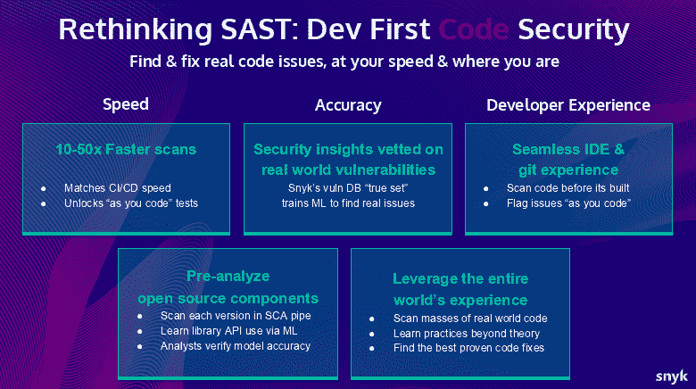
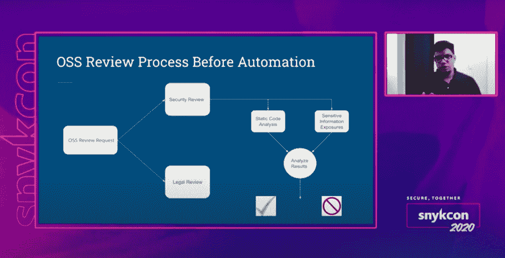
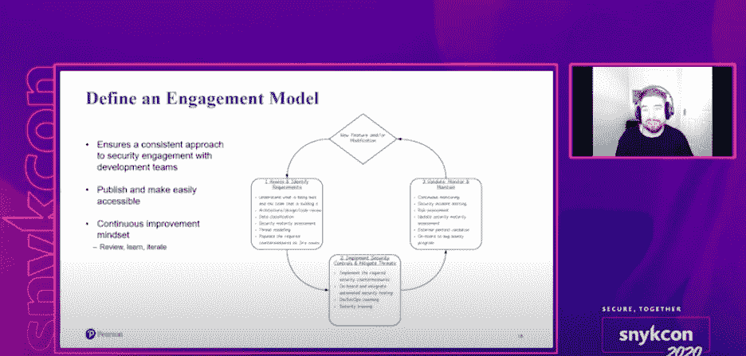
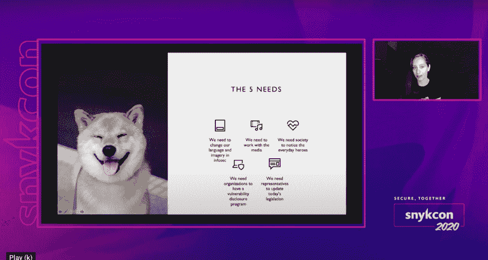

# Snyk 为开发者重新思考静态应用安全测试

> 原文：<https://thenewstack.io/snyk-rethinks-static-application-security-testing-for-developers/>

云原生安全软件提供商 [Snyk](https://snyk.io/) 发布了一个“开发者优先”(静态应用安全测试)的包。该公司声称，上周在 [SnykCon](https://snyk.io/snykcon/) 发布的 Snyk Code 填补了现有 SAST 解决方案中的许多空白，满足了开发人员测试开源代码、应用程序代码、容器和基础设施作为代码的需求。

Snyk 的创始人兼总裁 Guy Podjarny 在 SnykCon 新闻和分析师会议上说,“SAST 已经成为了不要为开发者提供安全解决方案的典范”。顾名思义，SAST 分析现有源代码、字节码和二进制文件中已知的漏洞模式。Podjarny 说，Snyk 代码以一种“重新思考开发安全性”的方式提供了机器学习(ML)辅助的安全监控和补救。他说，通过提高速度和准确性等，它改善了现有 SAST 解决方案的缺点。

Snyk Code 的许多功能来自 Snyk 对第三方组件的 AI 代码分析的 [DeepCode](https://snyk.io/blog/accelerating-developer-first-vision-with-deepcode/) 的收购。“我们正在建立我们的深层引擎和分析速度，以及我们现有的对世界上发布的每个库和每个版本的分析管道，”Podjarny 说。

Snyk 表示 Snyk 代码提供的以下功能包括:

*   开发者可用性:在创建应用程序时扫描源代码，与 git 和集成开发环境(ide)集成。
*   速度:Snyk 表示，Snyk 代码比现有的 SAST 解决方案快“50 倍”,因为漏洞扫描是在代码创建时启动的，因此为许多开发团队消除了一个主要的时间障碍。

提高扫描和修复的准确性也是 Snyk Code 提供的一个主要功能，其中包括 ML-scanned 数据库，以帮助减少误报。

“我们非常重视补救，所以每当我们向开发者介绍一个漏洞时，我们都会尽可能轻松地补救它们，”Podjarny 在新闻发布会和分析师会议上回答一个问题时说。Podjarny 说，这个过程通常涉及“一个单击按钮”来打开一个固定的拉请求，“我们已经创建了修复，我们只是将它们提供给开发人员”。

“我想强调的是，从这个平台的角度来看，我们为开发者提供的服务不是保护他们的代码、保护他们的开源或保护他们的容器，而是保护他们的应用，”Podjarny 说。“开发人员只需这样做一次，他们现在就可以一次性获得这种类型的验证、修复和对应用程序所有不同方面的监控。”

Snyk 首次推出 Snyk 代码旨在帮助在仍然支离破碎的安全工具市场中提供一种单一供应商的替代方案，这反映了组织如何继续采取不同的方法来投资安全工具。

最近在 SnykCon 期间发布的一份[企业战略集团](https://f.hubspotusercontent10.net/hubfs/1699665/Collateral/ESG%20eBook%20-%20Snyk%20-%20Modern%20Application%20Development%20Security%20-%20July%202020.pdf?__hssc=222551492.12.1603610178726&__hstc=222551492.bd51bce014cfaeb88b9fa507dbbdfe2d.1603111961669.1603201960333.1603610178726.5&__hsfp=314270745&hsCtaTracking=bc8063ec-5696-4fac-aca6-6ec8f6e0cfdd%7Cc275864e-57db-4951-95b8-938746223b69) [报告](https://f.hubspotusercontent10.net/hubfs/1699665/Collateral/ESG%20eBook%20-%20Snyk%20-%20Modern%20Application%20Development%20Security%20-%20July%202020.pdf?__hssc=222551492.12.1603610178726&__hstc=222551492.bd51bce014cfaeb88b9fa507dbbdfe2d.1603111961669.1603201960333.1603610178726.5&__hsfp=314270745&hsCtaTracking=bc8063ec-5696-4fac-aca6-6ec8f6e0cfdd%7Cc275864e-57db-4951-95b8-938746223b69)的结果显示，有多少组织在集成往往太多(或者可以说太多)的安全工具方面面临挑战。例如，仅有 30%的被调查组织能够在接下来的 12 个月内保护超过 75%的代码。尽管如此，接受调查的组织中的大多数 DevOps 团队计划在接下来的 12 个月内增加他们的安全支出。对于云安全，调查中 44%的组织正在“瞄准”云安全，而三分之一的组织正在寻求整合其工具库。

除了 Snyk Code 的首次亮相，SnykCon 还进行了多次有趣的会谈。以下是一些亮点:

## 自动化键

开发运维团队不断寻求依靠自动化来消除 CI/CD 中的手动步骤和任务，从首次将应用代码上传到 Git 开始，延伸到应用部署后阶段的运营管理。在 SnykCon 的演讲中， [Salesforce](https://www.salesforce.com/fr/) 的产品安全工程师 Amol Deshpande 描述了他的团队的自动化安全流程的机制，他将其描述为“即插即用”的安全扫描。

他详细介绍了 Salesforce 的自动化步骤，从发布 [OSS 请求](https://github.com/salesforce/oss-request)到工程师从相关工单收到报告。

“所以，每当工程师来的时候，他们已经把报告附在票上了，他们只需看一下报告，看看是否有发现，”Deshpande 说。“如果没有发现，他们可以批准请求。如果有发现。他们可以与员工或工程团队合作来修复这些发现，因此这为工程师节省了大量时间，因为他们不必花时间实际运行扫描或确保他们理解这些工具。”

Deshpande 估计，自动化已经帮助 Salesforce 的工程师团队每年减少了将近 150 个小时的工作时间，否则他们将花费在手动运行安全扫描上。Deshpande 说，工程团队成员因此能够“专注于更重要的任务”。

## 文化变迁

实现任何平台或工具都需要必要的 DevSecOps 文化。但是，当灌输这种文化时，无可避免地必须有合适的人才，培生集团的发展战略主管尼古拉斯·罗宇胜在他关于发展战略文化的演讲中说。

罗宇胜说:“当应用正确的流程和实践，在您的组织中实现指数级改进时，您需要具有正确知识和经验的人来定义和实施，以便就如何创建安全配置和实施安全控制提供有效的指导。”“你需要真正了解这些领域的人，并且拥有构建和管理类似服务的经验。这是您避免与开发团队发生冲突的方法，在开发团队中，由在孤岛中运行的安全分析师提供的传统安全需求可能不相关或不可行。”

他说，举例来说，要找到一个拥有涵盖所有技术的深度知识、能够满足所有安全需求的工程师“几乎是不可能的”。“我们通过创建一个不同技能组合的平衡团队和促进合作文化来解决这个问题，”罗宇胜说。"这导致了知识的交叉传播，以及弱势领域的技能提升。"

## 黑客 101

对于那些在被利用之前只有少数人知道的漏洞，道德黑客已经成为许多组织检测和减轻威胁的宝贵方法。然而，令人惊讶的是，技术领域的许多人仍然没有意识到黑客和寻找代码和网络漏洞的行为可以是一种崇高的追求，因为许多人将道德与犯罪黑客混为一谈。在普通大众中，黑客通常被错误地与穿着帽衫的刻板印象联系在一起，并被认为不怀好意。在她的演讲中， [Point3 Security](https://ittakesahuman.com/) 的战略副总裁 [Chloé Messdaghi](https://www.linkedin.com/in/chloemessdaghi) 谈到了“公众至今仍将我们视为威胁”

无论你输入“道德黑客”还是“犯罪黑客”，“你都会得到完全相同的图像:这个帽衫，这个黑暗，通常是一个男人，”Messdaghi 说。“这对我们来说是压倒性的，因为如果我们不断地在媒体上与这些形象作斗争，并把我们描绘成这样，他们就在误导公众，因为公众并不完全知道我们的长相，这些形象在我们的社会中被灌输了很多。”

这些误解对整个社会也有非常真实和不幸的影响。例如，在美国，道德黑客可能会披露安全漏洞或揭露攻击，这些攻击不仅可以防止金钱损失，还可以通过防止医疗保健和其他公共服务受到攻击来间接挽救生命，他们通常会面临法律后果。他们还面临民事法庭的高昂代价，至少可以说，这阻止了许多人帮助防止社会伤害。

Messdaghi 说，改变公共形象、媒体接触、公众对道德黑客的认可、在组织中建立披露程序和立法代表，以使保护道德黑客的命令和法规现代化，是实现这一积极变化的必要条件。

Messdaghi 说，采取这些措施可能有助于吸引更多的黑客进入这一领域，“因为他们突然意识到，这实际上是他们可以做的事情，他们不必整夜担心”。

“这可能会让一些人从犯罪的一面转向好的一面，而这正是我们首先想要的。我们想给人们机会，”梅斯达吉说。“但为了做到这一点，我们必须影响公共部门，通过这样做，我们必须让组织、媒体和立法机构参与进来。”

Snyk 是新堆栈的赞助商。

通过 Pixabay 的特征图像。

<svg xmlns:xlink="http://www.w3.org/1999/xlink" viewBox="0 0 68 31" version="1.1"><title>Group</title> <desc>Created with Sketch.</desc></svg>