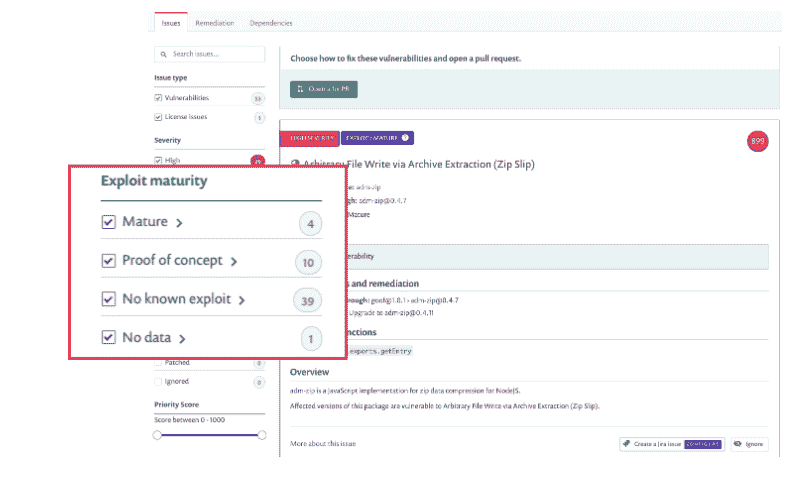
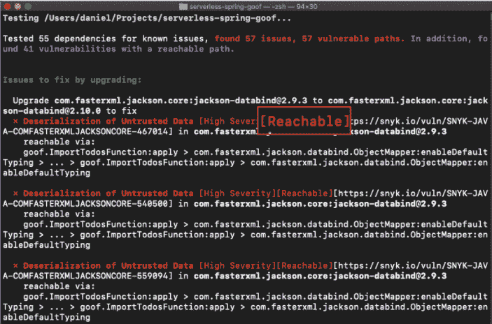

# Snyk 寻求加强低优先级和紧急安全警报之间的区别

> 原文：<https://thenewstack.io/snyk-seeks-to-sharpen-distinction-between-low-priority-and-urgent-security-alerts/>

DevOps 团队经常继续努力在太紧或太松的安全工具之间寻求平衡。选择过于敏感的安全监控工具通常会导致大量警报和误报。另一方面，一个安全工具被认为是设计来突出那些值得立即注意的警报，但它经常隐藏漏洞，甚至是潜在违规的消息。

一旦检测到警报，即使是分层警报，补救仍然是一个缓慢的手动过程。

即使是最合适的安全工具也会经常发送一个需要进行安全修复的列表。两难的问题是何时以及如何确定优先处理哪个安全工作单。为此，安全工具提供商 Snyk 寻求改进其安全平台，以更好地支持安全团队、DevOps 团队，尤其是开发人员在更精细和分层的基础上根据需要添加代码。

本周，Snyk 为其平台增加了所谓的“即时优先级”和“深度应用环境”功能。两家公司表示，在机器学习能力的帮助下，通过不断更新其漏洞数据库——Snyk 表示，其漏洞数据库的规模在过去四年中增加了 394%——警报分类更有针对性。

一个例子是，过去可能被认为是低优先级的漏洞突然上升到必须对应用程序代码进行修复的列表的顶部。当组织是目标行业的一部分，而漏洞突然被大规模利用时，可能会出现这种情况。其他漏洞根据它们可能如何影响特定组织的应用程序开发或基础设施来划分优先级。

第三个主要改进是能够根据特定的治理策略预配置警报和补救。这些由组织的 DevOps 团队嵌入到 Snyk 平台中。例如，与对客户存储的数据责任较小的其他组织相比，银行可能需要更多地关注堵塞某些漏洞，如数据存储治理。

和以前一样，Snyk 的警告和修复是针对开发者的。不是安全团队解析警报、分配作业单、自己修补代码或向开发人员传达修复，而是将警报和修复直接传达给开发人员。在存储库中的 [GitLab](https://about.gitlab.com/) 或 [GitHub](https://github.com/) 上自动打开“拉”请求，然后在对部署的应用程序代码进行测试和实现之后，修复过程完成。

Snyk 首席产品官[安内尔·马祖尔](https://www.linkedin.com/in/aner-mazur-95ba1950/?originalSubdomain=il)告诉新的 Stack，这个过程是为了给开发者更多的自主权和可见性。“开发人员不只是修复随机出现的 10 个漏洞(其中一些可能无关紧要)，而是实际上修复一些重要的东西，这使他们修复更多的漏洞。因此，这不仅仅是“嘿，有 10 个漏洞需要修复，我们应该修复哪个？””马祖尔说但随着时间的推移，它创造了一种文化，其中有非常积极的反馈，无论是谁在修复，都可以说‘嘿，我觉得我正在修复重要的问题，因为它实际上并不难。我会修复更多的问题，所以这真的有助于推动修复文化，并最终推动更多的修复。"

马祖尔说，通过更好地确定必须进行的修复的优先级，本周的发布为开发人员提供了更多的自主权，以在应用程序出现之前保护代码。

“我们正在推出的是一组产品和功能，它们都为组织提供并支持强大的优先级排序，”马祖尔说。

价格因用户数量而异，并按座位计费。

Snyk 和 GitLab 是新堆栈的赞助商。

通过 Pixabay 的特征图像。

目前，新堆栈不允许直接在该网站上发表评论。我们邀请所有希望讨论某个故事的读者通过推特[或脸书](https://twitter.com/thenewstack)[访问我们。我们也欢迎您通过电子邮件发送新闻提示和反馈:](https://www.facebook.com/thenewstack/)[feedback @ thenewstack . io](mailto:feedback@thenewstack.io)。

<svg xmlns:xlink="http://www.w3.org/1999/xlink" viewBox="0 0 68 31" version="1.1"><title>Group</title> <desc>Created with Sketch.</desc></svg>