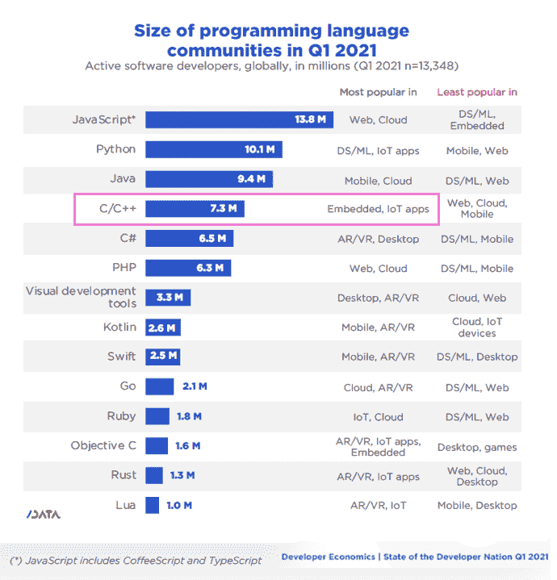

# Snyk 收购 FossID 以提高嵌入式开发人员的 C++兼容性

> 原文：<https://thenewstack.io/snyks-fossid-buy-to-boost-c-compliance-for-embedded-devs/>

根据 SlashData 的“2021 年 Q1 第 20 个开发者国家”报告，估计全球有 730 万开发者积极使用 C 或 C++编程语言他们未被满足的需求是 Snyk 创始人 T2 盖伊波德贾尼 T4 宣布收购 FossID 的原因。

根据前面提到的 SlashData 研究，C++是 40%从事嵌入式应用的开发人员的首选编程语言。Podjarny 认为 C/C++开发人员的需求还没有得到满足，并引用了 2020 年 C++社区调查中的数据，这些开发人员的重点是管理他们的应用程序所依赖的库。当你不能连接到云时，管理图书馆一定很困难。根据同一项研究，只有 51%的 C++在其软件开发生命周期中使用云。让我们重复一下，一半的 C++开发人员不使用云来部署更新。嵌入式应用通常在很少(如果有的话)连接到网络的物理设备中运送，使得连续部署相当困难。

FossID 解决了 C++开发人员似乎比其他人更关心的第二个问题——代码片段。来自其他来源的代码，如 StackOverflow，有时会被粘贴而不考虑许可约束。因为嵌入式代码不太可能依赖于通过云构建的库，所以检查它的代码片段比其他类型的应用程序更重要。从软件组成分析(SCA)的角度来看，扫描片段非常耗时，需要大量的信息知识库才能有效地完成，但 FossID 声称已经开发出一种人工智能技术，使这一过程变得高效。

根据我们自己的企业研究中的[开源，一年前，不到 5%的组织使用 Snyk 或 FossID 来实现开源合规，尽管超过三分之二的组织利用一些方法或工具来帮助治理。Snyk 似乎想扩大它在这里的存在，从 C++社区开始。该公司知道，只有 23%的目标受众采用了政策合规性测试——它在上周的](https://thenewstack.io/infosec-use-of-open-source-software-compliance-tools/)[云原生应用安全](https://snyk.io/state-of-cloud-native-application-security/)报告中基于 600 多次采访报告了这一事实。自动化策略测试和安全测试是一个好主意。现在让我们看看愿景变成现实。

资料来源:SlashData 的“2021 年 Q1 第 20 个发展中国家状况”

<svg xmlns:xlink="http://www.w3.org/1999/xlink" viewBox="0 0 68 31" version="1.1"><title>Group</title> <desc>Created with Sketch.</desc></svg>