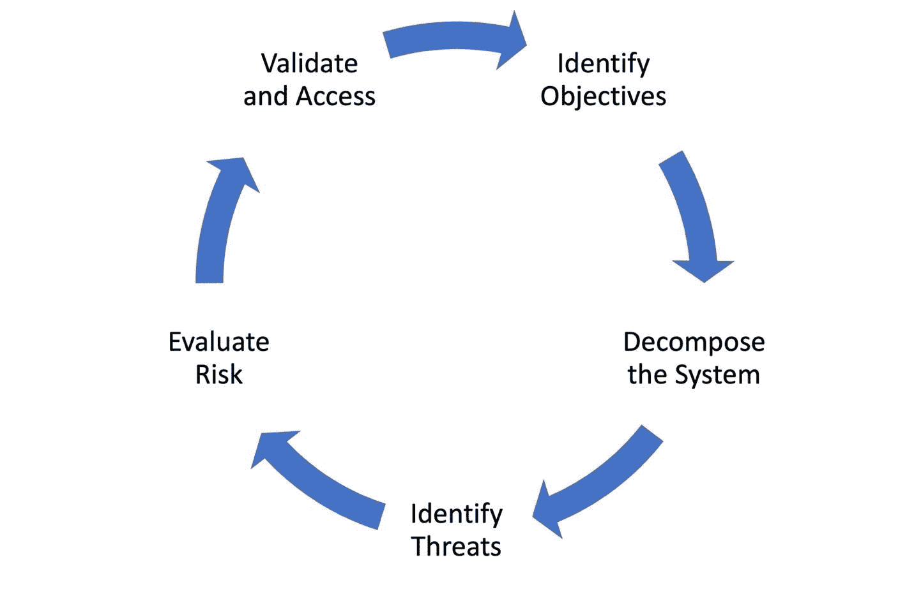
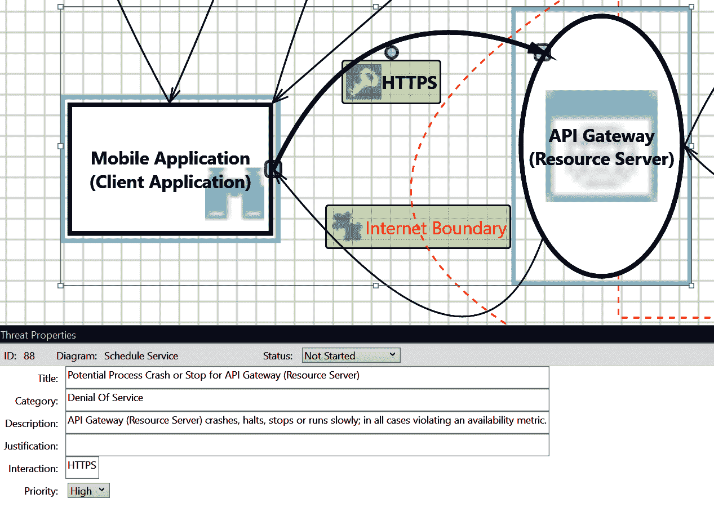

# 所以你想成为 API 安全专家？

> 原文：<https://thenewstack.io/so-you-want-to-be-an-api-security-expert/>

中国将军孙子在他常被引用的著作《孙子兵法》中说:“知己知彼，百战不殆。”在网络安全的背景下，他接下来说的话更加重要:“如果你了解自己但不了解敌人，那么每一次胜利都会让你遭受失败。”

总结:要了解你的敌人，你必须成为你的敌人。

安全专家知道维护 API 清单、跟上风险形势的不断变化以及监控潜在安全漏洞的重要性。但是，要真正成为 API 安全专家，您需要像攻击者一样思考，预测战术和技术，并建立安全措施和对策来降低风险。

## **API 安全专家接受威胁建模艺术培训**

### 奥瓦斯普

开放 Web 应用程序安全项目(OWASP)是一个致力于提高软件安全性的非营利性基金会。该基金会的旗舰项目是 OWASP 列出的 web 应用程序面临的最严重的十大安全风险。OWASP 还维护着一个 API 安全十大列表，重点关注应用程序编程接口(API)的独特安全风险。

让我们深入探讨在威胁建模过程中需要考虑的 API 安全的主要风险:

*图 1–OWASP API 安全性前 10 名*

### **大步流星，战战兢兢**

Microsoft 创建了 STRIDE 方法作为安全威胁模型，用于在设计阶段确定其产品在生产中可能面临的威胁。

*图 2–STRIDE 方法*

微软也有一个评估威胁的定性风险计算，称为恐惧。

*图 3–恐惧风险计算*

OWASP、STRIDE 和 DREAD 的指导可以帮助您分析各种威胁场景。例如，OWASP 漏洞 **API4:2019 缺乏资源&速率限制**详细描述了攻击者针对速率限制未正确配置或根本未实现的 API 的几种场景。

在这张截图中，微软 STRIDE/DREAD 工具使用数据流图(DFD)来评估针对 API 网关的 DoS 威胁，其中没有速率限制，揭示了系统崩溃的高风险。

图 4:微软威胁建模工具

## **零信任区**

传统的区域网络体系结构或基于边界的网络设计基于安全“区域”的概念，这些区域是网络中共享策略和要求的逻辑分组。这种架构不是一个完全开放或扁平的网络，而是将基础设施服务划分为多个区域，通过控制攻击的“爆炸半径”来降低风险。

这种体系结构的一个关键特征是，区域内的所有用户和设备都是隐式信任的，因此有权设置或更改该区域的策略、要求和其他安全设置。

这类似于“城堡和护城河”防御。但即使是最好的城堡和护城河也可能被攻破。信任“企业边界”内的用户和设备的传统方法在跨越架构、云和组织职责的复杂现代环境中并不适用。安全性正朝着[零信任架构](https://thenewstack.io/what-is-zero-trust-security/)发展的一个原因是减少攻击者进入城堡内部的情况。

零信任代表了向[无边界安全](https://thenewstack.io/zero-trust-adoption-4-steps-to-implementation-success-2/)的范式转变，它建立在“永远不信任，永远验证”的基本前提之上不存在隐含的信任，即使是对于一个被许可穿越网络护城河并进入应用程序城堡的信使。

零信任要求持续评估认证和授权，包括验证身份和完整性，而不依赖于用户类别(管理员、已认证/未认证、合作伙伴)或设备位置等因素。它旨在根据风险提供对应用程序、API 和服务的最低级别访问。

**零信任的关键原则包括:**

*   了解您的架构，包括用户、设备、服务和数据。
*   了解您的用户、服务和设备身份。
*   评估用户行为、设备和服务健康状况。
*   使用策略授权请求。
*   在任何地方进行身份验证和授权。
*   监控用户、设备和服务的所有访问。
*   不要相信任何网络，包括自己的。
*   选择和设计零信任服务。

采用零信任原则允许 API security ninjas 支持零信任和区域网络架构，弥合内部部署和基于云的系统之间的差距，并在混合环境中实施一致的安全性—例如，使用有助于微分段的服务网格。

## 下一步是什么？

在构建了包含 API 基础、管理和安全性的坚实基础之后，让我们将这些概念付诸实践，并通过为云重新搭建平台来实现传统应用的现代化。遵循免费 O'Reilly 电子书“[掌握 API 架构](https://www.nginx.com/resources/library/mastering-api-architecture/)”中的假设案例研究，进一步探索将应用重新设计为 API 驱动的架构以及权衡基于云的平台的运营和安全优势的方法。

<svg xmlns:xlink="http://www.w3.org/1999/xlink" viewBox="0 0 68 31" version="1.1"><title>Group</title> <desc>Created with Sketch.</desc></svg>