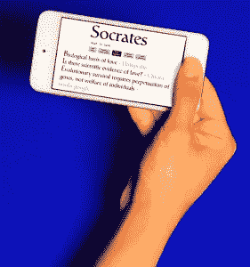

# 苏格拉底引擎为我们的搜索注入了批判性思维

> 原文：<https://thenewstack.io/socratic-search-engine-injects-critical-thinking-search-tools/>

现代信息时代让我们淹没在数据中，这可能是我们每天求助于谷歌等搜索引擎的主要原因，即使是最平凡或最深刻的问题也能找到答案。毫不奇怪，我们现代的求知仪式让一些人过早地宣称，不管是不是开玩笑，谷歌就是上帝。

但是，也许最好反思一下这种习惯性的、非常人性化的过度炒作的倾向。搜索引擎仅仅是工具，帮助我们在浩瀚的数据海洋中找到信息。英国评论家和投机设计师[泰德·亨特](http://www.ted-hunt.com/)指出，即使作为工具，像谷歌这样的搜索引擎也可以在引擎盖下大大改进。

为此，亨特设计了他所谓的[苏格拉底式搜索](http://www.ted-hunt.com/Socrates/)，一个将[苏格拉底式提问](https://en.wikipedia.org/wiki/Socratic_questioning)——基于古典希腊哲学家[苏格拉底](https://en.wikipedia.org/wiki/Socrates)的哲学——与谷歌定制搜索相结合的工具。定制搜索服务允许 web 开发人员创建一个定制的搜索引擎，将数十亿个索引网站削减到更精确的类别，这里它被赋予了一个哲学上的转折。

Hunt 解释说，这个项目背后的动机是让用户更深入地思考他们的问题和假设，为了更深入地了解任何主题而“质疑问题”，以及挑战驱动这些搜索工具的隐藏算法，而不仅仅是消费别人认为最相关的内容。

Hunt [向 Dezeen 杂志解释说](http://www.dezeen.com/2016/06/24/ted-hunt-socrates-search-google-socratic-method-royal-college-art-rca-graduate-project-design-interactions/)“关于技术使我们陷入‘搜索泡沫’和完全肯定的‘回音室’的倾向，已经写了很多，但很少主动帮助我们走出这些陷阱。“苏格拉底式搜索是一种帮助打破搜索泡沫、打开回音室之门的工具。技术的偏见，尤其是搜索引擎的偏见，往往隐藏在我们很少或根本无法控制，甚至意识不到的算法中。我们数字工具的简单变化，如引入更多哲学偏见，可能会在未来使搜索引擎用户能够选择通过他们自己的意识决定而不是算法来探索偏见。”

苏格拉底式搜索本质上引入了这位希腊哲学家著名的方法，通过定制的算法来帮助培养批判性思维。你被邀请键入一个问题或主题，但不是只按一个按钮就可以访问大量的页面和页面信息，从而获得更多的信息，而是有额外的按钮和标签可以沿着更有纪律的路线组织主题。这些按钮代表了解决任何问题的不同方法，受古代[苏格拉底方法](https://en.wikipedia.org/wiki/Socratic_method)的启发——要么通过寻求清晰，查看更多证据，挑战假设，探索替代方案，要么考虑其影响。

[https://www.youtube.com/embed/X1VcFggcLTY?feature=oembed](https://www.youtube.com/embed/X1VcFggcLTY?feature=oembed)

视频

## 对检索模式的再思考

亨特创建了这个项目，作为他在伦敦皇家艺术学院设计互动项目硕士学位的一部分，他测试了苏格拉底式搜索有史以来最常被谷歌搜索的问题之一:“什么是爱？”当在基于事实的“查看证据”类别的标题下查看问题时，人们会被引导到维基百科等地方，当使用“考虑暗示，即”时，人们会看到发人深省的作品，如 *[《爱情通论》](https://en.wikipedia.org/wiki/A_General_Theory_of_Love)。*

这个项目的目标是让我们更批判性地思考我们提出问题的背景，即“[检索模型](http://westminsterresearch.wmin.ac.uk/15453/)”，在这个模型下，搜索引擎运行并渲染所呈现的信息。亨特解释说:“(如果)传统搜索引擎使用一种算法来进行转换(将查询转换为一组文档)，那么苏格拉底式方法可以取代这种算法或增强这种算法，并在这样做的过程中，开始让那些进行搜索的人控制算法，这些算法创作通过我们问题的答案呈现的现实。”

Hunt 现在正致力于进一步开发这个概念性但最终有用的工具的功能，着眼于更大的愿景。“我希望像这样的投机(但功能正常的)工具可以开始为一个基于对智慧和知识的更复杂的欣赏而不仅仅是信息的商业交易的技术时代开辟新的道路，”亨特告诉我们。“在某些方面，我希望像这样的工具可能会像 T. S .艾略特要求我们考虑的那样；*我们在知识中失去的智慧在哪里？* *我们在信息中丢失的知识在哪里？*’

这是一个很好的问题，虽然我们可能无法找到一个明确的答案，但它肯定会让我们停下来思考我们需要问的其他问题。你可以查看一下[苏格拉底式搜索](http://www.ted-hunt.com/Socrates/)引擎，并访问 [Ted Hunt](http://www.ted-hunt.com/) 。

[https://www.youtube.com/embed/EB4MYGInRl4?feature=oembed](https://www.youtube.com/embed/EB4MYGInRl4?feature=oembed)

视频

专题图片:《苏格拉底之死》，雅克-路易·大卫，1787 年， [cc0](https://commons.wikimedia.org/wiki/File%3AGrecia_1.jpg) 。

<svg xmlns:xlink="http://www.w3.org/1999/xlink" viewBox="0 0 68 31" version="1.1"><title>Group</title> <desc>Created with Sketch.</desc></svg>