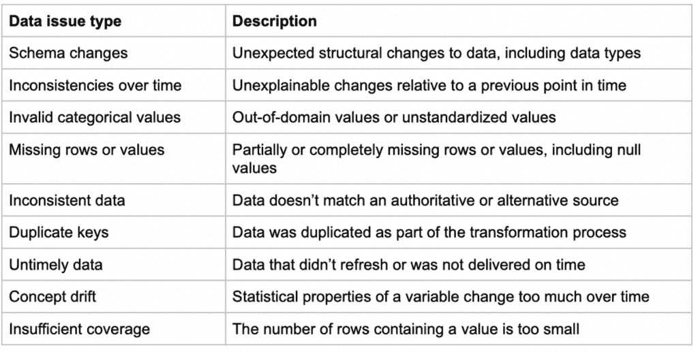

# Soda 检查保持您的数据一致

> 原文：<https://thenewstack.io/soda-io-checks-to-keep-your-data-in-line/>

最近有很多关于[数据网格](https://thenewstack.io/data-mesh-liberate-business-value-from-data-lakes-data-warehouses/)的谈论，它不是一种技术或服务，而是一种组织结构，它使数据的所有权更接近那些实际使用它为公司带来价值的人，正如[艾米丽·奥米耶](https://thenewstack.io/author/emily-omier/)最近在一篇帖子中解释的那样。

她引用数据管理系统提供商 Databricks 的现场工程高级副总裁[阿尔萨兰·塔瓦科利](https://www.linkedin.com/in/arsalantavakoli/)的话说:

*如果您有一个中央数据工程团队，他们对财务部门需要的数据集了解多少？或者任何业务部门需要的数据集？您越接近了解业务问题和需求并拥有领域知识的人，他们就越有准备来构建正确的数据资产集以支持正确的用例。*

比利时初创公司 [Soda](https://www.soda.io/) 将数据所有权向前推进了一步，使业务数据所有者也能够拥有数据质量。联合创始人[汤姆·贝恩斯](https://www.linkedin.com/in/tombaeyens/?originalSubdomain=be)和[马腾·马舍林](https://www.linkedin.com/in/maartenm/)从略微不同的角度来看待这个问题，但认识到一个共同的问题，于是这家公司诞生了。

“所有这些人一起工作，从他们拥有的数据中创造一些价值。事实证明，在生产中，最大的问题实际上是以一种清晰的形式保存数据。因为一旦你在生产中使用数据，工程师通常会去做别的事情，制造下一个产品。然后它就坏掉了，”贝恩斯解释道。

数据系统可能出现问题的方式有很多——可能就像有人在 Salesforce 中添加新字段一样简单——但传统上，工程师必须编写代码来检查生产中的数据质量，而数据分析师往往缺乏这方面的技能。Soda 团队开始改变这种情况，专注于数据分析师和数据工程师的需求。

## 数据作为代码

为此，它发布了 [Soda Core](https://www.soda.io/core) ，这是一个将数据可靠性检查和质量管理嵌入数据管道的框架，由 [SodaCL](https://www.soda.io/resources/introducing-a-new-domain-specific-language-for-data-reliability) (Soda Checks 语言)提供支持，这是一种针对数据可靠性的特定领域语言。

借鉴[数据即代码概念](https://thenewstack.io/the-coming-era-of-data-as-code/)，Soda Core 是一个[开源](https://github.com/sodadata/soda-core) CLI 工具和 Python 库，它使用户能够使用 SodaCL 将用户定义的输入转化为聚合的 SQL 查询。核心组件包括使用数据集元数据来了解数据的形状和健康状况，以及可用于验证许多数据质量参数的内置指标和广泛的检查覆盖范围。它们包括异常检测检查和随时间变化检查，以检测和解决数据中的问题，并向适当的人员发出警报。它是苏打云的基础，但也可以作为一个独立的工具使用。

[https://www.youtube.com/embed/Rd0HfVOK9qU?feature=oembed](https://www.youtube.com/embed/Rd0HfVOK9qU?feature=oembed)

视频

2021 年，该公司发布了 Soda SQL，以帮助数据工程师在生产中维护可靠的数据管道，并继续将其构建为一种特定的语言，使数据团队能够在从摄取到消费的每个数据工作负载中以代码形式检查数据。

作为一种更易于阅读的语言，SodaCL 消除了用 SQL 编写代码的需要，这意味着数据团队中的每个人都可以定义好数据需要的阈值。同时，它的底层仍然查询基于 SQL 的数据源。

这些是 SodaCL 中包含的 30 多个内置指标中的一部分:

巴西零售商 Americanas S.A .的大数据、分析和人工智能负责人 Tiago Andrade 表示:“现代零售环境已经发生了变化，对于像 Americanas 这样的组织来说，要继续提供尽可能最好的商业体验，我们依赖于我们零售平台背后的人工智能和人工智能驱动的数字引擎。

“这个平台是一个动态变化的实体，需要进行实时管理，以确保我们能够适应不断变化的条件，不会出现影响准确性和降低整体性能的错误。Soda 为我们提供了端到端的可观察性，我们需要对提供给我们引擎的数据更有信心，这意味着我们可以基于对数据健康状况的完全准确的了解，采取更加主动的方法，而不是对问题做出反应。”

Baeyens 说，它的用户强烈要求用一种特定的语言来保证数据的可靠性。一些公司已经在研究这种语言。

“当你想在生产中监控这些数据时，这意味着你需要建立一个好数据的图像，这样你就可以监控它，”他说。

“通常情况下，这是工程师专用的地形。他们必须写代码，他们知道如何写代码，然后他们必须学习库和所有这些。但我们的重点是…将它扩展到分析师和非技术用户。所以这种语言真的允许分析师变得自助。他们不必再依赖程序员来写这些支票。【用语言】比写代码简单多了。很好读。现在有更多的人可以为好的数据做出贡献。”

例如，您可以比较数据集，检查数据的新鲜度，或者配置一个[程序扫描](https://docs.soda.io/soda-core/programmatic.html)来创建一个断路器，以便在检测到问题时停止接收数据。

[https://www.youtube.com/embed/J5uvpTiKWCs?feature=oembed](https://www.youtube.com/embed/J5uvpTiKWCs?feature=oembed)

视频

它需要两个输入。一个是您所有的数据源配置，另一个是您想要做的检查。两者都是 YAML 配置文件。

Masschelein 说:“对于工程师来说，在数据进入的早期，插入他们的气流或编排工具非常容易。

其商业产品是托管云，包括协作工具、事件管理、与 Slack 的集成和其他功能。

## 群体意见

Soda 与 [Soda 基金会](https://www.sodafoundation.io/)无关，后者是一个由 Linux 基金会[运营的开源数据项目。](https://training.linuxfoundation.org/training/course-catalog/?utm_content=inline-mention)

该公司的首席技术官 Baeyens 之前创建了开源项目 jBPM，这是一个基于 JBoss 的工具包，用于构建业务应用程序以帮助业务流程自动化；和 [Activiti](https://www.activiti.org/) ，一个用于流程自动化的以 Java 为中心的业务流程模型和符号(BPMN)引擎。他还创建了 Effektif，这是一个基于云的流程自动化业务流程管理(BPM)解决方案，后来成为[SAP Signavio Process Governance](https://www.signavio.com/products/process-governance/)。

首席执行官 Masschelein 来自数据治理平台供应商 Collibra，该公司正在使用 Baeyens 的数据工具。两人在一个社区论坛上相识，Soda 于近四年前成立。这家总部位于布鲁塞尔的公司已经发展到大约 40 名员工。

它的用户和开源贡献者包括迪士尼、HelloFresh、Udemy 和圣裘德儿童研究医院。

例如，迪士尼为 SQL 查询引擎贡献了连接器，Hello Fresh 正在与该公司合作开发 Spark。

“所以你可以在数据框上使用它，这也很受欢迎，”Masschelein 说。“未来，我们也将朝着流媒体的方向发展。我们已经做了一些早期的原型。但我们希望确保覆盖从流到 Spark 到所有 SQL 源的整个领域。”

<svg xmlns:xlink="http://www.w3.org/1999/xlink" viewBox="0 0 68 31" version="1.1"><title>Group</title> <desc>Created with Sketch.</desc></svg>