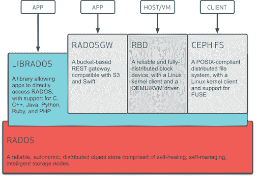
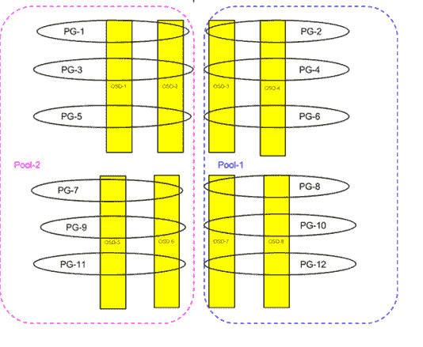
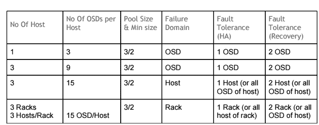
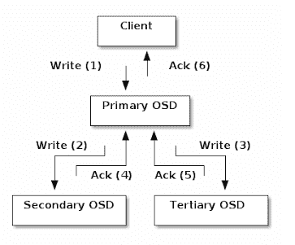
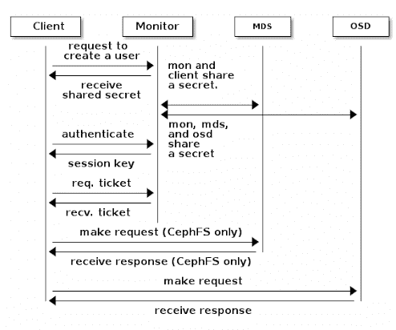

# 软件定义的存储之路，第二部分

> 原文：<https://thenewstack.io/software-defined-storage-ceph-way/>

这是关于软件定义的存储的三部分系列的第二部分。第一部分包括

[how to understand SDS](https://thenewstack.io/understanding-software-defined-storage/)

。在这篇文章和

[part three](https://thenewstack.io/software-defined-storage-with-an-understandable-interface-the-ceph-way-part-three/)

，我们探索 Ceph，一种流行的 SDS 解决方案。

Ceph 是一款功能全面、不断发展的软件定义存储(SDS)解决方案。它非常受欢迎，因为它有健壮的设计和扩展能力，并且它有一个繁荣的开源社区。Ceph 提供所有数据访问方法(文件、对象、块),并以其统一的存储方法吸引 IT 管理员。

本着 SDS 解决方案的真正精神，Ceph 可以与商用硬件一起工作，或者换句话说，不依赖于任何特定于供应商的硬件。ceph 存储集群足够智能，可以利用存储和计算任何给定硬件的能力，并通过使用 Ceph 客户端或其他标准协议和接口提供对虚拟化存储资源的访问。Ceph 存储集群基于可靠的自动分布式对象存储(RADOS ),它使用 CRUSH 算法来条带化、分发和复制数据。CRUSH 算法源自加州大学圣克鲁斯分校的 Sage Weil 的博士论文。以下是 Ceph 访问存储数据的不同方式的概述:

[](https://thenewstack.io/wp-content/uploads/2015/02/11.png)

图 1: Ceph 存储集群

## Ceph 存储集群

Ceph 存储集群是一组异构的计算和存储资源(裸机服务器、虚拟机甚至 Docker 实例)，通常称为 Ceph 节点，其中集群的每个成员要么作为监视器(MON)工作，要么作为对象存储设备(OSD)工作。Ceph 客户端使用 Ceph 存储集群将数据直接存储为 RADOS 对象，或者使用 RDB 或其他接口等虚拟化资源。Ceph 存储集群有许多组件，可总结如下:

## Ceph 监视器

Ceph monitor 是一个运行在 Ceph 节点上的守护进程，它保存了集群映射的最新副本。现在，假设集群映射是一个全局映射，它知道任何 RADOS 对象的位置，这些对象是实际数据块，并作为文件存储在 Ceph 存储集群中。任何希望与 Ceph 存储集群通信的客户端都需要有一个集群映射的副本，它可以从 Ceph monitor 的主副本中获得。由于该信息非常重要，因此建议运行多个 Ceph 监视器，以实现高可用性和集群健壮性。

Ceph 监视器还负责保存集群中其他监视器以及各种 OSD 守护进程的状态信息。在高度分布式的环境中，各种监视器可能会有不同的集群映射副本，或者关于 OSD 守护进程的不同状态的信息。为了保持这些监视器同步并始终向客户端提供正确的信息，使用了 Paxos 算法。 [Paxos 算法](https://en.wikipedia.org/wiki/Paxos_%28computer_science%29)作为各种 Ceph 监视器之间的共识建立方法，其中大多数运行监视器上的可用信息被认为是正确的。2N+1 个监视器中的多数是由 N+1 个正在运行的监视器形成的。例如，在总共有五个监视器的集群中，三个正在运行的监视器被认为是多数，即使其他两个监视器不可达，也可以建立关于集群状态的共识。

为了获得高可用性，建议让 Ceph 监控守护进程在专用的 Ceph 节点上运行。Ceph monitor 守护进程不需要非常高的计算资源，因此在超大规模环境中，甚至可以使用虚拟机来托管这些守护进程；然而，这些都是 Ceph 存储集群的关键组件，因此在选择主机或虚拟机时，应牢记所有故障场景。

## 对象存储设备

Ceph OSD 是一个运行在 Ceph 节点上的守护进程，负责存储 RADOS 对象。OSD 守护程序没有自己的在块设备中存储数据、块地址转换和其他相关任务的机制，而是将此任务外包给一个称为 OSD 后端机制的子系统。有各种可用的 OSD 后端机制，如 FileStore、KeyValueStore 和 MemStore。FileStore OSD 后端是最稳定的一个。文件存储后端利用任何支持扩展属性(XATTRs)的通用文件系统。XFS、Ext4 和 Btrfs 是可用的选项，但是 XFS 被认为是其中最稳定的。每个 OSD 守护进程在 OSD 主机上都有一个对应的挂载文件系统。每个 RADOS 对象都作为一个文件存储在挂载的文件系统中。这些 RADOS 对象根据 PGs 编号排列在目录中。

OSD 守护进程还与集群中的其他相邻 OSD 守护进程进行对话，然后可以更新 Ceph monitor 的状态，以及其他守护进程的状态，就像原始守护进程看到的那样。Ceph 监视器在它们之间建立共识之后，相应地更新聚类图。

每个 OSD 守护进程都应该由物理磁盘或 SSD 支持。此外，每个 OSD 可以使用专用或共享日志。日志通常由高速物理设备(如 SSD)支持，以提高写入性能。日志也是一个挂载的文件系统。写在日志中的对象然后被转储到属于 OSD 的适当的数据分区或磁盘。

## 元数据服务器(MDS Ceph)

这个守护进程用于存储 CephFS 元数据。它仅在需要对存储群集进行文件访问时使用。到目前为止，CephFS 还没有做好生产准备；CephFS 和 MDS 不在此列。

## 安置小组

放置组是一组 OSD，其中组中的每个 OSD 都有一个 RADOS 对象的副本。组中 OSD 的数量由副本数量决定。每个 PG 都有一个指定的主 OSD。RADOS 对象首先进入主 OSD，然后被复制到其他辅助 OSD、第三 OSD 等。每个放置组可描述如下:

```
&lt;pool_id&gt;.&lt;pg_id&gt;(primary_osd_num,secondary_osd.....)

```

例如:1.09(3，9，600) —这里的副本数是 3。

像 monitor 和 OSD 守护进程一样，pg 也有与之相关的状态。这些状态如下:

### 创造

Ceph 仍在创建安置组。

### 活跃的

Ceph 将处理安置组的请求。

### 干净的

Ceph 以正确的次数复制了放置组中的所有对象。

### 向下

包含必要数据的副本已关闭，因此放置组处于离线状态。

### 重播

OSD 崩溃后，放置组正在等待客户端重放操作。

### 剧烈的

Ceph 正在将安置组分成多个安置组。

### 擦洗

Ceph 正在检查安置组的不一致性。

### 堕落的

Ceph 还没有将放置组中的一些对象复制正确的次数。

### 不一致的

Ceph 检测放置组中对象的一个或多个副本中的不一致(例如，对象大小错误，恢复完成后一个副本中缺少对象。)

### 凝视

放置组正在进行对等处理。

### 修理

Ceph 正在检查放置组并修复它发现的任何不一致(如果可能)。

### 恢复

Ceph 正在迁移/同步对象及其副本。

### 回填

Ceph 扫描并同步放置组的全部内容，而不是从最近操作的日志中推断需要同步哪些内容。回填是恢复的一个特例。

### 等待回填

放置组正在排队等待开始回填。

### 回填-过满

回填操作正在等待，因为目标 OSD 超过其最大比率。

### 不完全的

Ceph 检测到放置组缺少有关可能已发生的写入的信息，或者没有任何正常的副本。如果您看到这种状态，请尝试启动任何可能包含所需信息的失败 OSD，或者临时调整 min_size 以允许恢复。

### 尿

放置组处于未知状态—自放置组映射更改后，监视器未收到其更新。

### 重新映射

放置组临时映射到 CRUSH 指定的一组不同的 OSD。

### 比一般尺寸小的

放置组的拷贝数少于配置的池复制级别。

### 凝视

放置组已对等，但无法为客户端 IO 提供服务，因为没有足够的副本来达到池的配置 min_size 参数。在这种状态下可能会发生恢复，因此 pg 最终可能会恢复到 min_size。

上述状态有些很明显，有些不那么明显。建议读者在阅读完其他章节后，重新审视这些状态。现在，知道放置组的最佳状态是活动+干净就足够了。

### 泳池

池是一组 PGs，RADOS 对象分布在其中。池也可以看作是一个虚拟化的存储分区，ceph 客户端可以用它来保存数据。一个池可能包含许多 rbd(远程块设备)、S3/Swift 对象(RADOS 网关接口)以及文件和元数据(CephFS)。池有四个基本属性:

1.  **PG Num:** 池中放置组的总数。
2.  **PGP Num:** 用于安置或分配池数据的安置组总数。这应等于安置组的总数，安置组拆分情形除外。
3.  **池大小:**池大小是一个对象被复制的次数。这决定了 PG 集合中 OSD 的数量。
4.  **池最小大小:**这是任何 PG 的 OSD 集中可用于/启动以满足 I/O 请求的最小 OSD 数量。如果在任何给定的 PG 中，可用/UP OSD 的数量低于该数量，则 PG 只能在 OSD 恢复后使用。

下图描述了 OSD、PGs 和 Pool 之间的关系:

[](https://thenewstack.io/wp-content/uploads/2015/02/21.png)

图 2:Ceph OSD、pg 和池(副本数量=2)

## 碾压规则和聚类图

任何分布式存储系统都是基于将数据分布在许多存储设备中，从而从这个资源池中的并行处理中获益。由于数据完整性和可靠性是任何存储系统的基本要求，因此应该有某种容错机制来确保在硬件故障的情况下数据的可用性和可靠性。数据复制是为存储系统提供容错的方法之一。在 Ceph 存储系统中，管理这种复制和分发的规则称为 CRUSH 规则。CRUSH 规则是为商用级硬件提供企业级可靠性的基础，因为它认为故障是集群中的常态，而不是例外。CRUSH 根据故障域来定义集群可靠性。每个故障域都包含一个对象副本。故障域可以是 OSD、主机、机架、数据中心、分区或区域中的任何东西。这提供了极大的灵活性和基于数据中心设计和可靠性要求的定制。默认情况下，故障域设置为主机，池大小和最小大小分别设置为 3 和 2。下面解释了不同挤压贴图和聚类配置的几个示例:

[](https://thenewstack.io/wp-content/uploads/2015/02/table.png)

为了参与数据管理和查找任务，Ceph 客户端和 Ceph OSD 都应该知道数据分布和复制方案。这种数据分布和复制方案或集群拓扑称为集群映射。分布式存储系统的早期方法是基于某个集中式守护进程来了解数据的位置，并充当客户端和服务器之间的代理。这种方法造成了瓶颈和单点故障。相反，Ceph 分散了有效计算物体位置信息的任务。它利用了 Ceph 客户端节点以及 Ceph OSD 节点的计算能力，其中两者都包含集群映射的副本并建立直接连接。集群映射不是单个实体，而是以下不同映射的集合:

1.  **监视器映射**:包含集群 fsid，每个监视器的位置、名称、IP 地址和端口。它还指示当前纪元、地图创建时间和最后一次更改时间。
2.  **OSD 映射**:包含集群 fsid、映射的创建时间和上次修改时间、池列表、副本大小、PG 编号、OSD 列表及其状态(例如，启动、进入)。)
3.  **PG 地图**:包含 PG 版本；它的时间戳；最后一个 OSD 地图时期；每个位置组的完整比率和详细信息，如 PG ID、Up Set、Acting Set、PG 的状态(如 active+clean)；和每个池的数据使用统计信息。
4.  **CRUSH map**:包含存储设备列表、故障域层次结构(如设备、主机、机架、行、房间)以及存储数据时遍历层次结构的规则。
5.  **MDS 地图**(仅在 CephFS 中使用):包含当前的 MDS 地图纪元，地图创建的时间和最后一次更改的时间。它还包含用于存储元数据的池、元数据服务器列表以及哪些元数据服务器已启动。

Ceph 客户端知道集群中的所有监视器和 OSD。它使用聚类图计算对象位置；它只需要 Pool-ID 和 object-ID 作为输入。基于这种计算，它知道与哪个 OSD 对话来获取或放置特定的对象。它只读写主 OSD。在写入的情况下，主 OSD 负责将其复制到 PG 集中的其他 OSD。

[](https://thenewstack.io/wp-content/uploads/2015/02/32.png)

图 3: Ceph 写操作

## Ceph 认证(CephX)

Ceph 还提供了一个类似 Kerberos 身份验证系统，称为 CephX。Ceph 客户端需要向集群中的任何监视器注册自己，并获得共享秘密。每个 OSD 守护进程还需要向任何监视器注册自己，并获得一个共享秘密。这些共享机密被复制到集群中的所有监视器上。当客户端希望与任何 OSD 通信时，它首先从监视器获得加密的会话密钥。客户端使用它的秘密密钥解密它，并从 monitor 请求一张票。收到票证后，它可以与群集中的 OSD 通信，直到会话超时。

[](https://thenewstack.io/wp-content/uploads/2015/02/41.png)

图 4: CephX 通信

## 部署简单的 Ceph 存储集群

建议仔细阅读官方文档，以部署任何生产集群。将这些步骤放在这里的目的只是为了说明:

### 可用硬件

*   **四台虚拟机**:运行 Ubuntu 14.04。
*   **三台裸机**:每台都有 Ubuntu 14.04。
*   **三个物理磁盘:**每个 1 TB。
*   **一块 SSD:** 400 GB。

### 前提

每个节点都应该有一个主机名，并且每个节点都应该能够解析其他节点的主机名。让我们假设这些节点命名如下:

*   **四个虚拟机**:管理节点、mon1、mon2 和 mon3。
*   **三款裸机** : osd-node-1、osd-node-2、osd-node3。

管理节点可以对所有其他节点进行无密码 SSH 访问。修复防火墙设置，并在官方文档中检查需要打开的端口。确保每个 Ceph 节点与其他节点时间同步。部署 Ceph 集群的流行方法是使用 Ceph-deploy。这个软件包应该安装在管理节点上。以下所有命令都是从管理节点执行的:

### 安装 Ceph

在管理节点上添加最新的稳定 ceph 存储库。请参考官方文档。

```
admin-node# ceph-deploy install mon-1 mon-2 mon-3 osd-node-1 osd-node-2 osd-node-3

```

### 创建集群

创建一个名为“ceph”的集群，将 mon-1、mon-2 和 mon-3 作为集群监视器仲裁的初始成员。

```
admin-node# ceph-deploy new mon-1 mon-2 mon-3

```

### 添加监视器

```
admin-node# ceph-deploy mon create mon-1 mon-2 mon-3

```

### 收集钥匙

从其中一个监视器中获取监视器创建的所有密钥。

```
admin-node# ceph-deploy gather-keys mon-1

```

### 列出磁盘

在每个 OSD 节点上寻找所有可用的磁盘。

```
admin-node# ceph-deploy disk list osd-node-1 osd-node-2 osd-node-3

```

这将显示每个主机可用的四个磁盘。每个主机中列出的 SSD 将充当日志。将/dev/sde 视为 SSD，可以将其划分为三个部分，每个分区对应一个不同的 OSD。

### 格式化磁盘

```
admin-node# for i in 1 2 3
do
for dev in sdb sdc sdd
do
ceph-deploy disk zap osd-node$i:$dev
done
done

```

### 创建 OSD

```
admin-node# for i in 1 2 3
do
for dev in sdb sdc sdd
do
ceph-deploy disk zap osd-node$i:$dev
ceph-deploy osd create osd-node$i:$dev:/dev/sde$i
done
done

```

### 检查健康状况

如果上述所有步骤都成功完成，您应该拥有一个正常运行的 Ceph 存储集群。您可以按如下方式检查集群的状态:

从任何 Ceph 节点(Mon 节点或 OSD 节点)

您应该会看到类似下面的内容:

```
cluster b0354daa-11ae-466e-ba51-99f3fe656978
health HEALTH_OK
monmap e1:  3  mons  at  {mon-1=10.242.43.96:6789/0,mon-2=10.242.43.98:6789/0,mon-3=10.242.43.100:6789/0},  election epoch  
202,  quorum  0,1,2  mon-1,mon-2,mon-3
osdmap e4210:  9  osds:  9  up,  9  in
pgmap v174144:  64  pgs,  1  pools,  0  data,  0  objects
100  MB used,  9000  GB  /  9000  GB avail
64  active+clean

```

### 创建 Ceph 池

从任一 Ceph 节点:

```
#ceph osd pool create mypool 512 512

```

它创建一个名为“mypool”的 Ceph 池，PG 计数为 512，后跟 pgp_num，默认副本计数(池大小)为 3。请参考官方文件来决定 pg 的数量。决定 PG_num 的一般公式如下:

```
Total PGs=  (Number of OSD *  100)/  pool size

```

成功创建池后，您应该能够看到 512 个 pg 处于活动+干净状态。

### RADOS 对象操作

```
#rados -p mypool put objectone infile1.txt
#rados -p mypool get objectone outfile2.txt

```

查看在 Ceph 集群中创建的对象，如下:

Pushpesh Sharma 目前在班加罗尔的 SanDisk 印度设备设计中心担任高级测试开发工程师。他在评估云、虚拟化和存储技术方面拥有超过六年的经验。他拥有政府工程学院 Kota (Raj)的工程(信息技术)学士学位。)，印度。他还拥有孟买 IIT SJMSOM 的市场营销和人力资源管理证书。在他的空闲时间，他喜欢阅读(主要是任何东西)和听好音乐，他喜欢美食和美酒。

<svg xmlns:xlink="http://www.w3.org/1999/xlink" viewBox="0 0 68 31" version="1.1"><title>Group</title> <desc>Created with Sketch.</desc></svg>