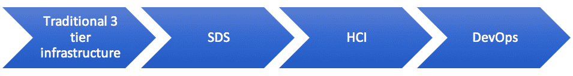
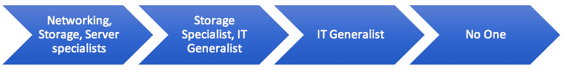

# 软件定义的存储还是超融合基础架构？

> 原文：<https://thenewstack.io/software-defined-storage-or-hyperconverged-infrastructure/>

[Kiran Sreenivasamurthy](https://www.maxta.com/)

[Kiran Sreenivasamurthy 是 Maxta 的产品管理副总裁。Kiran 将技术、营销和领导技能结合在一起，从概念和发布到收入阶段管理产品。他之前的职务包括担任惠普首席软件产品经理、应用和数据可用性专家 Mendocino Software 的产品经理以及 NetApp 的技术营销工程师。](https://www.maxta.com/)

很容易将软件定义的存储(SDS)与超融合基础架构(HCI)混淆。这两种解决方案都“软件定义”了基础架构，并从底层硬件中抽象出存储。它们都运行在商用服务器上，并且与虚拟化配合得很好。记者、分析师、供应商甚至经验丰富的 IT 专业人士都在谈论它们。

但是 HCI 和 SDS 之间有重要的区别。归结起来就是*您希望如何管理您的存储。* SDS 需要深厚的存储专业知识；HCI 没有。虽然资本成本有所不同，但运营成本要高得多。更重要的是，每种解决不同的问题，最适合不同的用例。

首先，让我们深入了解一下 HCI 和 SDS 的不同之处。

## 到底什么是超收敛？

供应商无疑增加了这个话题的混乱。许多人认为超融合是在一个节点上将计算和存储结合在一起，但它远不止于此。Hyperconvergence 通过将计算、存储和存储网络整合到标准服务器上的单个动态层来简化数据中心，并为虚拟机(VM)集成计算和存储服务，因此可以按需配置新的基础架构。这消除了虚拟化基础架构面临的最大挑战，即随着需求的增长处理规模和管理存储资源。

借助超融合，您无需成为存储专家。Hyperconvergence 将计算、内存和存储集中在一个平台上，并使存储在虚拟机管理程序中本机可用，因此您需要做的只是随着发展增加容量。

## 那么什么是软件定义的存储呢？

安全数据单可以有几种不同的形式。最突出的一种方法是使用带有软件层的商用服务器创建一个共享池，该软件层将其呈现为本机存储对象(通常是 LUN 或卷)。

软件定义的存储(SDS)通常通过使用行业标准服务器创建共享存储池来抽象物理存储的管理。它将您从传统存储阵列中解放出来，或将它们隐藏在软件层之下。该存储与计算和虚拟机管理程序层分开管理。

在许多情况下，SDS 可能是正确的方法。问题是，拥有 SDS 解决方案的供应商通常将其描述为超融合。它仍然是独立的存储，这是您选择基础架构平台时的一个重要考虑因素。

## 怎么知道是 SDS 还是 HCI？

与传统存储一样，SDS 资源需要独立于虚拟机进行管理。SDS 解决方案提供了需要映射到虚拟环境中的数据存储的 LUN 或卷。每次调配虚拟机时，您都需要确保存储可用或开辟另一个数据存储。换句话说，你需要成为存储专家并管理存储。正如我们将探讨的，这对于某些工作负载是有意义的，但是不要混淆这两种方法是很重要的。

超融合不仅仅是存储。所有这一切都只是为了管理虚拟机。它仍然是软件定义的基础架构，但围绕虚拟机构造而设计，而不是存储构造。在真正的超融合架构中，一切都在虚拟机级别进行管理。没有需要单独管理的 LUN 或卷。

## 您需要管理什么样的基础架构很重要

数据中心基础架构存在于一个“管理范围”中，也就是说，该范围的一端是传统的三层基础架构，包括存储、网络和服务器。它需要一个由各个领域的专家组成的团队来管理。另一方面，该基础架构是一个具有自我调配基础架构的 DevOps 模型，一旦它启动并运行，任何人都不需要担心日常操作。

## 基础设施模型

## 谁管理它 ****

## 从架构角度看 SDS 与 HCI

正如我们前面讨论的，这两种方法有不同的体系结构。

### 软件定义的存储

SDS 从底层硬件(通常是行业标准服务器)中提取存储，尽管一些解决方案也从现有阵列中汇集存储。然后，它以支持裸机或虚拟化工作负载的本机文件或数据块格式呈现存储对象。存储管理(性能、容量和可用性服务)通过 SDS 界面完成，计算资源通过虚拟机管理程序管理界面进行管理。

### 超融合基础设施

HCI 将存储、网络*和*计算抽象化，并将资源直接以其本机格式呈现给虚拟机管理程序。例如，在 VMware vSphere 中，存储只是作为数据存储对象呈现。HCI 在集群中只需要很少的资源管理。在某种程度上，任何事情都需要管理，这主要是通过一个单一的控制台来完成的。这使得 IT 通才可以管理一切。

### SDS 和 HCI 如何影响资本和运营成本

这两种架构对成本有不同的影响，尤其是运营成本。在你选择其中一个之前，了解它们的区别是很重要的。

### SDS 降低了资本成本，但会增加运营成本

大多数 SDS 解决方案运行在行业标准硬件上，不需要高端服务器硬件。这是一个好消息，因为您不必购买专有的存储阵列硬件，而且 SDS 允许您在发展过程中以较小的增量增加容量，通常只需向节点添加更多磁盘即可。

最大的资本支出通常是磁盘本身。其中一些是由应用程序性能要求决定的。任何要求延迟低于 1 毫秒的工作负载都至少需要一些昂贵的 NVMe 或 PCI 闪存，可能由企业级固态硬盘提供支持。然而，SDS 使用存储的效率对资本成本也有很大影响(对于 HCI 也是如此)。具有更高效的压缩、重复数据消除和控制复制因子等能力的解决方案将从硬件中获得更多收益。

SDS 的真正成本是管理存储的开销。您仍然需要一名或多名存储专家，并且仍然需要大量时间来调配、管理和优化存储。在这方面，它与存储阵列没有太大区别。

### 超融合降低了资本支出和运营支出成本，除非您选择不当

与 SDS 一样，HCI 可以使用行业标准硬件，与传统的三层基础设施相比，可以削减高达 80%的资本成本。但 HCI 有一个危险，那就是你最终可能会支付隐性税收。

基于设备的解决方案有时需要您通过添加额外的设备来增加额外的存储容量或额外的 CPU，这限制了您最初购买适量容量以及以后添加容量的灵活性。这意味着您最终购买的计算或存储往往会超出您的需求。当需要更新硬件时，设备也要贵得多，因为您要重新购买软件设备，而这些设备通常会将软件绑定到硬件上。

### 超融合软件提供了最大的灵活性

软件 HCI 解决方案允许您选择硬件，并根据自己的节奏添加容量或升级。从资本支出的角度来看，这提供了与 SDS 相同的优势。与硬件设备不同，您还可以轻松地独立添加计算和存储，因此您永远不会过度购买硬件。

从操作角度来看，HCI 还消除了存储管理。一切都“在一个屋檐下”，一个 IT 通才可以管理所有这一切。与传统存储甚至 SDS 相比，调配更多存储所需的工作最少，OPEX 成本降低了 60%。

### 根据工作负载及其管理方式选择解决方案

HCI 几乎总是虚拟化工作负载的最佳选择。它是专为虚拟化而设计的，它以本机方式将资源呈现给虚拟机管理程序。无论您是更新现有虚拟环境的基础架构，还是启动新项目，投资 HCI 都比投资传统存储或 SDS 更有意义。

这也适用于容器化的工作负载——大多数工作负载在一个虚拟机中运行。因为 HCI 已经完全抽象了存储层，所以它非常适合在虚拟基础架构上运行的任何容器工作负载。

SDS 对于可能无法虚拟化的工作负载非常有用。示例包括一些在边缘环境中运行的物联网或数据收集应用程序。可能需要直接连接到存储的数据库或其他系统也非常适合 SDS。

## 为工作选择合适的工具

HCI 是数据中心的多功能工具，或者(对于业余木匠来说)是台锯。在这个几乎一切都虚拟化的时代，它是大多数工作负载的绝佳平台。SDS 是一套梅花扳手，当你有一个需要它的项目时，你就可以使用它。

记住你要解决的问题。如果您关注 HCI 和 SDS，您几乎肯定会尝试通过替换传统存储阵列和提高灵活性来最大限度地降低存储复杂性和成本。这两种方法都能实现这一点，但 HCI 将在纯虚拟化环境中提供更好的结果。

最终，您可能会在您的组织中同时运行它们。一些工作负载将受益于 SDS(它只需要一个 Torx 扳手)，但大多数其他工作负载将与 HCI(多工具)一起工作。

<svg xmlns:xlink="http://www.w3.org/1999/xlink" viewBox="0 0 68 31" version="1.1"><title>Group</title> <desc>Created with Sketch.</desc></svg>