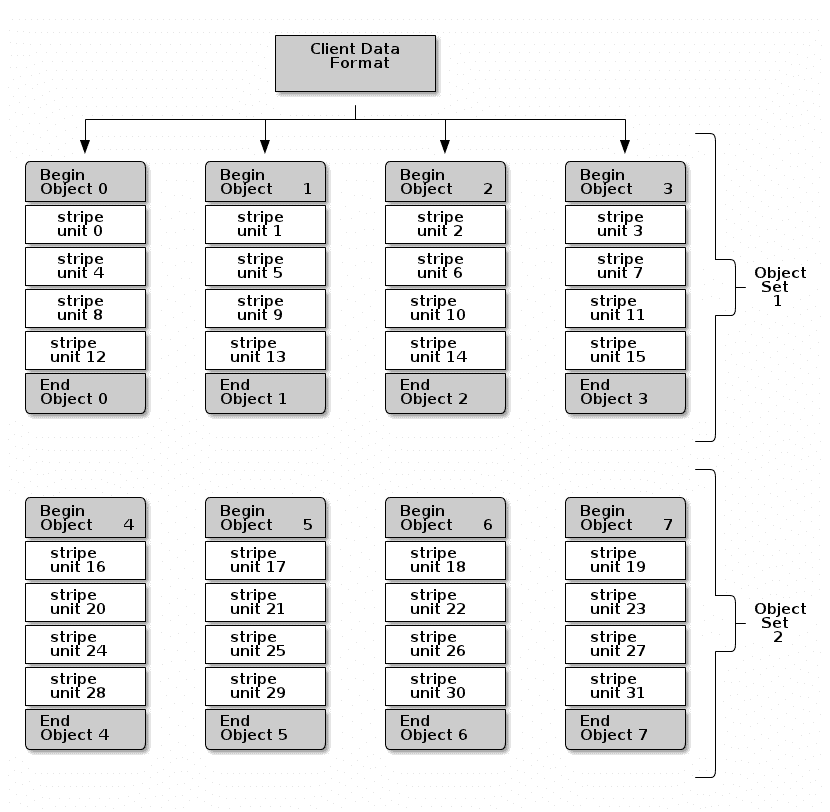

# 具有可理解接口的软件定义存储，Ceph 方式，第三部分

> 原文：<https://thenewstack.io/software-defined-storage-with-an-understandable-interface-the-ceph-way-part-three/>

这是软件定义的存储系列的第三部分。第一部分包括

[how to understand SDS](https://thenewstack.io/understanding-software-defined-storage/)

。在…里

[part two](https://thenewstack.io/software-defined-storage-ceph-way/)

在本帖中，我们将探讨 Ceph，一种流行的 SDS 解决方案。

如果没有一些存储消费者能够理解的标准接口，Ceph 存储集群及其强大和可扩展的设计就不是一个可用的存储。Ceph 为此提供的标准接口有:

1.  **RADOS 网关(RGW)**:HTTP 对象接口。
2.  **解除闭塞设备(RBD)** :闭塞界面。
3.  **CephFS** :符合 POSIX 的文件接口。

为了本文的目的，我们将讨论 RGW。

## 雷达网关(RGW)

RGW 是一个表述性状态转移(RESTful) API 服务，它向其客户端提供标准的 HTTP/Web 对象接口，并使用“librados”以 rados 对象的形式将客户端数据存储在 Ceph 存储集群中。HTTP/Web 对象是一个客户端概念，Ceph 存储集群对此一无所知。类似地，RADOS 对象描述了 Ceph 存储集群如何查看数据，而与 RGW 对话的 HTTP 客户端对 RADOS 对象一无所知。RGW 是一个 Ceph 客户端，它知道 Ceph 存储集群和集群映射。它也知道它的 HTTP 客户端理解的语义。RADOS 对象和 HTTP/Web 对象之间没有一对一的映射。相反，一个 HTTP/Web 对象被分成许多 RADOS 对象和 Ceph 存储集群来管理这些 RADOS 对象。HTTP/Web 对象的元数据和语义是分开存储的(还是以 RADOS 对象的形式)，只有 RGW 知道并负责将 RADOS 对象转换成 HTTP/Web 对象，反之亦然。

有三个概念与这种条带化机制相关:

### 1.条纹单位

条带单元是最小的数据单元。根据 RGW Ceph 客户端定义的对象大小和条带宽度(条带大小), HTTP 对象可以被条带化为许多条带单元。通常，除了最后一个条带，所有菌柄单元的大小都相同。例如，一个 1.1 MB 的 HTTP 对象可以分成五个条带单元(条带数= 5)，其中条带宽度为 256 KB 一个将获得四个大小为 256 KB 的条带单元，但最后一个条带只有 100 KB 的数据。

### 2.RADOS 对象

RADOS 对象有一个可配置的最大对象大小(2 MB，4 MB)。默认的 RADOS 对象大小是 4 MB。每个 RADOS 对象都有能力容纳许多条带单元。

### 3.对象集

这些条带单元被写入各种 RADOS 对象中。Ceph 客户端(RGW)以并行方式将属于特定 Web/HTTP 对象的所有条带单元写入这些 RADOS 对象。它们的 RADOS 对象充当一组磁盘，参与 RAID-0 配置，统称为“对象集”。由于每个 RADOS 对象属于不同的 PG、OSD 和磁盘，Ceph 客户端获得了出色的性能增益，因为它不受单个磁盘的限制，而是受许多磁盘的聚合速度的限制。

[](https://thenewstack.io/wp-content/uploads/2015/03/Figure-1.png)

客户端数据分条和 RADOS 对象

## HTTP 对象/Web 对象

HTTP 或 Web 对象是以这样一种语义方式存储的数据，即数据的所有者只知道唯一的统一资源标识符(URI)和用户凭证。它使用标准的 HTTP 方法(如 PUT、POST、GET、delete 和 HEAD)执行数据操作，如创建、删除、更新和管理数据。在另一端的 web 服务器上，或其为客户端请求服务的分支机构上，它处理所有相关的数据管理功能、可用性、可靠性和访问控制。

客户机和服务器之间的通信基于 RESTful API。RESTful web 架构因其更简单的设计、性能和可维护性而成为广泛采用的标准。RESTful web 服务及其架构的详细讨论超出了本文的范围；然而，有足够的资源来解释这个问题。这种服务的一些常见例子是亚马逊 S3 和 RackSpace 云文件。有一套标准的已发布 API 来访问和使用这些服务。亚马逊 S3 和 OpenStack Swift API 是广泛使用的对象存储 API。RGW 支持 S3 和 Swift APIs，并在它们之间提供一些互操作性。

## RGW RESTful 服务和 Web 前端

RGW 最初是作为一个可以插入 Apache web 服务器的 Fast_CGI 模块开发的。它服务于来自任何 web 客户端的 REST 请求，另一方面，它将使用“librados”与 Ceph 存储集群对话。然而，社区现在对一种新的方法更加开放，RGW 本身可以通过与 CivetWeb 紧密集成来处理 web 客户端。从 web 客户端来看，集成的方法使得 RGW 服务更容易配置，并且节省了响应时间。

要充当 RGW 服务器，主机应该是任何 Ceph 存储集群的 Ceph 客户端。为此需要单独的软件包集，即 ceph-client 和 librados，它们对任何 ceph-client 都是通用的。此外，radosgw 和 radosgw-agent 也需要成为 RGW 服务器。安装完这些包后，需要相应地更新 Ceph.conf。谨记当今数据中心的全球分布式设计，一个部署可以在不同的地理区域拥有多台 RGW 服务器。RGW 地区是一个逻辑地理区域，每个地区可能有许多地带。RGW 区域是一个或多个 RGW 实例的逻辑组。每个区域都有一个主区域，来自客户端的任何数据首先被写入主区域，然后被复制到该区域中的其他区域。对象可以从该区域的所有区域中读取，但只能写入主区域。Radosgw-agent 负责区域间和地区间的元数据同步。默认情况下，每个 RGW 地区使用一些 Ceph 池来存储其数据。Ceph 池也可以配置为使用不同的 Ceph 池。默认情况下，每个地区都有以下 Ceph 池:

*   。区域名称-区域名称. rgw
*   。区域名称-区域名称. rgw.control
*   。RegionName-ZoneName.rgw.gc
*   。RegionName-ZoneName.log
*   。RegionName-ZoneName.intent-log
*   。区域名称-区域名称.用法
*   。区域名称-区域名称.用户
*   。区域名称-区域名称.用户.电子邮件
*   。region name-zone name . users . swift
*   。区域名称-区域名称.用户. uid

RGW 实例使用所有这些池来保存区域和分区信息，以及用户信息和元数据。 <pool_prefix>.rgw.buckets 和 <pool_prefix>.rgw.buckets.index 分别表示默认的数据放置和数据索引池。也可以使用不同的池名称，但是保持这些池的后缀相同始终是一个好的做法。</pool_prefix></pool_prefix>

## RGW 用户和数据管理

在基于文件的访问机制中，数据以文件的形式查看，并排列在目录中，其中文件和目录属于用户或用户组。类似地，在基于 HTTP 的对象存储系统中，数据存储在 Web 对象中(可以等同于具有关联元数据的文件)，并且可以排列在容器(OpenStack Swift 术语)或桶(亚马逊 S3 术语)中。用户管理和访问控制机制由外部或集成认证系统提供。

按照 OpenStack Swift 的说法，每个 Swift 对象都属于一个容器。容器与某个帐户相关联。用户应该使用该帐户注册，才能访问该帐户中的容器和对象。用户具有某些分配的角色，并且对对象和容器具有部分、全部或无访问权限。每个用户在系统中都由一个唯一的帐户和用户名组合来标识。每个这样的用户都有一个密码。用户可以每次都使用 account:username 和 password，并让身份验证系统为其生成一个令牌，也可以生成一个令牌，并在所有后续请求中使用该令牌。令牌将在特定时间后过期。

按照亚马逊 S3 的说法，每个 S3 对象都存储在一个桶中。用户有一对或多对 access_key 和 secret_key。用户也可以使用其 access_key 和 secret_key 生成临时令牌。每个用户将拥有对存储桶和对象的部分或全部访问权限。

RGW 用户管理是两种方法的混合，以适应两种 API。首先创建一个用户作为 S3 用户，它有一个 access_key 和 secret_key。我们可以为这些用户添加更多这样的密钥对。每个用户可能有许多子用户。该用户:子用户组合可用作 Swift API 理解的账户:用户组合。子用户将用一些秘密密钥生成，甚至可以为它生成令牌。每个子用户可能有不同的访问权限，如只读、写、读写和完全控制。radosgw-admin 是一个提供管理用户、子用户和密钥的工具。

## 设置和测试小型 radosgw 部署

这里给出的步骤仅用于说明目的，所以仔细阅读任何实际部署的官方文档是明智的。我们已经在[上一篇文章](https://thenewstack.io/software-defined-storage-ceph-way/)中讨论过部署 Ceph 存储集群。对于此示例，我们将假设您已经有一个正在运行的 Ceph 存储集群，其拓扑结构如下:

*   **三个显示器** : mon-1，mon-2，mon-3。
*   **三个 OSD 节点** : osd-node-1、osd-node-2 和 osd-node-3。
*   **一个管理节点**:管理节点。

### 安装

我们将添加一个名为 rgw-1 的新节点。该节点需要 Ceph 客户端包，即 ceph-common、librados、radosgw、radosgw-agent。您可以使用 ceph-deploy 或 apt-get 在客户机上安装这些包。

### 密钥管理

生成 cephx 密钥并添加这些密钥，以便节点 rgw-1 可以访问 Ceph 存储集群。从任意监控节点执行以下命令:

```
sudo ceph-authtool  --create-keyring  /etc/ceph/ceph.client.rgw1.keyring
sudo chmod  +r  /etc/ceph/ceph.client.rgw1.keyring

sudo ceph-authtool  /etc/ceph/ceph.client.rgw1.keyring  -n  client.rgw1  --gen-key

sudo ceph-authtool  -n  rgw1  --cap osd  'allow rwx'  --cap mon  'allow rwx'  /etc/ceph/ceph.client.rgw1.keyring

sudo ceph  -k  /etc/ceph/ceph.client.admin.keyring auth add client.rgw1  -i  /etc/ceph/ceph.client.rgw1.keyring

```

### 配置 RGW 节点

在 Ceph 存储集群部署之后，admin-node 必须有一个生成的 ceph.conf 文件。添加以下部分来配置新的 radosgw:

```
[client.rgw1]
host  =  rgw1
rgw_socket_path  =  /tmp/rgw-1.sock
rgw_dns_name  =  rgw1
log_file  =  /var/log/radosgw/rgw-1.log
rgw_frontends  =  "civetweb port=8080"

```

在 ceph.conf 中进行任何更改后，它应该被复制到集群中的所有节点上。这可以使用 ceph-deploy 轻松实现，如下所示:

```
ceph-deploy  --overwrite-conf admin mon-1  mon-2  mon-3  osd-node-1  osd-node-2  osd-node3 rgw1

```

### 启动服务

确保您相应地设置了防火墙。ceph.conf 中提到的港口应向公众开放。

```
rgw1#sudo /etc/init.d/radosgw start

```

检查/var/log/radosgw/rgw1.log 中的日志，查看它是否已正确启动。

### 创建用户/子用户和密钥

```
sudo radosgw-admin user create  --uid=user1  --display-name="user1"  --email=user1@example.com

sudo radosgw-admin subuser create  --uid=user1  --subuser=user1:swift1  --access=full

sudo radosgw-admin key create  --subuser=user1:swift1  --key-type=swift  --gen-secret

```

在执行以下命令后，您应该会看到如下输出:

```
{  "user_id":  "user1",
  "display_name":  "user1",
  "email":  "user1@example.com",
  "suspended":  0,
  "max_buckets":  1000,
  "auid":  0,
  "subusers":  [
  {  "id":  "user1:swift1",
  "permissions":  "full-control"},
  ],
  "keys":  [
  {  "user":  "user1:swift1",
  "access_key":  "0H7I8DW8Q20C5HDQTV0O",
  "secret_key":  ""},
  {  "user":  "user1",
  "access_key":  "RTR9BKRLB9DRCDN5R6DE",
  "secret_key":  "JzjRmEgPepMVvG7dqea7OXmxJzW06t7j9cM95Qg7"}],
  "swift_keys":  [
  {  "user":  "user1:swift1",
"secret_key":  "asdJdfjsdhkjfhG7dqea7OXmxJzW06t7j9cM95Qg7yw5"},
  ],
  "caps":  [],
  "op_mask":  "read, write, delete",
  "default_placement":  "",
  "placement_tags":  [],
  "bucket_quota":  {  "enabled":  false,
  "max_size_kb":  -1,
  "max_objects":  -1},
  "user_quota":  {  "enabled":  false,
  "max_size_kb":  -1,
  "max_objects":  -1},
  "temp_url_keys":  []}

```

这里 s3 用户，user1 已经:

```
access-key=’RTR9BKRLB9DRCDN5R6DE’

```

和:

```
secret_key=’JzjRmEgPepMVvG7dqea7OXmxJzW06t7j9cM95Qg7’

```

Swift 用户 user1:swift1 拥有:

```
Password(secret_key)=”asdJdfjsdhkjfhG7dqea7OXmxJzW06t7j9cM95Qg7yw5”

```

### 测试 Swift 用户

Python Swift 客户端可以安装在任何能够访问 radosgw 主机“rgw1”的机器上。以下步骤描述了如何使用 user1:swift1 凭证创建和访问由 Ceph storage cluster 和 radosgw 提供服务的 swift 对象:

```
any-node#swift -A http://rgw1:8080/auth -U user1:swift1 -K secret-key-generatedlist

any-node# swift -A http://rgw1:8080/auth -U user1:swift1 -K secret-key-generatedupload mycontainer a-file-in-localdir

any-node# swift -A http://rgw1:8080/auth -U user1:swift1 -K secret-key-generated list

any-node# swift -A http://rgw1:8080/auth -U user1:swift1 -K secret-key-generated download mycontainer any-object-name

```

同样，您可以使用 s3curl、s3cmd 或任何其他 s3 客户端来执行任何 s3 对象操作。ceph.com 提供了受支持的 swift 和 S3 API 的完整列表。

Pushpesh Sharma 目前在班加罗尔的 SanDisk 印度设备设计中心担任高级测试开发工程师。他在评估云、虚拟化和存储技术方面拥有超过六年的经验。他拥有政府工程学院 Kota (Raj)的工程(信息技术)学士学位。)，印度。他还拥有孟买 IIT SJMSOM 的市场营销和人力资源管理证书。在他的空闲时间，他喜欢阅读(主要是任何东西)和听好音乐，他喜欢美食和美酒。

通过 Flickr Creative Commons[获取专题图片。](https://www.flickr.com/photos/bryanwerner/8326177679/in/photolist-dFKQxz-dUjDBG-8myJwG-ez5EW-dQaAKm-nw83QE-dwt9RM-7eXmT-hQnXvC-Qx5Vb-bWhWCQ-QCD4P-8DS3V1-fqXNnz-6sockN-eQjCWf-9cVJnb-dvcxtK-8cE3xF-oQcyLR-hm7fvj-cWsCwE-doz7qH-nmep66-2SUEQ4-dZuc33-oR14Wj-p72vJG-8fiEs2-668vzB-5Qn9E2-62vgGK-qL9eWn-a3MinN-7g9WZf-aQ3VH-qqeDWG-bkXepi-nX3exi-6XS6SE-3E47nj-53vHJp-avhTXA-hehtwj-ckDvL9-5uajjw-auPx4B-jdXpeU-6LsJgw-67xBfB)

<svg xmlns:xlink="http://www.w3.org/1999/xlink" viewBox="0 0 68 31" version="1.1"><title>Group</title> <desc>Created with Sketch.</desc></svg>