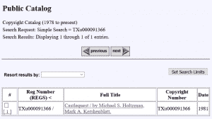

# 软件开发人员为一个 41 岁的心爱的文本冒险追踪代码

> 原文：<https://thenewstack.io/software-developer-tracks-down-code-for-a-beloved-41-year-old-text-adventure/>

“你在一间陈旧发霉的卧室里，一张巨大的、失去光泽的黄铜床上。天花板上挂着蜘蛛网……”

20 世纪 70 年代末，当两名学生从纽约伦斯勒理工学院毕业时，他们留下了交互式文本冒险“Castlequest”，该游戏一直安装在学校的计算机系统上。

40 多年后，经过五年的寻找，那个游戏的原始 Fortran 代码被重新发现并复活了，这要归功于一位业余游戏保护主义者的勤奋努力，他对 11 岁时玩这个游戏有着美好的回忆。这是一个关于奉献和毅力的故事，但最重要的是，一个人对一小块科技文化的喜爱能走多远。

知道记忆*可以被保留，童年的快乐可以再次体验，即使只是恢复一个关于探索中世纪城堡的幻想大学生游戏，这也令人感到安心。*

## 回到未来

十多年来,“Castlequest”一直被遗忘，直到 1994 年，一名来自当时正在发展的名为 Source 的在线服务的访问者在大学里发现了它。他联系了游戏的两位作者——迈克·霍尔茨曼和马克·克申布拉特——提出将他们的游戏移植给源代码(并分享版税)。后来，这款游戏被移植到另外两个互联网出现之前的在线服务上，一个是 CompuServe，另一个是通用电气公司提供的在线服务，已经积累了超过 350，000 名用户，即 GEnie。

其中一个顾客是亚瑟·奥德怀尔，他 11 岁，是两个程序员的儿子。他非常喜欢玩“Castlequest”到了中学，他甚至开始设计自己的业余互动小说游戏。“我肯定比一般 90 年代的孩子更容易接触到文字冒险，”奥德怀尔在一次电子邮件采访中告诉我。

从互动小说游戏“[巨大洞穴探险](https://en.wikipedia.org/wiki/Colossal_Cave_Adventure)”开始，奥德怀尔将全力发展拯救经典电脑游戏的爱好。

程序员威尔·克罗泽(也是阿帕网开发团队的一员)在 20 世纪 70 年代中期为 PDP-10 主机创作了这款游戏。这款命令行游戏仍然让人记忆犹新，它模拟了探索一个洞穴，同时收集宝藏和解决谜题——并向世界展示了计算机在游戏中的潜力。2012 年，奥德怀尔甚至在 Kickstarter 上发起了一项活动，成功资助了将《冒险》改编成桌游的活动。

奥德怀尔后来创建了一个可在线玩的“冒险”版本[，它是基于著名数学家唐纳德·克努特在 1998 年创建的版本](https://quuxplusone.github.io/Advent/)的[，使用 CWEB 编程系统改编了最初的 Fortran 源代码。](https://twitter.com/ColossalCaveTBG/status/1348327192158212102)

这反过来促使奥德怀尔去探索还存在哪些其他形式的冒险。他仍在寻找一些失踪的宝藏——包括大卫·龙的 751 分“新冒险”，以及科罗拉多州立大学的一个版本，其中有一个女巫的姜饼屋。所以他[发布了一个在线请求](http://www.club.cc.cmu.edu/~ajo/in-search-of-LONG0751/readme.html)——事后补充道，他也在寻找其他丢失的电脑游戏，“那些我小时候玩过的”，比如龙的副本《黑龙……和 Castlequest》。"

不幸的是，“在 GEnie([连同 Source 和 Compuserve)消亡之后，这款游戏似乎已经永远失去了，”奥德怀尔在博客文章中写道[。从 2016 年开始，他与游戏的原创者之一交换了一些电子邮件。但是去年有了一个重要的发现。40 年前，最初的程序员之一已经向美国版权局提交了注册。奥德怀尔发现登记“已经在华盛顿特区深处的某个地方存档 40 年了。”](https://quuxplusone.github.io/blog/2021/03/09/castlequest/)

今年 10 月，其中一位原作者同意尝试检索他们最初提交的副本。没人记得他们提交了什么。它可能只是游戏运行时的文本记录，或者是总结游戏所有事件的“漫游”。但当版权办公室的员工进入他们的物理存档并检索原始存款时，结果是所有的游戏原始代码(用 VS Fortran 编写)。

整整 78 页。

霍尔茨曼在他大学毕业后在格鲁曼数据系统公司的第一份工作中就已经把这些都打印出来了…

“我很激动，”奥德怀尔告诉我，并补充说，没有一个最初的程序员期望他们的文件包括所有代码的完整副本。Kershenblatt 与他的代码重聚，满怀深情地扫描了所有 78 页(在当地的一家 Staples 商店)，然后将结果文件上传到 Dropbox。O'Dwyer 指出，这遇到了光学字符识别的限制，在探索了几种重新扫描结果的方法之后，O'Dwyer 最终决定自己手动转录 pdf。

"经过三天的疲劳，我有了一个纯文本版本的代码！"

当他试图运行代码时，GNU 的免费 Fortran 版本(gfortran 4.9)一直给他一个关于不兼容数据类型的错误消息。O'Dwyer 后来在博客中写道，Fortran IV 实际上没有专门的字符串数据类型，所以它们被存储在其他变量中(如整数)，然后再转换回字符串。但是通过对代码做一些战略性的调整，他让代码可以编译了。有一次，他甚至咨询了他的母亲，她现在是 T2 退休的计算机程序员。

## 死而复生

最终的结果是一个小而辉煌的游戏复兴，由互动小说网站上的[讨论线程证明，新用户正在重新发现它的乐趣——甚至一些显然存活了 40 多年的 bug。一个用户描述了如何让它在他们的 Windows 系统上运行(使用 Linux 的 Windows 子系统)。另一个人指出，“这个游戏太老派了，它要求你输入全部大写字母。”](https://intfiction.org/t/castlequest-1980-text-adventure-recovered/49860/66)

但在达到快乐结局(包括欢呼的村民)后，一名玩家称整个游戏“相当迷人”

奥德怀尔自己写了一篇博文[，描述了他多年后终于玩上这款游戏的经历](https://quuxplusone.github.io/blog/2021/03/19/all-the-adcastlequest-part-1/)。虽然“我刚刚花了三天时间抄写源代码，所以我已经看到了游戏的每一行——但我仍然相对完好无损。”

他很快就画出了庄园的地图——走廊、客厅、门厅、吸烟室——并再次发现门边那把神秘的伞——还在滴水！—还有挂在栏杆上的那件不祥的黑色斗篷…

<svg xmlns:xlink="http://www.w3.org/1999/xlink" viewBox="0 0 68 31" version="1.1"><title>Group</title> <desc>Created with Sketch.</desc></svg>