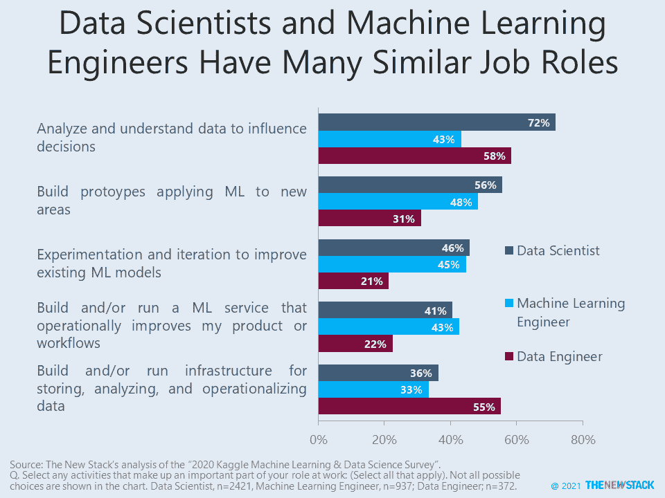
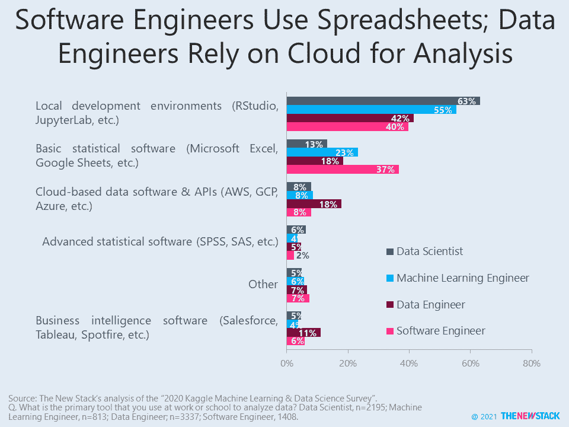
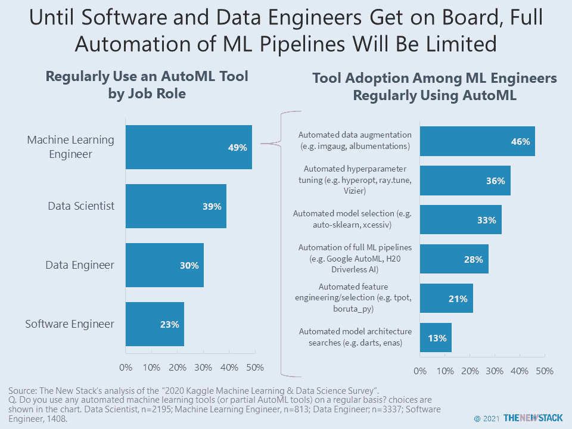

# 软件工程师使用电子表格；数据工程师使用云

> 原文：<https://thenewstack.io/software-engineers-use-spreadsheets-data-engineers-use-the-cloud/>

根据" [2020 Kaggle 机器学习&数据科学调查](https://www.kaggle.com/c/kaggle-survey-2020)，构建或运行数据基础设施是 372 个数据工程师工作中 55%的重要部分这些[数据工程师](https://thenewstack.io/data-engineer-critical-role-for-data-success/)支持数据科学应用以及其他用例。数据工程师实际上更有可能(58%)分析和理解数据，以便影响决策，这是他们工作的一部分。

数据科学家专注于分析，这对于机器学习(ML)工程师来说没有那么重要。尽管如此，Kaggle 调查中的 2421 名数据科学家和 937 名机器学习(ML)工程师之间仍有许多相似之处，大约有相同比例的人改进 ML 模型，以及建立/运营 ML 服务来改进产品或服务。

18%的数据工程师使用基于云的软件和 API 作为主要工具来分析数据的可能性是数据科学家的两倍多。他们还展示了在云端分析数据的更大可能性。像 [Jupyter Notebooks](https://jupyter.org/) 这样的本地开发环境[最有可能被我们审查的所有工作角色](https://thenewstack.io/usenix-jupyter-notebooks-could-help-sres-better-sleuth-incidents/)使用。被定义为电子表格的基本统计软件在软件工程师中非常流行。这是一个提醒，仅仅因为他们知道 Python 并不意味着开发人员将使用数据工具进行数据科学。

通过 Pixabay 的特征图像。

<svg xmlns:xlink="http://www.w3.org/1999/xlink" viewBox="0 0 68 31" version="1.1"><title>Group</title> <desc>Created with Sketch.</desc></svg>