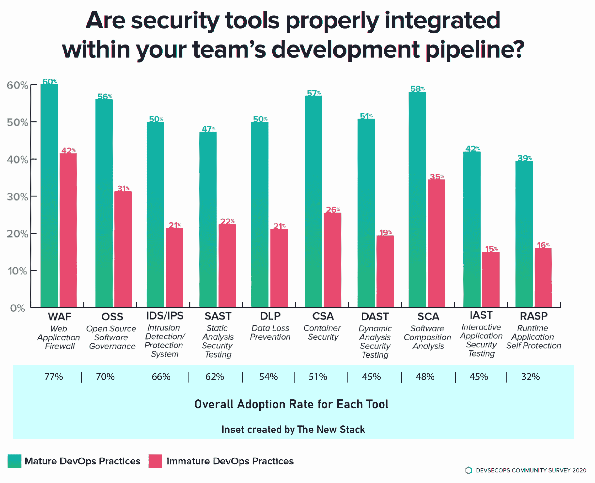

# 加起来:将安全性集成到开发管道中

> 原文：<https://thenewstack.io/software-supply-chain-secure-3/>

在开发管道中集成安全工具仍然具有挑战性。根据 [2020 DevSecOps 社区调查](https://www.sonatype.com/2020survey)，不到 60%的具有成熟开发运维实践的公司正确集成了一般的安全工具。实际数字从那时起急剧下降；没有接受跨团队沟通的 DevOps 咒语的公司通常有两倍的可能性没有正确集成安全工具。

并非此图表中的所有工具都必须集成到 SDLC 的每个阶段。

如果没有成本的话，DevOps 专业人员会把他们能做的任何事情都整合到他们的管道中。在最近与来自 DevOps 自动化公司 [Sonatype](https://www.sonatype.com/) 的 [Derek Weeks](https://www.linkedin.com/in/derekeweeks/) 的一次谈话中，他解释道:“如果你集成了一个要花两个小时来分析的东西，而你却每小时发布一次，没人想要那个税。”因此，开发人员会找到集成工具的变通方法。

就其本质而言，软件组合分析和容器安全工具需要集成到 CI/CD 管道中。它们的有效性取决于它们的自动化程度和所有相关利益攸关方的认同程度。为了更好地理解这个主题，我们邀请读者参与一个关于 CI/CD 管道安全性的一分钟[投票](https://www.surveymonkey.com/r/software_supply_chain?x=April30post)。

通过 Pixabay 的特征图像。

Sonatype 是新堆栈的赞助商。

<svg xmlns:xlink="http://www.w3.org/1999/xlink" viewBox="0 0 68 31" version="1.1"><title>Group</title> <desc>Created with Sketch.</desc></svg>