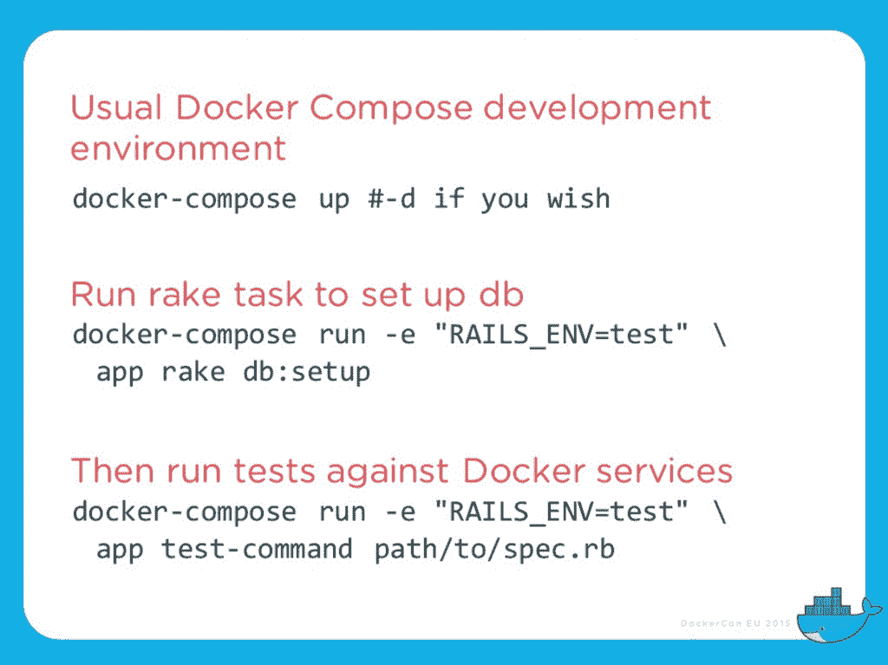
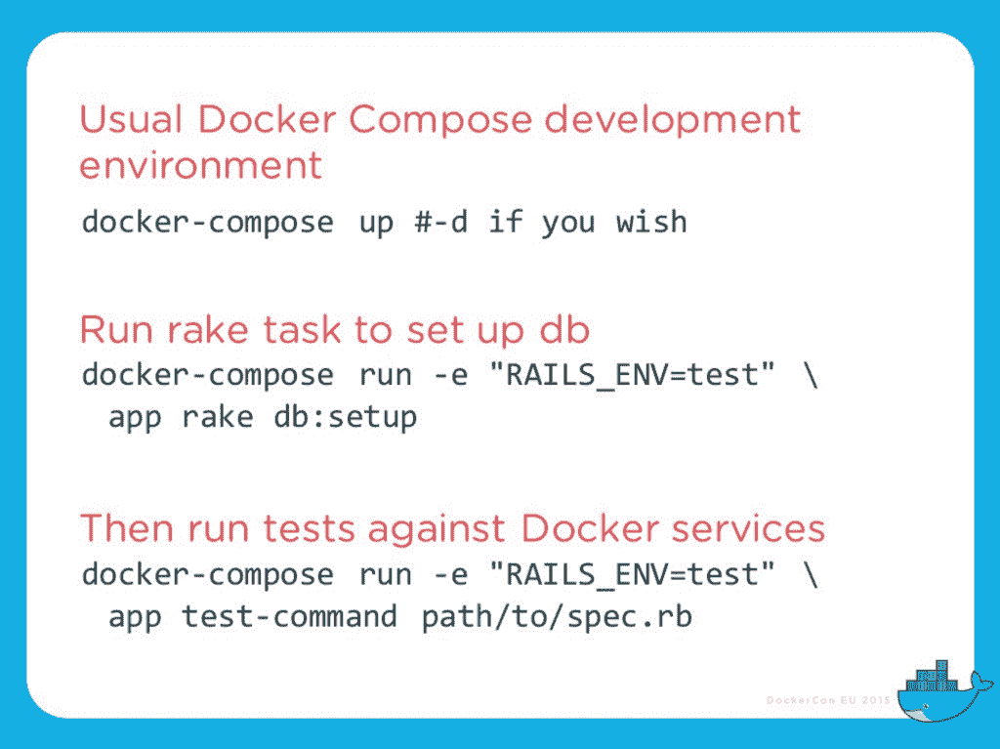
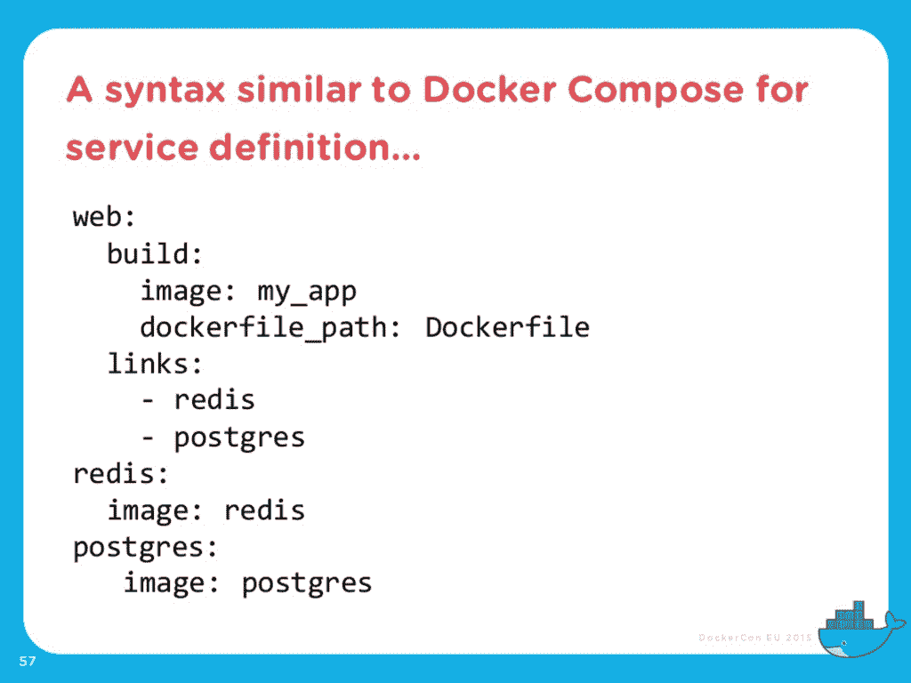
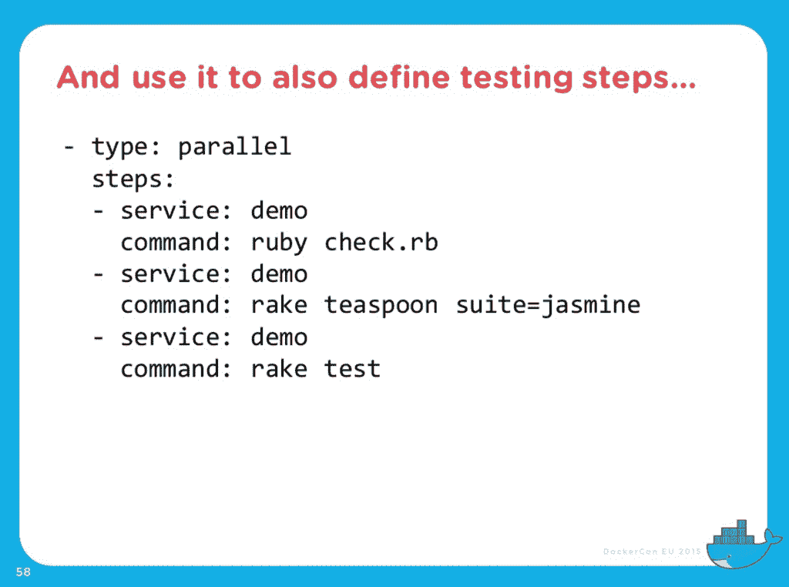
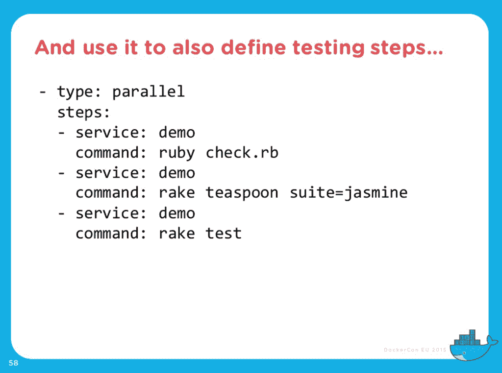
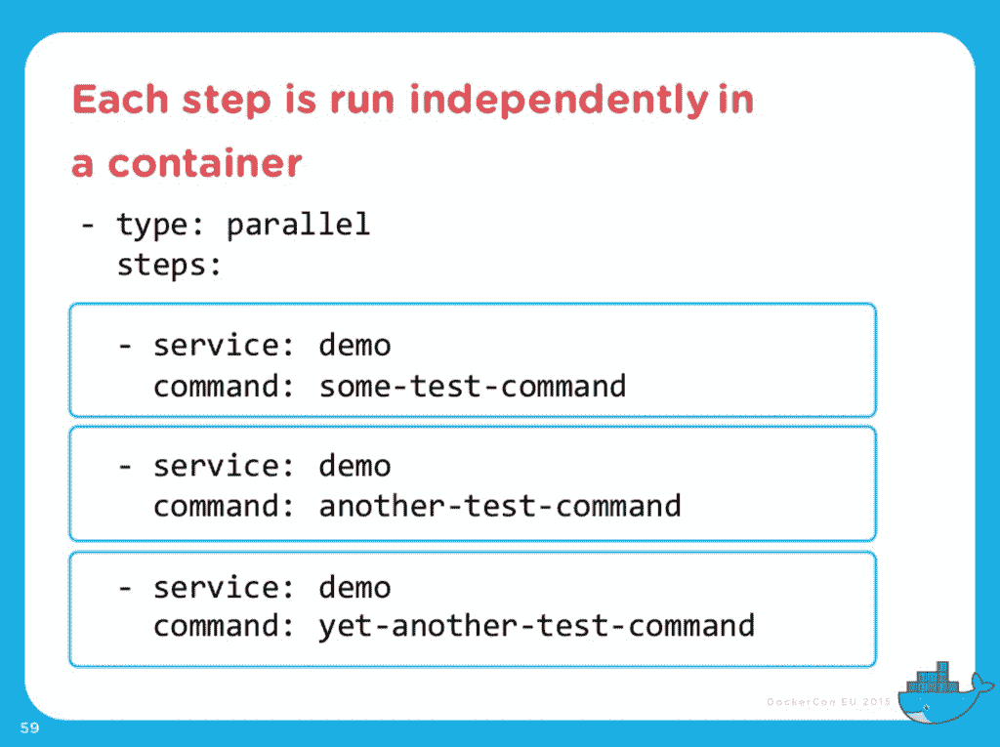

# DockerCon EU:用 Docker 进行软件测试

> 原文：<https://thenewstack.io/software-testing-docker/>

正如 Docker 的创始人 Solomon Hykes 本周在 [DockerCon EU](https://docker.events.cube365.net/dockercon-live/2021/) 所说，“我们都对我们代码的质量负责。”

测试是好的，不测试是坏的。充分和全面的测试覆盖允许您在不破坏东西的情况下更新，验证更新的功能，并检查以确保您的持续集成和持续交付(CI/CD)以及确保重构不会破坏现有的功能。

就是这么简单——你必须尽早并经常测试——但是坚持这一理念并不那么简单。除了有太多事情要做而时间太少的明显障碍之外，测试还会极大地降低部署速度，并且会花费很长时间。

你需要做的是用一种不占用时间和空间的高效方式进行测试。Docker 作为一种可能的解决方案应运而生。

这正是持续集成和交付公司 [Codeship 的](https://codeship.com/) [Laura Frank](https://twitter.com/rhein_wein) 在她的 Dockercon 演讲中所提倡的，题目很恰当，叫做“停止懒惰，测试你的软件”

## 使用 Docker Compose 进行测试

Frank 使用 Docker 大约两年了，从 0.7.0 版本开始。她的演讲集中在用简单的代码例子来表达测试模式，作为一种至少减轻一些与测试相关的挫折的方法。

“Docker 是一种非常简单的方法，可以在许多平台上提供非常可预测的测试，”Frank 说。

她首先介绍了如何通过 Docker Compose 进行测试，她说这使得创建一致的、可重复的环境变得非常容易。“我们中的许多人已经使用 Docker Compose 来建立开发环境，但我们就此止步，我们在 Docker Compose 之外运行测试，”Frank 说。

“在大多数情况下，您需要做一些设置来运行不同的测试，甚至可能需要一个不同的 docker 文件来运行测试——但事情就是这么简单，”她继续说道，并提供了下面的例子。

她还提到，您可以立即使用 Docker Compose 对服务运行一次性命令。

更多 Docker Compose 测试配置选项[可以在她的幻灯片](http://www.slideshare.net/rheinwein/stop-being-lazy-and-test-your-software)中找到。她还发现 Docker 为更好的依赖性管理提供了一个很好的解决方案。

Frank 还推荐使用 Docker Compose 作为测试和开发环境。“Docker 提供了一个可预测和可重复的测试环境。它将与您的开发环境完全相同，您也可以轻松地对其进行更改和扩展，”Frank 说。

## Docker 如何实现简单的 CI/CD 测试

首先也是最重要的，如果您想要持续集成——实际上，如果您也想要持续交付，不破坏任何东西——您需要不断地测试，这样您就可以在生产中得到您的错误，而不是 CI/CD 系统的失败运行。

“我们负责推送代码，然后审查它，但是没有测试覆盖，你不能这样做，”Frank 说。"我们在开发过程中运行单元容器，所以我们也应该在测试容器中运行它们."

如果您也可以在容器内部运行测试，在开发和部署期间隔离测试，会怎么样？同样，Frank 认为，如果你在开发期间在容器中运行服务，为什么不在生产中在容器中运行它们呢？这一切都使你能够尽早快速地失败。

她在 Codeship 上说，“我们让詹金斯在一个容器中运行，然后我们希望我们的其他服务，我们希望詹金斯拥有控制权。”

> 在 Docker 中运行 Docker 并不总是很棒…

但这并不都是美好的。正如[杰罗姆·佩塔佐尼写的](https://jpetazzo.github.io/2015/09/03/do-not-use-docker-in-docker-for-ci/)，在 Docker 中运行 Docker 并不总是很棒。他警告您要小心，确保内部 Docker 不会试图应用与外部 Docker 冲突的安全配置文件。

Petazzo 说:“我的修改在我的 Debian 机器和 Ubuntu 测试虚拟机上工作(并且所有测试都将通过),但是它在另一台机器上会崩溃和燃烧。此外，有许多组合是行不通的，比如把 AUFS 放在 AUFS 的上面。他说，许多问题都有解决办法，比如“如果你想在内部 Docker 中使用 AUFS，只需将 *`/var/lib/docker`* 升级为卷就可以了。”

为了避免数据损坏，Petazzo 提供了最后一条建议:“Docker 守护进程被明确设计为独占访问 *`/var/lib/docker`* 。其他任何东西都不应该碰、戳或挠藏在那里的任何 Docker 文件。”Frank 提供了将 Docker 套接字与共享守护进程绑定的替代方案。

## 如何使用 Docker 进行并行测试

Frank 说，当你在开发时，你可以倾向于把容器想成一个运行特定工作负载或特定应用程序的小型虚拟机，“但是如果我们可以改变我们的思维，把容器创建为进程而不仅仅是机器，我们就可以让自己更有想象力”，拥有多个进程。她用下面这些步骤来说明它:

与 Docker Compose 类似，您定义不同的测试步骤，每个步骤都作为一个容器独立运行。“伟大的事情是，Docker 使这些东西完全相同，你可以分拆不同的群体，”弗兰克解释说。

Frank 分享了免费下载的关于 [Codeship 自己的工具 jet](https://codeship.com/documentation/docker/installation/) 的信息，jet 在你的开发环境中本地运行。

对于 jet 和 Docker，“它们都有点混合在一起，但它们都聚集到一个来源，”Frank 说。"使用这种并行管道类型的框架，如果质量下降，您可以添加一个额外的管道来失败."

她接着说，如果您致力于质量，您应该将您当前的覆盖率与之前的覆盖率进行比较。

Frank 最后以对所有开发人员的合理建议和测试的重要性结束了她的讲话:“更加努力地工作，知道你是错的。”

Docker 是新堆栈的赞助商。

<svg xmlns:xlink="http://www.w3.org/1999/xlink" viewBox="0 0 68 31" version="1.1"><title>Group</title> <desc>Created with Sketch.</desc></svg>