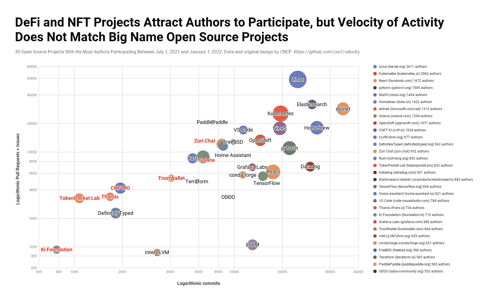

# 索拉纳区块链撞上开源 Top 10

> 原文：<https://thenewstack.io/solana-blockchain-crashes-into-open-source-top-10/>

[Lawrence Hecht](https://thenewstack.io/author/lawrence-hecht/)

[Lawrence 在近 25 年的时间里，对企业 IT B2B 市场和技术政策问题提出了切实可行的见解和报告。他经常与客户一起开发和分析关于开源生态系统的研究。他之前为一家初创公司管理“客户之声”调查，这家公司最终成为标准普尔全球市场情报的一部分。劳伦斯在乔治敦大学获得公共政策硕士学位，在罗格斯大学获得文学学士学位。](https://thenewstack.io/author/lawrence-hecht/)

根据 2021 年后六个月代码作者的数量，大量的资金和大量的热情使七个 Web3 项目进入了前三十个开源项目。根据[Cloud Native Computing Foundation](https://cncf.io/?utm_content=inline-mention)上个月[发表的一份分析报告](https://www.cncf.io/blog/2021/12/15/end-of-year-update-on-cncf-and-open-source-velocity-in-2021/)，Solana 对社区的[推动可能会有回报，因为它比其他 Web3 项目有更多的开发人员参与，更重要的是，它展示了与开源社区的主要支柱不相上下的项目速度。](https://solana.com/community)

CNCF [开始](https://www.cncf.io/blog/2017/06/05/30-highest-velocity-open-source-projects/)分析项目速度，试图表明活动水平，而不仅仅是 GitHub 明星或贡献者的数量，是一个软件项目长期健康的指标。五年后，这些项目中的十个仍然在排行榜上，Linux、Kubernetes、dotnet(。NET)、React、NixOS 和 VS Code 都继续保持着令人印象深刻的提交水平，与之相匹配的是大量社区成员提出拉请求和提交问题。

读者会注意到，该图中的确切数字与 Electric Capital 最近的报告中的数字不符，该报告显示 [*Web3 开发者生态系统很小，但在 2021 年*](https://thenewstack.io/web3-developer-ecosystem/) 有很大增长。前者包括来自非开发者生态系统的数据，如 [DappRadar](https://dappradar.com/) 和 [CoinMarketCap](https://coinmarketcap.com/) 。

这两项研究都包括了来自 GitHub 以外的来源的数据，这在未来可能会变得越来越重要。例如，几个月前，GitHub 上的协作平台 Zuri Chat 的活动急剧下降，当时他们制定了一条规则，只有患有 NFTs 的人才能加入其分散自治组织(DAO)并成为项目的贡献者。

[CNTF.io](https://cnft.io/) 是最近为 Cardano 不可替代代币(NFT)创建的市场。

图表的[交互式版本](https://docs.google.com/spreadsheets/d/e/2PACX-1vTz-8j_ua9PkQWXCyDaxJXSJFsfaJI7jJSfMp0q9xPxgTICz6FwgbtCbay7ZzWQZxpnKJQs3yRMWvI_/pubchart?oid=143987646&format=interactive)也可用。气泡的面积与作者的数量成正比。

<svg xmlns:xlink="http://www.w3.org/1999/xlink" viewBox="0 0 68 31" version="1.1"><title>Group</title> <desc>Created with Sketch.</desc></svg>