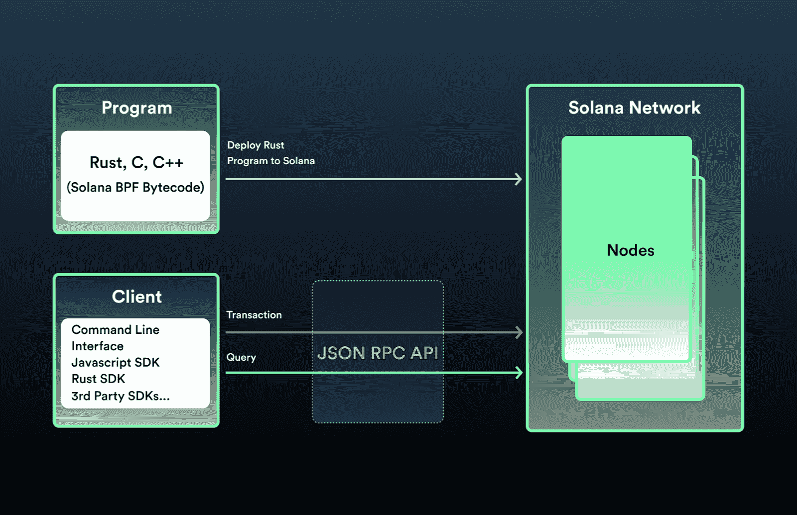
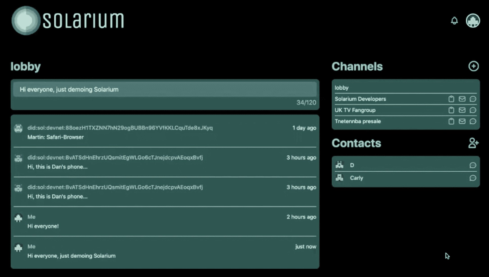

# 索拉纳用 Rust 来吸引开发者，避免抄袭

> 原文：<https://thenewstack.io/solana-rust-developers/>

Web3 中一个有趣的[开发者趋势是 Rust 作为编程区块链的一种方式的出现。当然，Rust 是一种用途广泛的流行编程语言——在过去的六年里，它一直是](https://thenewstack.io/web3-stack-what-web-2-0-developers-need-to-know/) [Stack Overflow 年度开发者调查](https://insights.stackoverflow.com/survey/2021)中最受欢迎的语言。所以它在 crypto 中的用途只是开发者喜欢它的一部分。也就是说，如果区块链[索拉纳](https://solana.com/)是可靠的，Rust 可能成为未来 Web3 的关键战场技术。

Web3 世界中的许多人将 Solana 视为以太坊的潜在竞争对手，认为它是 dapps(去中心化应用程序)的领先平台。截至本文撰写之时，Solana 在加密货币的流行指数 CoinMarketCap 上的市值排名第七。使用 Rust 的区块链排名肯定是最高的。

在我们讨论 Solana 和 Rust 之前，先简单介绍一下区块链编程的“传统”方法(我用了引号，因为所有这些东西都不到十年！).以太坊是第一个可编程的区块链，直到今天，它仍然是小型但不断发展的 Web3 生态系统的基础开发环境。要在以太坊上编程，你需要使用名为 Solidity 的定制以太坊语言创建一个“智能契约”。然后，在以太坊的运行时环境以太坊虚拟机(EVM)上运行智能合约。

## Solana 的开发是如何工作的

现在让我们来看看索拉纳是如何设计区块链的。首先，在其[开发者文档](https://solana.com/news/getting-started-with-solana-development)中，Solana 去掉了听起来合法的“智能合同”术语，并让我们回到传统的软件开发语言:

“在索拉纳，智能合约被称为程序。Rust C、C++是用于构建部署在链上的程序的语言。”

一旦部署到索拉纳区块链，程序“通过索拉纳运行时运行，它们将永远存在。”与以太坊一样，面向 Solana 的 dapps 很可能使用传统的 Web 2.0 语言和框架(JavaScript 和 React 都很流行)来构建。然后，这些 dApps 将通过 Solana 的 JSON RPC API(即通信层)与区块链上的“程序”进行交互。

图片 via Solana

当创建一个 dApp 时，solana 建议你使用它的官方 SDK， [solana-web3.js](https://solana-labs.github.io/solana-web3.js/) ，根据 Solana 实验室的说法，它“感觉就像与你使用过的任何其他 API 对话一样。”但也有其他第三方 SDK 构建在 JSON RPC API 之上——包括 Java、C#、Python、Go、Swift、Dart-Flutter 和 Kotlin 的 SDK。

## 索拉纳为什么选择铁锈？

在[YouTube 秀 UpOnly 最近的一集](https://www.youtube.com/watch?v=e8wsw1htJFY)中，索拉纳的创始人[阿纳托利·亚科文科](https://twitter.com/aeyakovenko)和[拉杰·戈卡尔](https://twitter.com/rajgokal)讨论了他们选择用 Rust 而不是已经建立的以太坊来构建索拉纳“程序”(又名智能合同)的原因。

亚科文科是索拉纳的工程头脑，他首先注意到了 Rust 的流行。“这不像我们选择了哈斯克尔什么的，”他开玩笑说(挖苦索拉纳的竞争对手区块链，卡尔达诺，目前在 CoinMarketCap 上排名第六，而[选择了哈斯克尔](https://medium.com/@cardano.foundation/why-cardano-chose-haskell-and-why-you-should-care-why-cardano-chose-haskell-and-why-you-should-f97052db2951))。他继续解释为什么他们没有选择用 Solidity 和以太坊虚拟机(EVM)来构建。

“对 EVM 来说，最困难的部分，”他说，“是你要让真正聪明的人全职思考[……]我如何扩大规模？[……]或者你只是想找一个人从 Solidity 复制一些东西，然后在上面打上一个标记？”

亚科文科的意思是，至少在他看来，可靠性吸引了更有可能从现有的区块链项目中复制粘贴智能合同代码的开发人员(这种做法俗称“copypasta”)。因此，通过选择 Rust，这是一种比 Solidity 更难学习的语言，并且更有可能被专业程序员使用，他们希望吸引那些可以构建定制的、可扩展的程序的开发人员。

UpOnly 是一个受欢迎的密码影响者，他的名字是 [Cobie](https://twitter.com/cobie) (真名 [Jordan Fish](https://www.linkedin.com/in/jordan-fish-493132149/) )，该网站的联合主持人之一指出，这也可能是另一种方式——缺乏经验的 Rust 开发人员可能会把构建程序搞得一团糟，并可能让用户损失大量资金。对此，亚科文科回答说，“我们有很多社区审查”，由经验丰富的开发人员组成，他们将“识别他们能找到的每一个 bug”

## 索拉纳最近的技术问题

现在是时候提一下索拉纳最近经历了一些令人担忧的网络问题。《财富》杂志上周报道称，索拉纳“本月遭遇了第六次超过八小时的严重断电。”

其他区块链也有问题，在许多情况下是由于无法扩大规模。《财富》杂志写道:“以太坊继续受到规模扩张困难和极高汽油费的困扰，而 Polygon PoS 等新来者在 1 月份的一个月内成本飙升了 7 倍多，因为玩游戏赚钱的视频游戏阻碍了需求。”

在[的一条 Twitter 帖子](https://twitter.com/aeyakovenko/status/1486349041571188739)中，亚科文科将索拉纳的问题归咎于“清算机器人[……]向网络发送垃圾邮件”这表明，中断更多地与加密货币交易骗局有关，而不是索拉纳上的任何规模计划问题。不管怎样，这确实凸显了在区块链上开发应用程序的危险性。像 Solana——甚至以太坊——作为开发平台仍然是非常新的。

**更新，2 月 3 日:**这篇文章发表后，索拉纳·区块链卷入了一场黑客攻击，导致约 3 亿美元的 wETH(“包装”以太坊)被盗。这条 Twitter 帖子有详细信息:

## Solana 的开发者社区

撇开技术问题不谈，索拉纳似乎有一个欣欣向荣的开发者社区。根据最近来自电气资本的[报告](https://medium.com/electric-capital/electric-capital-developer-report-2021-f37874efea6d)，这是区块链五大 Web3 开发项目之一。此外，根据云本地计算基金会(CNCF)的[数据分析](https://www.cncf.io/blog/2021/12/15/end-of-year-update-on-cncf-and-open-source-velocity-in-2021/)，新堆栈的 Lawrence Hecht [报告](https://thenewstack.io/solana-blockchain-crashes-into-open-source-top-10/)Solana“展示了与开源社区的主流项目不相上下的项目速度。”

索拉纳也从去年六月举办的黑客马拉松中获益良多。“Web3 赛道”的获胜者是一款名为 [Solarium](https://solarium.chat/) 的应用，被描述为“一款基于索拉纳区块链的完全去中心化、端到端加密、抗审查的即时通讯软件。”

日光浴室在行动。

这款应用看起来足够漂亮，但有一个问题(任何加密应用都有这个问题)——使用该产品需要付费。正如联合创作者[丹尼尔·凯莱赫](https://twitter.com/danbkelleher)在[演示视频](https://www.youtube.com/watch?v=C_XVl1fT76Y)中指出的，“索拉纳区块链上的每条消息都是一次交易。”

与以太坊和卡尔达诺等竞争平台相比，索拉纳对 Rust 的拥抱是否真的会带来更多高质量的区块链 dApps 还有待观察。即便如此，dApp 的可用性问题依然存在。当然，像 Solarium 这样的例子是有趣的测试案例，但是只要是付费游戏，新用户就不太可能蜂拥而至。

<svg xmlns:xlink="http://www.w3.org/1999/xlink" viewBox="0 0 68 31" version="1.1"><title>Group</title> <desc>Created with Sketch.</desc></svg>